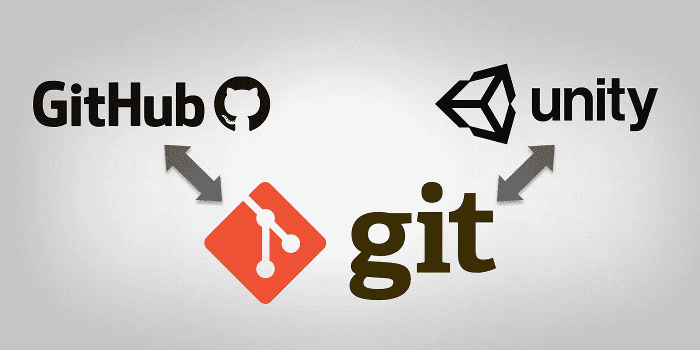

# Git 从 GitHub 和 Unity3D 开始

> 原文：<https://medium.com/geekculture/git-started-with-github-and-unity3d-2f88ad52fffd?source=collection_archive---------28----------------------->

如果你是软件开发新手或者不熟悉这个领域，你可能从来没有听说过 Git 或 GitHub。如果你计划在 Unity 或任何其他游戏引擎中与一个团队合作，你可能需要考虑熟悉这项服务。无论你是一名专业或有抱负的工程师，还是一名在家中办公室熬夜工作的休闲单人游戏开发人员，熟悉…