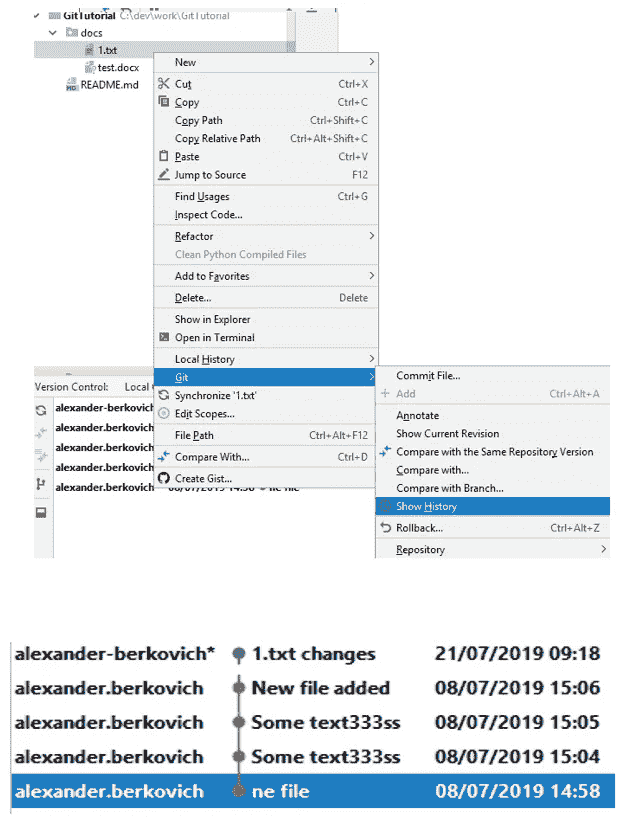

# Git 教程

> 原文：<https://medium.com/geekculture/git-tutorial-40697ec6683f?source=collection_archive---------2----------------------->

## 专门的受众是新的 Git 用户。这是 [*链接*](https://github.com/alex-ber/AlexBerDocs/blob/master/Git/Git%20Tutorial.docx) 到文档本身。

教程从[的基本操作](#_Basic_operations)开始，比如[“git 添加”](#_Add_File)、[“git 提交”](#_Commit_File)、[“git 推送”](#_Push_(no_conflicts))和[“git 拉取”](#_Pull_(no_conflicts))。

有些选择和假设是有意做出的，本文只讨论了其中的一部分。例如，“git rebase”被故意选择不包括在内。然而，没有任何假设，在你的远程存储库上，它可以是任何 Git 提供者，比如 GitHub、GitLab 等等。

**合并**概念贯穿整个教程。合并过程的基本描述见章节*合并* *中的[。它描述了许多日常使用案例和陷阱。了解如何解决冲突是很重要的。](#_Merge) [*合并分支*](#_Merging_Branches) 部分假设你对 [Git 理论](#_Appendix_A)很熟悉；它描述了您应该如何合并分支。*

为了让你对如何使用 Git 有一个好的基本理解，我故意尽可能地从理论上解释不同。下一节假设你已经读过了。理解 [*分支*](#_Branches) 段和[*提交历史*](#_Commit_History) 尤为重要。

[*为什么没有大师只有*？](#_Why_not_master)小节讨论了使用 Git 的最佳实践。

[*特性分支*](#_Feature_branch) 部分描述了我推荐做的一个最佳实践。在[替代分支模块](https://nvie.com/posts/a-successful-git-branching-model/)上有链接，但是它们超出了本教程的范围。本节描述如何创建 [*新分支*](#_New_Branch) ，如何 [*合并分支*](#_Merging_Branches) (参见上面的合并概念段落)，还如何[重命名分支](#_Rename_branch)。创建 [*新标签*](#_New_Tag) 和 [*删除标签*](#_Delete_Tag) 在相应的章节中描述。除了简单的操作之外，在 PyCharm 中使用 tag 是非常糟糕的。例如，不能重命名标签。

下一节是关于 [*藏毒*](#_Appendix_A) 。你应该偶尔使用它。第一小节( [" *"如果你正在工作……*"](#_What_if_you’re))描述了典型的用法。高级的、不推荐的技术在[*第二个隐藏小节*](#_What_if_you) (也参见上面的合并概念段落)中描述。

下一节描述如何 [*创建新项目*](#_Create_New_Project) 。你不会每天都创造新的项目，但是你一定要知道如何去做。通常，您将从现有项目 (git 克隆)中 [*创建新项目。另一种方法是*](#_From_existing_project) *[*从头创建新项目* (git init)](#_From_Scratch_(git) 。或者你甚至[*使用 git 命令* (git init)](#_From_Scratch_using) 创建新项目。如果您想了解 PyCharm 在幕后做些什么，最新的部分也会很有用。*

如果你想阅读文档本身，请按照这个 [*链接*](https://github.com/alex-ber/AlexBerDocs/blob/master/Git/Git%20Tutorial.docx) 。