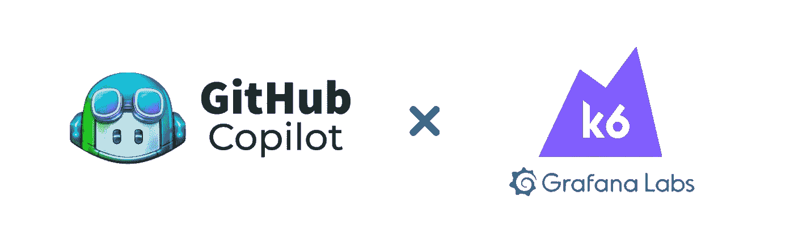
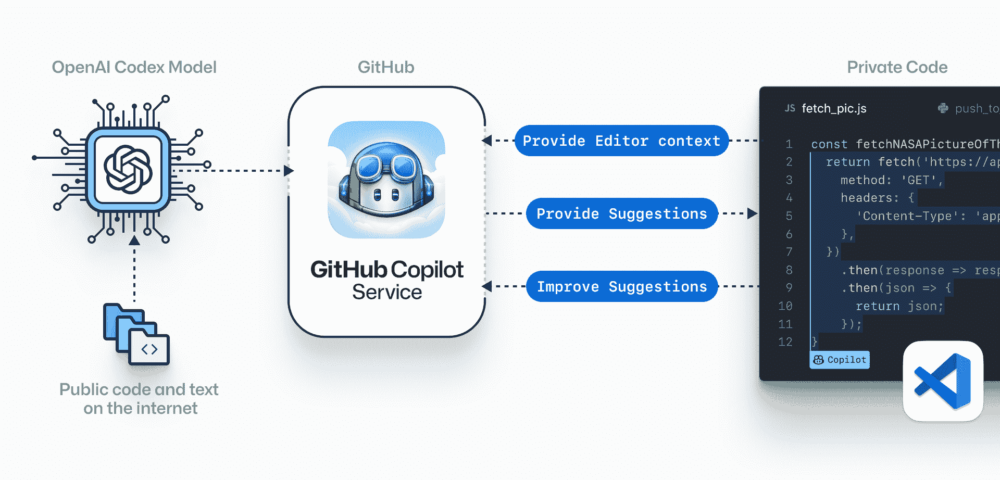
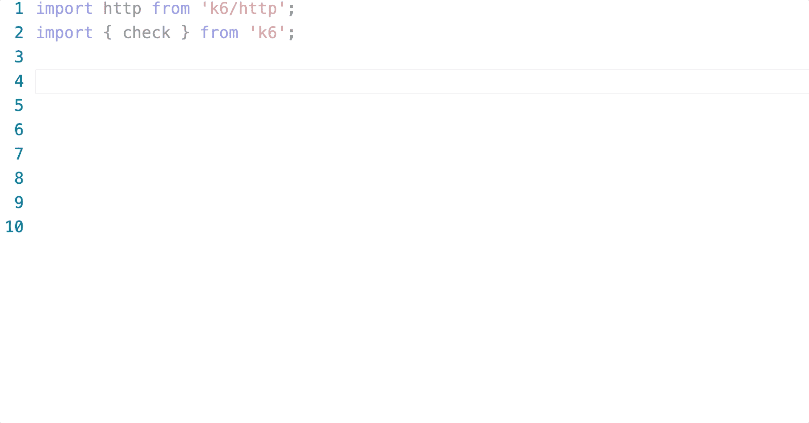
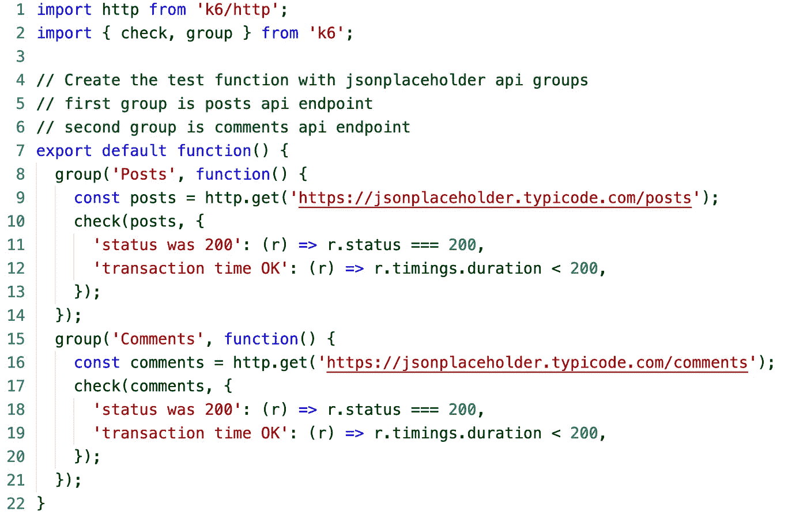

# github Copilot:K6 实用概述

> 原文：<https://medium.com/geekculture/github-copilot-a-practical-overview-with-k6-98c179d8e73d?source=collection_archive---------9----------------------->

# 什么是 Github-Copilot？

基本上，Copilot 是一种云服务。云服务是由 OpenAI Codex 支持的代码预测引擎，open ai Codex 是一种在数十亿代码上训练的语言模型。

还有，你要知道 Codex 是 code _synthesizer_，不是搜索引擎。

# Github-Copilot 是如何工作的？

Copilot 编辑器扩展将您的评论和代码发送到 GitHub Copilot 服务，然后该服务使用 OpenAI Codex 来合成和建议代码。它实际上是通过通读 GitHub repos 上的所有开源代码，然后收集数据并试图找到与之相关的最佳代码来工作的！

你可以把 Github 副驾驶当成你的结对编程朋友。Copilot 仅向您提供它以前见过的代码或您在项目中使用的代码示例。

# Github-Copilot x k6 概述

首先，我们需要为负载测试指定选项，例如，我们将在多少分钟内创建一个负载。你可以在下面的例子中看到我们如何在不知道的情况下快速创建这个测试。

在下面的例子中，您可以看到我们如何使用 copilot 和 JSON 占位符 fake API 创建一个简单的 get 请求。在创建这个负载测试时，我们还使用 k6 检查方法执行了我们的状态代码控制。我们使用 k6 的主要原因是它提供了对轻量级语言如 javascript 的支持。

现在让我们使用 k6 组特性，您可以使用组来组织多个请求和不同的场景。我想对帖子和评论端点进行分组，我们需要做的事情非常简单。

# 结论

因此，虽然你可以用 k6 非常快速地编写负载测试，但是用 GitHub-Copilot 这个速度非常快，你可以更好地管理你的时间。别忘了，我们的结对编程朋友 Copilot，绝对不会抢我们的饭碗，不要相信这种东西，我们只是知道如何有效利用。🤓