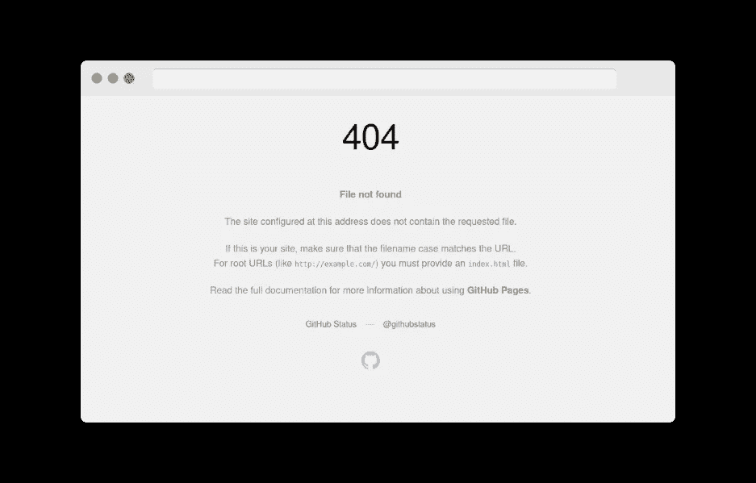

# 带有动态路线的 GitHub 页面

> 原文：<https://medium.com/geekculture/github-pages-with-dynamic-routes-40f512900efa?source=collection_archive---------3----------------------->


**截至 2022 年，medium.com 要求您拥有至少 100 名粉丝才有资格加入合作伙伴计划。在写这篇文章的时候，我有 13 个。所以如果你觉得这篇文章有帮助或者有趣，请考虑关注我。谢谢！**

*本文涉及的问题已经讨论了一段时间:*[*https://github.com/isaacs/github/issues/408*](https://github.com/isaacs/github/issues/408)*不幸的是，仍然没有真正的解决方案，需要一个变通办法。*

[GitHub Pages](https://pages.github.com/) 是一个超级方便的静态网站托管服务，例如个人作品集或博客或项目文档，甚至现代的网络应用程序在许多情况下也不过是一个静态 HTML 文件和(大量)Javascript。但是静态网站也有不利的一面……嗯……是静态的。这意味着你不能有动态路线，比如`your-project.github.io/posts/<post-slug>`其中`<post-slug>`是一个动态参数。所有可能的路由都需要提前知道，并指向一个静态文件。也许这些文件是由某个构建过程生成的，每当您添加新的博客文章时，您只需重新部署页面。使用像 GitHub Actions/Workflows 这样的 CI/CD 管道，这个过程甚至可以归结为将新的 markdown 文件推送到您的存储库，这对于许多场景来说已经足够方便了。但有时并非如此，您只需要动态路径，尤其是当涉及用户生成的内容或项目变得更加复杂时。

# 动态路由是如何工作的？

*如果您非常熟悉这个概念，并且您只想知道如何欺骗 GitHub 页面来支持动态路由，那么您可以跳过这一部分，继续使用这个解决方案。*

路由/路径通常指向服务器上由域表示的(静态)文件。

`your-server.com/some/path/index.html`

如果你试图访问一个不存在于该服务器上的文件，它将响应一个错误，这通常意味着它将为你提供一个服务器自带的默认`404.html`。你可能见过这样的东西:


这是一个默认的错误文件，在本例中是由 nginx 服务器提供的。但是，您可以配置服务器，使其为您提供特定的资源/文件，而不管您请求什么路径。假设您在服务器上有一个`index.html`,并且您相应地配置了它。你现在可以打电话给`your-server.com/index.html`，也可以打电话给`your-server.com/some/path/that/does-not-exist.html`。它将总是返回相同的`index.html`文件。现在，该文件也可以是一个脚本，而不仅仅是一些静态的 HTML 文件。否则，您的动态路由不会那么动态，因为它们都提供完全相同的内容。

一个[前端控制器](https://en.wikipedia.org/wiki/Front_controller)就是这样一个动态脚本，它处理对服务器的所有请求，并动态地提供内容，例如，根据实际请求从数据库获取数据，然后从模板生成 HTML 响应。这样你可以用动态部分支持路线，你不必提前知道，就像上面的`/posts/<post-slug>`例子。

# GitHub 页面

GitHub Pages 不支持这样的前端控制器，因为它不是用来提供动态内容的。当然可以。你可以在你的静态 HTML 文件中使用 Javascript 来动态地改变它的内容，例如，基于用户交互，正如前面提到的，大多数 web 应用程序只不过是一个静态 HTML 文件，然后 Javascript 从那里接管。但这一切都发生在你的浏览器中，而不是 GitHub 的服务器上。因此，如果您调用`your-username.github.io/some/file.html`，它将只查找该文件，而不查找其他文件，如果它找不到该文件，因为您没有将它添加到您的存储库中，它将显示以下内容:



那是 GitHub 默认的`404.html`文件。在这一点上，我假设大多数开发者/用户现在会简单地接受痛苦的现实，GitHub Pages 可能不适合他们，而是转向更全面的托管解决方案，在那里他们对服务器在幕后实际做什么有更多的控制。但不是我！我是一个懒惰的极简主义者，一个平台账户就足够了！

## 老式的选择

起初，我考虑妥协一下，不要“真正的”动态路线，我可以回到单页应用程序的历史，使用`#`方法，[就像旧的 AngularJS](https://www.w3schools.com/angular/tryit.asp?filename=try_ng_routing) 一样。如果你想知道，`#`之后的部分并不是服务器响应的实际 URL 的一部分。它只是被浏览器用来跳转到一个 HTML 锚，你可以用 Javascript 访问它。服务器甚至不知道这一部分。只是客户端的。但这意味着你可以有这样的路线:

`your-server.com/#/posts/<post-id>`

应用程序驻留在服务器上的`/`，在浏览器中运行时处理`#`之后的部分。当点击你的应用中的一个链接时，它只是更新`#`之后的部分，并通过 Javascript 相应地改变内容。但这看起来并不那么好，像 Next.js 这样的现代框架甚至不再支持这种形式的路由。Vue 的 [Nuxt.js 实际上有一个后备选项](https://nuxtjs.org/docs/2.x/configuration-glossary/configuration-router#fallback)但是仍然…

# 解决方案

你已经在这篇文章中看到了部分解决方案。是 404 页。GitHub Pages 实际上允许你添加一个自定义的`404.html`到你的库，调整它以适应你的项目的品牌等等。如果您熟悉前端控制器模式，现在您可能会有“aahhhhhaaaa”的感觉。这种模式的重要部分是，它只接受任何请求，并将其路由到您的应用程序，然后在那里处理请求。良好的..一个 404 页也差不了多少。它处理与任何现有资源都不匹配的所有请求。你知道我想说什么吗？虽然有点不同。传统的前端控制器位于服务器上，它将所需的响应发回给您，就好像您请求的资源实际上存在一样。欺骗 GitHub 页面来支持动态路由要稍微复杂一些。因为根本没有！但是我们可以让它看起来像是真的。普通人的眼睛不会注意到这种差异，它甚至可以与现代框架的动态路由功能一起工作，如 Vue 的 Nuxt.js 或 React 的 Next.js。

## 概念证明

简单的技巧是让你的客户`404.html`将任何请求重定向回你的应用，然后你的应用使用[浏览器历史 API](https://developer.mozilla.org/en-US/docs/Web/API/History_API) 将你的浏览器显示的 URL 更新为最初请求的内容。重定向时，您需要将这些信息传递给应用程序。为此我用…猜猜是什么？…我们的老朋友，`#`。我在这里设置了一个 GitHub 页面:[https://mktcode.github.io/static-dynamic-routing/](https://mktcode.github.io/static-dynamic-routing/)和它的`404.html`如下所示:

```
<!DOCTYPE html>
<html>
  <head>
    <title></title>
  </head>
  <body></body>
  <script>
    window.location.href = '/static-dynamic-routing/#' + window.location.pathname.replace('/static-dynamic-routing', '')
  </script>
</html>
```

因此，而不是显示一些 404 没有找到！消息，它只是将您重定向到应用程序所在的根路径。请注意，这个 GitHub 页面示例位于子目录`/static-dynamic-routing/`中，当您为存储库设置 GitHub 页面时，这是正常的。它将生活在`<your-username>.github.io/<repo-name>/`之下。这就是为什么我们必须在这里做一些更换。否则我们会将用户重定向到`mktcode.github.io/`。幸运的是，你可以很容易地为你的 GitHub 页面配置一个自定义域，然后你就不用再关心这个了。

所以现在，无论我们调用什么路线，我们都会在我们的应用程序中结束，它会知道这条路线，所以它可以相应地采取行动。在我的小例子中，我只不过替换了地址栏中显示的 URL 并操作了一些内容。这就是现代框架中动态路由的基本工作方式。

```
<!DOCTYPE html>
<html>
  <head>
    <title>My App</title>
  </head>
  <body>
    <h1>My App</h1>
    <h2 id="header">Post Path: {PATH}</h2>
  </body>
  <script>
    if (window.location.hash.length > 1) {
      const path = window.location.hash.replace('#', '')
      history.pushState({ page: 1 }, "Some title", '/static-dynamic-routing' + path)

      document.getElementById('header').innerHTML = document.getElementById('header').innerHTML.replace('{PATH}', path)
    }
  </script>
</html>
```

尝试在您的浏览器中打开此链接:[https://mkt code . github . io/static-dynamic-routing/posts/my-post](https://mktcode.github.io/static-dynamic-routing/posts/my-post)

一瞬间，你可以在浏览器的地址栏中看到`#`。这就是重定向发生的时候，然后我们假装它从来没有发生过。这基本上就是全部了。

## 与 Nuxt.js 一起使用

如果你是那种反应型的人，你必须自己去实现它。我只展示 Nuxt.js 的方式。

在 Nuxt.js 中，你可以通过创建一个类似于`/pages/posts/_slug.vue`的文件来轻松配置动态路由。Nuxt 会完成剩下的工作，你有像`/posts/my-post-title`这样的路由。这甚至可以在静态站点模式下工作，但前提是该站点是由集成的 Nuxt 服务器或任何其他以相同方式配置的服务器交付的(想想:前端控制器模式)。对于 GitHub 页面，这不起作用，你只会看到 404 页面。但是有证据表明，我的方法即使在 Nuxt.js 上也完全可以工作:

[https://mkt code . github . io/dynamic-nuxt-GH-pages/post/my-total-dynamic-post-title](https://mktcode.github.io/dynamic-nuxt-gh-pages/post/my-totally-dynamic-post-title)

它所需要的只是`[static](https://github.com/mktcode/dynamic-nuxt-gh-pages/blob/main/static/404.html)`目录中的 `[404.html](https://github.com/mktcode/dynamic-nuxt-gh-pages/blob/main/static/404.html)` [文件和](https://github.com/mktcode/dynamic-nuxt-gh-pages/blob/main/static/404.html)[一个路由器中间件](https://github.com/mktcode/dynamic-nuxt-gh-pages/blob/main/middleware/gh-pages-dynamic-routes.js)，它执行一个 nuxt-internal 重定向到原始路由，导致你浏览器的地址栏被更新。如果您的应用程序中不存在该路由，则会显示 [Nuxt 错误页面](https://nuxtjs.org/docs/2.x/concepts/views/#error-page)。顺便说一下，它现在使用`#!`进行重定向，仍然允许正常的 HTML 锚。以前工作的一切应该仍然工作，加上 GitHub 页面的动态路线！:)

**结尾**

*如果你打算成为中等会员，可以使用我的推荐页面支持我:*【https://markus-kottlaender.medium.com/membership】