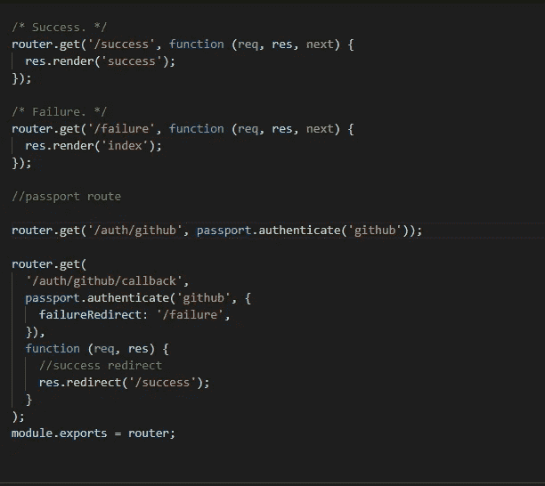
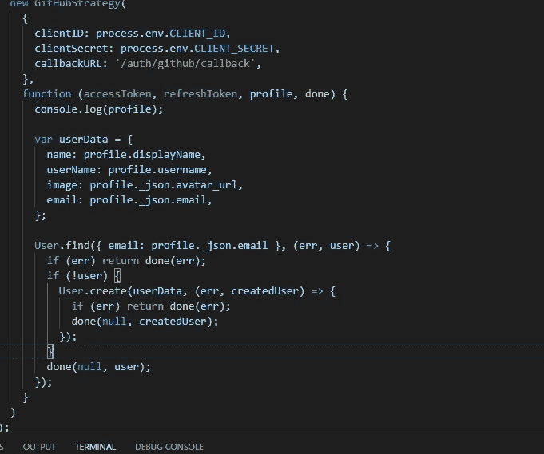
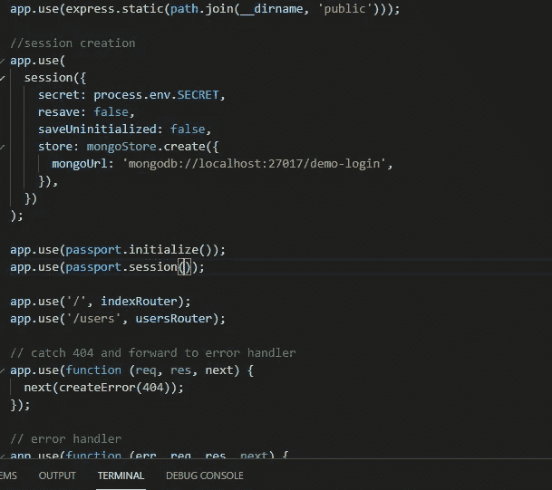
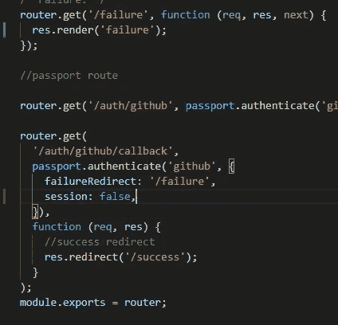
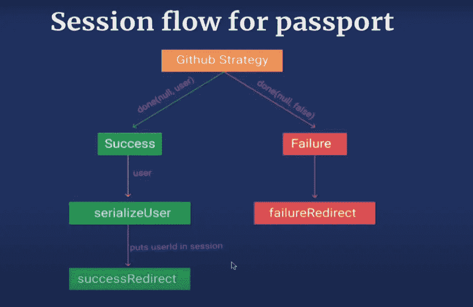
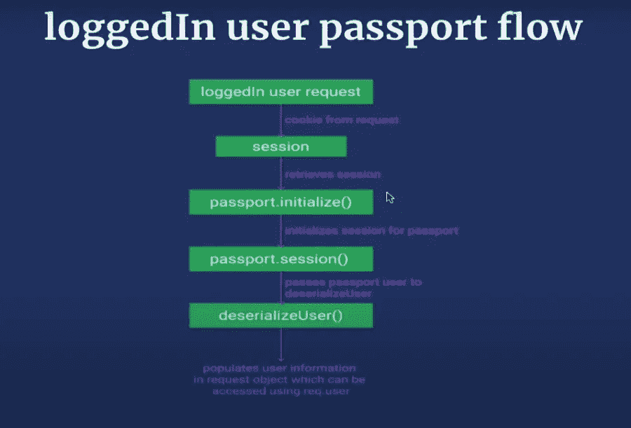

# github-在 nodeJS 中使用 Passport 的 Oauth 策略。

> 原文：<https://medium.com/geekculture/github-strategy-for-oauth-using-passport-in-nodejs-1e878ff4b892?source=collection_archive---------15----------------------->


*   在任何 express 应用程序中，我们都可以使用 PassportJS npm 包来验证使用第三方应用程序的用户。
*   这些应用程序用于获取他们的公共配置文件数据。将 **Github-Strategy** 用于 Oauth 有 **5 个步骤**。
*   但是首先，我们必须使用 Express 包设置一个基本的 **Express 服务器**，并设置会话中间件来创建一个会话。

# 步骤 1:-将应用程序注册到 Github。

*   首先，我们必须将我们的应用程序注册到我们的 GitHub 个人资料中，以获取 **Client_Secret** 和 **Client_ID。**
*   进入 github >个人资料>设置>开发者设置> Oauth 应用。
*   现在点击新建 OAuth app，输入**应用名称**，**首页 URL** 为“[***http://localhost:3000***](http://localhost:3000)”，**回调 URL** 为“[***http://localhost:3000/auth/github/回调***](http://localhost:3000/auth/github/callback) ”。
*   现在从新创建的 OAuth app 中复制 Client_ID 和 Client_Secret，粘贴到[**中。env**](http://localhost:3000/auth/github/callback) 文件放在我们的项目中以备将来使用。

# 步骤 2:-处理护照的路线。

*   首先，我们必须在 index.ejs 页面上创建一个按钮，以便在 GitHub route "**/auth/GitHub**"上创建请求。
*   现在我们必须处理索引路由器内的" **/auth/github** "和" **/auth/github/callback** "路由。
*   但是首先，我们必须将 passport 和 passport-GitHub 包安装到我们的服务器中。使用下面的命令。

```
$ npm i passport passport-github --save
```

*   现在去“www.passportjs.com”上的 passport 的文档，搜索“ **github 策略**”。阅读文档。
*   现在，我们必须处理索引路由器页面中的“/成功”、“/失败”、“/auth/github”和“/auth/github/callback”路由，如下所示。



handling routes inside index router page

*   处理回调路由时，如果验证失败，failureRedirect 将重定向“/failure”路由，如果成功，将重定向“/success”路由。

> 提示:-不要忘记在索引路由器页面中导入 passport。

# 第三步:- GitHub 策略。

*   现在我们必须定义 Github 策略。我们必须在新文件夹**模块**中创建一个名为 **passport.js** 的新文件。
*   现在在 passport.js 文件中首先导入 passport 包。
*   现在我们必须使用下面的代码行导入 GitHub-strategy。

```
**var** GitHubStrategy = **require**('passport-github').Strategy;
```

*   现在，要定义策略，请编写以下代码

```
passport.use(**new** GitHubStrategy({
   clientID: process.env.CLIENT_ID,  //  import client id from .env
   clientSecret: process.env.CLIENT_SECRET, //import clientsecret .env
   callbackURL: "/auth/github/callback"
  },
  **function**(accessToken, refreshToken, profile, done) {
       console.log(profile);
       done(null, false); //passing falsey value as 2nd argument will return failure route. });
  }
));
```

*   现在，在初始化 express 服务器之前，在 app.js 文件中导入 passport.js 文件，以便它可以在应用程序中使用。

```
require(./modules/passport.js);
```

> 提示:-将 falsy 值作为第二个参数传递给 done()将调用失败路由，传递 truethy 值将调用成功路由。

# 步骤 4:-向数据库添加本地副本。

*   在上一步中，我们将**配置文件**记录到控制台，我们可以检查我们在**控制台**中获得的值。
*   我们可以从**概要文件**变量中提取所需的**数据**，并通过创建**用户**模型将其存储到 mongo 数据库中。
*   现在我们必须在“root/models/User.js”中创建一个**用户**模型。
*   现在我们必须在 passport.js 文件中导入用户模型

```
let User=require("../models/User");
```

*   现在，我们必须检查我们将要创建的用户是否存在于数据库中，以避免数据库中出现重复的用户。
*   我们可以使用 User.find()方法来检查用户是否在配置文件变量中使用电子邮件。
*   如果用户已经存在，我们必须呈现失败页面和成功页面，如果不存在。
*   查看下图了解更多细节



adding user to databse

*   但是现在，如果我们运行应用程序，我们将看到错误，因为没有使用 passport.initialize()中间件。
*   创建会话后，我们使用 passport.initialize()中间件，这一点很重要。
*   之后，我们必须使用 passport.session()中间件从浏览器 cookie 中检索会话。

> T ip:-在 app.js 中导入 passport 包以使用上述中间件。



settimg middlewares

*   但是 passport 需要序列化函数来将用户添加到会话中。所以我们必须定义 session.serialize 函数。

> 提示:-如果我们想要禁用会话创建，下面的步骤是可选的。

*   如果我们想禁用它，我们可以做一件事。我们可以去 index.js 路由器页面，在故障路由后面加上“**session:false”**。



disbling session

# 步骤 5 :-序列化和反序列化用户。

*   转到 **passportJS 文档**并搜索“ **serialize** ”并阅读文档以了解详细信息。

## 定义搜索用户:-

*   要将用户添加到会话中，我们必须在 passport.js 文件中定义策略之后定义序列化用户函数。

```
passport.serializeUser(**function**(user, done) {   
      done(null, user.id);  
  });
```

*   现在你会想知道序列化函数中的**用户**是如何访问**用户值**的。
*   我们知道，一旦策略被执行，它将把创建的用户的值传递给序列化函数。



session flow.

## 定义取消搜索用户:-

*   如果我们重启服务器，我们需要一个反序列化函数来检索现有的登录用户数据。

```
passport.deserializeUser(**function**(id, done) {
   User.findById(id, **function**(err, user) {
     done(err, user);
   });
 });
```

*   反序列化函数获取会话 cookie 中的用户 id，填充用户信息并用用户变量调用 done 回调。并将用户数据自动放入 **req** 变量和 **req.locals** 中。

