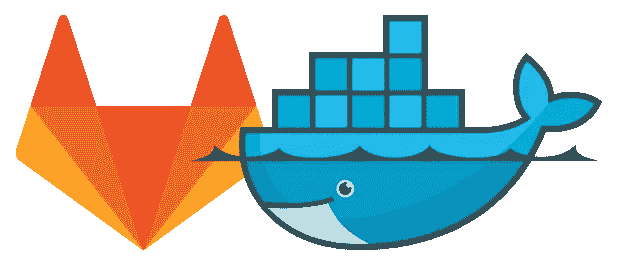

# GitLab 是您持续部署的一站式商店

> 原文：<https://medium.com/geekculture/gitlab-continuous-deployment-one-stop-shop-2a8ebf168963?source=collection_archive---------26----------------------->



本周，我想从我的 Start Rust 系列中休息一下，专注于一个不同的主题。我已经详细写了我的博客堆栈。

然而，我没有触及一个方面，这个方面就是我如何从 Jekyll 生成静态页面。正如我在博文中描述的，我已经包含了相当多的定制。其中一些需要外部依赖，例如:

*   一个用于 PlantUML 图生成的 JRE
*   *graphviz* 包也是出于同样的原因
*   等等。

总而言之，这意味着我需要一个完全配置的系统。我用集装箱化，也就是 Docker 解决了这个问题。在`Dockerfile`中，我能够安装所有需要的依赖项。然后，在我的 GitLab 构建文件中，我可以引用这个图像并从它的所有功能中受益。

YAML

```
image: registry.gitlab.com/nfrankel/nfrankel.gitlab.io:latest# ...
```

# 更新，辛苦了

Jekyll 是建立在 Ruby 之上的。Ruby 中的共享库被称为 *gems* 。我用了其中的一些，还有哲基尔宝石本身。作为一个长期的 Maven 用户，我在 Ruby 世界中搜索了等效的依赖管理工具，并偶然发现了 [Bundler](https://bundler.io/) :

> *Bundler 通过跟踪和安装所需的 gem 和版本，为 Ruby 项目提供了一个一致的环境。*

Bundler 在一个`Gemfile`文件上休息。它类似于 npm 的`package.json`。当您执行`bundle install`时，它会用最新的 gems 版本创建一个`Gemfile.lock`；用`bundle update`，它更新它们。

到目前为止，我的更新过程是这样的:

1.  将 gems 更新到最新版本
2.  在我的笔记本电脑上构建 Docker 映像
3.  将图像上传到我的项目的 GitLab 注册表
4.  提交对锁文件的更改
5.  推
6.  反过来，这会触发 GitLab 上的构建，并在 GitLab 页面上部署我的站点。

它有几个缺点:

*   它需要我的笔记本电脑上的 Docker。当然，我已经有了，但不是每个人都满意
*   构建需要时间，也需要 CPU 时间
*   图像占用存储空间。我可以把它清理干净，但这是对我时间的额外浪费。
*   它堵塞了我的网络。由于我的上传速度非常有限，当我上传时，我不能做任何涉及互联网的事情。

# 更新，聪明的方法

最近偶然发现了 GitLab cheatsheets 的优秀[系列。在第六部](https://dev.to/jphi_baconnais/series/12928)中，作者提到了 [Kaniko](https://github.com/GoogleContainerTools/kaniko) :

> *kaniko 是一个在容器或 Kubernetes 集群中从 docker 文件构建容器映像的工具。*
> 
> kaniko 不依赖 Docker 守护进程，完全在用户空间执行 Docker 文件中的每个命令。这使得在不能轻松或安全地运行 Docker 守护进程的环境中构建容器映像成为可能，比如标准的 Kubernetes 集群。
> 
> *kaniko 的本意是作为形象运行:* `*gcr.io/kaniko-project/executor*` *。*

这意味着您可以将 Docker 映像构建部分移动到构建过程本身。新流程变成:

到目前为止，我的更新过程是这样的:

1.  将 gems 更新到最新版本
2.  提交对锁文件的更改
3.  推
4.  尽情享受吧！

为了做到这一点，我不得不非常仔细地浏览文档。我还将构建文件移到了“新”语法中。这是新版本:

YAML

```
stages:
  - image                                                        # 1
  - deploy                                                       # 1build:                                                           # 2
  stage: image                                                   # 3
  image:
    name: gcr.io/kaniko-project/executor:debug                   # 4
    entrypoint: [""]                                             # 5
  script:
    - mkdir -p /kaniko/.docker
    - echo "{\"auths\":{\"$CI_REGISTRY\":{\"auth\":\"$(echo -n ${CI_REGISTRY_USER}:${CI_REGISTRY_PASSWORD} | base64)\"}}}" > /kaniko/.docker/config.json                                       # 6
    - /kaniko/executor --context $CI_PROJECT_DIR --dockerfile $CI_PROJECT_DIR/Dockerfile --destination $CI_REGISTRY_IMAGE:$CI_COMMIT_TAG                                # 7
  only:
    refs:
      - master
    changes:
      - Gemfile.lock                                              # 8pages:                                                           # 2
  stage: deploy                                                  # 3
  image:
    name: registry.gitlab.com/nfrankel/nfrankel.gitlab.io:latest # 9
```

1.  定义*阶段*。阶段是有序的:在这里，`image`在`deploy`之前运行。
2.  定义*岗位*
3.  作业与一个阶段相关联。根据记录，与同一阶段相关联的作业是并行运行的。
4.  使用 Kaniko Docker 图像的`debug`风格。虽然这不是必需的，但是这个映像记录了在出现问题时它是如何改进调试的。
5.  重置`entrypoint`
6.  在下一行中，创建 Kaniko 用来推送到 Docker 注册表的凭证文件
7.  使用提供的`Dockerfile`构建映像，并将其推送到项目的 Docker 注册表中。注意 GitLab 传递这里使用的所有环境变量
8.  仅当`Gemfile.lock`文件被更改时运行该作业
9.  使用先前生成的图像生成静态站点

# 结论

这篇文章展示了如何使用 Kaniko 映像将构建管道的 Docker 部分从本地机器卸载到 GitLab。它节省了时间和资源。我唯一的遗憾是，我应该更早做这件事，因为我是自动化的大力支持者。

我遗漏了最后一步:调度一个更新依赖关系并创建一个*合并请求**àla*dependent bot 的作业。

**更进一步:**

*   [GitLab Cheatsheet 系列](https://dev.to/jphi_baconnais/series/12928)
*   [使用 kaniko 构建 Docker 图像](https://docs.gitlab.com/ee/ci/docker/using_kaniko.html)
*   [关键词引用。gitlab-ci.yml 文件](https://docs.gitlab.com/ee/ci/yaml/)
*   [在 GitLab 上用 Kaniko 构建最低特权容器](https://www.youtube.com/watch?v=d96ybcELpFs)
*   [GitLab 的预定义变量引用](https://docs.gitlab.com/ee/ci/variables/predefined_variables.html)

*原载于* [*一个 Java 极客*](https://blog.frankel.ch/gitlab-continuous-deployment-one-stop-shop/)*2021 年 8 月 1 日*