# GitOps with Argo CD:使用 Git 和 Argo CD 管理 Kubernetes 应用程序

> 原文：<https://medium.com/geekculture/gitops-with-argo-cd-managing-kubernetes-application-using-git-and-argo-cd-42ed6879ab1e?source=collection_archive---------0----------------------->

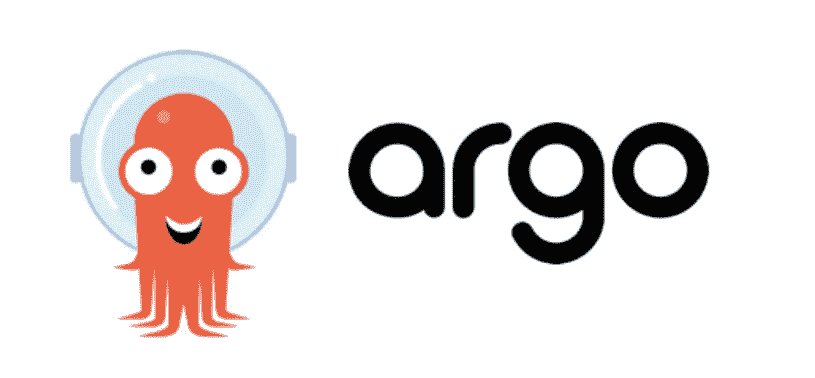

# 什么是阿尔戈光盘

Argo CD 是一个工具，它将从您的 git 存储库中读取您的环境配置(编写为 helm chart、kustomize 文件、jsonnet 或普通 yaml 文件),并将其应用到您的 Kubernetes 名称空间。Argo CD 的一些特征是:声明性的和版本控制的应用程序部署。

# 为什么是 Argo CD

它使您的应用程序定义、配置和环境应该是声明性的和受版本控制的。应用程序部署和生命周期管理应该是自动化的、可审计的、易于理解的。

# 没有 Argo CD 的挑战

1.  在您尝试部署的每个地方安装和设置像 Kubectl 这样的工具。
2.  配置对每个 k8s 集群的访问，以部署应用程序。
3.  如果我们的集群在云上，则配置对云提供商的访问。这将带来更多的安全挑战。
4.  我们不了解部署状态。

# Argo 光盘如何解决上述问题

在 Kubernetes 集群中部署 ArgoCD，而不是将应用程序更改或部署推送到集群，我们可以在 argo CD 代理的帮助下提取它。因此，同一个 argo CD 实例能够同步 k8s 集群的舰队。

我们可以配置 Argo CD rto 来跟踪存储我们的 kubernetes 清单的 GIT repositry 的变化，如果有任何变化，就自动提取和部署它。这样我们就可以清楚地分离 CI 和 CD 流，并单独维护代码。

如果 k8s 集群中发生了任何手动更改，Argo CD 将自动恢复这些手动更改，并保证 k8s 在 Git 中的显示保持真实的单一来源。

Argo CD 支持 Kubernetes 平原 yaml 文件，舵图表和 kustomize 文件。

使用这种设置，集群灾难恢复非常容易，因为我们在单独的 git 存储库中管理所有部署代码，我们可以简单地将 Argo CD 指向 git repo。Argo CD 会将这些同步到集群。

对于特定的部署，我们不需要在 kubernetes 中创建集群角色和访问权限。相反，我们可以使用 GIT 合并策略将应用程序部署到带有 Argo CD 的集群中。

您不需要向非人类用户授予外部集群访问权限。所以 k8s 之外没有集群凭证。

我们可以使用带有 customize 的覆盖来首先测试 dev env 中的更改，然后在 prod 中应用它。(我们甚至可以使用分支策略，尽管它非常流行，但并不是最佳选择。)

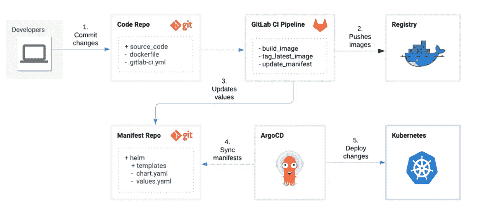

Lamen Diagram

# 先决条件

在安装 Argo CD 之前，我们需要准备好以下环境。(我假设您已经有了这个设置)。

1.  库伯内特星团。
2.  kubectl 包已安装。这是管理集群所必需的。
3.  Kubernetes 集群访问(默认位置是~/。kube/config)。
4.  GitHub repositry。在我的案例中，我使用了这种回购。[**https://github.com/Sarvabhowma1995/argocd-demo**](https://github.com/Sarvabhowma1995/argocd-demo)

# **安装 Argo 光盘**

**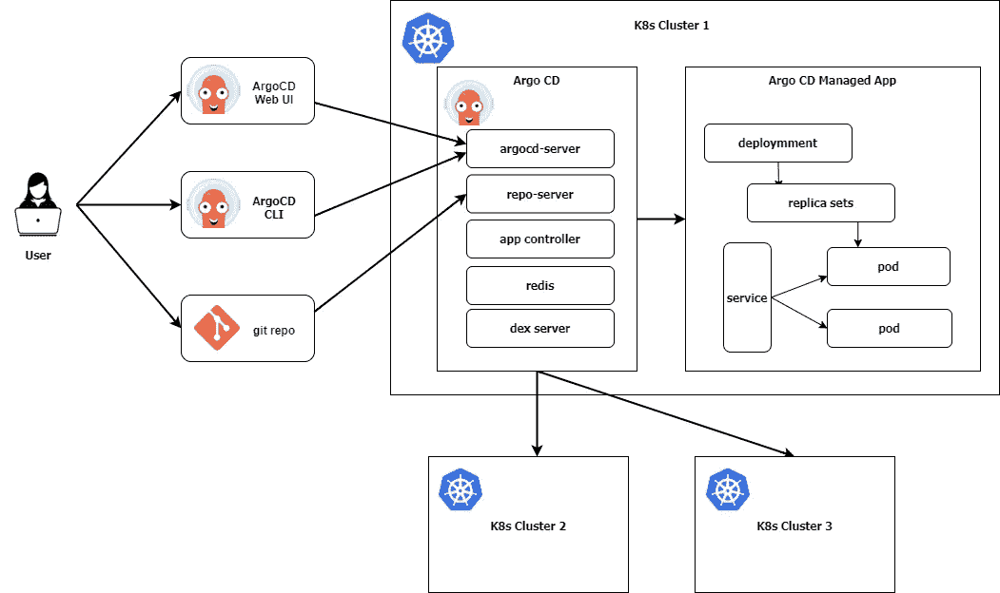**

**Argo CD low level architeture**

**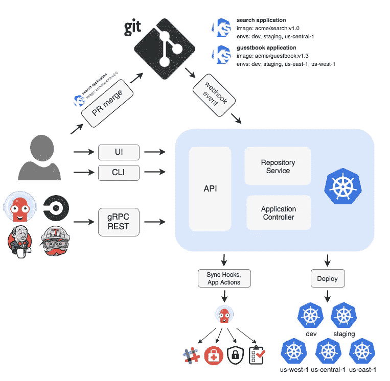**

**High Level Architecture**

**Argo CD 可以安装在 kubernetes 内部或外部，但在 kubernetes 上安装 Argo CD 是生产就绪。因此，我将它安装在 kubernetes 集群中。更多关于如何本地安装的信息，请 [***点击这里***](https://argo-cd.readthedocs.io/en/stable/developer-guide/running-locally/) 。**

****注意:**即使您在本地安装 Argo CD，您仍然需要 kubernetes 集群来部署资源。**

**在运行以下命令之前，请确保您拥有 kubernetes 集群访问权限，可以访问需要安装 Argo CD 的位置。在我的例子中，我将 kubernetes 集群作为 minikube 安装在 windows 中，并连接到它来执行任何操作。**

> ****$** kubectl 创建名称空间 argocd**
> 
> ****$**ku bectl apply-n argocd-f[https://raw . githubusercontent . com/argoproj/Argo-CD/stable/manifests/install . YAML](https://raw.githubusercontent.com/argoproj/argo-cd/stable/manifests/install.yaml)**

**下面是运行命令后的输出，**

**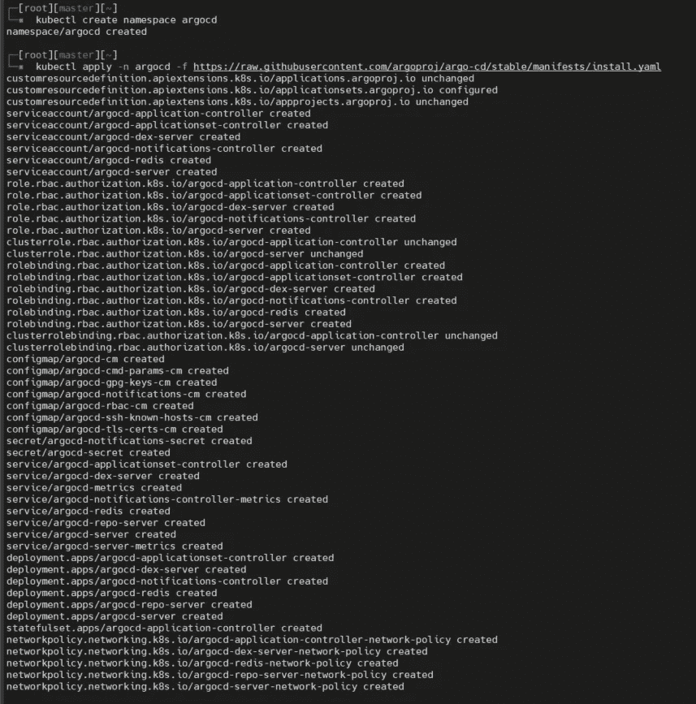**

**Command Output**

**以下是 Argo CD 安装过程中创建的对象。**

**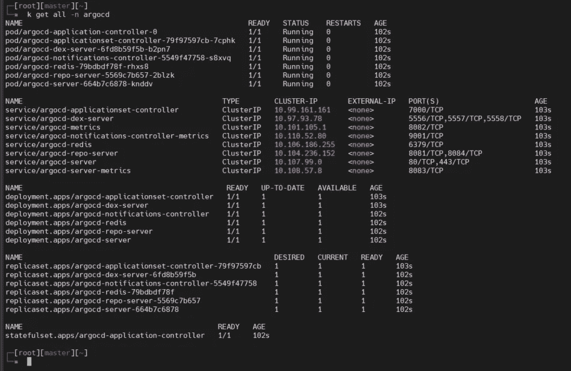**

**Objects created for Argo CD**

**一旦分离舱准备好，ArgoCD 就会运行。但是 ArgoCD API 服务器将无法从集群外部访问。我们将使用 port-forward 向服务公开一个端口，并将其转发到 localhost，或者将 argocd-server 服务类型更改为 LoadBalancer(仅适用于云)或 NodePort。**

****三种情况的步骤:****

****A)** 对于**端口转发**运行下面的命令，然后用 [https://127.0.0.1:8080](http://localhost:8080) 访问你的网页**

> ****$** kubectl 端口转发 SVC/argocd-server-n argocd 8080:443**

**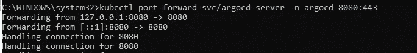**

****B)** 为**节点端口**打补丁服务，运行以下命令。您可以使用具有相应节点端口端口号的任何集群节点公共 IP 访问 webUI。**

> ****$**ku bectl patch SVC argocd-server-n argocd—type = ' JSON '-p '[{"op":"replace "，" path":"/spec/type "，" value":"NodePort"}，{ " op ":" replace "，" path":"/spec/ports/0/nodePort "，" value":30080}]'**

****C)** 要将服务修补为**负载平衡器**，请运行以下命令。您可以使用 LB URL 访问 webUI。**

> ****$**ku bectl patch SVC argocd-server-n argocd-p ' { " spec ":{ " type ":" load balancer " } } '**

**在我们的例子中，为了方便起见，我使用端口转发。**

**一旦你在 UI 中打开网页，它会询问用户名密码。 ***admin*** 是默认的用户名和密码我们需要检查***argocd-initial-admin-secret***并解码值。**

**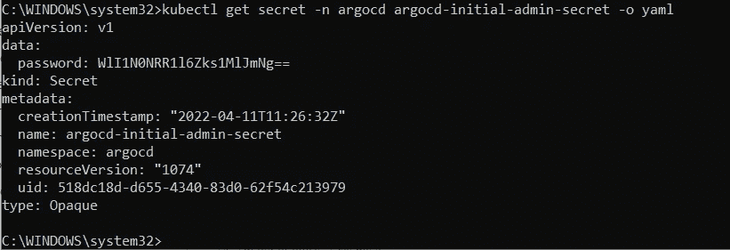**

**View secret from secret**

**下面是解码上述 seret 值的命令。**

> ****$** 回显<秘密值> | base64 - decode**

**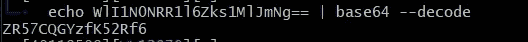**

**Command to decode the value**

**登录后，您的初始页面如下所示，**

**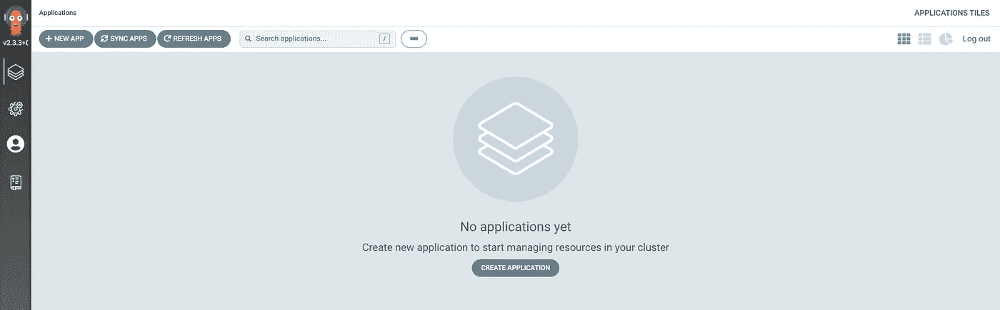**

**Inital ArgoCD page**

# **将 ArgoCD 与 Git 存储库连接**

**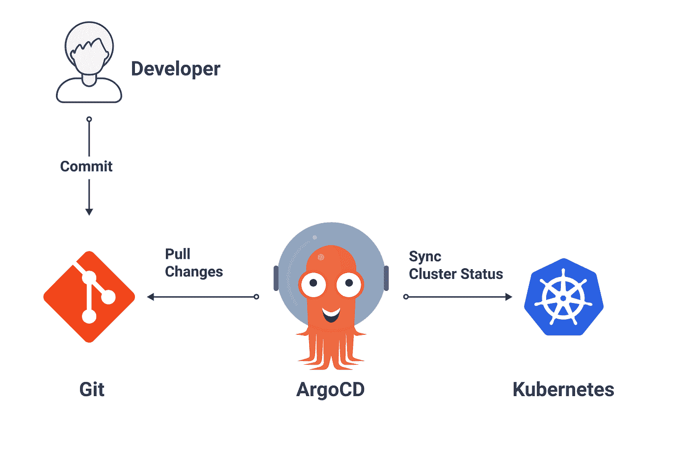**

**我们可以通过 yaml 文件或 UI 来定义这些设置。但是在我们的例子中，我遵循 yaml 文件，这样我们可以在源代码库中维护这个文件。**

**我在 github 中创建了一个[***demo repository***](https://github.com/Sarvabhowma1995/argocd-demo)*。在我已经创建的 develop 文件夹中，存储了所有的开发环境清单文件，并且我已经在该目录中创建了 nginx 部署&服务。你可以点击下面的链接查看代码。***

> ***[【https://github.com/Sarvabhowma1995/argocd-demo】](https://github.com/Sarvabhowma1995/argocd-demo)***

****现在，我正在创建 application.yaml 文件来存储 argocd 和 github 之间连接的配置细节。这个文件非常类似于 kubernetes 清单文件，但是有不同的选项。****

****在 application.yaml 清单文件中，我们可以在 source 和 destination 下提到所需的值。****

****我已经清楚地解释了每一行，所以请按照下面的代码来理解它，你可以随时参考 [***官方文件***](https://argo-cd.readthedocs.io/en/stable/operator-manual/declarative-setup/) 。****

****一旦你创建了上面的文件，要应用它，运行下面的命令。以便从现在开始 Argo CD 将跟踪来自 git 的更改并部署它。****

> ******$**ku bectl apply-f application . YAML****

****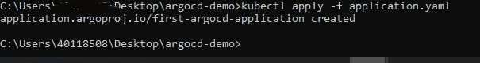****

****applying application manifest to****

****一旦应用了应用程序清单，您就可以从 web UI 检查该应用程序是否可用。****

****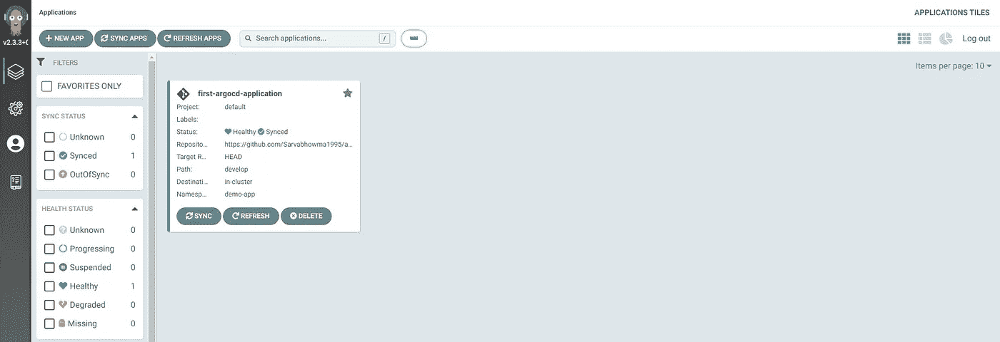****

****Application details from Argo CD Web UI****

****您可以单击该应用程序来检查应用程序映射。您可以单击每个标题来查看摘要、日志、事件、参数和 yaml 配置。****

****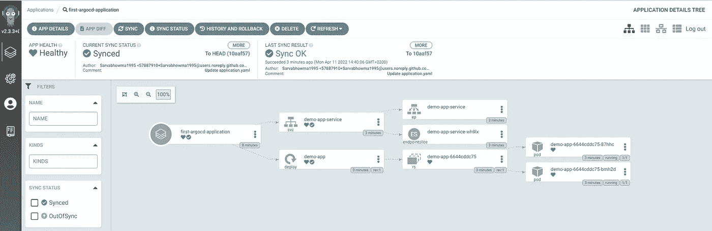****

****Application mapping view****

# ****测试自动部署****

****要测试自动部署，您可以简单地从部署清单文件中更改 image 标记，并等待 3 秒钟来自动部署更改。你可以从 UI 上看到。****

****在我的用例中，我已经给出了 nginx 的最新标签，现在我将把它改为 nginx:1.20 标签。****

****提交后，现在你可以看到 argoCD 自动将更改后的图像标签部署到集群中。****

****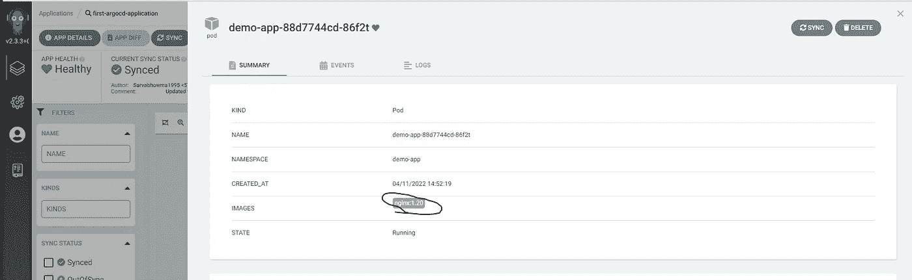****

****Validatng the automatic deployments****

****您甚至可以测试从集群中手动删除演示应用程序部署或服务，并检查 argo CD 如何创建应用程序。****

****我们还可以从 CLI 创建示例应用程序，因为我们需要安装 Argo CD CLI 并运行 Argocd app create 命令。欲了解更多信息，请 [***关注本文档。***](https://argo-cd.readthedocs.io/en/stable/getting_started/#2-download-argo-cd-cli)****

# ****结论****

****现在您已经知道了，通过完整的设置，我们可以分离 CI & CD，并使用 Argo CD 自动将应用程序部署到集群中。****

****我希望你们喜欢这个实践教程，并学到比你以前知道的更多的东西。如果你有任何关于这个博客的问题，请告诉我。****

****下一篇博客再见。🤘****