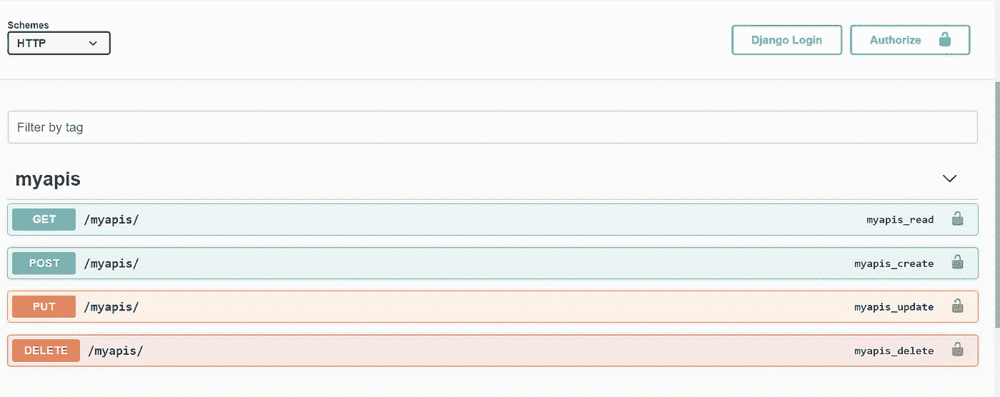

# 给你的 Django APIs 一个无需编码的用户界面

> 原文：<https://medium.com/geekculture/give-your-django-apis-a-user-interface-without-coding-d64878f1314f?source=collection_archive---------13----------------------->

使用 Swagger UI 访问 Django Rest APIs



Swagger UI

D jango 是构建 web 应用程序最流行的 Python 框架，它是可伸缩的，可以轻松处理大量用户。对于这样的大型应用程序，通常首先开发具有 API 的后端部分，然后是 UI 部分，访问具有 UI 的后端 API 总是比使用 CURL 命令好。

Swagger 提供了访问后端 API 的 UI，这个 UI 对于非技术人员和前端开发人员访问和测试后端 API 非常有用。Swagger UI 的主要优点是

1.  它不需要开发人员太多的时间来开发
2.  任何能够访问 Django web 应用程序的人都可以访问这个 UI。
3.  此外，在 Swagger UI 上添加标题、查询和主体参数也很常见。
4.  每个 API 都有自己的描述，因此用户不需要检查文档或询问开发人员如何使用 API。

# 现在让我们获得一个现有的 Django web 应用程序并集成 Swagger UI

## 获取现有的 Django web 应用程序

1.  要了解如何在 Django 中创建 CRUD Rest APIs，请查看 https://vgautam99.medium.com/1bb174596ada?的博客[*source = friends _ link&sk = 83 efb 7 a3 bdbd 05 E3 f 5188 B4 be 02d 97 E4*](https://vgautam99.medium.com/1bb174596ada?source=friends_link&sk=83efb7a3bdbd05e3f5188b4be02d97e4)
2.  创建虚拟环境并激活它

安装:*[*https://pypi.org/project/virtualenv/*](https://pypi.org/project/virtualenv/)*

```
*virtualenv venv*
```

***窗户***

```
*cd venv/Scripts
activate*
```

***Linux***

```
*cd venv/bin
source activate*
```

*安装要求*

```
*pip install -r requirements.txt*
```

1.  *装置*

```
*pip install -U drf-yasg*
```

*2.与 Django Web 应用程序集成*

*打开*DjangoSwagger/settings . py*文件，在`INSTALLED_APPS`里面粘贴下面的线*

***注意:确保 INSTALLED_APPS** 中只有一个‘django . contrib . static files’*

***settings.py***

***打开 *DjangoSwagger/urls.py 并粘贴这些行****

***urls.py***

***3.运行 Django 服务器并检查 Swagger UI***

```
***cd SwaggerDjango && python manage.py runserver***
```

***现在您可以在[http://127 . 0 . 0 . 1:8000/Swagger/](http://127.0.0.1:8000/swagger/)查看 Swagger UI***

******

***Swagger UI***