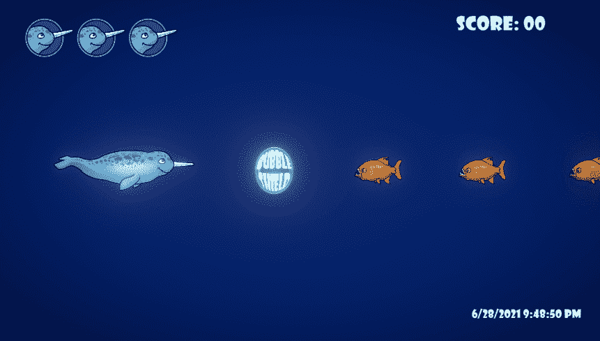

# 赋予 Unity2D 中的护盾生命

> 原文：<https://medium.com/geekculture/giving-life-to-the-shields-in-unity2d-3adc237e9f2e?source=collection_archive---------49----------------------->

在这篇文章中，我将把我的玩家护盾从承受**一次**命中改为承受**三次**命中。我还会讲解如何改变盾牌的**颜色**来显示它受到了伤害。

我的盾牌在视觉上是作为**玩家**游戏对象的**子对象**而存在的，并且在我的**玩家脚本**上受到控制，所以我将在那里继续实现添加的盾牌行为。在我的**玩家职业**的顶端，我添加了一些…