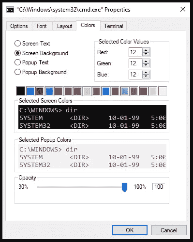
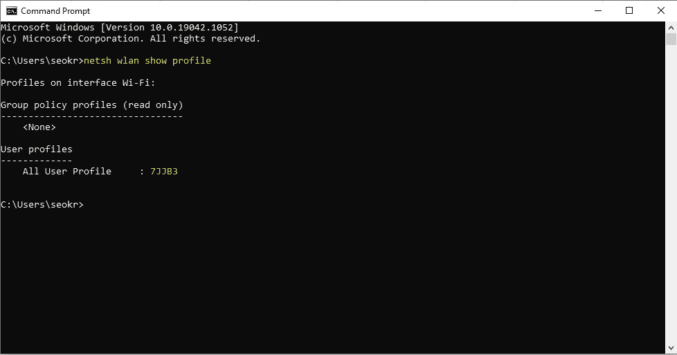
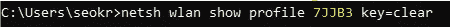
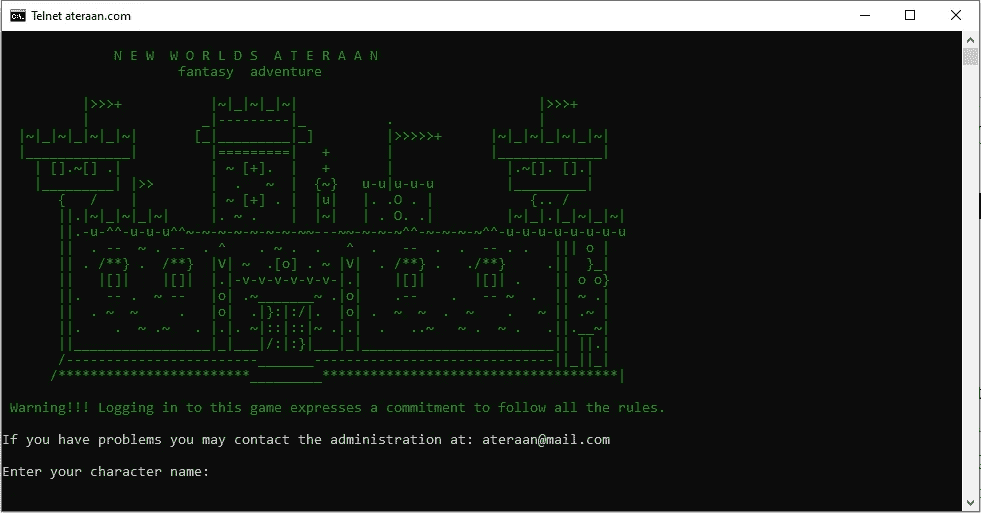
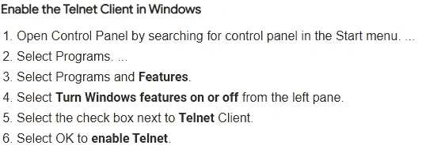

# 给予命令行界面一些内在的优雅

> 原文：<https://medium.com/geekculture/giving-the-command-line-interface-some-inner-grace-18ed62479ff5?source=collection_archive---------34----------------------->

作为一名软件工程专业的新生，命令行是你不情愿地爱上的第一批工具之一。这可能是一项艰巨的任务，启动并运行看起来只不过是字母汤和一个闪烁的下划线等着你打破一些东西。

在一个图形用户界面(GUI)已经取代传统界面的时代，当你可以将鼠标放在某个地方并点击它时，键入命令似乎是违反直觉的...那么我们为什么要使用它呢？

对于开发人员来说，寻找对他们工作的程序文件的更多控制，终端访问是必要的。

一旦你克服了这个工具令人生畏的严酷性，你就开始在处理大型嵌套数据时使用它来提高速度和效率，无论是文件、文件夹、程序等等。

因此，我们的目标是更好地使用 CLI，我认为从定制您的命令提示符开始是合适的。

# 技巧 1:定制

让我们从定制开始。好莱坞电影中的任何潜在黑客似乎总是有一些黑色背景和绿色文字来传达他们的技能有多强，对吗？好的，让我们跳到我们的终端，看看我们如何在大约 30 秒内完成这项工作。

> **打开你的终端:**
> *Windows:*
> -Windows+r 会打开运行框，在那里输入“cmd”
> 
> *MAC:*
> -command(⌘)+space 打开 spotlight 然后只需输入“终端”

打开您的终端后，您需要访问您的属性。如果使用鼠标，这部分教程实际上会更容易。因此，要开始操作，请将鼠标悬停在 CLI 的**顶部工具栏**和**上，右键单击**打开下拉菜单，然后导航至“ ***属性*** ”设置。从那里您将导航到“ ***颜色*** ”选项卡。它应该看起来像下面这样:

在这里，我们有一些有趣的自定义功能，我们可以尝试，但为了这个主题，我们将尝试和模仿标志性的“矩阵”设置。有两种方法可以做到这一点，所以首先我们将尝试下面的手动方式:

1.  **首先将单选按钮切换到屏幕背景，并将颜色设置为黑色。**
2.  **其次，切换单选按钮以显示文本，并将其设置为绿色。**

现在，当我们退出时，它应该会更新和刷新。你可以试着输入一些命令，然后自己去看，或者根据你的喜好改变一些颜色。

很甜，但不完全是电影中著名的绿色坠落外星语言的原型。这里有一个快速的技巧，使用一个包就可以得到我们想要的结果。

在您的终端中键入以下命令:

> **sudo apt-get install cmatrix**
> 
> **矩阵**

所以，下次你在咖啡店里，想要表现得像“入侵主机”一样，你可以把这个扔到你的背景上，然后若无其事地走开去接电话。

# 技巧 2:快捷键

现在我们已经完成了终端的定制部分，让我们来看看一些有用的终端术语，它们将帮助我们实现一个更快、更强大的工作流。

假设我们知道下面列出的传统命令

cd —更改目录
dir/ls —列表目录
pwd —打印工作目录
mkdir —生成目录
rm —删除
mv —移动或复制后的新文件名

为了增加这个知识库，我们可以添加一些内置在工作终端中的热键。键盘顶部的所有功能键都有实用功能。从 F1 到 F9:

*   F1:轻按或按住此键可以一个字母一个字母地重新键入您的最后一个命令。
*   F2:将当前命令复制到指定的字符。
*   F3:重新输入前一行
*   F4:自动删除当前命令直到指定的字符。
*   F5:类似于 F3，但是让您在前面的命令中循环。
*   F6:将 EOF 指示符输入 CMD。
*   **F7:打开之前输入的命令列表。**
*   F8:类似于 F5，但不会在会话中的命令历史结束时停止。相反，它一直到开始。
*   F9:通过输入与该行关联的数字来输入上一个命令

使用向上和向下箭头也有助于命令的循环，但是它们会根据你要完成的任务给出更具体的指示。

# 技巧 3:奖励内容

**从好友的终端找出其 wi-fi 密码:**
**需要管理员权限*
1。将这个弹出到命令行中

> netsh wlan 显示配置文件

2.获取用户配置文件(也称为 wi-fi 网络名称)并重新运行此命令，将{Wifi}替换为网络名称:

> netsh 无线局域网显示配置文件{Wifi} key=clear

# 最后一招

**Windows 命令提示符下的 ascii 艺术角色扮演游戏**
如果你想怀旧一下，你可以玩一个全 Ascii 艺术角色扮演游戏，名为“新世界之旅”。这是通过 telnet 完成的，据我所知，telnet 是一个比较老的协议，只在网络上链接文本通信。自己看吧，在命令行中键入:

> 远程登录 ateraan.com 4002

*注意:您需要打开 telnet 连接访问*

**Mac 程序员从不睡觉**

你的屏幕变暗或者屏幕保护程序没有警告就运行了吗？

尝试键入:

> ***咖啡因***

**这会让你的屏幕在一段时间内保持明亮:**

> 添加“-t xx”来指定清醒的时间，“xx”是以秒为单位的时长。例如，如果你想要一个小时的清醒，你可以输入“咖啡因-t 3600”。

我希望你喜欢这些提示。坐下来闻闻咖啡。编码快乐！