# 中的全局错误处理。带弹性搜索的 Net 6.0

> 原文：<https://medium.com/geekculture/global-error-handling-in-net-6-0-with-elasticsearch-f9d90c1903d8?source=collection_archive---------4----------------------->


嗨，今天我们将讨论从两个方面来捕捉全局错误。网芯 6.0。稍后，我们将把这个错误记录到 Elasticsearch 中，并将自定义错误模型返回给客户端。

你可以从整个解决方案中得到各种各样的错误。所以有时候你可能想对一些特定的错误进行额外的操作。或者您可能希望对所有错误进行全局操作。

## 首先让我们从控制器发送自定义禁止异常:

我们将从控制器发送一个“403 禁止”错误消息来测试全局错误异常捕捉器类。

*   ****ex。data . Add()****方法获取字典参数。因此，我们将 statusCode 作为一个键，statusMessage 作为一个值字典参数添加到客户异常的数据中，并发送它。**

*****user controller/GetTopOneUser():*****

```
**public void GetTopOneUser()
{
    //throw custom exception
    int statusCode = 403;
    string statusMessage = "You are not authorized for this page";

    var ex = new Exception(string.Format("{0} - {1}", statusMessage, statusCode));
    ex.Data.Add(statusCode, statusMessage);  // store 403and "Forbidden Parameters"

    throw ex;
}**
```

> **习惯是错误的温床。—维克多·雨果**

# **1-)第一个方法 Api 扩展:**

**首先，我们将创建“IApplicationBuilder”扩展类。并全局捕捉异常。最后，我们将把响应附加到当前上下文中。**

**1。我们为 IApplicationBuilder 创建了 ConfigureExceptionHandler 扩展类。我们将在“***UseExceptionHandler()***”方法上捕获所有应用程序异常。**

**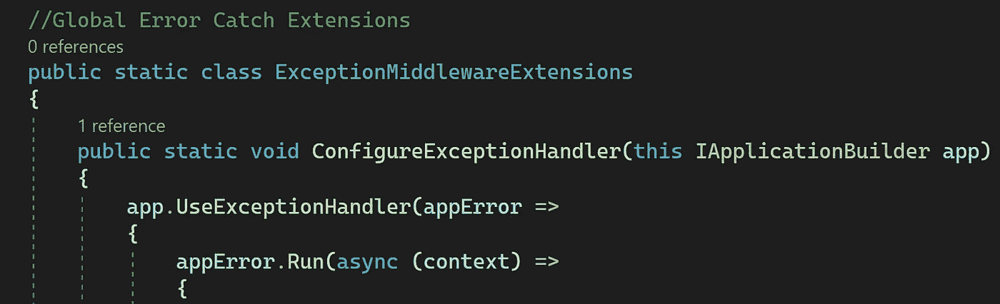**

**Extension ConfigureExceptionHandler**

**2。我们将设置弹性搜索配置。我们以后再谈。我们将检查上下文特征中是否有任何错误。如果其中有错误，我们将得到一个错误消息和错误代码，并为我们的自定义异常创建一个新的字典。**

**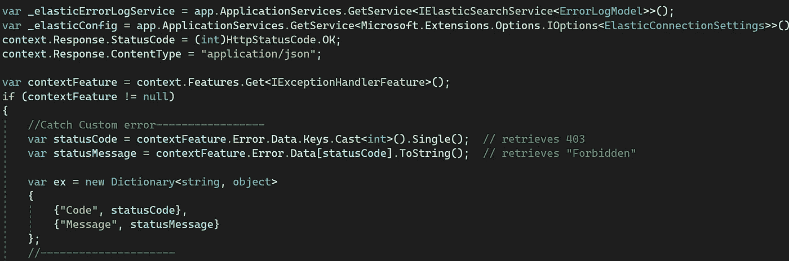**

**Error Dictionary**

**3。我们将创建自定义错误日志模型，用于在弹性搜索中创建索引。**

```
**public class ErrorLogModel
{
   public int UserID { get; set; }
   public string Message { get; set; }
   public string Controller { get; set; }
   public string Action { get; set; }
   public string Method { get; set; }
   public string Service { get; set; }
   public DateTime PostDate { get; set; }
   public int ErrorCode { get; set; }
}**
```

**我们将从“上下文”中获得动作和控制器名称。Request.Path”进行日志记录。我们将设置当前时间，并从请求头中获取 UserID。最后，我们将把“logModel”索引保存到 ElasticSearch (error_log 索引)。**

**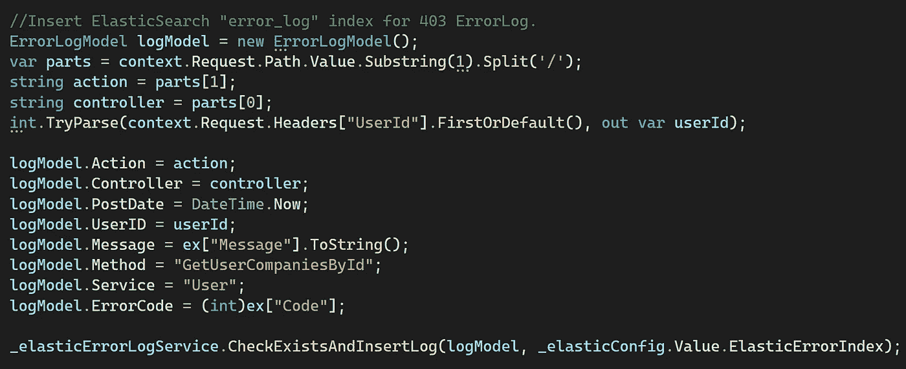**

**Create ElasticSearch Model and Index**

**4。我们将检查错误数据中是否有错误。如果是，我们将循环每个错误，并将其添加到异常字典中。最后，我们将在上下文响应中写入“错误消息”。**

**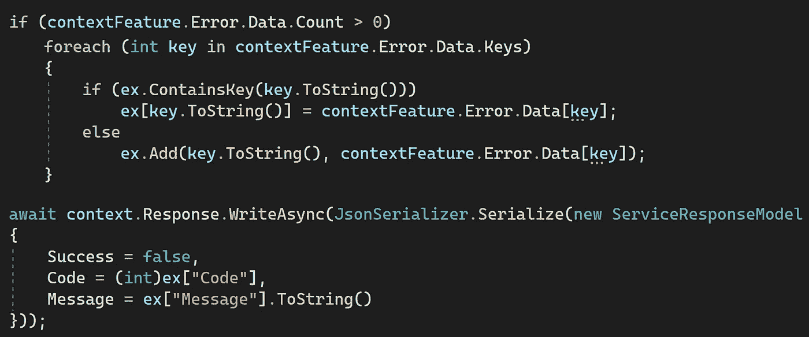**

**Loop in the Errors**

> **最大的错误是认为我们永远不会犯错。**
> 
> **—托马斯·卡莱尔**

*****Infrastructor/exceptionmiddleware extensions . cs:*****

*****appsettings.json/ElasticConnectionSettings:*****

**我们将大致浏览一下 ElasticSearch 核心库。因为 ElastichSearch 是一个完全不同的学科。如下所示，出于安全原因，弹性连接和凭证被加密。所有三个索引名称都在配置文件中定义。**

**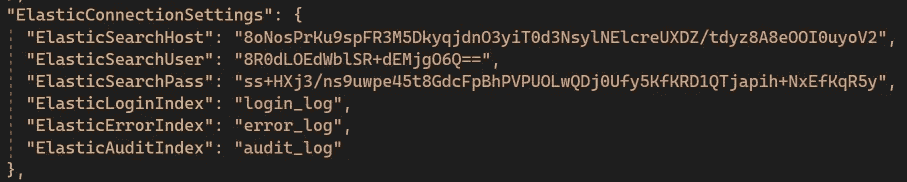**

**appsettings.json (ElasticConnectionSettings)**

*****Elastic search/ielasticsearchservice . cs*:**这些都是弹性操作。创建< T >动态索引，并从特定的 3 个索引(错误、审计和登录)进行搜索。在本文中，我们将只讨论为 ElasticSearch 创建或插入索引。**

**ElasticSearch Base Methods**

*****elastic search/elastic search service . cs:*****

*   **ElasticClientProvider 正在设置 ElasticConfig 并创建一个单独的弹性客户端类。我们以后再谈。**
*   **CheckExistsAndInsertLog()方法。在本例中，我们将创建“ ***error_log*** ”索引，如果不存在的话。NumberOfReplica 和 NumberofShards 是为了提高性能和灾难场景下主机与从机之间的交换而设置的。**

**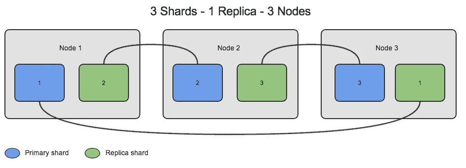**

**Elasticsearch is configured on a total of 6 machines called 3 sharding, running on 3 machines for performance purposes and each machine having 1 backup (Replica) for security purposes. 6 machines are divided into 3 groups in 2 groups. Each group is called a Node. Each machine backup must be on a different Node. “You shouldn’t put all your eggs in the same basket. :)“**

*   **" ***别名(a =>a . Alias(index name)))***":设置别名对于 ellasticsearch 来说非常重要。当将来对索引进行更改时，它可以确保以前保存的文档可以很容易地创建而不会丢失。**
*   *****IndexResponse response index = _ client。索引< T > (logModel，idx = > idx。Index(indexName))*** ":索引创建后或者已经存在，我们会将错误日志模型保存到 error_log 索引中。实际上，这个方法是“**通用的< T >** ”所以你可以将每个模型保存到 elasticsearch 上的任何索引中。**

****elastic search/elastic client provider:****

**我们将使用配置信息创建 ElasticClient。出于安全原因，所有配置文本都进行了加密。所以我们使用一个外部加密类来解密所有的配置信息。**

*****Security/encryption . cs:***这是我们的加密类。我们将使用“ ***TripleDES*** ”进行编解码。出于安全原因，您必须在将所有重要文本保存到 config 之前对其进行加密。毕竟，当我们从 appsettings.json 中读取配置信息时，我们必须解密所有文本。**

**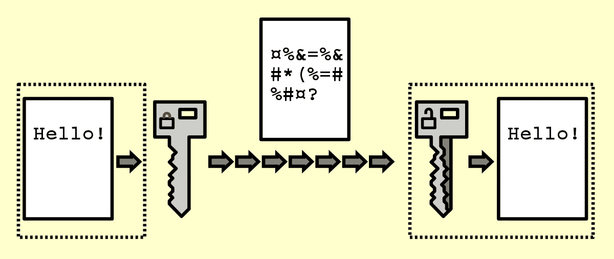**

**[https://en.wikipedia.org/wiki/File:Public_key_encryption_keys.svg](https://en.wikipedia.org/wiki/File:Public_key_encryption_keys.svg)**

****Startup.cs:** 现在我们要调用我们在 Startup.cs 上的"***ConfigureExceptionHandler()"***方法" app "继承自 IApplicationBuilder 接口。而且我们在 IApplicationBuilder 接口上写了一个扩展。所以现在我们在监控应用上的每一个错误。如果真的发生了，我们会登录弹性搜索。我们可以使用 Kibana 工具来监控按日期排序的错误日志，或者我们可以使用任何特定的属性进行过滤。**

```
**.
.
app.ConfigureExceptionHandler();
.
.**
```

**Global Error Handling With ElasticSearch Demo**

> **当你的敌人犯错时，千万不要打断他。——拿破仑**

# **2-)创建中间件类的第二种方法:**

**在第二个方法中，我们将在这个中间件类中实现两个方法。 ***Invoke()*** 和***handelexception async()***方法。毕竟我们会通过使用“***use middleware()***”将“*GlobalErrorHandlingMiddleware*”类注入到 in 的 app 中。Net 6.0**

**1。我们将用“ *RequestDelegate next* ”参数获取 GlobalErrorHandlingMiddleware 类的构造函数上的 RequestDelegate，并设置 private“*_ next*”变量。**

**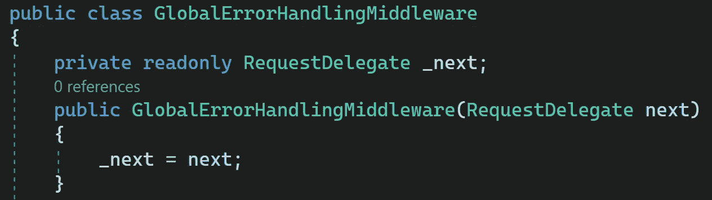**

**Set RequestDelegate in the Constructor method**

**2。我们将用“ ***Invoke()*** ”方法作为参数获取当前的 HttpContext。**

*****deep note***:*request delegate*是代表请求处理完成的任务。**

**在" *try {} catch{}* "块中，我们将尝试完成当前的 HtppContext 请求，如果我们得到一个错误我们将调用异步的"***【HandleExceptionAsync()***"方法。**

**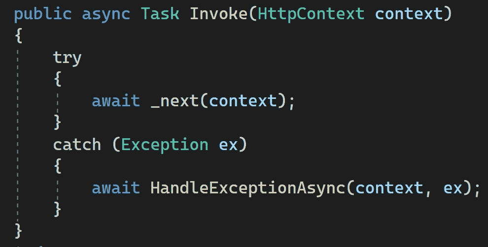**

**Monitoring Current HttpContext Processing**

**3。在 HandelExceptionAsync()方法上，我们将得到错误消息，stackTrace。如果我们愿意，我们可以从“上下文”中获取动作和控制器名称。Request.Path.Value "与前面的示例一样。我们将把我们的自定义错误响应注入到当前上下文中。然后归还。**

**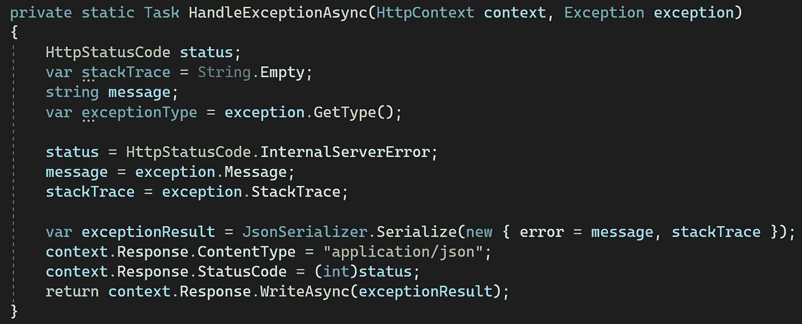**

**我们将把这个中间件类注入到应用程序中，如下所示:**

****Startup.cs:****

```
*****.
.
app.UseMiddleware(typeof(GlobalErrorHandlingMiddleware));
.
.*****
```

**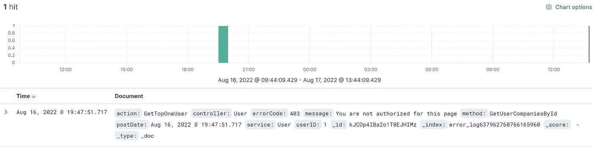**

**Kibana “error_log” Index Result**

*****基础架构/* 全局错误处理中间件*。cs:*****

**这是结果屏幕:**

**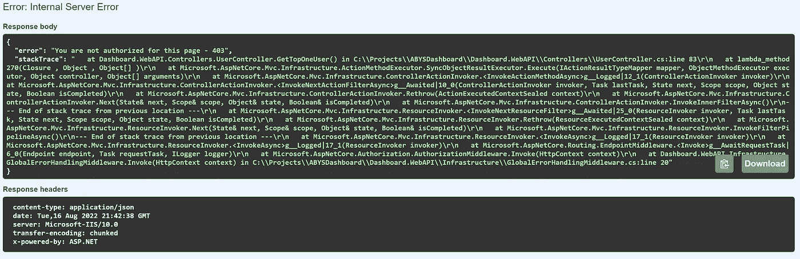******

****结论:****

**我们的主要目的是设法在一个地方解决错误。所以以后你可以很容易地改变、扩展或删除一些错误操作。您可以全面有效地进行测试和监控。现在，对于错误记录，您可以使用 Elasticsearch，但是以后您可以决定在 mongoDB、cosmosDB 或任何地方索引您的错误文档。您可以全局地对特定的错误代码进行额外的操作。例如，如果你得到“500 错误”你可以发送电子邮件给管理员。**

**我们不打扰一般的流动。如果我们遇到任何错误，我们只将错误日志文档附加到“上下文”中。回应”。我们在本文中没有谈到多语言支持。我们用英语写了所有的东西。这完全是另一篇文章的主题。**

**下一篇文章再见。**

***“如果你读到现在，首先感谢你的耐心和支持。欢迎大家到我的博客*[](http://www.borakasmer.com/)****了解更多！”******

****来源:****

*   **[https://docs . Microsoft . com/en-us/aspnet/core/fundamentals/error-handling？view=aspnetcore-6.0](https://docs.microsoft.com/en-us/aspnet/core/fundamentals/error-handling?view=aspnetcore-6.0)**
*   **[https://www.elastic.co](https://www.elastic.co)**
*   **[https://blog . devo PS . dev/implementation-of-global-exception-handling-using-net-core-6-we b-API-cab 566052012](https://blog.devops.dev/implementation-of-global-exception-handling-using-net-core-6-web-api-cab566052012)**
*   **[https://cloud coders . XYZ/blog/global-error-handling-in-ASP-net-core-we b-API/](https://cloudcoders.xyz/blog/global-error-handling-in-asp-net-core-web-api/)**