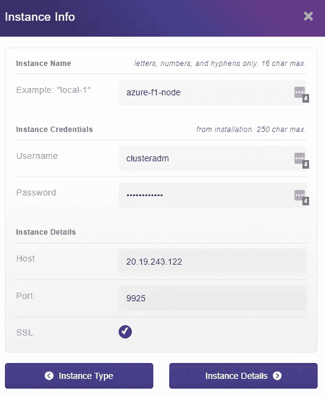

# 面向全球低延迟应用的全球多云平台部署

> 原文：<https://medium.com/geekculture/global-multi-cloud-terraform-deployment-for-low-latency-applications-worldwide-b02c65c859ca?source=collection_archive---------7----------------------->

分布式数据库非常重要，因为我们可以将数据分布到全球各地，无论用户身在何处，都可以获得极快的响应速度。我想展示如何通过利用 HarperDB 和提供商提供的免费层来完全免费地做到这一点。虽然我选择了 AWS 和 Azure，但现在有很多其他云提供商提供利润丰厚的免费层或免费积分，如 Azure。

为了使这种多云部署变得容易，我将使用 [Terraform](https://www.terraform.io/) 来管理基础设施，并允许我们在一个命令中部署我们的容器。我们将使用 Azure 在欧洲托管一个数据库，在印度由 AWS 托管一个数据库，最后，我们将利用运行在美国的 HarperDB 的云实例。部署完容器后，我们将进入 HarperDB，利用它的集群特性，只需点击几下鼠标就可以轻松地同步实例。为了展示缓存，我将构建一个[一级方程式](https://www.formula1.com/)数据 API 中继来帮助驱动一个显示最新车手排名的 web 应用程序。我们开始吧！

如果你想以视频格式遵循这个指南，我还准备了一个近 30 分钟的分步视频，HarperDB 已经慷慨地提出为我上传到他们的 YouTube 频道:

# 输入地形

[Terraform](https://www.terraform.io/) 是由 [HashiCorp](https://www.hashicorp.com/) 发布的开源 [IaC 工具](https://learn.hashicorp.com/tutorials/terraform/infrastructure-as-code)。Terraform 是平台无关的，因此它包含许多不同提供商的模块，并被视为 IaC 的中立方法，因为一些解决方案需要供应商锁定，如云形成。我们可以使用 Terraform 在任何情况下进行可重复的部署，而不是使用 CLI，编写大量代码来使用 API 启动实例，或者在控制台中进行大量点击。

## 入门指南

如果你没有安装 Terraform CLI，安装说明是[这里](https://learn.hashicorp.com/tutorials/terraform/install-cli)。为了让 Terraform 与我们的 AWS 和 Azure 帐户进行身份验证，最简单的方法是使用它们各自的 CLI 登录，并让 Terraform 以这种方式进行身份验证。您也可以将凭证保存在您的环境变量中，这里有针对[的指令](https://registry.terraform.io/providers/hashicorp/aws/latest/docs#environment-variables)，这里有针对[的指令](https://registry.terraform.io/providers/hashicorp/azurerm/latest/docs/guides/service_principal_client_secret)。

要获取 AWS CLI，这里有说明[这里有](https://docs.aws.amazon.com/cli/latest/userguide/getting-started-install.html)，Azure CLI 的说明可以在这里找到[。要验证 AWS CLI，您可以通过控制台按照这些指令](https://learn.microsoft.com/en-us/cli/azure/install-azure-cli)[生成访问密钥](https://docs.aws.amazon.com/IAM/latest/UserGuide/id_credentials_access-keys.html#Using_CreateAccessKey)。Azure 有一个登录命令，我们可以使用它通过我们的 web 浏览器进行身份验证。

现在，CLI 已准备就绪，我们可以继续讨论基础架构了！

## 地形文件

Terraform 的工作方式是[解析](https://www.terraform.io/language/files)当前工作目录中的所有`*.tf`(和一些其他的)文件，并应用来自`*.tfvars`文件的变量。您也可以将您的 TF 文件以 JSON 格式存储为一个`*.tf.json`文件，但这并不常见。

你可以将所有的 Terraform 代码存储在一个巨大的文件中——但是它非常容易丢失，并且当你开始构建更大的项目时，确实需要一些组织。出于这个原因，开发人员通常会将 IaC 代码分成模块、服务或提供者，但这取决于您。如果您是 Terraform 的新手，下面是代码的大致样子:

我们声明它是什么类型的资源，在我们的例子中是`aws_vpc`，以及资源的名称，我刚刚把它命名为`vpc`——不是很新颖，但是对于像这样只有一个这样的资源的小项目来说，它是有效的。根据您正在配置的资源类型，将确定哪些属性是必需的或可用的，但这正是 Terraform 的伟大的[文档](https://registry.terraform.io/providers/hashicorp/aws/latest/docs/resources/vpc)派上用场的地方，因为我们可以深入研究并查看 VPC 资源还有哪些可用的属性。

如前所述，需要一些组织，这就是为什么我把这个项目的 IaC 代码分成一个 [AWS 文件](https://github.com/makvoid/guide-harperdb-multi-cloud-tf/blob/master/deployment/aws.tf)，一个 [Azure 文件](https://github.com/makvoid/guide-harperdb-multi-cloud-tf/blob/master/deployment/azure.tf)，一个 [DNS 文件](https://github.com/makvoid/guide-harperdb-multi-cloud-tf/blob/master/deployment/dns.tf.example)，然后是保存配置和一些变量信息的[主文件](https://github.com/makvoid/guide-harperdb-multi-cloud-tf/blob/master/deployment/main.tf)。

# 部署

要开始部署，首先，我们需要克隆这个项目的 GitHub 存储库，初始化 Terraform，然后部署这个项目:

在计算完所有需要的资源后，Terraform 将在实际启动资源之前等待您的批准，这非常有用，因为您可以看到它是否会意外破坏资源，或者添加太多资源，等等。一旦 Terraform 完成部署，您就可以通过 CLI 或控制台获取容器的公共 IP。也可以使用 Terraform 将这些设置为输出，并将其保存在本地。

对于 AWS，前往[控制台](https://console.aws.amazon.com/)并选择‘弹性容器服务’。选择 HDB 集群，然后选择“任务”选项卡。单击列表中的唯一任务，并查找“公共 IP”。对于 Azure，请转到[门户](https://portal.azure.com/#home)并选择“容器实例”。选择 HDB 组并获取“IP 地址(公共)”。

# 地理路由

现在我们有了我们的多云部署，如果我们可以自动将用户路由到他们最近的区域，以便我们的用户以最快的方式从我们的 API 获得信息，那就太好了。幸运的是，我们可以通过我们选择的任何一个提供商来实现这个目标，但是我将使用 AWS Route53 来轻松添加这个特性。在项目目录中，重命名示例 DNS 文件，并用您的容器 IP 地址填充它:

保存这些更改后，我们现在可以重新运行 Terraform，让它添加所需的额外 DNS 基础架构:

现在，根据用户的位置，Route53 将策略性地发送我们的请求——超级简单和棒！

# HarperDB 聚类

在 HarperDB Studio 中，让我们继续添加我们之前部署的实例。登录到 [HarperDB Studio](https://studio.harperdb.io/) 后，导航到实例页面并点击 add 按钮。我们想要添加我们的两个容器，并适当地命名它们:

Setting up a node in HarperDB Studio

由于我们的容器很小，我们可以使用免费的 HarperDB 层，它提供 512MB 的内存分配。添加完这两个实例后，让我们最后添加第三个实例进行连接。您可以选择用户安装的实例并在本地运行，但我会选择使用 HarperDB 的云实例产品，因为它是完全托管的，所以少了一件需要担心的事情。

## 云实例

单击“创建实例”，然后单击“创建 AWS 或威瑞森波长实例”。我将选择 AWS，并给出一些基本的细节，但我将保持实例凭证不变，只是为了便于管理。我还将在下一页保留默认设置，并在出现提示时启动实例。在给 HarperDB 几分钟时间来启动实例之后，我们就可以点击它并开始集群了！

## 启用集群

将所有三个实例添加到 HarperDB 后，单击我们刚刚添加的云实例，并转到“Cluster”部分。在左侧，输入变量文件中的集群凭据。之后，单击“设置集群节点名称”,然后启用最终集群。完成后，您将在左侧看到一个未连接实例的列表。您可以单击每个容器实例旁边的“+”图标将它们连接在一起。

一旦它们被连接起来，您将获得一个模式和表的列表，您可以选择发布或订阅这些模式和表。这是一种非常简单的同步两个不同实例的方法，这样信息可以在整个集群中使用，而不是只在一个实例中使用。我们将选择发布和订阅两个节点，就好像一个节点获得了一条记录，我们希望了解它，然后发布到另一个节点。

Example clustering configuration

# API 部署

难题的最后一部分是将我们的定制函数代码部署到 HarperDB 集群节点。如果在您的一个节点上已经有了一个自定义函数项目设置，那么您可以使用 HarperDB Studio 来转移它。或者，如果您使用非云实例，您可以将文件上传到 HarperDB 数据目录中。由于我们使用云实例，以及其他服务器的容器，如果我们使用一个脚本来加载使用 HarperDB API 的定制函数代码，会更容易。

HarperDB [发布了](https://github.com/HarperDB/hdb-cf-apigateway)一个定制函数项目，使我们能够在 HarperDB 实例上本地缓存远程 API 资源。如果我们获取的信息不经常更新，并且我们不总是需要信息的新副本，因为它不会改变，那么这是很有用的。我们将利用这段代码为 Ergast 托管的 F1 API 快速构建一个缓存实用程序。

在`scripts`目录中，有一个名为`deploy-custom-functions.js`的文件，该文件有一些配置值，应该在顶部附近编辑:

编辑完这些值后，我们可以安装依赖项并运行脚本，如下所示:

一旦完成，我们可以前往 HarperDB Studio，将项目部署到其他实例。在 HarperDB Studio 中，选择我们部署到的实例，然后选择“Functions”。单击右上角的“Deploy”以查看可用服务器的列表——然后您可以部署到我们为此项目设置的每个 HarperDB 节点。

最后，我们需要在每台部署了 API 网关代码的主机上运行 setup route。我们可以通过 Curl 非常容易地做到这一点:

# 测试

使用 Curl(或者通过它的 UI 使用 Postman)，您可以通过向 API 发送请求并从 Ergast 的 API 请求驱动程序排名来轻松测试缓存响应时间:

“实际”行上的时间量是请求花费的时间，以分钟/秒为单位。取决于您在 handleRequest 助手中如何配置`MAX_AGE_SECONDS`值，它将决定一个请求将被缓存多长时间。对于我们这里的用例，我们可以将它设置得相对较高，因为比赛不会经常发生(尤其是现在的休息时间)。

# 结论

这里最棒的是，因为我们已经配置了 HarperDB 数据集群，一旦一个节点缓存了记录，HarperDB 就会自动在集群中同步记录。这降低了代码的复杂性，节省了我们大量的时间和麻烦。这是我第一个使用集群的项目，我非常兴奋地发现我的下一个项目可以实现它。

为了进一步推进这个项目，我们可以实现一个定制的映像，它加载了我们自己的 SSL 证书，并将端口配置为 HTTPS 的普通端口。我们还可以更改 DNS Terraform 配置，改为使用容器的输出值，这样它可以自动为我们生成 DNS 记录。

完成项目后，您可以通过一个简单的命令轻松销毁所有创建的资源:

# 资源

*   [代码库](https://github.com/makvoid/guide-harperdb-multi-cloud-tf)
*   [哈珀德布](https://harperdb.io/)
*   [地形文件](https://www.terraform.io/docs)