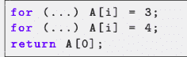
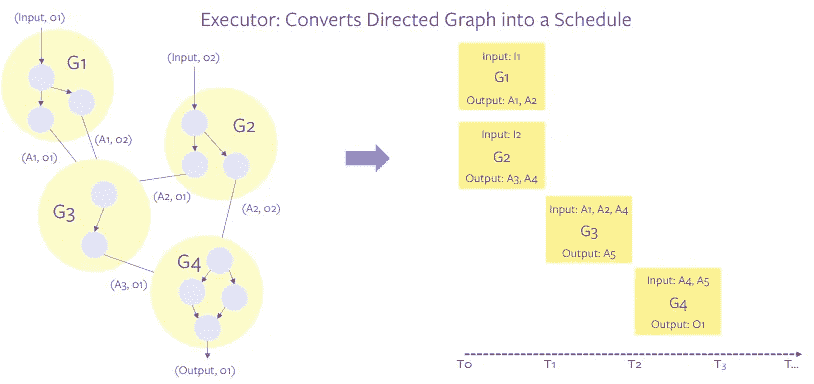
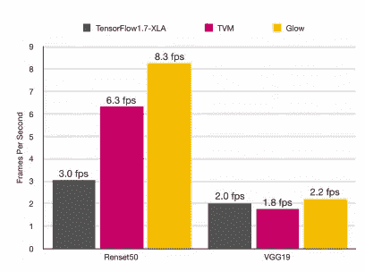

# Glow:用于神经网络的图形降低编译技术

> 原文：<https://medium.com/geekculture/glow-graph-lowering-compiler-techniques-for-neural-network-fb1eacbd0508?source=collection_archive---------23----------------------->

Glow 是一个机器学习编译器，旨在用作 Pytorch、Tensorflow 等高级机器学习框架的后端。它还充当硬件加速器的执行引擎。该编译器旨在创建一流的编译器优化和神经网络图的代码生成。在这篇文章中，我将讨论 GLOW 论文的摘要，以及我在这篇论文中发现的优势和弱点，以及为什么 Glow、TVM 等深度学习编译器是人工智能的未来。

**概要:**

Glow 从 Tensorflow、Pytorch 等高级框架获得传统神经网络数据流图输入，并将其降低为两阶段强类型中间表示。不同级别的 IR 执行不同的操作，就像高级 IR 允许优化器执行特定于域的优化。基于低级指令的仅地址 IR 允许编译器执行与内存相关的优化，例如指令调度、静态内存分配和复制消除。在最底层，优化器借助专门的硬件特性生成特定于机器的代码。Glow 通过支持降低阶段，使编译器能够支持大量的硬件目标和输入操作符，从而消除了在所有目标上实现所有操作符的需要。降低阶段减少了输入空间，并允许新的硬件后端专注于少量的线性代数运算。Glow 将基于浮点的网络转换为带符号的 8 位整数网络，用于量化值。Glow 使用轮廓导向量化，在推断过程中观察执行情况，以估计神经网络每个阶段的可能数值范围。Glow 运行时组件包含第一分区，这些分区组成一个或多个子网。置备程序编译每个子网，并将它们分配给一个或多个设备。设备管理器充当物理设备的抽象。它处理网络负载、内存传输、设备上的执行，并跟踪硬件状态。执行器处理网络的执行。它跟踪每个子网的执行状态，并传播子网的输入和输出。

**动机:**

让我们看一个例子来理解为什么神经网络图的优化需要高级 IR。

这里我们可以看到两个 for 循环写入某个内存区域，return 语句从数组的第一个元素中读取。GCC 和 LLVM 编译器都无法删除多余的第一个循环，也无法用常量值“4”替换加载操作。原因是分析循环和内存很难。编译器检查循环是否没有溢出和索引是否正确，以及计算结果是否准确并符合 C 编程语言的规范。

但是像 GLOW 这样的编译器看到了对这种代码进行优化的需要，高级中间表示允许编译器推理和优化高级结构，如张量和运算。深度神经网络处理时间、内存和计算敏感，并将其部署在低内存设备中，图形需要基于低级设备特定 IR 和高级 IR 进行优化，这是 Tensorflow 和 Pytorch 框架等框架无法做到的。我们也不能依赖传统的 C++或 JVM 编译器，为此我们需要一些智能框架来处理内存优化，并基于程序执行创建编译器级别的代码设备特定代码，而无需针对每个不同的硬件进行手动调整。

**论文优势:**

1.  Glow 在高水平 IR 下进行图形级优化，这对于所有设备都是通用的，也可以进行特定设备的低水平优化，并且可以处理许多不同的设备。这减少了工程师在每个设备上优化代码的工作量，并将这项任务留给了编译器。
2.  Glow 支持两种类型的编译技术:即时编译(在执行模型之前执行编译)和提前编译(在离线状态下执行编译以生成目标文件(称为 Glow bundle ),该文件稍后将与用户的应用程序代码相链接。

A simple example showing a graph partitioned into multiple sub-graphs, themselves making up a directed graph, and then converted into a schedule by the executor.

Glow 仅支持 ONNX 和 cafe 2 模型作为输入格式，但从 Tensorflow 制作的其他模型可以很容易地导出为 ONNX 格式，以便在 Glow 编译器中使用。

**纸的弱点:**

1.  首先，我们必须使用 Tensorflow、caffe 或 pytorch 等高级框架库创建一个神经网络图，然后该图将被输入到 Glow 编译器，该编译器将优化高级图，然后进行特定于设备的优化，因此与普通 C++编译相比，这将是一个耗时、繁琐且缓慢的过程，并且模型还需要转换为 ONNX 或 caffe 2 模型格式才能输入到 Glow 编译器中，不接受其他格式。

Glow vs. TensorFlow-1.7 and TVM on an IntelR Core i7–7600U; frames per second on a single thread.

2.与 TVM 或内部编译器相比，没有任何高级优化，例如内存不足时的激活/权重分区、重用激活以避免内存移动、计算数据移动并行。

3.当 Tensorflow 在启用 XLA 的情况下编译时，Glow 的性能比 Tensorflow 高 2.7 倍，但只有在 TVM 中禁用自动调整和计划时，glow 的性能才能优于 TVM。

**参考文献**

1.  [https://www . opensourceforu . com/2019/06/the-capabilities-of-tensor-virtual-machine-an-open-deep-learning-compiler-stack/](https://www.opensourceforu.com/2019/06/the-capabilities-of-tensor-virtual-machine-an-open-deep-learning-compiler-stack/)
2.  [https://ucbrise . github . io/cs 294-ai-sys-sp19/assets/lec12/dl-compilers . pdf](https://ucbrise.github.io/cs294-ai-sys-sp19/assets/lectures/lec12/dl-compilers.pdf)
3.  [https://www . ground ai . com/project/the-deep-learning-compiler-a-comprehensive-survey/1](https://www.groundai.com/project/the-deep-learning-compiler-a-comprehensive-survey/1)
4.  [神经网络的图形降低编译技术](https://arxiv.org/pdf/1805.00907.pdf)