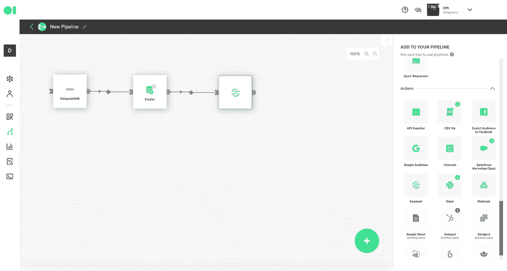
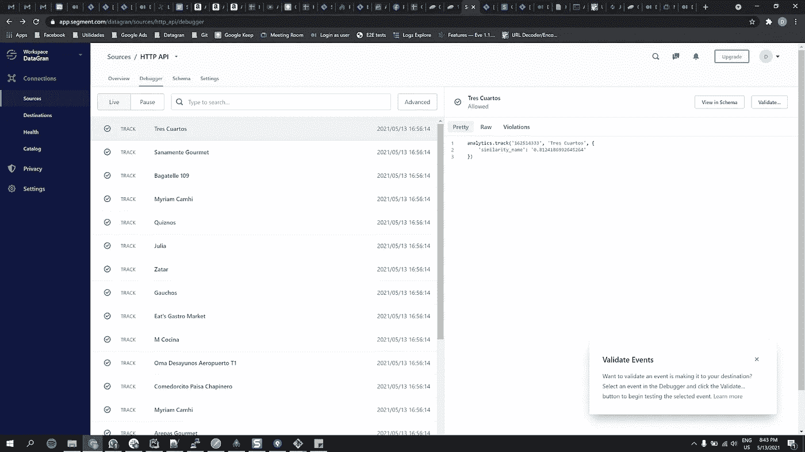

# 将分段作为一个动作转一整圈

> 原文：<https://medium.com/geekculture/go-full-circle-with-segment-as-an-action-7334a81cc982?source=collection_archive---------46----------------------->

Unsplash

几个月前，我们宣布整合细分市场。作为一种集成，Datagran 允许您将存储在 Segment 中的 web、移动、服务器和云应用程序数据整合到 Datagran 中，以便在您的所有数据项目中使用。

今天，我们很高兴地宣布细分为行动。对于使用 Segment 作为 CDP(客户数据平台)的公司来说，这是一个非常有用的功能，因为从现在开始，用户可以将 Datagran 中创建的机器学习模型的输出发送到 Segment，然后将这些数据传输到 Segment 支持的不同业务应用程序。

# 为什么重要？

目前，使用 Segment 的公司只能跟踪其网站、应用程序或服务器中的事件，并在业务应用程序中传播这些数据，以便进行分析或采取特定行动。为了能够运行预测分析，必须将多个应用程序和云服务器连接在一起，这可能既耗时又困难。通过 Datagran，公司可以简单地连接细分市场集成，提取存储在其中的所有数据，运行机器学习模型，然后轻松地将输出发送到细分市场，如果用户不存在，将自动更新或创建用户。

我们客户的一个用例如下:

1.  客户将其交易数据发送到充当 CDP 的段。
2.  Segment 不仅将数据发送到业务应用程序，还将其存储在雪花中。
3.  Datagran 连接到 Snowflake 来带来 Segment 中包含的所有数据。
4.  客户执行 ML 模型，如销售预测、聚类等，并将输出发送回细分市场。
5.  客户端使用数据段将数据发送到不同的业务应用程序以采取行动。

以下是 Datagran 中分段操作所需的输入:

1.  **Write 键:**这是一个 API 键，允许 Datagran 通过段的 REST API 发送数据。有关如何获得写入密钥的说明，请点击此[链接](https://segment.com/docs/connections/find-writekey/)。
2.  **表格:**是指您要从中提取数据的表格。一旦您将 Segment 操作连接到特定的操作符(通常是 SQL 操作符)，Datagran 将自动检测您的表。
3.  **事件名称:**指的是将持有您的属性的事件。例如，一个事件可以是“销售预测”。
4.  **属性:**指事件中包含的属性。您可以拥有任意多的属性。
5.  **客户 id:** 指您数据库中的客户 id。如果用户存在于段中，我们将更新事件和属性。如果没有，我们将创建一个新的客户。

带有分段操作的简化管道示例如下所示:

‍

要使用分段作为操作，您必须在分段仪表板中创建 HTTP 源。这是它应该是什么样子的一个例子:

该段将收到的输出如下所示:

analytics.track('162514333 '，'销售预测'，{ 'iphone': '0.734 '，' apple_watch': '0.812'})

如前所述，这个方法有一个 user_id 字符串、一个事件字符串和一个属性字符串。

Datagran 将数据批量发送到 Segment，并由 Segment 的库进行处理。以下内容摘自分部文件:

每个名为'**的方法都不会'**产生 HTTP 请求，而是在内存中排队。消息在后台批量刷新，这样可以加快操作速度。

默认情况下，段将刷新:

*   每 100 条消息(用 upload_size 控制)
*   如果从最后一次冲洗起已经过了 0.5 秒(用 upload_interval 控制)

每个批处理请求最多有 500KB，每个调用最多有 32KB。

# 如果消息太多会怎么样？

如果模块检测到刷新速度不能快于接收消息的速度，它将简单地停止接收消息。这意味着操作永远不会因为队列备份而崩溃。默认的最大队列大小是 10000。

准备好进一步挖掘细分市场数据了吗？点击此处注册[，使用您的细分市场账户遵循本指南。通过我们易于使用的管道工具，您可以利用您的数据并立即构建机器学习模型，在该工具中，您可以使用 RFM、推荐产品、聚类等构建和部署模型。](https://www.datagran.io/)