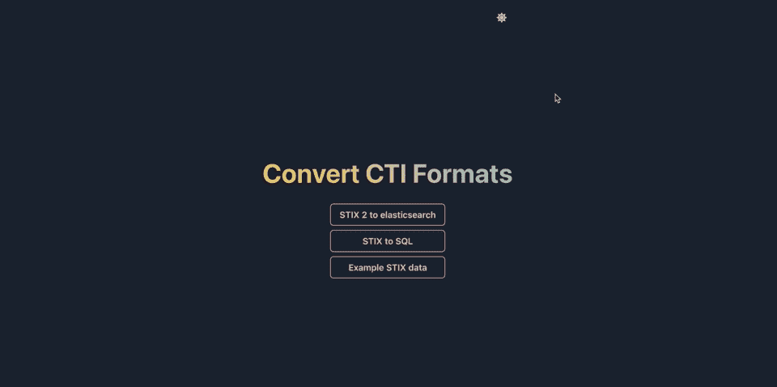

# 与姜戈一起玩全栈游戏，并在 15 分钟内做出反应

> 原文：<https://medium.com/geekculture/go-full-stack-with-django-and-react-in-15m-ef73b6dba28b?source=collection_archive---------2----------------------->

## TL；博士；医生

克隆[这个](https://github.com/osintalex/django-react-poc)回购，运行`docker-compose build`，然后`docker-compose up`，前端在`localhost:3000`上，后端在`localhost:8000`上。示例 GET 请求[在这里](https://github.com/osintalex/django-react-poc/blob/main/django-cti-react/react-frontend/src/components/PopOver/popover.js)，示例 POST 请求[在这里](https://github.com/osintalex/django-react-poc/blob/main/django-cti-react/react-frontend/src/components/Form/form.js)。

## 介绍

我最近做了一个小型的概念验证网站来转换网络情报格式——代码[在这里](https://github.com/osintalex/django-react-poc)。我想全力以赴，用 Django(一个强大的 Python 框架)和 React(一个广受欢迎的 JavaScript 库)创建一个网站。

一旦我得到了这一切设置和工作，这是伟大的！但是我发现想出一个好的方法来设置 Django/React 配置是非常耗时的，这也是我想写这篇文章的原因。

尽管网上有大量关于 Django/React 全栈项目配置的内容，但我总的来说发现它们相当混乱和冗长。他们中的许多人似乎也在重复这篇关于数字海洋的非常好的文章。这是一个很棒的作品，但是它没有使用 Docker，并且拥有比你需要的更多的前端代码，你只需要启动一些东西并看看它是如何工作的。

所以这里有一篇文章可以帮助你尽快开始开发。我会尽量让它简单，同时也确保有可能理解过程中发生的事情。

## 概观

首先，让我们回顾一下我们需要构建的核心内容:

1.  Django 应用程序
2.  React 应用程序
3.  React 从 Django 获取数据的方法
4.  React 向 Django 发送数据并在处理后取回数据的方法

经过一些研究，我认为实现这些目标最简单的方法是使用 Docker、Django REST 框架和 Django CORS 头文件。不过我先说一句——*如果你不知道怎么用 Docker，不用担心！在这篇文章中，我将使它非常容易理解。*

无论如何，Docker 是非常有用的，因为它自动化了这个和 [Django CORS 头文件](https://github.com/adamchainz/django-cors-headers)和 [Django Rest 框架](https://www.django-rest-framework.org/api-guide/authentication/)的大量设置，我们的其他主要依赖，是什么实现了上面的第 3 和第 4 点——它让 Django 和 React 相互通信。

因此，一旦你使用 Docker 复制了我的站点，我们只需要弄清楚如何使用 Django CORS headers/REST 框架让我们的应用程序互相交流，就这样！

好了，该开始了！这是所有构建步骤的样子:

1.  按照说明安装 docker 。
2.  克隆[我的存储库](https://github.com/osintalex/django-react-poc)并按照我的指示设置应用程序。
3.  想办法把 Django 的数据导入 React。
4.  弄清楚如何将数据从 React 发送到 Django，然后再获取回来。

我不打算讨论第一步，因为 Docker 的页面上对此有很好的记录。请务必仔细按照他们的说明安装 Docker，然后继续阅读:-)

## Docker 撰写

好了，现在是克隆[我的回购](https://github.com/osintalex/django-react-poc)的时候了。完成后，点击`cd django-react-poc.`，确保您与存储库在同一个目录下

确保 Docker 正在运行——你可以在 windows/mac 上打开这个应用程序——然后运行`docker-compose build`。

这将基于`docker-compose.yaml`文件中的指令构建一个 docker 映像——一组关于如何构建项目的指令。

这可能需要几分钟的时间，所以我建议您运行它，然后回到这里。与此同时，让我们看看它是如何工作的:

顶部的 version 命令指定使用哪个版本的 docker compose。然后定义应用程序需要的服务；首先我们做 db，指的是数据库。这使用了 Docker hub 上已经存在的预配置映像，即有人已经为 Postgres SQL 数据库创建了一个 Docker 映像，因此我们不需要构建它，我们只需从 Docker Hub 中提取它即可。

注意，我在这里硬编码了一个弱密码！您肯定应该为生产重置它。本文中的所有内容都旨在让您快速启动并运行*，而不是发布一个安全的产品版本。*

*接下来，我们进入 Django 和应用程序的前端部分，在那里我们*需要*构建我们自己的图像。在 Django 中，我们告诉 Docker compose 构建映像所需的文件在`django-backend`目录中，在`react-frontend`目录中，我们告诉 Docker 文件在那里。*

*为了简洁起见，我不打算介绍 cover 文件在这两个文件夹中是如何工作的，但是如果你好奇的话，可以看看存储库中的`Dockerfile`文件。*

*我将在此阶段介绍的另一个重要内容是 volumes 命令。卷本质上是在本地计算机和 Docker 容器之间共享文件的一种方式。这对于开发来说非常重要，因为这意味着我们不必在每次进行更改时都重新构建 Docker 容器。*

*在这里，我们共享构成 Django 应用程序和 React 应用程序的文件，以便每当我们对本地机器上的`django-backend`目录或`react-frontend`目录中的文件进行更改时，都会影响 Docker 容器中的文件。这很棒——这意味着我们可以让 Docker compose 继续运行，继续开发。*

*希望您的构建现在已经完成。首先，cd 进入`react-frontend`目录并运行`npm i`来安装 React 应用程序所需的所有包。*

*一旦完成，就该点击`docker-compose up`来运行 docker 映像了。你现在需要创建一个新的终端窗口来做一些事情，因为在这个过程中这个窗口将保持锁定状态；这是有帮助的，因为它让你看到很多调试信息。*

*这将做三件事:*

1.  *设置一个运行 Django 的 Docker 容器*
2.  *设置运行 React 的 Docker 容器*
3.  *设置运行 postgres sql 数据库的 Docker 容器*

*如果你去`https://localhost:8000`，你会有一个 Django 应用在你的浏览器上运行，它连接到一个 Postgres SQL 数据库，如果你去`https://localhost:3000`，你会有一个 React 应用在那里运行。这些可能需要一段时间才会出现，所以继续回来检查。*

*一些有用的命令以防出错:*

*`docker logs <container id>`获取特定容器的日志*

*`docker ps -a`获取所有正在运行的容器及其 id*

*`docker-compose down`停止并移除您拥有的所有容器*

*现在我们只需要让他们和睦相处。但在此之前，我们应该向数据库添加一些数据，以便测试 React 是否从 Django 检索数据。如果数据库中没有数据，那么显然我们不能测试这个😕。*

*所以，你应该这样做:*

*   *`docker ps -a to get the id of the Django container`*
*   *`docker exec -it <container id goes here> /bin/bash`在 Django 容器中获取一个 shell*
*   *`python manage.py migrate`让您的数据库正常运行！*
*   *`python manage.py createsuperuser`创建超级用户——按照提示设置您需要登录管理网站的账户*
*   *`Go to localhost:8000/admin`登录并添加一些数据*
*   *`Go to localhost:3000`查看站点的前端*

*在本文的下一节中，我将向您展示我如何从 Django 获取数据，并在我构建的概念验证应用程序中向 Django 发送数据。通过例子更容易做到这一点——一旦你理解了原理，你可以在你自己的工作中调整它！*

## *从 Django 检索数据*

*现在打开[这个](https://github.com/osintalex/django-react-poc/blob/main/django-cti-react/react-frontend/src/components/PopOver/popover.js)文件— `react-frontend/src/components/Popover/popover.js`。现在不要担心任何前端组件，只需看看`handleClick`函数；我贴在这里供参考。*

*这是您在 React 端从 Django 数据库获取数据所需要做的全部工作，尽管要记住这是完全未经认证的。这里有一些关于如何设置认证[的细节](https://www.django-rest-framework.org/api-guide/authentication/)，如果你看一下该项目的`settings.py`(可以在 github [这里](https://github.com/osintalex/django-react-poc/blob/main/django-cti-react/django-backend/backend/settings.py)找到)，你会看到我们已经在`CORS_ALLOWED_ORIGINS`设置中允许来自`localhost:3000`的请求。*

## *将数据发送给 Django 进行处理*

*现在向 Django 发送数据有点复杂。要了解其工作原理，打开[这个](https://github.com/osintalex/django-react-poc/blob/main/django-cti-react/react-frontend/src/components/Form/form.js)文件:`react-frontend/src/components/Form/form.js`并查看`callAPI`函数。*

*同样，完全没有认证，这是在 POST 请求中将数据发送到 Django 后端:*

*为了实现这一点，我在 Django 端配置了一个视图…看看下面的代码片段:*

*我在这里基于表单的标签属性做了一些不同的事情，你可以在上面的代码片段中看到我在第 7 行指定的`form.js`。*

*这里要看到的主要内容是，我将一个带有我想要的数据的`Response`对象返回到前端，这些数据已经存储在变量`converted`中。这太棒了！它让我在视图函数体中完成我想在 python 中完成的所有处理，然后在完成后返回数据以作出反应。*

*仅此而已！现在，您可以从 Django 发送和检索数据，并让它在 React 前端看起来更好。*

## *让它成为你自己的*

*如果你想自己创建完整的栈，你所要做的就是克隆库，然后用你自己的工作替换`django-backend`和`react-frontend`目录中的代码。*

*对于 react 来说，这非常简单——你只需要点击`npx create-react-app yourapp`。但是 Django 有点复杂；仔细查看`settings.py`，我已经添加了 CORS 中间件、应用程序名称和 CORS 允许的来源。*

*最后提醒一句——如果您从这里进入生产应用程序，请确保验证所有内容，并更改数据库密码以及`settings.py`中硬编码另一个错误密码的密码😰。*

*感谢阅读！*