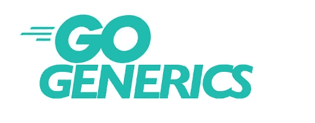

# 去泛型和多态吧，一个习惯性的警钟

> 原文：<https://medium.com/geekculture/go-generics-a-polymorphism-idiomwake-up-call-6d5fe00aca31?source=collection_archive---------3----------------------->

我一直觉得围棋的[湿](https://en.wikipedia.org/wiki/Don%27t_repeat_yourself#WET)本性导致了很多不合格的代码。这真正突出的一个领域是[多态性](https://en.wikipedia.org/wiki/Polymorphism_(computer_science))。Go 支持多态接口，但是由于类型的限制，系统接口无法实现其全部潜力，所以我们一次又一次地编写功能相似的代码，当我们编写每个重复的代码时，我们几乎没有考虑它们的通用性。考虑…