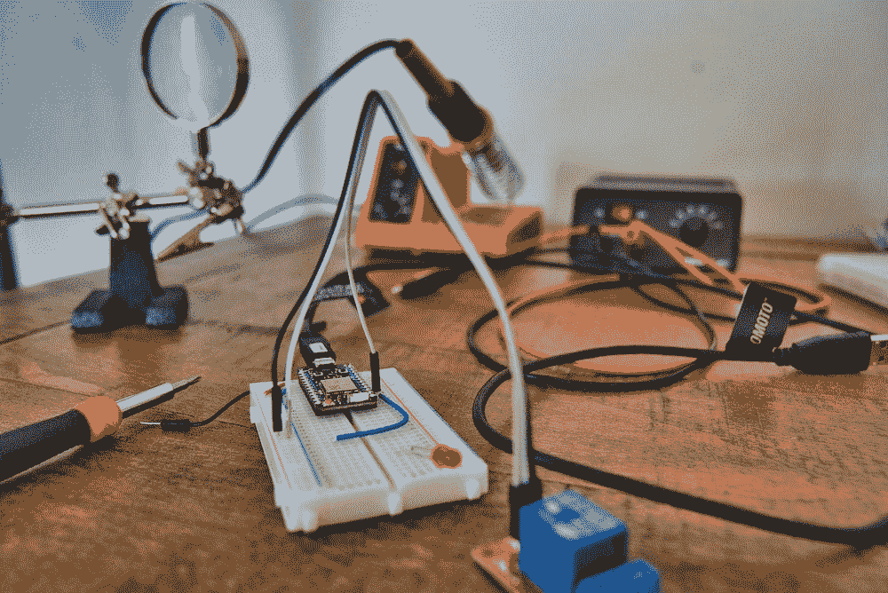

# 去仿制药来了

> 原文：<https://medium.com/geekculture/go-generics-is-coming-e03182d19873?source=collection_archive---------3----------------------->

## 尝试未来的新功能！

From unsplash, [@cbpsc1](https://unsplash.com/photos/lPcXuJyoIjU)

Go generics 已经被讨论了很多年了。在[问题标签](https://github.com/golang/go/issues/43651)下，有来自成千上万地鼠的支持或反对、期望或抱怨的评论和信息。

从 d [筏形设计](https://go.googlesource.com/proposal/+/refs/heads/master/design/go2draft-contracts.md)，到 2020 年 3 月终于发布[方案](https://go.googlesource.com/proposal/+/refs/heads/master/design/43651-type-parameters.md)，等待已久。而且预计最快在 2022 年 Go1.18 应用。我们…