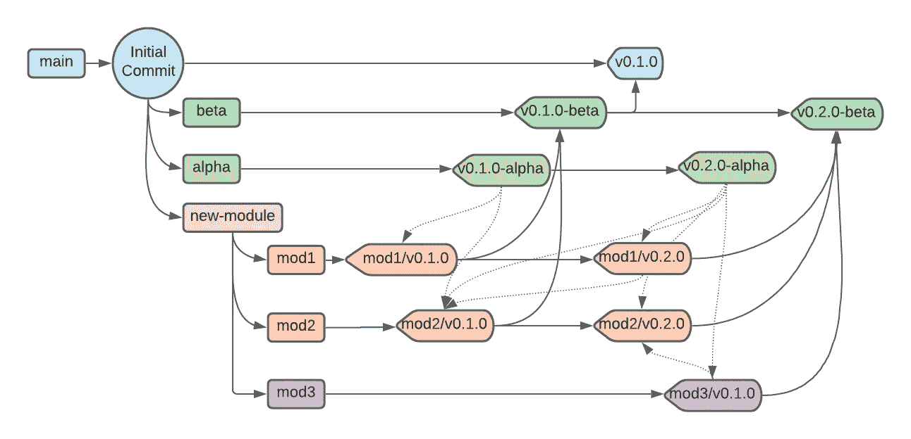
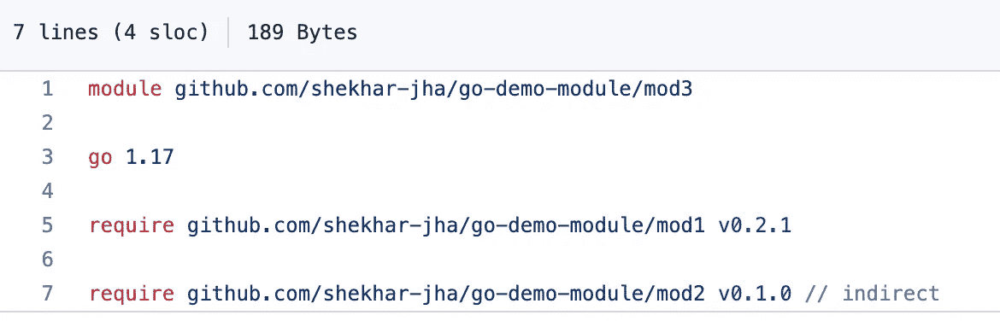
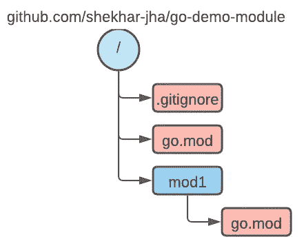
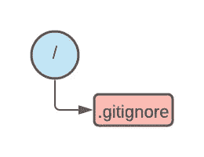
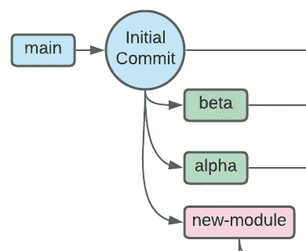
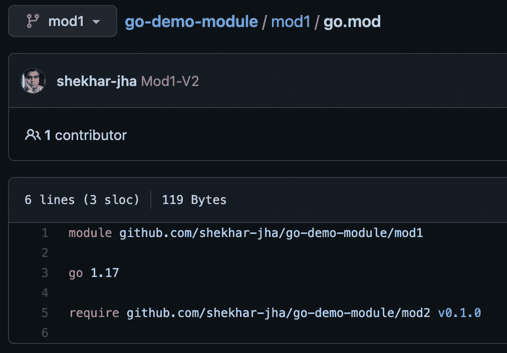
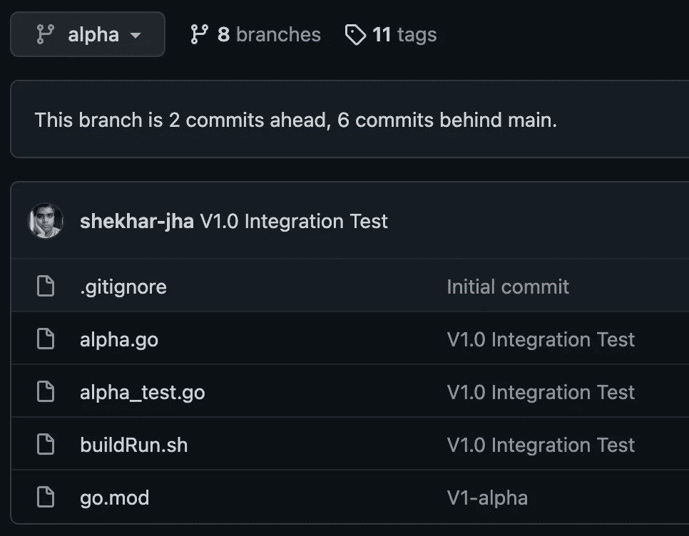

# 单一回购中的 Go 模块

> 原文：<https://medium.com/geekculture/go-modules-in-mono-repo-c049ef2741f6?source=collection_archive---------9----------------------->

Visual representation of git log of simple mono-repo with multiple go modules

## 平衡开发灵活性和结构化发布过程

自 2018 年 8 月第一个[模块功能](https://go.dev/doc/go1.11#modules)作为 2.11 版本的一部分推出以来，围棋模块[已经走过了漫长的道路](https://github.com/golang/go/wiki/Modules#modules)。传统上，建议是[一个回购=一个模块](https://github.com/golang/go/wiki/Modules#should-i-have-multiple-modules-in-a-single-repository)。但是，我认为，在过去的一年中，Go 模块工具以及 GOPROXY 协议和基础设施已经成熟，能够很好地支持多个模块。这对于在单一回购中开发解决方案具有重要意义。本文不是对 go 模块或[单回购](https://en.wikipedia.org/wiki/Monorepo)优缺点的[介绍。](https://go.dev/ref/mod)

## TL；速度三角形定位法(dead reckoning)

以下是要点

1.  Go 工具使用版本控制功能，如[标签、分支和修订](https://go.dev/ref/mod#versions)来识别模块版本并生成[伪版本](https://go.dev/ref/mod#pseudo-versions)。
2.  使用模块特定分支来创建和管理模块开发，以及用于集成测试的发布特定分支(例如 alpha、beta)。这可能需要以可读性为代价将代码库拆分到多个分支中(这可以通过下面的方法来解决)
3.  考虑到工具中对版本控制系统的开箱即用支持，请考虑限制对您的 mono-repo 的访问，并使用 GOPROXY 协议为外部/公共消费的包的正式发布周期提供工件。这种方法目前受到缺乏通用工具的限制(例如 github 不支持[包注册表](https://docs.github.com/en/packages/working-with-a-github-packages-registry)的 [GOPROXY 协议](https://go.dev/ref/mod#goproxy-protocol))。

如果这听起来很有趣，那我们就开始吧。下面显示的所有流程都可以在 git 资源库 [go-demo-module](https://github.com/shekhar-jha/go-demo-module) 和 [go-demo-module-client](https://github.com/shekhar-jha/go-demo-module-client) 中获得。

# 模块

> 模块是 Go 管理依赖关系的方式。

模块是一起发布、版本化和分发的包的集合。模块可以直接从版本控制库或模块代理服务器下载。

A simple go.mod file

由模块根目录中的 *go.mod* 文件表示的简单模块定义了正在导出的模块、对 go 编译器版本的依赖以及它所依赖的其他模块和相应的版本。

## 版本到标签的映射

Directory structure of a repo with parent and child modules

Go 使用[分支、修订和标签](https://go.dev/ref/mod#vcs-version)来识别所需的版本。在这里显示的场景中，可以定义以下模块和相应的版本
1。go.mod 文件中的 *go-demo-module v0.1.0* 将转换为对应于标签 *v0.1.0* 的拉取代码，但该代码不包含 mod1，因为它被识别为不同的模块。
2。go.mod 文件中的一个条目*go-demo-module/mod1 v 0 . 1 . 0*将翻译成对应于标签 *mod1/v0.1.0\.* 的被拉取的代码

这种机制确保了每个模块都可以在一个存储库中独立使用，不会产生任何歧义。

# Git 流

建立一个在 mono-repo 中工作的标准流程有助于减少团队内部的摩擦，提高团队的生产力。这是一个这样的流程，可用于简化跨多个 go 模块的单一回购工作

## 初始设置

建议创建一个分支(类似于上面流程中的*“新模块”*)。

Base directory for new-modules

该分支将包含类似*的基本文件。gitignore* 和其他有助于定义新模块的模板文件。

在启用现有存储库的情况下，这可以通过从第一次提交创建新的分支，然后恢复提交来实现。

Initial set of branches defined in mono-repo

*新模块*可用于创建各种发布分支，如这里所示的 *alpha* 和 *beta* 。这些发布分支将在以后用于定义和构建发布包，方法是定义 go.mod 文件，并在子目录中定义特定版本的模块，如下所述。

请确保分支命名约定不遵循与 go 版本控制机制冲突的标准。

## 新模块

通过从新模块分支，可以随时创建任何新模块。该模块将创建在相应的目录中。在[标准项目布局](https://github.com/golang-standards/project-layout)的情况下，这可能转化为 *pkg/ <模块>* 、 *cmd/ <模块>* 等等。

mod1 v0.2.0 with dependency in mod2 v0.1.0

开发完成后，可以根据目录结构相应地标记分支(例如 [mod1/v0.1.0](https://github.com/shekhar-jha/go-demo-module/releases/tag/mod1%2Fv0.1.0) 、 [mod2/v0.2.0](https://github.com/shekhar-jha/go-demo-module/releases/tag/mod2%2Fv0.2.0) 、pkg/mod1/v0.1.0 等等)。

一旦被标记，这些模块就可以被 repo 内部或外部的其他模块使用，如此处所示。在外部依赖的情况下，可以遵循一个更标准化的发布过程，以确保所有发布的包都经过了充分的测试。

## 释放；排放；发布

发布过程确保整个开发包在打包和发布之前得到很好的集成和测试。

在 go 的情况下，这可以通过定义一个依赖于其他内部模块的虚拟模块并执行系统集成测试来实现。在 go-demo-module 中， [*alpha*](https://github.com/shekhar-jha/go-demo-module/tree/alpha) 分支展示了一种这样的封装和测试方法。这个分支包含 *go.mod* ，它定义了模块(即 *go-demo-module* )和相关的依赖项(即 mod1 v0.10 和 mod2 v0.1.0)，以及[*alpha _ test . go*](https://github.com/shekhar-jha/go-demo-module/blob/alpha/alpha_test.go)*文件中的系统集成测试。添加了[*alpha go*](https://github.com/shekhar-jha/go-demo-module/blob/alpha/alpha.go)以确保测试可以运行。*

*另一种方法如 [*dev*](https://github.com/shekhar-jha/go-demo-module/tree/dev) 分支所示，它为模块开发人员向 dev 分支提交 pull 请求建立了一个流程。作为合并拉取请求的一部分，相应的模块和相关联的版本作为依赖项被添加/更新到 go.mod。这提供了一个更正式的发布过程，同时也增加了项目的整体可读性(因为模块代码可以作为 branch 的一部分获得)。*

*如果实现了更正式的发布过程(如上),确保外部项目不直接依赖模块是很重要的。这可以通过将项目私有并将测试包发布为 [zip 文件](https://go.dev/ref/mod#zip-files)并通过 GOPROXY 协议提供服务来实现。*

*Go 模块提供了一种非常灵活的方式来分解在 go 中开发的系统，并通过允许开发人员独立开发组件，然后在准备就绪后执行集成测试来简化开发。*