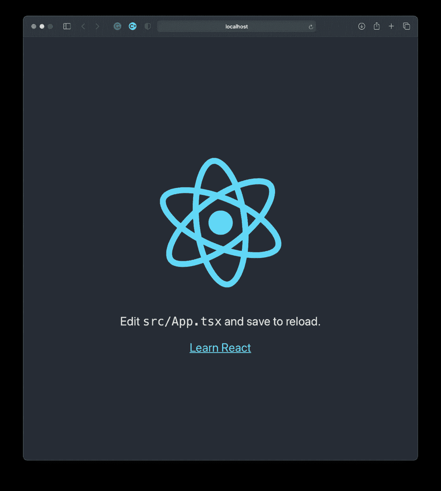

# 使用 Typescript 和 WebSockets 实现实时。

> 原文：<https://medium.com/geekculture/going-real-time-with-typescript-and-websockets-fe11d1447f44?source=collection_archive---------9----------------------->


在我的整个学士学位期间，我对机器学习及其应用产生了浓厚的兴趣。所以很自然地，我大学四年的大部分时间都花在了不同规模的人工智能项目上。直到毕业后，我才第一次涉足 Web 开发的海洋。这在很大程度上是因为我在一家初创公司的新工作，要求我帮助公司开发软件，以支持一个正在进行的大型计算机视觉项目。

但是只有当我写了第一行 React 代码，加上 Typescript 的优雅，我才开始真正欣赏 GUI 开发的艺术。然而，前面的道路是漫长而艰巨的。因此，这一系列的帖子不仅是我内化一些概念的一种方式，也是与其他刚刚起步的人分享一些想法的一种方式。我将向您介绍我的开发过程，同时描述过程中面临的警告以及我如何尝试解决它们。

在这篇文章中，我首先构建一个简单的应用程序，它可以用来在两个或多个用户之间发送实时聊天消息。

# 反应

React 是由脸书开发的 GUI 框架。我非常喜欢 React，主要是因为两个原因:

1.  它将 HTML 与 Javascript 结合起来，允许您轻松地将服务器端脚本与显示组件集成在一起。
2.  React 是相当高的性能。它为您提供了大量的组件，可以用来最小化 GUI 需要刷新的次数和频率。

# 以打字打的文件

虽然 typescript 通常是大型项目的首选，但是一旦您习惯了它，它可以节省大量的时间。它利用接口和类型来确保编译时的类型安全。这意味着不再意外地试图打印空变量的长度或向整数添加字符串。

Typescript 文件以扩展名`.tsx`保存。重要的是将它们与您在处理 React 和 Javascript 时可能遇到的其他类型的文件区分开来，例如`.js` `.ts`和`.jsx`

# 计算机编程语言

对于服务器，我使用 Flask-SocketIO 接受和广播来自使用 WebSocket 协议的各种客户机的消息。

因为您正在阅读这篇文章，而不是题为“Web 开发基础”的文章，所以我假设您对 React 和 Python 有所了解。然而，对于门外汉，我将在整篇文章的相关地方留下所有主要概念的链接。所以让我们开始吧！

本文中使用的所有代码将在这个 [Github 回购。](https://github.com/PawanBhandarkar/DemoProjects/tree/master/FlaskReactWebSocketDemo)

# 第 1 部分:后端。

通常，每当我开始构建一个基于 web 的项目时，我都喜欢从后端开始。这有助于我从一开始就摆脱大部分繁重的工作。然而，由于这是一个简单的项目，后端相当简单。

## 步骤 1:创建一个 conda 虚拟 env 并激活它。

使用新的虚拟环境来避免模块版本冲突始终是最佳实践。

```
conda create -n chatroom python==3.7
conda activate chatroom
```

## 步骤 2:安装所需的 python 模块

我们将使用 flask-socketio 和 gevent 来托管 websocket 服务器。

```
pip3 install flask_socketio gevent gevent-websocket
```

## 步骤 3:构建服务器

感谢 Flask python 库背后的聪明才智，我们只用 12 行代码就可以建立并运行一个 WebSocket 服务器，如下所示。此服务器的唯一目的是接受传入的客户端连接请求，并将消息广播给所有连接的客户端。

我们现在可以使用

```
 python3 server.py
```

# 第 2 部分:前端

对于前端，我使用 React-Typescript。我还为我的组件使用 React-Boostrap CSS 样式。得益于[反应堆启动带](https://react-bootstrap.github.io) npm 模块，这变得很方便。最后，我还使用 [Socket.io-client](https://www.npmjs.com/package/socket.io-client) npm 模块来建立客户端套接字连接。

## 步骤 1:创建一个 Typescript 项目

现在我们进入这个项目最复杂的部分。但是不用担心！我们一步一步来。

首先，我们需要初始化一个新的 typescript 项目。最简单的方法是使用 [create-react-app](https://reactjs.org/docs/create-a-new-react-app.html#create-react-app) 。最近，他们增加了对 typescript 的支持，减少了 90%的麻烦！

我们还将使用 React-Bootstrap GUI 组件，因为它允许我们拥有一个看起来不错的页面，而不必钻研 CSS，这超出了本文的范围。我们还需要为 typescript 安装相应的类型。

```
npx create-react-app gui --template typescript
cd gui
npm i react-bootstrap bootstrap
npm i @types/react-bootstrap @types/bootstrap --save-dev
npm i socket.io-client @types/socket.io-client
```

虽然这应该是开箱即用的，但目前有一些问题[阻止您这样做。以下命令将修复它:](https://github.com/facebook/create-react-app/issues/10109#issuecomment-752650608)

```
npm i @types/react --save-dev
```

现在。您可以运行`npm start`，它应该会加载 ReactTypescript 的登录页面:



我们在半路上🎉

## 步骤 2:构建 GUI

接下来，我们必须用我们的代码替换默认模板，使它看起来更像一个聊天应用程序。

正如这篇博文中所描述的，最佳实践是利用 React 上下文将 socket 对象声明为一个全局可访问的组件。因此，让我们为此创建一个名为`socket.tsx`的文件，并添加以下代码。

接下来，我们创建一个名为`ChatRoom.tsx`的文件，它将包含我们的大部分 GUI 代码。为此，我们将使用 React [功能组件](https://www.freecodecamp.org/news/react-components-jsx-props-for-beginners/)。

注意:在下面的代码列表中，`...`用来表示为了便于解释，某些代码被省略了。

首先，我们用将要使用的状态创建并导出一个基本的功能组件。

在上述要点中，状态是:

1.  `socket`:socket 对象的上下文变量。
2.  `username`:用于存储每个新用户的标识。
3.  `message`:用于在发送前存储新输入的信息。
4.  `allMessages`:用于讲述聊天历史。
5.  `error`:用于存储错误信息(可选)。
6.  `loggedIn`:用于决定显示登录页面还是聊天页面。

接下来，让我们定义一个钩子来对传入的消息做出反应。我们将使用`useEffect()`钩子来达到我们的目的。

React Hooks 有时可能有点挑战性，即使对于经验丰富的 Web 开发人员也是如此。所以快速总结一下`useEffect()`钩子，就知道:

1.  在`useEffect(()=>{})`中定义的函数将在组件安装时执行一次，每次在方括号`[]`中声明的变量改变时执行一次
2.  它们异步运行，应该优先用于非阻塞操作，比如与后端通信。

接下来，我们将创建一个函数，当用户单击 send 按钮时，该函数向服务器发送消息:

对于上述内容，我们还定义了一个用于消息的 typescript 接口。也就是说，我们不是向服务器发送普通的消息字符串，而是将消息和当前登录用户的用户名一起发送。这有助于区分聊天室中的消息。

最后，我们将创建一个函数来设置登录状态，以便我们可以从登录页面转换到 cat 页面。

太好了！我们快到了！现在剩下的就是添加实际的显示组件了。如前所述，我们将使用两种布局:

注意:最佳实践是为每个 React 组件使用单独的文件。但是因为我想保持示例项目相当简单，所以我选择在主组件中定义它们。

然后，我们添加一些逻辑来选择适当的显示组件:

## 第三步:把所有东西放在一起

现在剩下的就是将所有这些组件放在`App.tsx`文件中，这样我们就可以使用`npm start`来运行它。

## 第四步:运行应用程序！

祝贺你到达终点线！您现在可以运行您的代码，并惊叹于您新建的聊天室！从项目的根目录运行以下命令:

```
python3 server.py
cd gui 
npm start
```

最终的应用程序看起来会像这样。请注意，我已经在两个独立的浏览器窗口上启动了`http://localhost:3000`，以可视化他们之间的实时通信。


And that’s a wrap!

# 结论

请注意，尽管最终应用程序看起来非常简单，但是您现在已经了解了足够多的知识，可以将这些概念应用到您自己的项目中。以下是关于如何推进这个项目的一些想法:

1.  添加 CSS 样式，使其看起来更有吸引力
2.  添加对通过 Websocket 协议发送图像的支持。
3.  在线托管应用程序(例如在 Heroku 上)
4.  尝试和应用你自己的想法，让它脱颖而出！

感谢您完整阅读这篇文章。如果你喜欢，一定要分享并留下一些你希望我接下来报道的评论。一如既往，建设性的批评总是受欢迎的！快乐学习！