# 使用 AWS Lambda 函数实现无服务器— 1

> 原文：<https://medium.com/geekculture/going-serverless-with-aws-lambda-functions-1-edec330c2bce?source=collection_archive---------2----------------------->

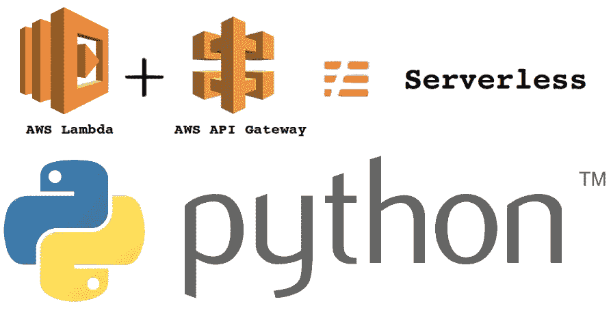

几年前，传统的物理服务器被云服务器所取代，现在，无服务器成为新的时尚。在无服务器执行中，服务器在那里，但是我们不再需要管理那些服务器。所有这些都由服务提供商负责。除此之外，由于除非触发触发器，否则不会有服务器实例运行，所以不会产生任何成本，而触发器在执行结束后立即终止。AWS Lambda 功能通过按需提供计算资源而无需供应或管理服务器来促进无服务器执行，可以以不同的方式触发:HTTP 请求、向 S3 上传新文档、计划的作业、AWS Kinesis 数据流或来自 AWS 简单通知服务(SNS)的通知。

AWS Lambda 函数可能看起来是无处不在的解决方案，但是使用它们有一些限制。单个 lambda 函数具有 512 MBs 的有限存储空间，在用于部署包的压缩形式中具有 50 MBs 的有限大小，并且是短暂的，最长 15 分钟。上面提到的所有缺点都可以用一种或另一种方法来处理。除此之外，AWS Lambda 功能还有一个更重要的问题，即冷启动。Lambda 函数处理第一个请求需要一些时间，因为 Lambda 必须启动该函数的一个新实例。如果在任何时候您期望快速响应，而您的函数没有活动实例，那么冷启动对您的函数来说可能是一个真正的问题。

在这里，我将向您简要介绍简单和复杂的 Lambda 函数创建，以及使用 AWS CLI 创建和配置 AWS Lambda 层，以便与 AWS Lambda 函数一起使用，这使我们超越了最大 50 MBs 部署包的限制，允许我们拥有最多 5 层不同的库，库的总解压缩大小高达 250 MBs。

这里，我们将介绍使用 API 创建一个简单的 Lambda 函数的步骤:

1.  首先，登录 AWS 帐户。

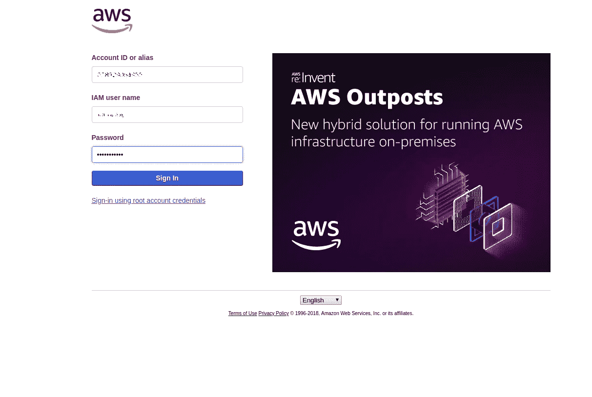

AWS Login Screen

2.转到 Lambda 仪表板。

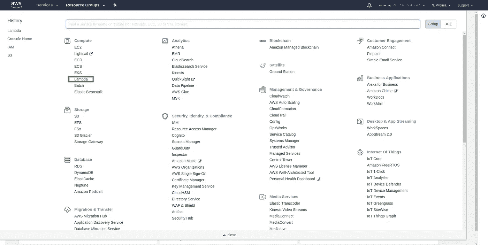

AWS Service Dashboard

3.在 Lambda 仪表板上，单击创建函数选项。

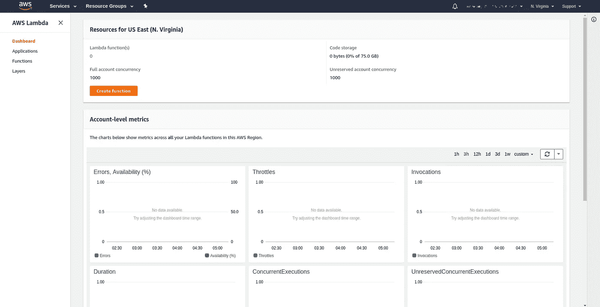

AWS Lambda Dashboard

4.在创建函数屏幕上，键入 Lambda 函数的名称，选择运行时环境，然后在角色选择区域中选择创建自定义角色，这将引导您进入角色创建屏幕。

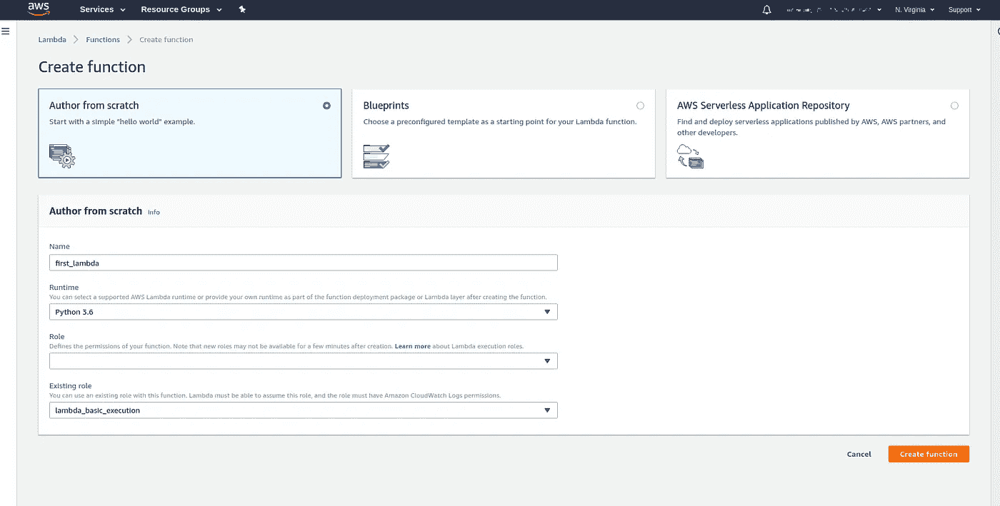

Create Lambda Function Screen

**Lambda 角色:**每个 Lambda 函数都有一个与之关联的 IAM 角色(执行角色)。在创建 Lambda 函数时指定 IAM 角色。您授予该角色的权限决定了 AWS Lambda 在承担该角色时可以做什么。

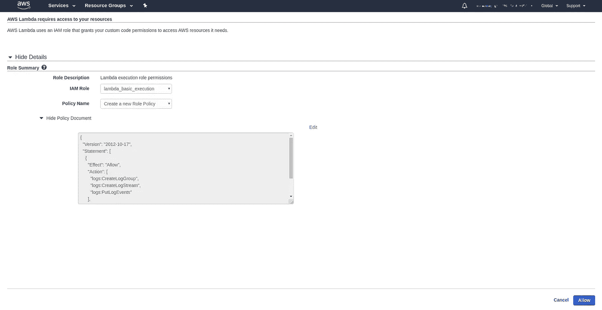

Role Creation Screen

5.现在，我们将选择 lambda_basic_execution 角色，该角色将只授予 Amazon CloudWatch Logs 操作写日志的权限。我们将使用这个策略，因为我们的 Lambda 函数是一个基本函数，除了写日志之外，不会访问任何其他 AWS 资源。

发布这篇文章，点击“允许”,这将带你回到“创建函数”屏幕，一个现有的 lambda_basic_execution 角色将被选中。之后，点击创建函数

6.我们将进入 Lambda 配置屏幕，使用该屏幕我们可以更改 Lambda 功能的所有设置。主要包括添加/移除触发器、更改 lambda 函数、更改其角色、内存分配、设置环境变量、设置超时周期、选择虚拟私有云(VPC)以及设置错误处理机制。

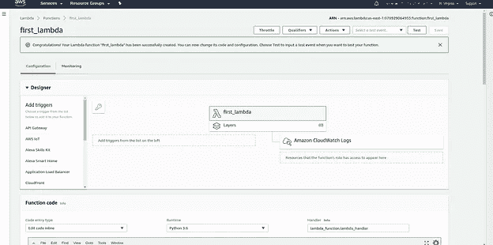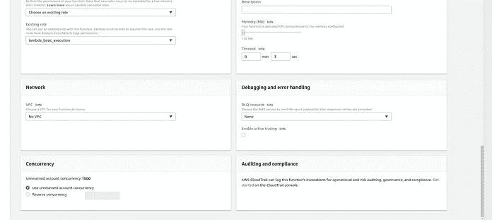

Lambda Configuration Screen

在激活 Lambda 功能之前，我们应该始终对所需的设置进行更改。目前，主要设置有:

1.  引发
2.  Lambda 函数的代码和 lambda 处理函数。
3.  超时
4.  分配的内存
5.  角色和权限

7.现在，我们将为我们的函数设置触发器(触发器实际上是应该调用和执行 lambda 函数的事件)。现在，我们将使用 AWS API Gateway 上的 API hit 作为触发事件，并在 Configuration 选项卡的 Add Triggers 面板上选择 API Gateway。

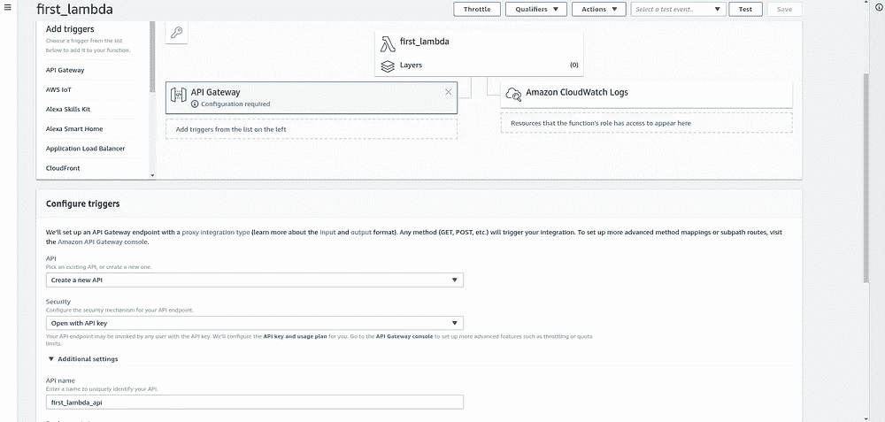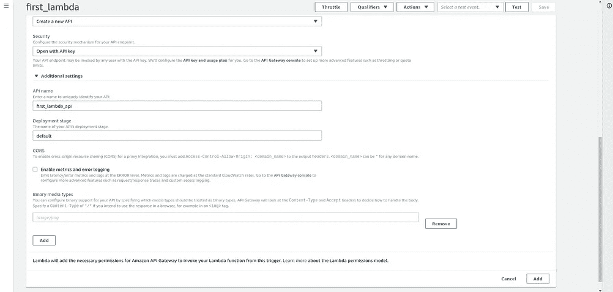

API Trigger Configuration

我们选择创建一个新的 API，在“security”选项卡中，我们选择创建一个带有 API 密钥的开放 API。

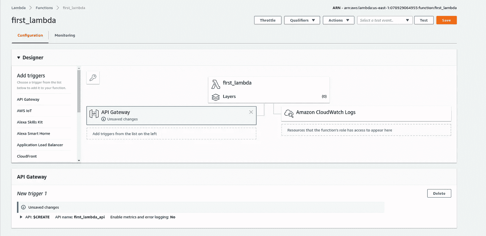

键入 API 的名称，然后单击“添加”按钮。

在此之后，我们将单击“层”按钮上的 first_lambda 按钮，编辑代码，并将下面提到的代码用于我们的第一个 lambda 函数，该函数将在返回的表达式中使用传递的名称。

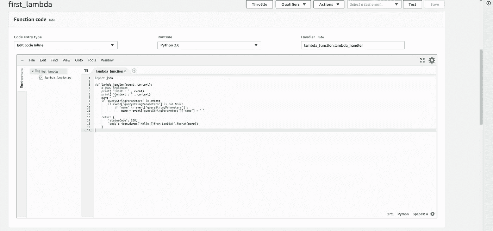

Inline Code Editor

我们可以使用内嵌编辑器来编写代码，也可以上传包含代码的压缩文件。在这两种情况下，我们都必须将处理程序设置为<file_name>。<function_name>。在上面的例子中，我们将它设置为 lambda_function.lambda_handler，因为文件名是 lambda_function，函数名是 lambda_handler。</function_name></file_name>

此外，请注意，事件和上下文两个变量被传递给 lambda_handler 函数，该函数为我们提供有关触发事件的信息。

发布这篇文章，点击保存按钮保存 Lambda 函数中的修改。

8.我们已经成功地创建了第一个使用 API 触发的 Lambda 函数。点击突出显示的 API Gateway 按钮，我们将看到要使用的 API 端点和 API 密钥。

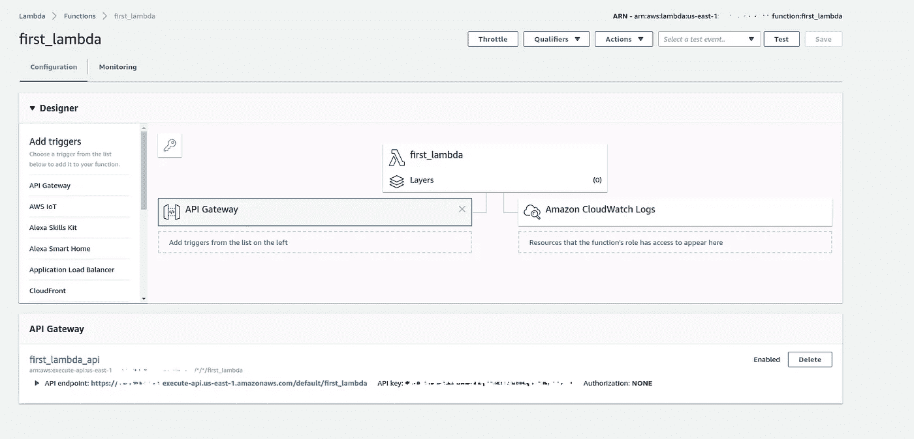

Successful Creation of Lambda

我们可以使用 Postman 来尝试 lambda 函数，并在 API 端点上点击一个请求，同时在标头中添加 API 键，标头键为“x-api-key”。

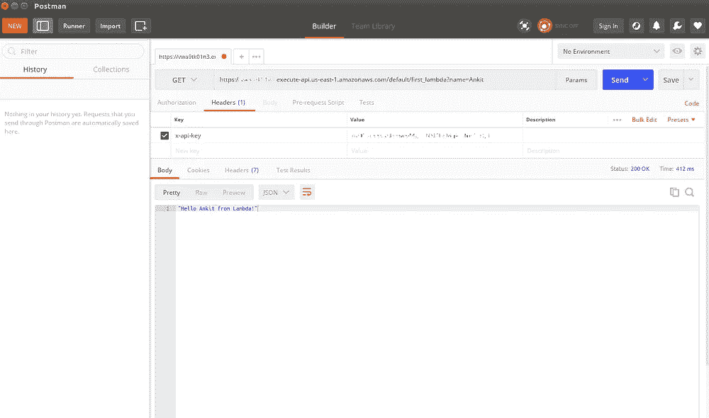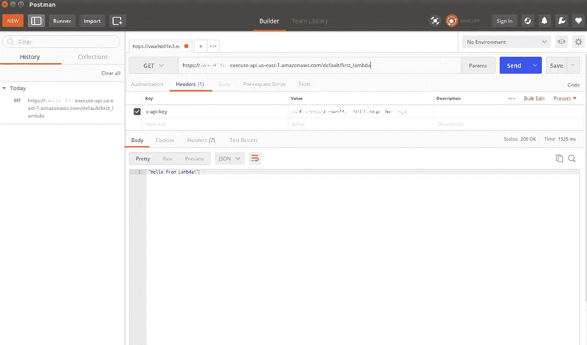

API Hit using Postman

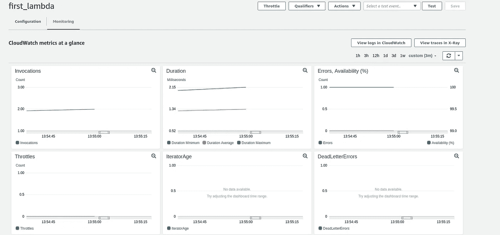

AWS Lambda Monitoring Screen

9.我们还可以使用 lambda 仪表板的 Monitoring 选项卡检查 Lambda 执行中发生的调用和错误。
我们还可以使用 CloudWatch 检查 Lambda 执行的日志，因为我们提供了创建 Cloud Watch 日志流的权限。

并不是所有的 lambda 函数都有这么小的代码，可能需要多个模块来实现这些功能。一个这样的用例可以是使用 AWS Lambda 函数下载图像。如果我们使用 python 开发，我们将需要 PIL 和请求模块以及它们的依赖关系。

在下一篇文章的[中，我们将介绍使用 Docker 创建自定义层、下载 AWS Lambda 实例的库或模块，并将使用 AWS S3 的对象创建创建一个 Lambda 触发器，该触发器将使用自定义创建的层。](/@info.ankitp/going-serverless-with-aws-lambda-functions-2-51a1bd786547)

我希望你能发现这篇文章内容丰富且简单易学，如果你有任何疑问，请随时拨打 info.ankitp@gmail.com[的电话联系我](mailto:info.ankitp@gmail.com)

编辑:[带 AWS Lambda 功能的无服务器化— 2](/@info.ankitp/going-serverless-with-aws-lambda-functions-2-51a1bd786547) 已发布。