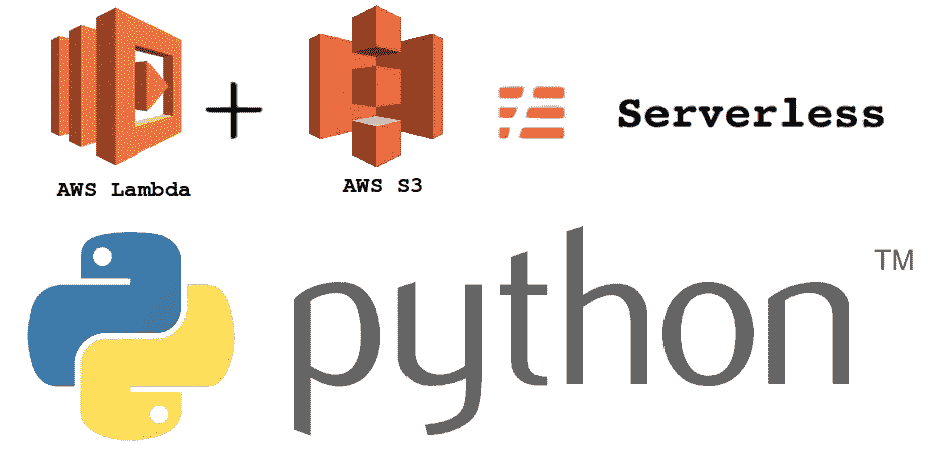
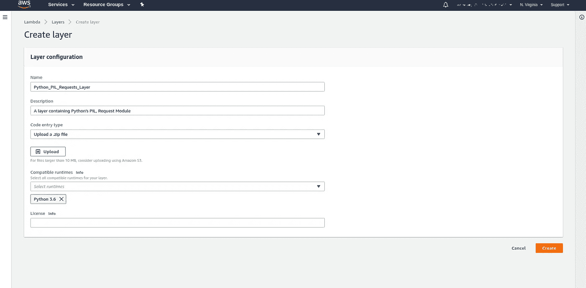
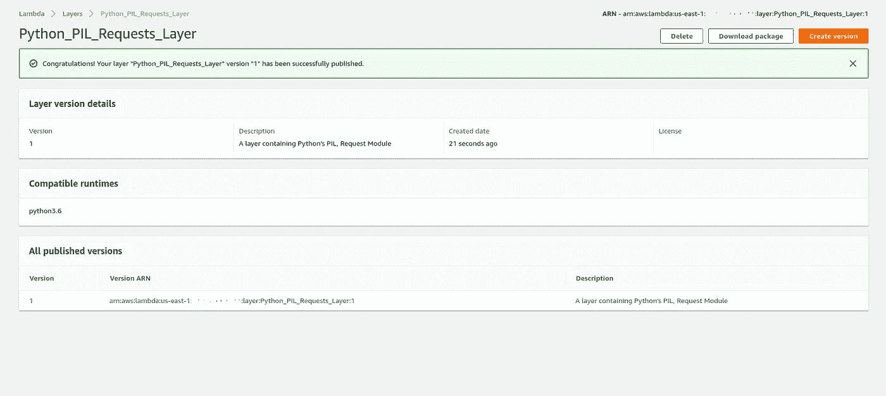
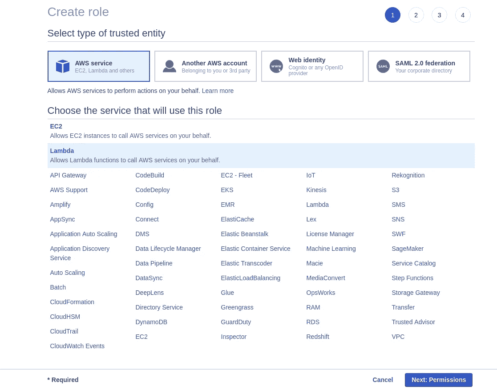
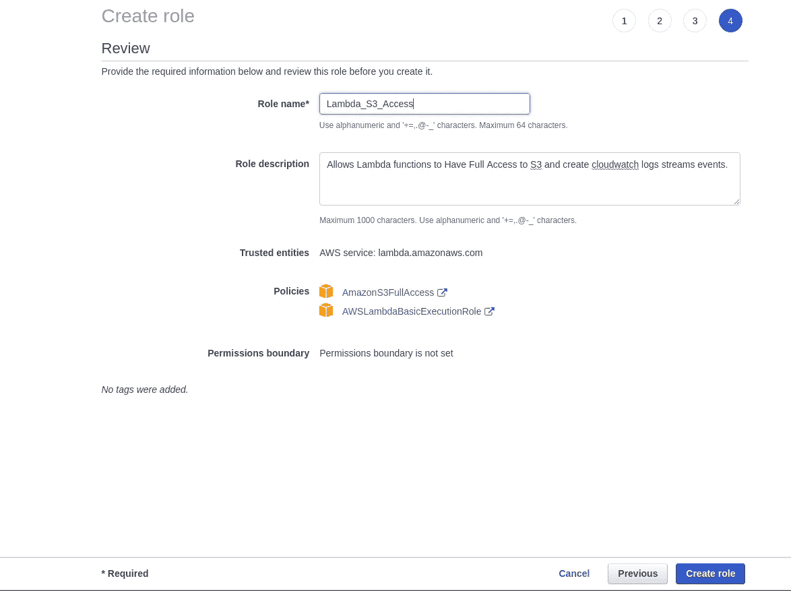
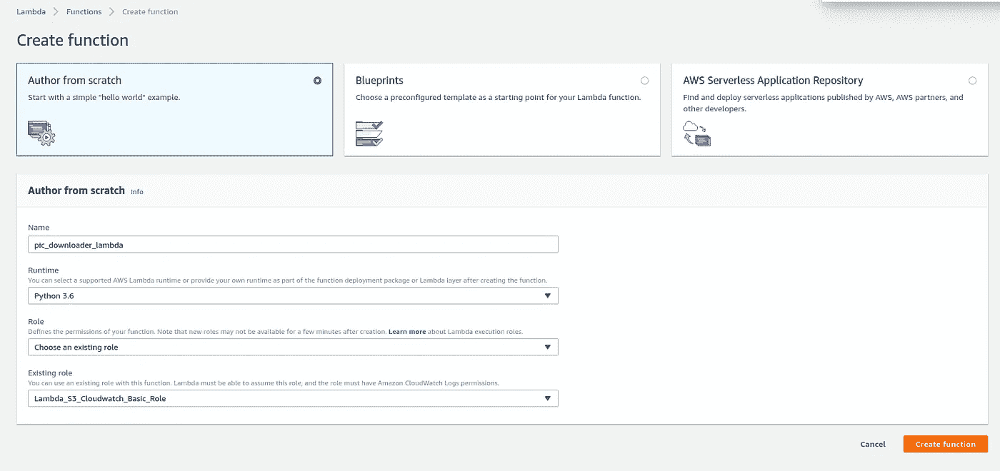
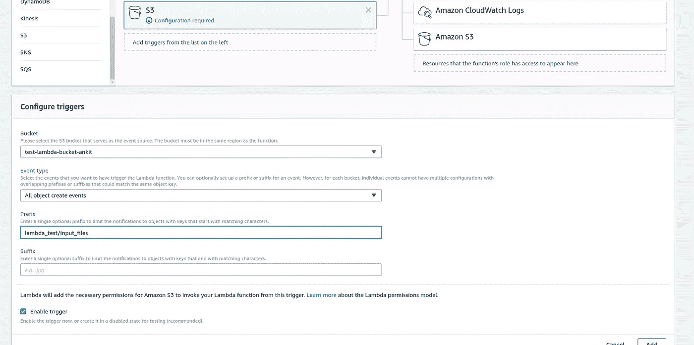
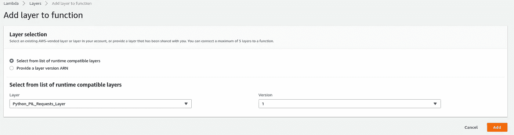

# 使用 AWS Lambda 函数实现无服务器— 2

> 原文：<https://medium.com/geekculture/going-serverless-with-aws-lambda-functions-2-51a1bd786547?source=collection_archive---------1----------------------->



正如前面的文章中所讨论的，Lambda 函数也可以被编写来执行复杂的操作，这可能需要多个库或模块。例如，使用 MXNET 从图像中提取人脸，使用链接下载图像。对于这些用例，我们将需要在执行环境中打包多个库，因为从头开始编码将非常复杂。因此，要部署这些组件，我们必须为 lambda 实例提供所需的库，因为 lambda 实例只有特定的库可以使用。

还有一点需要注意的是，AWS Lambda 实例实际上是基于 Amazon Linux 的实例，它们不同于 Ubuntu 环境，可能对不同的模块有不同的代码。由于这个原因，很多人在 Lambda 函数中使用 python 时，都面临着 PIL 库的导入问题。

为了克服这个问题，我建议使用 docker 为脚本构建运行时环境，并在相同的环境下安装库和测试它。我将向您简要介绍 docker 在为 Amazon Linux 实例下载模块时的用法。发布后，我们将了解如何为 AWS Lambda 函数形成自定义层和配置层，以及创建一个使用 S3 桶上的对象创建触发的 Lambda 函数，并使用文件中的数据下载图像。

首先使用 docker 为 Amazon Linux 实例下载模块。Docker 促进了容器化或操作系统级的虚拟化。我们首先需要安装 docker。

要在 Ubuntu (Xenial 或 Bionic)上安装 docker 并了解更多关于 Docker 的基础知识，请参考[使用 Nvidia-Docker 虚拟化 Cuda 环境并部署 API](/@info.ankitp/virtualizing-cuda-environment-using-nvidia-docker-and-deploying-apis-on-those-environments-508e0171d4a6):

安装 docker 后，我们将不得不运行一个 docker 的 AWS Lambda 实例的容器，并运行它的 shell。
`sudo docker run [ --rm] -it -v <code_dir>:/code lambci/lambda:<runtime> sh` 让我们在这里讨论更多关于可用的 Lambda 函数运行时:
`**lambci/lambda:<runtime>**`**:**Lambda 实例的镜像，我们不需要担心镜像在本地是否可用，我们只需要一个活跃的互联网连接，docker 镜像就会自动安装。我们可以从下面的 Lambda 实例运行时选项列表中进行选择。

*   `build-nodejs8.10`
*   `build-nodejs4.3`
*   `build-nodejs6.10`
*   `build-python2.7`
*   `build-python3.6`
*   `build-python3.7`
*   `build-ruby2.5`
*   `build-go1.x`
*   `build-java8`
*   `build-dotnetcore2.0`
*   `build-dotnetcore2.1`

对于 python3.6 运行时环境，我将运行以下命令。

```
sudo docker run — rm -it -v /path/to/code/:/code/ lambci/lambda:build-python3.6 sh
```

4.现在，在进入交互式 shell 后，我们将使用 pip3 下载所需的模块。为了下载 PIL 和请求模块，我们将在 Lambda 的 shell 中运行以下命令。
`pip3 install pillow
pip3 install requests`

现在，既然我们已经安装了需求，我们将不得不找到所需的模块，并将它们复制到`/code/`目录中。默认情况下，大部分下载的包都是在`/var/lang/lib/python3.6/site-packages/`目录下下载的。

我们将使用下面的命令复制 PIL 和请求模块以及它们在`/code/`文件夹中的依赖关系，在从`/path/to/code/`目录使用 ubuntu 关闭 docker 容器后，我们也可以访问这些命令。

```
cp -r /var/lang/lib/python3.6/site-packages/PIL /code/
cp -r /var/lang/lib/python3.6/site-packages/Pillow-5.3.0.dist-info /code/
cp -r /var/lang/lib/python3.6/site-packages/requests /code/
cp -r /var/lang/lib/python3.6/site-packages/urllib3 /code/
cp -r /var/lang/lib/python3.6/site-packages/urllib3–1.24.1.dist-info/ /code/
cp -r /var/lang/lib/python3.6/site-packages/chardet /code/
cp -r /var/lang/lib/python3.6/site-packages/chardet-3.0.4.dist-info/ /code/
cp -r /var/lang/lib/python3.6/site-packages/idna /code/
cp -r /var/lang/lib/python3.6/site-packages/idna-2.7.dist-info/ /code/
cp -r /var/lang/lib/python3.6/site-packages/certifi /code/
cp -r /var/lang/lib/python3.6/site-packages/certifi-2018.11.29.dist-info/ /code/
```

现在，在定义的目录中有了所需的模块之后，我们已经正确地下载了所需的库。现在，我们将着重于在 AWS 上形成定制层。

登录 AWS 控制台并打开 Lambda 仪表板后。打开图层面板，点击“创建图层”。

随后，我们将进入以下屏幕，如您所见，我们需要填写层的名称、层的描述，然后选择兼容的运行时并上传包含模块的压缩文件。但是，模块或库需要有特定的结构。让我们也经历一下。



Layer Creation Screen

要在层中包含库，请将它们放在下面提到的运行时支持的文件夹之一中:

*   **NODE . js**:nodejs/NODE _ modules，nodejs/NODE 8/NODE _ modules(NODE _ PATH)
*   **Python** : python，Python/lib/Python 3.7/site-packages(站点目录)
*   **Java** — java/lib(类路径)
*   **Ruby**—Ruby/gems/2 . 5 . 0(GEM _ PATH)，ruby/lib (RUBY_LIB)
*   **All** — bin(路径)，lib(LD _ LIBRARY _ 路径)

我们将按照上述格式创建一个目录。首先，我们将不得不使用下面的命令来更改`/path/to/code/`文件夹的读写权限，就像我们使用 docker 和`sudo`权限一样。所以，我们要么改变文件夹的权限，要么切换到拥有`sudo`(超级用户)权限的用户。
`sudo chmod 777 -R /path/to/code/` 帖子里面，我们会在`/path/to/code/`里面创建一个文件夹，命名为 python。
`mkdir /path/to/code/python` 移动 python 目录中的所有文件夹，除了 python 目录本身

```
cd /path/to/code
mv !(python) -t ./python/
```

将所有这些库放入上述目录后，压缩文件夹并上传到 AWS 层创建屏幕。我们可以使用下面的命令来实现。

1.  在 Ubuntu 下载 zip。
    `sudo apt-get install zip`
2.  运行以下命令来压缩文件夹

```
cd /path/to/code
zip -r ~/lambda-layer_1.zip python
```

现在，点击创建层屏幕上的上传按钮，浏览并选择`lambda-layer_1.zip`文件，然后点击创建。



我们已经成功地创建了层。我们还可以创建单层版本，也可以下载所创建的层的包。

现在，继续创建一个 Lambda 函数，该函数提供了一个 Youtube 频道 id 列表和它们在 S3 上的个人资料图片链接，并将图片以压缩文件的形式上传到 S3。为此，让我们为 lambda 函数创建一个角色，它允许 lambda 函数创建 Cloudwatch 日志，并提供对 S3 的完全访问权限。



Role Creation Screen

从 AWS 控制台打开 IAM 服务并选择角色。单击 Create Role 并选择 Lambda 作为将使用该角色的服务，然后单击 Next:Permissions。



Role Review Screen

现在，选择完全访问 S3 所需的策略(AmazonS3FullAccess)和 Lambda Cloudwatch 日志创建策略(AWSLambdaBasicExecutionRole)。并单击“Next:Tags ”,可以提供键值对，我们现在将跳过标签，单击“Next:Review”。最后，提供角色的名称和描述并检查角色中的策略，我们将单击 Create Role 按钮来完成角色创建过程。

现在我们将创建一个 Lambda 函数，使用上面创建的角色和层。



点击后，创建功能按钮选择 S3 触发器和选择对象创建事件，并给出前缀路径，你要上传的输入文件，并点击添加。



S3 Trigger Configuration

现在，我们将配置 Lambda 函数的层，单击 Lambda 设计器上的层，然后单击添加层。选择相关图层及其版本，然后单击添加。



Configuring Layer to a Lambda Function

最后，在内联编辑器中更改代码。使用以下代码下载压缩格式的图像，更改超时和 CPU 内存设置，并保存 lambda 函数。

现在，为了测试 Lambda 函数，在目标 S3 桶上上传一个文件，每行都有 json 转储。我已经手动复制了几个人的个人资料图片的链接，并将它们转储到这个文件中。

```
1546760133
{"thumbnail":"https:\/\/yt3.ggpht.com\/a-\/AN66SAwK4vgc4xY4WEkqBN-L5PAMxMk78S7N9FjL_Q=s800-mo-c-c0xffffffff-rj-k-no","num":"1"}
{"thumbnail":"https:\/\/yt3.ggpht.com\/a-\/AN66SAyXDERjWHJoIOMzk3oGIb9AW4epd59EIZoV3w=s800-mo-c-c0xffffffff-rj-k-no","num":"2"}
{"thumbnail":"https:\/\/yt3.ggpht.com\/a-\/AN66SAxTMaIX7mBvmGmHAdYhZe1C9UuqmH6TWG5nxQ=s800-mo-c-c0xffffffff-rj-k-no","num":"3"}
{"thumbnail":"https:\/\/yt3.ggpht.com\/a-\/AN66SAwaRnCUkcxfZW1LkRPQNqnrNmaTGWWuSyEvSA=s800-mo-c-c0xffffffff-rj-k-no","num":"4"}
{"thumbnail":"https:\/\/yt3.ggpht.com\/a-\/AN66SAwgXwU1xHh7-WauvK-4OY7InqChVF-nKSOB0A=s800-mo-c-c0xffffffff-rj-k-no","num":"5"}
{"thumbnail":"https:\/\/yt3.ggpht.com\/a-\/AN66SAxtsoYVvKUkLEokTKHi9KznmpeXRlWIzXyhBQ=s800-mo-c-c0xffffffff-rj-k-no","num":"6"}
```

上传后，我们会看到在 lambda_test 目录下创建了一个新的目录“output_files ”,压缩后的图像和错误文件将被上传到 S3 上。

我希望这能让你对 AWS Lambda 函数如何工作有一个完整的了解，以及你如何轻松地开发具有不同库的 Lambda 函数，并轻松地解决你的用例。

我希望你会发现这篇文章内容丰富且易于学习，如果你有任何疑问，请随时拨打[info.ankitp@gmail.com](mailto:info.ankitp@gmail.com)联系我