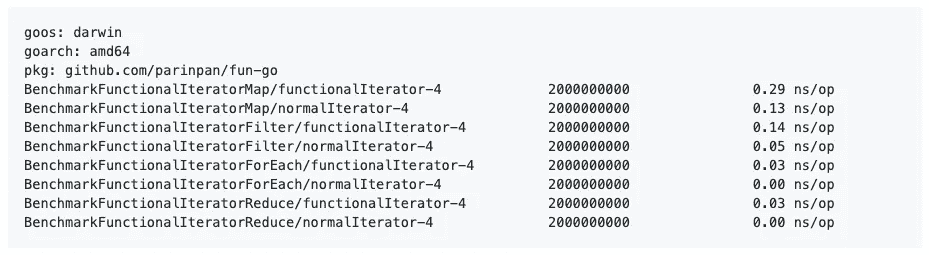

# Golang 不知道特定的编程范例。原因如下。

> 原文：<https://medium.com/geekculture/golang-is-agnostic-to-particular-programming-paradigms-heres-why-a57bfc27ec90?source=collection_archive---------4----------------------->

# **长话短说**

新型冠状病毒正在世界各地传播。一些国家决定封锁被今年最具传染性的病毒感染的城市。这也是我从印尼最大的电子商务平台 **Tokopedia、**辞职后，作为一名临时无业人员度过的一个月。

它把我带到一种宁静的状态，没有周围的人群、声音或其他任何东西让你不去关注你正在做的事情。所以，我听到虚空在对我耳语:*写一个函数式编程的东西怎么样？*


Golang 一直是我最喜欢的语言，至少到目前为止是这样。以前的工作经验让我应付自如，我们一天比一天更了解对方。我喜欢它的简单直白；就好像你是大师，可以在这门语言上修补和混合你想要的任何东西。

我在 Golang 中创建了一个小型库，向您强调它对特定编程范式的不可知论。在这种情况下，它不仅仅属于大家通常美化的面向对象编程范式*(嘿，我也是！).*

我称这个库为 [**Fun-go**](https://github.com/parinpan/fun-go) **(离完美还很远)**它将在 Go **中提供一些**函数式编程**能力。**基本上由我从 Javascript 采用的 ***贴图******滤镜******归约*** 函数组成。嗯，当我在研究它的时候，它已经足够有影响力了，除了我的坦白:

> 我真的讨厌重复的循环语法！

我将从*一个痛点*开始，描述这个库是如何帮助我摆脱对那个东西的仇恨，让 Golang 依然可爱的。

# **搜索物品很痛苦**

搜索是计算机科学中的一种基本本能。通常，一件简单的事情变得更加复杂，因为我们自己给它增加了更多的复杂性；像太多的搜索条件。示例:

*   搜索价格高于**50 美元**的产品
*   搜索价格高于 **$50** 的新产品
*   搜索 ID**大于 **1234** 且价格低于**100 美元**的二手产品**
*   另一个搜索条件…
*   等等…

按照惯例，您的代码通常如下所示:

Searching items with Golang in a conventional way

你必须看到一个模式。你不断地一遍又一遍地编写许多重复的循环块，并开始失去你实际上要对数据做什么的直观性。意图变得模糊。IMHO。

```
// the pattern// you will always provide a variable that will hold your data
var myVariables// keep making repetition of the looping block
for _, *blabla* := range blablas {
  ..state a search condition that might be used multiple times..
  ..append *blabla* to **myVariables..**
}
```

想象一下，新的工程师来到你的仓库，他们必须使用这种方法搜索数组中的项目。可能性很大**他们会编写实际上已经存在的冗余逻辑**,因为他们缺乏关于回购的知识，此外，搜索条件本身也非常无序和分散。


通过观察那个痛点。我开始思考如何解决这个问题？这就是为什么这个不成熟的小图书馆出来了。这就是 Fun-go 的 ***滤镜*** 功能来拯救你脱离痛苦的原因:

现在，将不会有重复的循环块，它会模糊你打算如何处理数据的意图。

一切看起来更清晰、更有条理，各种 ***过滤函数*** 可以在代码的另一部分重用，只需在需要时使用[高阶函数](https://en.wikipedia.org/wiki/Higher-order_function)技术调用它们。可重用意味着减少冗余。

现在，您也可以像这样构建过滤管道:

如果想找其他与*相关的例子，映射*和*减少*功能。可以去我的 Github 回购:[https://github.com/parinpan/fun-go](https://github.com/parinpan/fun-go)

# **基准**

在 MacBook Pro (13 英寸，2016，两个雷电 3 端口)2 GHz 英特尔酷睿 i5 8 GB 1867 MHz LPDDR3 上测试，100 万个数据。



# **结论**

Golang 很好玩。它与特定的编程范例无关。嗯，我不能说在它上面实现一些函数式编程原则已经足够好了，但是仍然是可能的，并且给我们带来了一个更好的编程方法。

# **免责声明**

我不是函数式编程的专家。只是它的超级粉丝！:)

*反正如果有什么询价；可以联系我:*[*Linkedin*](https://www.linkedin.com/in/fachrinfan/)*或者*[*Twitter*](https://twitter.com/fachrinFAN)*。*