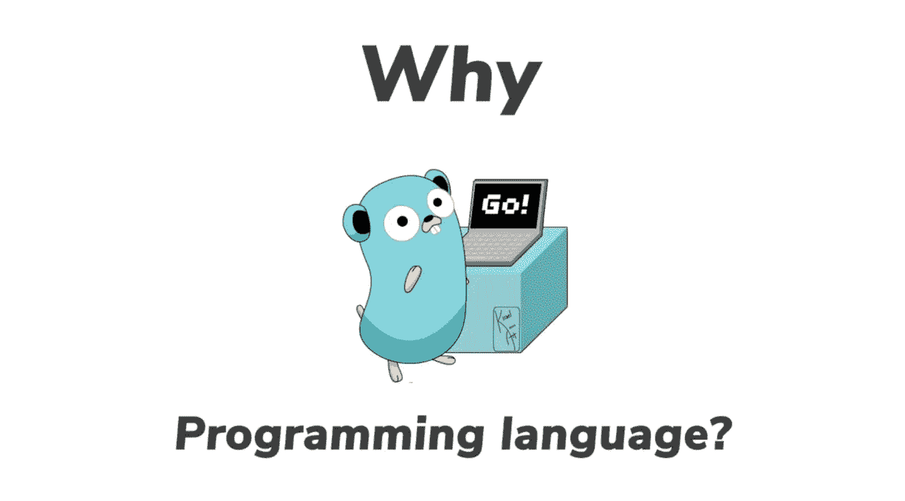

# GoLang——好的、坏的和丑的

> 原文：<https://medium.com/geekculture/golang-the-good-the-bad-and-the-ugly-880270a85848?source=collection_archive---------1----------------------->



*Image by* [*Garry Tailor*](https://morioh.com/p/127038a30554) *via* [*https://images.app.goo.gl/zAysEkk5BBWebt9g6*](https://images.app.goo.gl/zAysEkk5BBWebt9g6)

本文讨论了 Go 编程语言的好、坏和丑陋的一面。

# 好人

## 简单的

围棋很简单。这也是 Go 的主要设计目标之一。这也使得学习和接受这种语言变得非常容易。一些领域变得更加简单和轻量级:

*   语言结构的最小集合。
*   简单的项目和模块结构。
*   极简可见性控制(仅公共和包私有)。
*   易于定义类型(结构)。
*   易于编写测试——不需要外部测试框架。

## 快的

Go 程序被编译成机器码，并且有一个静态类型系统，使得它在执行过程中非常快。此外，启动时间比 Java 或任何 JVM 语言要少得多。

## 内置的构建和包管理

与 C++、Java 等传统/老派编程语言相比，有一个领域 Go 做得非常好。它带有内置的构建系统和包管理系统。这消除了对第三方包和构建管理系统(如 Gradle、Maven、make 等)的需求。，并使开发人员的工作变得更加轻松。

## 类型开关

这些年来，我一直在使用大量的 Java 和少量的 C++，而类型转换是我在这些语言中经常错过的东西。它不再需要做昂贵的操作，比如在 Java 中使用大量 if-else 条件进行`instanceof`检查，或者为要切换的对象/类(比如标签)引入可选的切换属性。围棋的[型开关](https://tour.golang.org/methods/16)完成了这个任务。更不用说，它是疯狂的快！

## 戈鲁廷斯

Go 最强大的特性之一是你可以很容易地使用该语言的原生结构编写并发程序。阅读[这里的](https://blog.golang.org/pipelines)可以获得一篇关于 Go 中不同并发模式的好文章。

## 值与指针

Go 既支持按值传递，也支持按引用传递。这真的很强大，因为你不会被语言限制在你想做的事情上(像 Java)。

然而，这也会留下一些混乱。请参见下一节。

# 坏事

## 值与指针——混淆

1.  **指针的零检查令人困惑**

检查下面的例子。当你查看`NewApple()`方法时，它返回一个`nil`。然而，如果你运行这个 main 方法，它会说，" *It's not nil* "！

```
type Fruit interface {
}type Apple struct {
}

func NewApple() *Apple {
   return nil  // return nil
}

func Main() {
   var fruit Fruit = NewApple()

   if fruit == nil {
      fmt.Println("It's nil")
   } else {
      fmt.Println("It's not nil")
   }
}
```

原因是，`NewApple()`返回一个指向`nil`的指针，而这个指针本身并不是`nil`。要检查指针指向的值是否是`nil`，您必须检查`fruit == (*Apple)(nil)`。但是同样，缺点是你需要知道这将返回一个`Apple`。

**2。赋值将产生一个‘副本’**

将“值”赋给另一个变量将复制该值，除非指定。请参见下面的示例:

```
apple := Apple{Price: 50}newApple := applenewApple.Price++fmt.Println(apple)
```

该值仍将打印为`{50}`，因为它已经将一个副本分配给了`newApple`变量，并且增量发生在该副本上。此外，每次赋值都会复制值，这意味着它会对性能关键型应用程序产生很大影响。

但是 Go 也有一个解决方案，就是传递引用，而不是值:

```
apple := Apple{Price: 50}newApple := &apple    // pass the pointernewApple.Price++fmt.Println(apple)
```

然而，问题是，如果你不小心处理指针和值的差异，不仅程序会以意想不到的方式运行，应用程序也会非常慢。

3.**默认情况下，地图和切片是参照传递的**。

嗯，我们刚刚讨论了“值”和“指针”的区别。但是惊喜！地图和切片没有按值传递的概念。它们总是通过引用传递。这是不一致的，并且不同于所有其他的结构化类型，这很容易使用户困惑。

## 结构没有构造函数

Go structs 没有构造函数的概念，主要是因为 Go 不是作为 OOP 语言设计的。但不幸的是，这意味着没有办法确保 structs 字段的正确初始化。可以引入一个类似构造函数的函数来完成这项工作。但问题是，由于 Go 的极简可见性控制能力，没有办法确保某人只使用那个函数，而不是结构初始化表达式。

## 没有多少图书馆

每当你开始用 Go 编写一些严肃的程序时，你经常会发现自己在寻找实际上并不存在的库。Go 的策略是尽量减少内置库，并依靠社区来构建 echo 系统。不幸的是，它并没有真正按照计划的方式发展，即使要使用一些简单的“集合”数据结构，你也必须自己写一些东西。

## 没有 IDEs

对于一种已经存在了十多年却没有多少“免费”IDE 支持的编程语言来说，这有点令人惊讶。有几个 ide 支持 Go，但是它们有一定的局限性。

*   IntelliJ IDEA Go 插件—仅支持企业版。不支持社区(免费)版。
*   Eclipse Go 插件——已弃用，没有进行任何积极的开发。
*   [GoLand](https://www.jetbrains.com/go/) —有很好的特性。但同样，没有免费版本。
*   VSCode Go 插件**——免费，但与 GoLand 相比功能较少。VSCode 插件不支持查找结构/接口的接口/实现。这是一个障碍，因为 Go 有一个结构化的类型系统，如果没有 IDE 的支持，手工解决这些问题是不可能的。**
*   **Atom 插件/VIM 插件——不是真正成熟的 ide。**

# **丑陋的**

## **没有继承——编写面向对象程序真的很痛苦**

**这是我开始从事围棋工作以来遇到的最大痛点。诚然，Go 从设计上来说并不是一种 OOP 语言，但是在现实中，当你处理大型代码库时，避免对象和模块化几乎是不可能的。**

**这里有一个简单的例子:我正在编写一个简单的解析器，它产生了一个由节点组成的简单语法树。每个节点都有一个“tag”或“nodeKind ”,用于唯一地标识节点(在序列化和反序列化之类的 ace 中)。然后还有一个 getter 方法，比如说`getTag()`，它返回每个节点的标签。**

**所以节点的实现看起来像这样:**

```
type Node interface {
    getTag() int
}type FunctionDefinition struct {
   tag int
}type VariableDefinition struct {
   tag int
}type BinaryExpression struct {
   tag int
}... // Implementing the getTag() method for all nodesfunc (node *FunctionDefinition) getTag() int {
    return node.tag
}func (node *VariableDefinition) getTag() int {
    return node.tag
}func (node *BinaryExpression) getTag() int {
    return node.tag
}...
```

**很快你就能发现问题所在。必须为每个节点实现`getType()`方法，尽管所有方法看起来都一样，做的事情也完全一样。现在，想象一下这个语法树有将近 50 个节点(一个现代语言的完全实现的语法树可以有那么多节点)——你最终将会编写和复制相同的代码 50 次！更糟糕的是，如果有更多这样的方法，这意味着工作量增加了 50 倍(哎呀！).**

**这里的问题是围棋缺乏传承。在真正的 OOP 编程语言中，如 Java 和 C++，这可以通过扩展具有`getNode()`实现的‘节点’类来更容易地实现，而不是为所有节点实现它。**

***注意:Go 具有“组合”特性，这与拥有一个结构类型为* `*T*` *的字段是一样的，但是可以使用* `*T*` *的方法。这不应该与“继承”混淆，尽管它可能有助于解决一些棘手问题。***

## **没有明确的接口一致性**

**举个和上面一样的例子。在这里，所有的节点都遵守`Node`接口，只需要实现它的方法。除此之外，我们从未在任何地方提到过`FunctionDefinition`实现了`Node`。换句话说，接口实现是隐式的。同样，这也是 Go 的接口被设计来处理结构化类型的方式。这使得确定哪个结构实现了哪个接口变得更加困难。**

**假设您正在向现有接口引入一个新功能。现在，实现该接口的现有节点都不再符合该接口。但是，我如何知道它们现在被破坏了，更重要的是，我的代码库中所有结构中的哪些结构被破坏了？简单来说就是没办法搞清楚。**

**在大型代码库中，更改接口后更新实现可能是一场噩梦。这很容易被忽略，而且你可能永远也不会知道，直到你的代码在生产中崩溃。**

***一个黑客:***

***有一种方法可以确保一个节点确实实现了* `*Node*` *接口，方法是:***

```
*var _ Node = FunctionDefinition{}*
```

***这只是试图将一个* `*FunctionDefinition*` *的值赋给一个* `*Node*` *类型的变量，如果你改变接口，这将给出一个编译时错误。然而，这是一个丑陋的黑客行为，你最终会为 50 个节点编写 50 次相同的代码。***

## **没有仿制药！**

**正如我前面提到的，Go 没有非常广泛的第三方库基础。因此，Go 没有一些基本的数据结构，比如有序映射、集合等等。我发现需要一个有序映射来保存不同时间的不同值。(例如，函数定义的映射、变量定义的映射等。).由于没有内置/第三方的有序地图库，我不得不自己写一个。**

**但是，唉！因为 Go 没有泛型，所以我没有办法编写一个可以在所有不同用例中重用的泛型映射。这意味着我必须:**

*   **为不同的值类型复制实现，**

```
struct FuncDefMap {
    // implementation
}func (m *FuncDefMap) set(key string, value FunctionDefinition) {
    // implementation
}func (m *FuncDefMap) get(key string) FunctionDefinition {
    // implementation
}struct VarDefMap {
    // implementation
}func (m *VarDefMap) set(key string, value VariableDefinition) {
    // implementation
}func (m *VarDefMap) get(key string) VariableDefinition {
    // implementation
}
```

*   **或者，编写一个以`interface{}`类型作为值类型的有序映射，然后实现将值转换/断言为相应类型的包装器。**

```
struct AnyOrderedMap {
    // implementation
}func (m *AnyOrderedMap) set(key string, value interface{}) {
    // implementation
}func (m *AnyOrderedMap) get(key string) interface{} {
    // implementation
} // Implement type-safe wrappersstruct FuncDefMap {
    AnyOrderedMap
}func (m *FuncDefMap) set(key string, value *FunctionDefinition) {
    m.AnyOrderedMap.set(key, value)
}func (m *FuncDefMap) get(key string) *FunctionDefinition {
    return m.AnyOrderedMap.get(key).(*FunctionDefinition)
}
```

**但是上述两种方法都需要为我们需要的每种映射类型定义新的结构。**

## **错误检查——每次都是！**

**嗯，这可能是最著名的开发人员体验 Go 的错误。恐慌和恢复不是处理错误的“可行”方式。任何可以/应该处理的错误都必须作为错误从封闭函数返回。这意味着，有时您最终会编写比实际业务逻辑更多的错误处理代码行。**

***注:Go2 中有一个* [*建议*](https://go.googlesource.com/proposal/+/master/design/go2draft-error-handling-overview.md) *，通过引入“检查表达式”来解决这个问题。但 Go2 何时发布还是未知数。***

# **判决**

**从启动到运行长期应用程序，Go 速度很快。具有良好内置构建和包管理系统。对于大量使用函数式编程的应用程序来说，这很好。此外，Go 还通过 goroutines 和通道提供了简单而强大的并发编程能力。**

**然而，当处理具有大型代码库的大型项目时，尤其是在非常需要面向对象能力的情况下，它可能会失败。随着代码库的增长，代码的可维护性也会成为一个问题。**

**因此，在选择 Go 作为您的主要编程语言之前，明智的做法是仔细考虑您想要做什么以及您将在项目中做什么。如果你要写很多面向对象的程序，那么 Go 可能不是最好的选择。但是，如果你正在编写一些轻量级的应用程序，比如需要快速启动和低内存占用的微服务，那么 Go 可能会完全满足你的需求。**