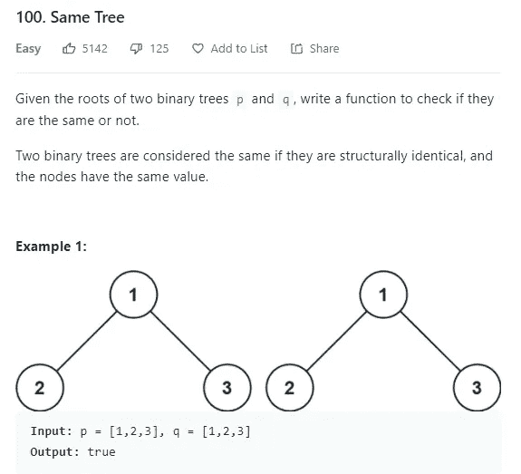
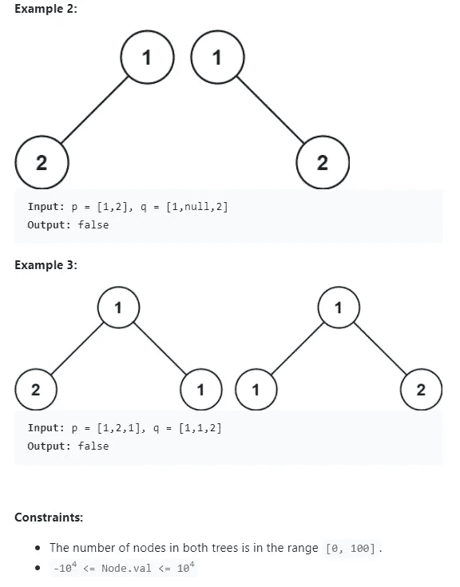
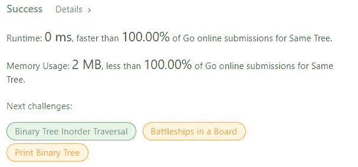

# 有 Leetcode 的 Golang:同一棵树

> 原文：<https://medium.com/geekculture/golang-with-leetcode-same-tree-c56b27ec3d1f?source=collection_archive---------19----------------------->

Leetcode 问题# 100:Golang 中的相同树解决方案


src: [Golang Gopher Go Six Pack — Golang — Sticker | TeePublic](https://www.teepublic.com/sticker/6160254-golang-gopher-go-six-pack) (not affiliated, just liked the picture)

# Leetcode #100:同一棵树

难度:容易

录取率:55.3%



# 问题分解

这个问题本质上是一个图的遍历问题。解决方案必须对称地遍历所提供的每个树节点的分支，如果分支处的值相等，则进行比较。

要考虑的边缘情况是，如果两个节点都是空的，那么它们在技术上被认为是相等的。另一种边缘情况是检查一个节点是否为空，另一个节点是否不为空；这自动告诉我们分支不相等。

递归为树遍历提供了一种自然而直观的解决方案，因为它通常在深度优先搜索和广度优先搜索方法中实现。DFS 和 BFS 是常见的图遍历方法，然而，这似乎是图遍历的入门问题，所以我们现在能够用简单的递归解决方案来解决。

# 问题解决方案:

isSameTree 函数上面的注释代码是由 Leetcode 提供的，让我们知道 TreeNode 结构的结构。

我们要做的第一件事是声明一个变量来存储我们的操作结果。我们将简单地称这个变量为“结果”我们将为它提供一个缺省值 false，因为这样可以避免我们编写多个 return 语句，从而改进我们的问题解决逻辑。之后，我们检查两个指针是否都为零。你可以看到，如果它们都是零，结果设置为真。这就像我们之前说的:如果两个指针都是空的，那么它们在技术上是相等的。

在初始的边缘情况之后，在我们做更多的处理之前，我们检查以确保两个指针都不为零。如果指针不为零，我们检查值是否相等。如果是，我们递归调用这个函数，并分别向它传递左右指针。这将允许我们的递归调用遍历两条路径，并比较每个节点的对应分支之间的相等性。

然后我们返回结果

```
/**
 * Definition for a binary tree node.
 * type TreeNode struct {
 *     Val int
 *     Left *TreeNode
 *     Right *TreeNode
 * }
 */
func isSameTree(p *TreeNode, q *TreeNode) bool {
    var result bool = false

    if p == nil && q == nil {
        result = true
    } else if p != nil && q != nil {
        if p.Val == q.Val {
            result = isSameTree(p.Left, q.Left) && isSameTree(p.Right, q.Right)
        }
    }

    return result
}
```

# 结束语

