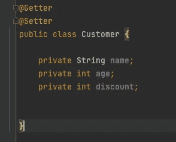
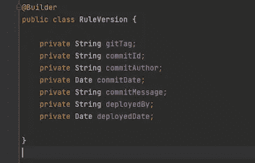
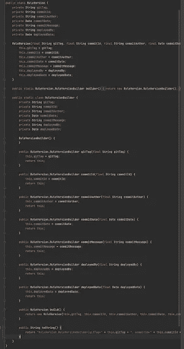
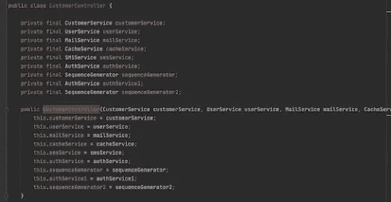
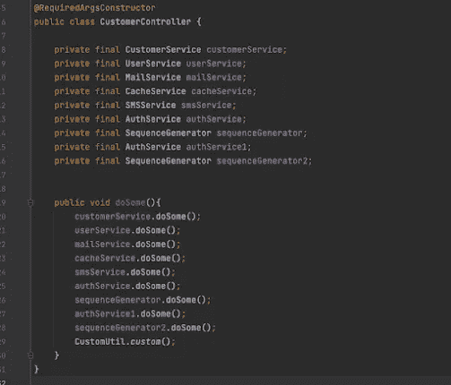
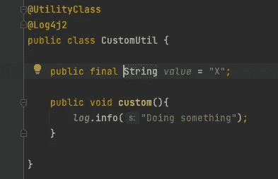

# 龙目语的好用法和坏用法

> 原文：<https://medium.com/geekculture/good-and-bad-usage-of-lombok-8c8f70874a93?source=collection_archive---------0----------------------->

> 拿着工具的傻瓜仍然是傻瓜

Lombok 是一个非常好的工具，它帮助我们编写更少的代码，并帮助我们更加专注于我们的实际工作。更多的是关于你如何在你的项目中使用 Lombok。我看到龙目语的好的和坏的用法。

# 什么是龙目岛

Lombok 是一个 Java 库，它减少了我们的类中的样板代码。你添加一些注释，Lombok 会在编译时为你生成代码。例如，如果您从 **@Getter** 注释中注释您的类，那么 Lombok 会为类中的所有变量生成 Getter 方法。

# 龙目岛的运作方式

首先，让我们谈谈编译过程是如何工作的。流程中主要有三个步骤**解析输入**、**注释处理**、**分析生成**。

在 **Parse 和 Ente** 中，源文件被读入一个语法树( **AST** )中，每个树被传递给 Enter。所有注释处理器在**注释处理**步骤中被调用。如果注释处理器生成新的源文件或类文件，编译过程将进入第一步，并重新开始。如此重复，直到注释处理器不再生成新的源文件或类文件。AST 在**分析和生成**步骤**中被翻译成类文件。**

Lombok 完成了**注释处理**步骤中的所有魔术。注释处理器的工作是生成新的源文件或类，但是 Lombok 会修改现有的源文件或类。Java 编译器规范从来没有说注释处理器可以或不可以修改现有的源文件。龙目岛利用了这个漏洞。我们可以通过改变 AST 来修改将要从源代码生成的类。这就是龙目岛的运作方式。

# 为什么我喜欢龙目岛

Lombok 通过让我们只关注我们应该做的事情，使编写代码变得容易；将业务需求转化为代码。编写 getters、setters、constructors、equals 方法或实现 builder 模式不是我们应该关注的。Lombok 会处理这些，我们只需要添加合适的注释，Lombok 会为我们生成代码。例如，如果我想生成 Getter 和 Setter，我只需要用 **@Getter** 和 **@Setter** 注释来注释这个类。

如果你有一个包含许多属性的复杂对象，你可以使用 **@Builder** 注释来注释这个类，Lombok 将为这个类实现 Builder 模式。

下面是上述类的编译代码。

我们可以在项目中使用许多额外的注释来编写更少的代码，如 **@Cleanup、** **@AllArgsConstructor** 、 **@Data、@Value** 。我必须写更少的代码；更少的代码意味着需要操心的事情更少。这很棒，对吧？以上是真的，但是 Lombok 在编译时会在我们的项目中添加代码，有时会比你写的代码更多。

# Lombok 的错误用法

我主要关心的不是 Lombok 的问题，而是开发者如何在他们的开发中使用 Lombok。开发人员忘记了 Lombok 会生成代码，因为它在我们的源代码中是不可见的。

大多数开发人员做的第一件事是在实现任何东西之前，向类中添加 Lombok 注释。例如，他们使用 **@Data** 注释来生成 getters 和 setters，从而对 DTO 类进行注释。这也是我过去经常做的事情。但是他们忘记(或者不知道)的一点是，Lombok 生成了额外的方法，比如**等于**、 **hashCode** 、 **toString** 、 **canEqual** 。但是有时候我们真的不用这些方法。我们的代码库不应该有任何我们不用的东西。无论我们写什么代码都必须有一个存在的理由，如果没有，我们应该删除它。开发人员有责任使用正确的 Lombok 注释。解决这个问题最明显的方法是添加 **@Getter** 和 **@Setter** 注释，而不是 **@Data** 注释。

一些开发人员使用 Lombok 来隐藏声纳违规，而不是修复它们(有意或无意)。以下面的代码为例。

这个构造函数有九个参数，这是一个声纳违规。

这个类可能做了太多的事情。这应该通过进行必要的代码修改来解决。开发人员使用 put**@ RequiredArgsConstructor**来生成带有所需参数的构造函数。但是当他们添加注释时，声纳违例就消失了。

这不是解决声纳违规的方法。

另外，我不鼓励使用任何修改代码的 Lombok 注释。如果你拿@Data、@Getter、@Setter、@AllArgsConstructor 在现有源代码中添加新代码，而不修改我们写的代码。但是如果你使用 **@UtilityClass** 注释，它会修改我们的代码。以下面的实用程序类为例，

**@UtilityClass** 批注通过使现有类成为最终类并创建私有默认构造函数，将该类转换为实用类。它还将现有的方法和变量改为静态的。如果你检查上面的类，你不会发现任何问题。也没有违反声纳规则。但是当你检查编译后的代码时，你会发现真正的问题。

*值*变量是一个*公共静态最终*变量，因此它应该遵循常量命名约定。但是当我们检查源代码时，我们看到它是一个实例变量。即使是 IDE 也无法将其识别为常量。有人可能会说，如果你知道 **@UtilityClass** 注释是如何工作的，那么你应该知道*值*变量是一个常量。我的主要论点是，这种修改严重影响了可读性。我们的代码首先应该是人类可读的。在我们看来，这是一个实例变量。

我们必须记住的另一件事是，Lombok 利用了 Java 编译器规范中的漏洞。如果 Java 解决了这个问题，我们可能无法使用 Lombok。根据我的测试，Lombok 一直工作到 java 16(我测试的最新版本)。

# 结论

Lombok 是一个很好的工具，可以帮助我们编写更少的代码。但是我们必须明智地使用它。如果我们不知道如何使用龙目岛，我们就不能真正利用它。

[失败的 CQRS 系统](https://keaz-devops.blogspot.com/2020/01/why-we-failed-to-implement-cqrs-in.html)

[在 K8S 上骂詹金斯](https://keaz-devops.blogspot.com/2020/01/scaling-jenkins-on-kubernetes-jenkins.html)