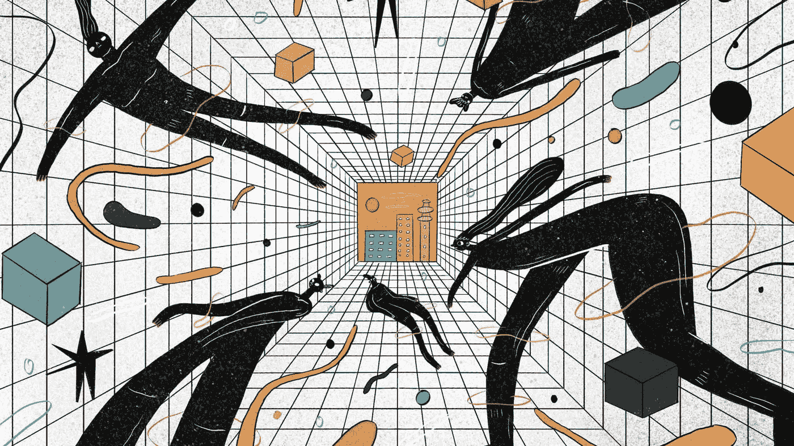

# 好的设计根本没有语言

> 原文：<https://medium.com/geekculture/good-design-has-no-language-at-all-2813a205d8d8?source=collection_archive---------14----------------------->

## 网页设计技巧

## 设计意味着第一眼就能被理解，而不是在阅读大量文本之后。

Illustration by [Catalina Vásquez](https://www.behance.net/kathiuska) on [Béhance](https://www.behance.net/)

让我带你进行一次时间旅行，回到 2000 年，我们的网站由过度饱和的颜色组成，没有空白。而且，还有开发者放在那里让你印象深刻的 GIFs