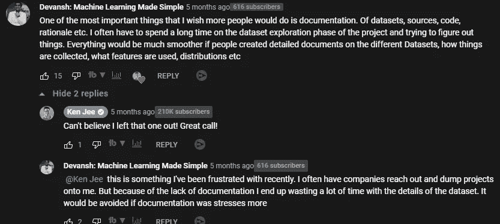
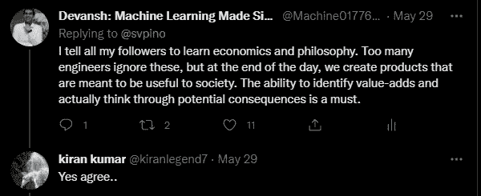
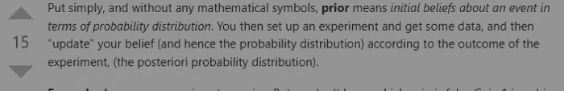
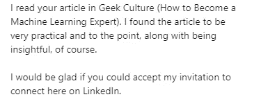
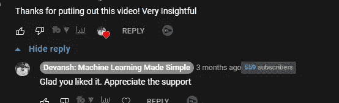

# 机器学习的好文档——指南

> 原文：<https://medium.com/geekculture/good-documentation-for-machine-learning-a-guide-93ebbb4c4ea?source=collection_archive---------1----------------------->

## 这在机器学习中是非常需要的

为了帮助我了解您[请填写此调查(匿名)](https://forms.gle/7MfQmKhEhyBTMDUD7)

如果你正在读这篇文章，你不需要被推销机器学习对经济有多么有效。有一个很好的机会，你要么想进入或已经是 ML 的一部分。这个行业正在蓬勃发展，各种组织都在争先恐后地雇佣顶尖人才。

If you can master Machine Learning, there is a lot of money to be made. But this requires time, effort, and genuine interest. [Ignore shortcuts like the one shared here](/geekculture/the-internet-is-lying-to-you-about-machine-learning-2ea53e952a2d)

不幸的是，管道文档是机器学习中最容易被忽视的方面之一。好的文档有很多好处，是一个公司可以采取的投资回报率最高的步骤之一。良好的文档可以大大减少新员工/项目成员的入职时间，为组织提供方向感，并促进创新。而且几乎不用花钱。听起来像是你喜欢的东西？请继续阅读。

This article was inspired by a “conversation” with [Ken Jee](https://medium.com/u/6ee1f7466557?source=post_page-----93ebbb4c4ea--------------------------------) in his in his video [What Professional Data Scientists ACTUALLY Do](https://www.youtube.com/watch?v=iPdO9MwdcLE&t=763s&ab_channel=KenJee)

在这篇文章中，我将分析如何为你的机器学习/数据科学管道编写好的文档。我将告诉你如何为你的管道写好文档。我们将涵盖您的文档应该涵盖的不同方面，以及如何分别涵盖这些方面。无论您是一个希望扩大运营规模的组织，还是一个希望为您的团队做出一些有价值贡献的开发人员，您都不想错过这个机会。

Photo by [Markus Spiske](https://unsplash.com/@markusspiske?utm_source=medium&utm_medium=referral) on [Unsplash](https://unsplash.com/?utm_source=medium&utm_medium=referral)

# 为什么好的数据文档对软件工程很重要

那么，为什么好的文档在软件工程(尤其是深度学习)中很重要呢？毕竟，对于一个开发人员来说，花那么多时间去写文档是非常昂贵和耗时的。好的文档值得拥有以下好处-

1.  **帮助人们达成共识**。拥有好的文档可以让不同团队的人都有一个共同的理解。
2.  **使远景和计划变得清晰。**正确的行动因组织的计划、愿景和约束而异。拥有详细的文档可以让每个人更好地理解接下来的步骤。记住，很难看到你打不中的目标。文档使你的目标更加具体。
3.  **降低入职成本**。每当我着手一个新项目时，我做的第一件事就是浏览已经完成的工作。这包括倾倒方法、关于收集的数据的信息、ML 管道原理等。拥有好的文档将大大减少我花在学习上的时间。
4.  **加快探索性分析**。在数据科学和人工智能等领域，开发人员在领域探索和 EDA 上花费了大量时间。这对于确保稍后在管道中进行的分析不会遗漏正在解决的问题特有的关键细微差别是至关重要的。优秀的文档简化了这个过程。

如果要我用一个词来概括好处，那就是清晰。*好的文档会全面增加清晰度*。这将为您的企业节省大量开发人员时间，否则这些时间将被浪费在重复查找内容上。

Documentation allows your team to define the correct target. Finding your path to that target becomes much easier after that. Photo by [Afif Kusuma](https://unsplash.com/@javaistan?utm_source=medium&utm_medium=referral) on [Unsplash](https://unsplash.com/?utm_source=medium&utm_medium=referral)

在一个越来越遥远的世界，异步成为常态。奇妙的文档促进了异步性。**如果你讨厌不必要的会议，那就提倡彻底的文档化。**这将让你节省大量重复相同想法的时间。[如果你想成为一名远程工作者，那么学习文档和/或其他技能将让你茁壮成长](/p/685913c83d2b)。

If you’re interested in leveling up your foundational Computer Science, Software Engineering, or getting your dream job, check out my newsletter [Coding Interviews Made Simple](https://codinginterviewsmadesimple.substack.com/).

既然您已经确信了良好文档的必要性，那么让我们继续讨论如何创建良好的文档。

# 机器学习的好文档的细节。

现在来回答一个价值数百万美元的问题，“如何编写好的机器学习文档？”让我们开始吧。要获得良好的文档，您需要解决以下问题-

1.  公司和产品的愿景(相信我，这非常重要)
2.  资源/环境限制
3.  使用的数据源、可用的数据集和完成的处理
4.  目前正在进行的项目
5.  你拥有的实际代码

让我们逐一解决这些问题

# 1:公司愿景和计划

这应该是一个公司的头等大事。如前所述，你只能击中你看到的目标。有了明确的方向和目的，会让你的团队省下很多精力浪费在像无头鸡一样东奔西跑上。

For more amazing discussions, connect with me on LinkedIn, Instagram, and Twitter. Links at the end

那么这看起来像什么？文档应清楚地概述每个已开发或正在开发的产品。商业案例，这些产品如何整合到更大的生态系统中，以及你的企业/团体所瞄准的理想客户。这看起来像是财务人员的事情，但对开发人员来说却很关键。请记住，最终，我们必须开发对社会有用的产品，以创造长期价值。不知道你在为谁开发产品是在为失败做准备。

让我用一个大规模自动化数据分析公司的例子来说明这一点。这家公司从他们的客户那里获取数据，为他们做一些分析，并返回很好的见解。如果这听起来对我的常客来说很熟悉，这是因为我帮助建立的公司 [Clientell](https://www.getclientell.com/) 正是这么做的。

[Check us out, we’re doing some pretty great work. Whether you’re an org looking to streamline your revops or someone looking for work, we’ve got something for you.](https://www.getclientell.com/)

我们新成立的假想公司有两条路可走。一种是尝试服务大量客户，通过实现大量交易(大量客户/订单)来赚钱。另一种是只为少数高价客户工作，并为这些客户构建非常庞大的解决方案(这是我们采取的方法)。无论哪种方式都会让你建立一个繁荣的企业。然而，两者面临的工程挑战大相径庭。拥有清晰的愿景将有助于你的整个组织朝着正确的目标前进。这也将帮助你和团队的其他成员了解未来需要掌握哪些技能。

# 2:资源/环境限制

有了清晰的愿景，您还需要概述您的团队目前正在处理的约束。这些约束可能是面向物理/资源的(缺少人力、云计算、财务)，也可能是面向领域的(规则和法规)。它们甚至可能是自我强加的(满足某些基线，使用某些工具/解决方案，集成在一个框架内)。弄清楚这些是至关重要的，所有的文档都应该包括这些。

# 3:关于数据的信息

每次有组织跟我说他们没有这个，我都摇头。任何严肃的数据处理/分析/AI 公司都应该这么做。您的文档应涵盖有关所用数据源的信息、管道的外观以及对原始数据中的特征/信息进行了何种处理。

**用于数据科学/机器学习的每个特征**都应该有自己的分类，包含关于其性质(分类/布尔/数字等)、使用它的理由以及预期范围/分布的信息。这也是一个很好的地方来记录你的前科以及你是如何找到这些前科的。

[Source](https://cs.stackexchange.com/questions/76647/what-is-meant-by-the-term-prior-in-machine-learning)

另一个被严重低估的举动是谈论任务的基线表现。谈论任务、使用它们的原因以及解决方案预期达到的基准性能。太多人在没有首先建立基线的情况下就进入了机器学习项目。

# 目前正在进行的项目

从事一个项目的工程师应该能够查看正在进行的其他项目。这可以帮助开发人员开发组织的鸟瞰图，并且是建立跨团队协作所必须的。它还可以帮助您的工程师构建着眼于全局的解决方案，这将带来许多好处。

Thank you for all the love. I would love to connect with you.

# 你拥有的实际代码

当大多数工程师想到文档时，他们想到的都是这个。有很多好的指南可以帮助你写出好的、有良好文档记录的代码。但是，我将在这里介绍一些基本原则。如果你想要更深入的分析，让我知道，我可以涵盖它。

摘下低垂的果实，所有的变量/方法名称都应该是描述性的。你的函数 docstring 应该包含描述变量，函数做什么，以及返回值。我还为每个类写了一个描述，所以任何人都可以立即评估这个类。我想给我的读者举一个例子:

你还需要遵循清晰的设计模式，比如[单一责任原则](https://blog.devgenius.io/use-single-responsibility-to-improves-your-machine-learning-pipelines-e724e153680f)。这使得代码易于阅读、理解和修改。这将允许您或其他人在您编写的旧代码上工作，以最少的精力浪费在试图弄清楚您的想法/流程上。

本文到此为止。如果你想进入 ML，t [他的文章给了你一个逐步发展机器学习能力的计划](/geekculture/how-to-learn-machine-learning-in-2022-9ef2ea904986)。它使用免费资源。与其他训练营/课程不同，这个计划将帮助你发展基本技能，并为你在该领域的长期成功做好准备**。**

对于机器学习来说，软件工程、数学和计算机科学的基础至关重要。它将帮助你概念化，建立和优化你的 ML。我的每日时事通讯，[编码采访变得简单](https://codinginterviewsmadesimple.substack.com/)涵盖了算法设计、数学、最近的科技事件、软件工程等主题，让你成为更好的开发人员。 [**我目前正在进行一整年的八折优惠，一定要去看看。**](https://codinginterviewsmadesimple.substack.com/subscribe?coupon=1e0532f2)

我创建了[编码面试，使用通过指导多人进入顶级科技公司而发现的新技术，使面试变得简单](https://codinginterviewsmadesimple.substack.com/p/faqs-and-about-this-newsletter?r=4tnbw&s=w&utm_campaign=post&utm_medium=web)。时事通讯旨在帮助你成功，避免你在 Leetcode 上浪费时间。我有一个 100%满意的政策，所以你可以尝试一下，没有任何风险。[您可以阅读常见问题解答，并在此了解更多信息](https://codinginterviewsmadesimple.substack.com/p/faqs-and-about-this-newsletter?r=4tnbw&s=w&utm_campaign=post&utm_medium=web)

如果你也有任何有趣的工作/项目/想法给我，请随时联系我。总是很乐意听你说完。

以下是我的 Venmo 和 Paypal 对我工作的金钱支持。任何数额都值得赞赏，并有很大帮助。捐赠解锁独家内容，如论文分析、特殊代码、咨询和特定辅导:

https://account.venmo.com/u/FNU-Devansh

贝宝:【paypal.me/ISeeThings 

# 向我伸出手

使用下面的链接查看我的其他内容，了解更多关于辅导的信息，或者只是打个招呼。另外，查看免费的罗宾汉推荐链接。我们都得到一个免费的股票(你不用放任何钱)，对你没有任何风险。**所以不使用它只是失去免费的钱。**

查看我在 Medium 上的其他文章。:[https://rb.gy/zn1aiu](https://rb.gy/oaojch)

我的 YouTube:[https://rb.gy/88iwdd](https://rb.gy/88iwdd)

在 LinkedIn 上联系我。我们来连线:[https://rb.gy/m5ok2y](https://rb.gy/f7ltuj)

我的 insta gram:[https://rb.gy/gmvuy9](https://rb.gy/gmvuy9)

我的推特:[https://twitter.com/Machine01776819](https://twitter.com/Machine01776819)

如果你正在准备编码/技术面试:[https://codinginterviewsmadesimple.substack.com/](https://codinginterviewsmadesimple.substack.com/)

获得罗宾汉的免费股票:[https://join.robinhood.com/fnud75](https://join.robinhood.com/fnud75/)