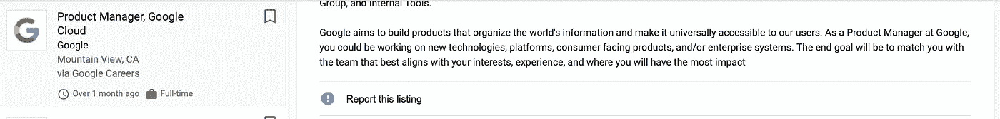

# 良好的衡量是作为产品经理产生影响的关键

> 原文：<https://medium.com/geekculture/good-measurement-is-the-key-to-delivering-impact-as-a-product-manager-c98fdd8bbc36?source=collection_archive---------14----------------------->

大多数产品经理进入产品领域是因为他们想让*影响*。

这就是我在 2017 年从商业智能/分析转向产品的原因。我喜欢发现见解，用数据回答业务问题，并提出行动建议。

但它对用户产生了*影响*并发展了我真正追求的业务。

实际上，你找到的每一份预防性维护工作描述都会包含这个关键词，你与之交谈的大多数优秀的预防性维护都会告诉你，这是激励他们的因素之一。以下是我在谷歌搜索“产品经理职位”时发现的第一份工作描述，以支持这一说法:

Product Manager, Google Cloud

我们一直在谈论影响，但影响意味着什么呢？

## 作为一名产品经理，发挥影响力意味着为您的用户增加价值或以**显著的**和**可测量的**方式改善您的业务——理想情况下两者兼而有之

这 24 个词中最重要的是*可测量的*，因为在一天结束时，这是这个定义中唯一有助于证明你离目的地更近的真实东西。你“动了针”。你增加了价值。

你有*影响*。

# 一个有影响力的产品经理是一个熟练的导航员

Photo by [Uriel Soberanes](https://unsplash.com/@soberanes?utm_source=unsplash&utm_medium=referral&utm_content=creditCopyText) on [Unsplash](https://unsplash.com/s/photos/measurement?utm_source=unsplash&utm_medium=referral&utm_content=creditCopyText)

作为一名产品经理，你在很多方面似乎都是一名船长。

您领导您的团队，解决问题，并对有关优先级的最终决策负责。您还可以绘制路线。

您也是团队的导航员。正是在这个角色上的成功增加了你产生影响的可能性。

在整个海洋历史中的远洋船舶上,[航海家的角色是始终意识到船只的位置](https://en.wikipedia.org/wiki/Navigator)并绘制前方路线，以便船只和船员到达目的地。

就像过去的航海家一样，作为产品经理，您正在带领团队朝着一个目标前进——尽管存在极大的不确定性——而实现这个目标的最可靠方法是始终了解您相对于目标的位置，并相应地调整您的路线。

## 好的衡量标准才是真正的北极星，它可以帮助您了解自己的进步，并为您作为产品经理发挥影响力指明前进的方向。

当我们从这个比喻出发，进入战术时，我想说清楚一点:

***作为产品人员，您所做的每一件事都应该源自您所关注的指标。***

如果您是**产品经理**的个人贡献者，那么您的路线图和您的团队开发的特性都应该与您的指标相关联。

如果你是一名**产品负责人**，你应该设计并引导你的整个*组织*围绕移动那些为你的用户和业务带来最大价值的指标。

# 为了优化影响，围绕指标进行组织

在我解释组织影响力意味着什么以及如何去做之前，我想把它和我在许多公司看到的一个常见的选择进行对比:为*域名所有权*而组织。

围绕给定的技术或特性集来定位您自己、您的团队和您的路线图是很诱人的。毕竟，作为产品经理，你的工作是开发技术，对吗？随着你对自己开发的技术越来越熟悉，你会开始发现它可以变得更好并提供更多价值的所有方式，对吗？

不。那里有龙。这是个陷阱。不要这样做。

作为一名产品人员，你的工作是为业务区分技术投资的优先次序，以便它们在给定的时间框架内以最少的努力提供最大的价值。

## 如果您围绕技术所有权进行组织，您将为构建技术进行优化。

通过围绕正确的*指标*定位您的路线图或您的组织，您可以保证您正在产生影响——无论您是个人贡献者产品经理，还是经验丰富的产品领导者。

但是到目前为止，我只给了你这个想法，有一个系统地实现它并保证结果的框架，我将在接下来与你分享。

# 目标和主要成果

okr 并不新鲜。它们从 70 年代就已经存在，并且在《衡量什么是重要的》一书中被广泛提及。

我将告诉你我对此的看法，并分享我在多个组织中体验过的这个概念的一个版本。我将首先定义一些基本术语，然后我们将使用一个通用在线订阅操作的示例业务成果(新客户注册)来展示如何将指标分解为产品路线图。

## 术语

*   **目标** —代表业务绩效的重要指标(如新客户签约)
*   **关键结果** —您的目标可以分解成的可操作的子组件指标(即新线索和注册转化率)
*   **扮演** —你采取的行动，试图推动你的关键结果(例如，“优化搜索引擎优化的登录页面，以吸引新的线索”和“改变信息，以提高注册转化率”)
*   **特色** —您开发和交付的面向客户的体验，以便执行您的行动

## 推动通用在线订阅业务新客户注册的 OKR 框架(示例)

> **重要提示:**在本例中，我将重点介绍产品和技术的作用，但 OKRs 必须与您的销售、营销和运营合作伙伴协调执行。

这里的**目标**是为一家在线企业吸引新客户注册，然后将这些注册客户转化为*付费*客户。这个 OKR 的例子将只关注注册目标。

在本例中，该企业甚至为我们提供了今年需要达到的 100，000 名新客户注册的目标。太好了！

> 目标= 10 万新客户注册

那么接下来呢？我们需要将这个目标分解成关键结果。我们需要了解这些新客户注册来自哪里？

## 如何从你的目标中得出关键结果

接近**关键结果**的最简单方法是代数方法——将目标视为*关键结果*的函数。如果数学不是你在学校的强项，不要放弃这篇文章！我们将从我们的目标开始倒退，一起解决这个问题。

那么，需要发生什么才能让注册被计算在内呢？嗯，用户必须*同意*才能注册。在我们的在线业务示例中，假设当用户在给了我们他们的电子邮件地址后点击一个写着“注册”的按钮时，这个事件就发生了。太好了！我们也把这个事件称为“转换”。在转换发生之后，这个用户被转换成了一个客户，但是在转换事件发生之前，我们应该怎么称呼他们呢？让我们称他们为 *A Lead* 。

所以对于一个用户(在这个例子中，是一个 Lead )来说，他们甚至需要看到这个“注册”按钮，他们需要登陆包含这个按钮的页面，让我们称这个页面为“登陆页面”。潜在客户访问登录页面。领导也决定注册，如果他们这样做，他们成为客户。让我们将潜在客户注册并成为客户的比率命名为“转换率”。(为了简单起见，让我们假设主管只访问一次登录页面并决定注册或不注册)

因此，现在我们已经将我们的目标分解为两个关键结果，我们可以将它们结合在一起，以显示新客户注册的来源

> (潜在客户数量)x(转化率)=新客户注册数

**关键结果 1:** :销售线索数量

**关键结果 2:** 转化率

太棒了。我们还可以说，如果我们今年的业务没有任何变化，我们保证会有 1，000，000 个潜在客户访问该页面，转化率为 5%，这将产生 50，000 个新客户注册。

> 100 万销售线索 x 5%转化率= 5 万注册人数

但请记住，我们有 10 万注册的客观目标。现在，通过了解我们的目标如何分解为关键结果，以及这些关键结果的现状基线是什么，我们可以更好地了解如何推动这些关键结果实现我们的目标。

例如，我们可以将这个页面上 2M 的潜在客户数量增加一倍(但不改变转化率)，或者我们可以尝试将这个页面的转化率增加一倍，达到 10%，但不增加潜在客户数量。或者我们可以追求两者的结合。

## 设计如何推动你的关键成果

无论如何，下一步是设计将推动这些关键结果的**行动**。

假设我们想要增加通过我们目标函数的潜在客户数量(我们假设这些潜在客户都来自今天点击脸书广告的用户)。

产品团队增加潜在客户的一个方法是通过搜索引擎优化优化这个页面，并试图让它在谷歌中排名更高。更高的谷歌搜索结果排名将导致更多的用户点击这些有机搜索列表，因此更多的线索来自这个漏斗。

但请记住，我们跨职能部门实现 OKRs，因此营销部门也可以将他们在脸书广告上的支出翻倍，以尝试将访问登录页面的潜在客户数量翻倍。

到目前为止，我们只关注我们现有的漏斗，试图逐步增加销售线索数这一关键结果。到目前为止，这看起来非常像围绕域名所有权进行的组织，但请记住，我们专注于增加线索数量，我们如何做到这一点并不重要…所以我们如何在这里想得更大？

如果我们开发一个全新的第二个登录页面，以不同的方式向略有不同的受众介绍，鼓励他们注册，会怎么样？或者，如果我们为现有客户建立一个推荐功能，允许他们将自己的朋友和家人推荐到登录页面来注册，会怎么样？

这是以指标而不是技术所有权为导向的主要好处之一。你可以避开针对局部最大值进行优化的陷阱，而是不受现有产品足迹的约束，去寻找一个可以让你更快实现目标的解决方案。

因此，下面是我们可以用来提高销售线索数量的重头戏:

> 玩法 1:为 SEO 优化页面，以有机地推动更多销售线索(产品)
> 玩法 2:增加脸书广告的预算，以推动更多销售线索(营销)
> 玩法 3:为第二批受众开发第二个广告+登录页面(产品+营销)
> 玩法 4:开发推荐功能，允许现有客户将他们的家人和朋友作为销售线索发送到我们的登录页面(产品)

这是一份可靠的清单。所有这些重头戏都会对推动我们的销售线索关键结果产生影响(这反过来会推动我们的目标)。这些也都说明了产品和营销之间的跨职能协作对于实现业务目标的重要性。

有哪些拉动转化率的玩法？

让我们考虑两点来提高登陆页面的转化率。

首先，我们可以测试不同的信息，看看哪些特定的词可以让用户相信注册是有价值的，并引导更多的用户注册。对于这个剧本，我们可以使用无限数量的单词组合来鼓励用户注册。由于有太多的不确定性，什么样的信息会真正引起用户的共鸣，我们会想制定假设，我们可以 A/B 测试，以找出哪个版本会产生最高的转化率。

作为提高转换率的另一种手段，我们还可以在登录页面添加“与销售代表聊天”功能，这样用户就可以与销售代表就他们的任何问题进行聊天，并帮助他们注册。

概括来说，我们可以设计两个重头戏来提高页面上的转换率关键结果是:

> 玩法 1:通过 A/B 测试试验不同的信息传递(产品)
> 玩法 2:添加聊天功能，允许用户在注册前与销售代表交流(产品+销售)

这些行动还说明了在 OKRs 上执行的跨职能性质。但是现在我们来谈谈特性。

## 执行有特色的剧本

你如何组织你的产品工作以直接实现商业成果的最后一步是为你的每一部戏设计特色。

对于产品经理来说，这个阶段在交付影响方面包含了最大的不确定性，因为最终我们不知道哪些剧本会起作用，我们对这些剧本的执行真的很重要——我们甚至不知道某个功能的哪个*版本*会提前起作用。

只有客户最终知道这一点，我们有两种方法可以减少这种不确定性，以帮助我们设计功能，从而有效地执行我们的行动。实验和客户研究。

## 通过用户研究开发出色的功能

决定如何设计一个特性的最好方法之一，尤其是如果你的用户基数很小的话，就是去和他们交谈！没有什么可以替代与你的用户进行真正的对话，倾听他们的动机，理解他们看待世界的思维模式，真正理解他们的问题所在。

一个特性要想成功，最终需要解决用户的一些问题。如果你没有接触到用户，也没有能力用他们自己的话来交流他们的问题，那么你成功产生你想要的影响的可能性将会很低。

关于进行有效的用户研究还有很多要说的，但是我们现在就把它留在这里，谈谈实验。

## 为了更高的用户量和流量，通过实验来学习

当您有大量的、稳定的活动，您可以将这些活动分成组进行测试(假设在测试持续时间内进行 [15k 次观察)，然后您可以使用 A/B 测试，以便从数据中了解哪个版本的特性会对您的用户产生更大的影响。](https://help.optimizely.com/Analyze_Results/How_long_to_run_an_experiment)

当您的小组变得如此之大，以至于您无法与所有用户交谈时，这是非常有用的。你的用户群越大，你与之交谈的个人用户越不可能代表你的真实人口。也有减少这种风险的方法，但是我们将在另一篇文章中讨论。

在大范围内，A/B 测试成为发布一个特性的最佳版本的有效方法，了解它们中的哪一个工作得更好，并随着时间的推移进行迭代和优化，以最终交付一个特性的最佳版本，该版本将交付您所寻求的影响。

# OKR 摘要

因此，我们刚刚探索了一个*非常*简化版的 OKR 崩溃，以及如何设计行动和开发功能，以增加您实现目标和产生影响的可能性。

关于这一切，还有最后一件事要说，因为我们不想不惜任何代价推动我们的目标*并因此冒用户体验下降或公司损失的风险。我们需要讨论数量指标和质量指标。*

# 关于数量度量和质量度量的一个注记

到目前为止，我们已经花了整篇文章来探索 okr，它实际上是我认为的“容量度量”。

这些是你一直想向右上方推动的指标。

Photo by [Slidebean](https://unsplash.com/@slidebean?utm_source=unsplash&utm_medium=referral&utm_content=creditCopyText) on [Unsplash](https://unsplash.com/s/photos/chart?utm_source=unsplash&utm_medium=referral&utm_content=creditCopyText)

但是这样做可能会损害过程中的其他重要指标，所以我们总是希望用一些“质量指标”来约束我们驱动 OKR“量的指标”的努力，这将确保我们不会搁浅(重新使用导航的比喻)。

在抽象的意义上，数量指标将代表业务的增长。推动我们的销量指标上升，意味着业务在增长，这很好。

但是，在追求增长的过程中，我们需要考虑的主要制约因素是成本和用户体验的质量。

Photo by [Naomi August](https://unsplash.com/@naomi_august?utm_source=unsplash&utm_medium=referral&utm_content=creditCopyText) on [Unsplash](https://unsplash.com/s/photos/guardrail?utm_source=unsplash&utm_medium=referral&utm_content=creditCopyText)

回到我们推动新客户注册的例子，我们确定了一个增加脸书广告营销预算的计划，以推动新的销售线索，但如果这实际上不在公司的年度预算中呢？或者，如果获得第二个 100 万个潜在客户，每个潜在客户的客户获取成本(CAC)要高得多，那么单位经济对企业来说就没有意义了。为了减轻这种情况，我们需要定义与 OKR 相关的质量指标，以帮助定义我们可以承受的采购成本的护栏。

同样，也有可能通过向网站添加额外的注册模式来提高转换率，当用户开始悬停在页面左上角附近时，这些注册模式会弹出(通过后退按钮)。我们可能会从中挤出一些额外的转化，但这可能会给持观望态度的用户带来糟糕的体验，因为我们坚持通过弹出广告来吸引他们。我们现在开始有点偏离我们的例子，但我们希望考虑像“参与时间”或“跳出率”这样的质量护栏来代表这种情况下的客户体验。

# 结论

好的指标是我们作为产品经理的北极星。

通过使用 OKR 框架来定义什么是重要的，根据它制定我们的行动，并不断进行测量以确保我们仍在朝着我们的目标前进，我们可以确保我们正在朝着正确的方向前进，并最终对我们的用户和业务产生我们想要的影响。