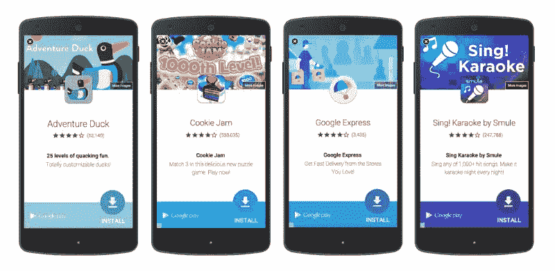
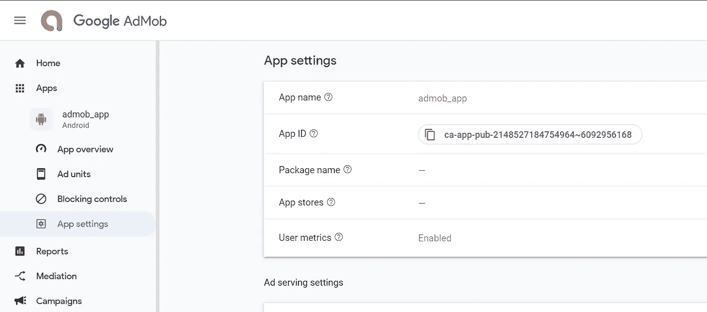
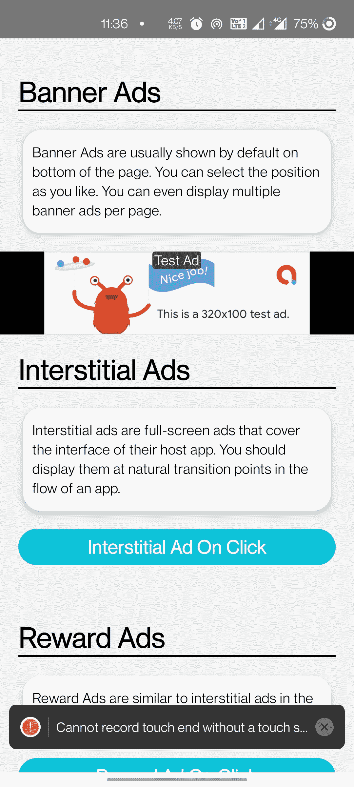
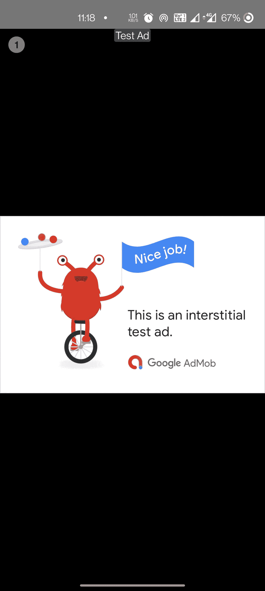
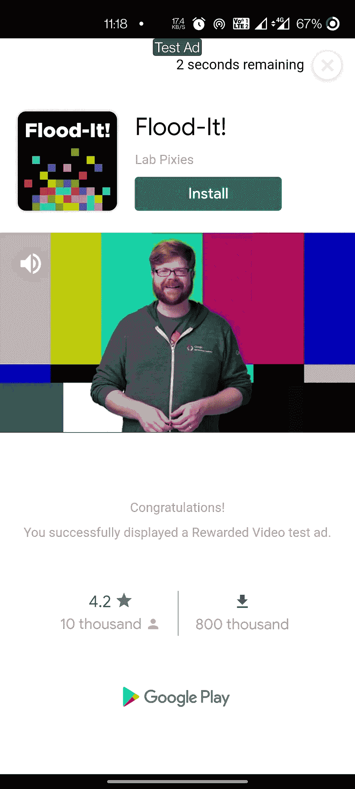
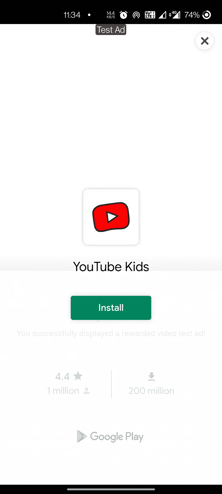

# Google AdMob 通过 FireBase 进行本地反应

> 原文：<https://medium.com/geekculture/google-admob-for-react-native-via-firebase-11a2a6fa555a?source=collection_archive---------4----------------------->


React Native — Time to Monetize your app

> 这篇文章是应我们成千上万的读者之一的特别要求而写的。如果你有更多的要求，请在评论中告诉我

在这篇文章中，你将学习如何在 React 本地应用中实现 **AdMob 功能**，即谷歌广告。我们将在一个简单的 React 本机应用程序中实现这一点，并在 Android 上进行测试。

众所周知，广告是谷歌、脸书、推特等科技巨头的主要收入来源。谷歌广告是最受欢迎的广告之一，谷歌广告的移动版本被称为 AdMob。



An example of Google AdMob ad. The ad is prompting user to install certain app

## AdMob 广告类型

**横幅**:出现在设备屏幕顶部&底部的基本广告格式。

插页:整版广告出现在自然间断&过渡处，比如关卡完成。支持视频内容。

**奖励**:广告奖励用户观看短视频并与可播放的广告和调查互动。有利于免费游戏用户的货币化。支持视频内容。

**原生**:可定制的广告格式，与你的应用的外观&感觉相匹配。广告与应用程序内容一起出现。支持视频内容。目前，原生广告只能在原生应用中出现，而不能在基于 Ionic 或 React Native 的混合应用中出现。

# 步骤 1 —创建 Firebase 项目

对于 Admob 实现，我们从 Firebase 项目中需要的只是用于 Android 的— `google-services.json`文件

遵循以下步骤

*   登录 [Firebase 控制台](http://console.firebase.google.com/)
*   创建 Firebase 项目
*   添加一个 Android 应用程序，注册捆绑包 id，并为您的应用程序命名
*   下载`google-services.json`。我们将在项目的后期需要这个文件

如果你需要的话，按照这个视频来做上面的步骤-

Create a firebase project

# 步骤 2 —创建基本的 React 本机应用程序

首先，根据[官方文档](https://facebook.github.io/react-native/docs/getting-started.html)，确保你具备创建 react-native 应用的所有先决条件。

> ***在发这个帖子的时候，我已经反应过来了——原生版本 0.64.2*** ***&节点 14.9.0***

创建一个空白的 react-native 应用程序

```
$ react-native init admob_app
```

这将创建一个基本的 React-native 应用程序，您可以在设备或模拟器中运行它。(安卓或 iOS)

# 步骤 3 —设置您的 Admob 帐户

*   注册，然后登录您在[https://apps.admob.com](https://apps.admob.com/?utm_source=internal%26utm_medium=et%26utm_campaign=helpcentrecontextualopt%26utm_term=http://goo.gl/6Xkfcf%26subid=ww-ww-et-amhelpv4)的 AdMob 账户。
*   点击侧边栏中的**应用**。
*   点击**添加应用**添加新应用，或点击**查看所有应用**搜索您添加到 AdMob 的所有应用列表。
*   在**应用设置**选项中，可以看到您的**应用 ID** 。这是您将应用程序连接到 React 原生应用程序中的 Google AdMob 所需的 ID。



Note down your App ID from App Setting in Google AdMob

*   在**广告单元**部分，您可以添加多种类型的广告单元。有关添加广告单元的更多详细信息，请查看以下详细的分步说明

— [横幅广告](https://support.google.com/admob/answer/7311346?hl=en)

[—插播广告](https://support.google.com/admob/answer/7311435?hl=en%26ref_topic=7382891)

— [悬赏广告](https://support.google.com/admob/answer/7311747?hl=en%26ref_topic=7382891)

AdMob 有很多其他的设置，比如你的广告应该如何、何时以及在哪里出现，但这些都是以后的事了。在本帖中，我们将讨论限制在**“如何在 React 原生应用中显示基本广告单元”**

# 步骤 4 —安装 AdMob 依赖项并实施

在这篇文章中，正如我之前解释的，我们使用 AdMob 和 Firebase。我们为此使用的依赖项是 [React-Native Firebase](https://invertase.io/oss/react-native-firebase/) 。这个主依赖项包含几个服务模块，AdMob 是其中之一。

## 4.1 为 Android 安装 React-Native Firebase

在您现有的 React 本机应用程序中，使用

```
**$ yarn add @react-native-firebase/app**# For iOS 
**cd ios && pod install**
```

## 4.2 安装 AdMob 依赖项

使用安装模块

```
$ yarn add @react-native-firebase/admob# For iOS
cd ios/ && pod install
```

## 4.3 添加您的 AdMob 应用 ID

AdMob 模块需要使用我们在**步骤 3** 中记下的应用 ID 连接到您自己的 Google AdMob 帐户

将 ID 添加到您的根级`firebase.json`文件(在`react-native`对象下创建一个)中，如下所示

```
{
"react-native": {
"admob_android_app_id": "ca-app-pub-xxxxxxxx~xxxxxxxx"
}
}
```

重新构建应用程序以使更改生效。

# 第 5 步——在应用程序中实现不同类型的广告

一旦一切都设置好了，让我们在应用程序中实现不同类型的广告。

## 横幅广告

横幅广告本身就是一个`<BannerAd>`标签。你可以把它放在你的 React 本地应用中，就像其他标签一样。确保您导入了依赖项

```
import { TestIds, BannerAd, BannerAdSize} from '@react-native-firebase/admob';
```

我在页面底部的`View`位置`absolute`导入了横幅广告，如下所示

```
<**BannerAd**
unitId={TestIds.BANNER}
size={BannerAdSize.SMART_BANNER}
requestOptions={{
requestNonPersonalizedAdsOnly: true,}}
onAdLoaded={() => {
console.log('Advert loaded');}}
onAdFailedToLoad={(error) => {
console.error('Advert failed to load: ', error);}}
/>
```

在这里，我使用了一个测试 ID `TestIds.BANNER`。这使用 AdMob 提供的默认测试 ID。当您发布应用程序时，您将使用您的制作广告单位 ID 替换它

> **不要在您的生产应用程序中使用测试 ID，也不要在开发应用程序时使用您的生产广告单元 ID**

最终的广告看起来像这样



AdMob Banner Ad in React Native app

## 间隙广告

插播广告是一个触发器。因为这些是全页广告，所以它们并不总是作为横幅广告出现。

要实现间隙广告，请导入所需的依赖项并遵循下面的代码

同样，`TestIds.INTERSTITIAL`是一个测试 ID。发布应用程序时，将其替换为生产广告 ID。

`.load()`方法加载广告。这个广告需要一些时间来加载。这就是为什么`.show()`在`LOADED`事件中被调用。如果你在`.load()`之后立即调用`.show()`方法，这个 app 就会崩溃。

最后`.show()`全屏显示广告，如下图



Admob interstitial ad in React Native app

## 奖励广告

还是那句话，悬赏广告在触发机制上类似于插播广告。要实现，请导入所需的依赖项并遵循下面的代码

同样，`TestIds.REWARDED`是一个测试 ID。发布应用程序时，将其替换为生产广告 ID。

`.load()`加载广告的方法。这个广告需要一些时间来加载。这就是为什么在`LOADED`事件中调用`.show()`的原因。如果在`.load()`之后立即调用`.show()`方法，app 会崩溃。

奖励广告也有一个`.EARNED_REWARD`事件，当奖励广告抛出回调时(通常是当用户已经看到广告的所需长度时)调用该事件。在这次回调之后，你可以向用户提供奖励。

最后`.show()`全屏显示广告。悬赏广告会是这样的



Admob reward ads in React native app

# 步骤 6:在设备上测试应用程序

要运行 Android 应用程序，您应该首先通过 Android Studio 或`adb`启动模拟器(或连接设备)，然后调用

```
$ react-native run-android
```

# 结论

在这篇博客中，我们学习了如何在 React Native app 中实现 Google AdMob 功能。对于用户希望从广告点击中获得一些收入的应用程序来说，AdMob 功能是必不可少的。你也可以将插播广告和奖励广告与应用内奖励相结合，如游戏升级、额外生命等。

# 资源

> [Github](https://github.com/LuffyAnshul/admob_app)