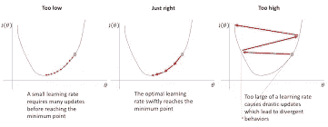
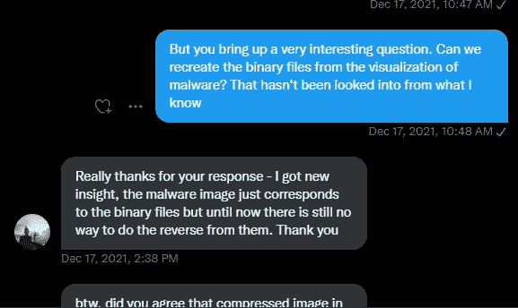
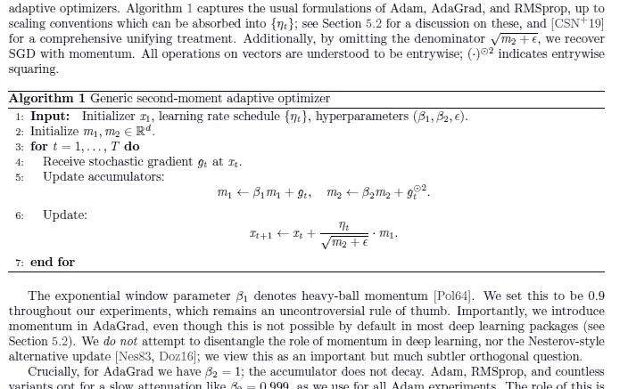
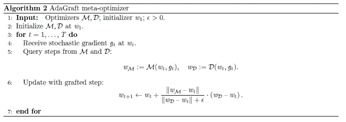
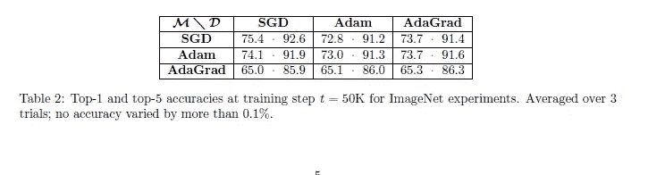
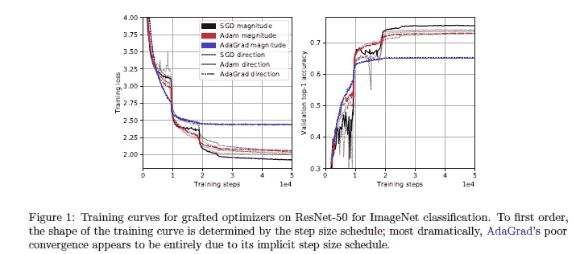
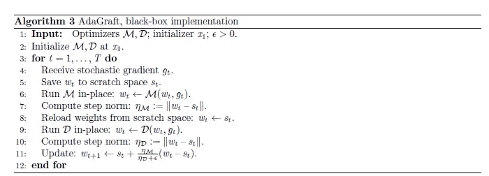
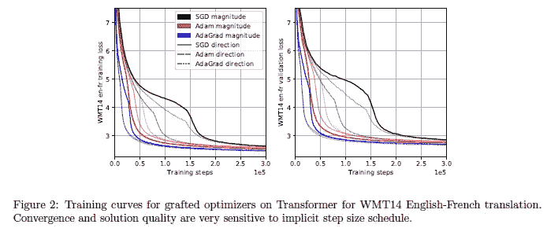
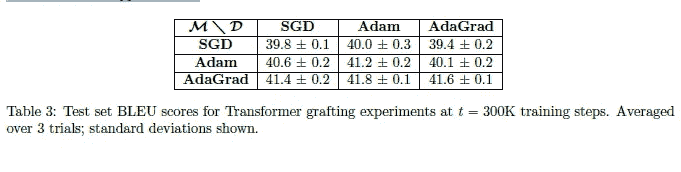

# 谷歌人工智能和普林斯顿发现了深度学习

> 原文：<https://medium.com/geekculture/google-ai-collaborated-with-princeton-to-discover-this-about-deep-learning-e6a0c6f7cae5?source=collection_archive---------2----------------------->

## 他们的发现改变了我们对深度学习行为的认识

为了帮助我了解您[请填写此调查(匿名)](https://forms.gle/7MfQmKhEhyBTMDUD7)

ML 模型的学习结果很大程度上取决于模型的学习速率。学习率是优化算法中的调整参数，该优化算法确定每次迭代的步长，同时向损失函数的最小值移动。由于它影响了新获得的信息覆盖旧信息的程度，因此它隐喻性地代表了机器学习模型“学习”的速度。

Learning Rate can make or break your model. This is why there are so many variants in practice.

学习率的重要性不可小觑。这就是为什么有很多研究致力于发现新的学习速率表(LR 应该如何随时间变化)和比较现有的学习速率表。谷歌人工智能、特拉维夫大学和普林斯顿大学的研究人员合作编写了 [**，将自适应梯度方法与学习速率**](https://arxiv.org/abs/2002.11803) 分开。本文着眼于"*自适应梯度方法如何与学习速率表相互作用。在这篇文章中，我将分享一些有趣的文章，也许会对你的 ML 之旅有所帮助。通过评论或 DMs 分享你对论文的想法和你觉得最有趣的想法。这是我们大家互相学习/获得新思想的好方法。如果你希望从事机器学习方面的工作，看看这个视频，它解释了什么样的机器学习项目将最有助于加速你的成长和找到工作。*

Conversations like this are always interesting. Use IG/LinkedIn to reach out.

# 理解上下文

为了理解这篇论文，理解他们所运用的理论的基础是很重要的。通常认为像 Adam 这样的学习率调度器很棒，因为它们能够计算两个方面，幅度和方向。可以把幅度想象成步长的绝对值，把方向想象成步长的方向。请记住，由于机器学习中的大量输入数据是高维的，因此选择正确的方向进行遍历不是一件小事。下图很好地概括了二阶矩优化器。如果你不能理解所有的东西，不要担心，只要注意我们是如何根据我们计算的梯度来改变不同的值。

Notice how we always tweak the parameters by a function of the gradient

本文作者试图说明选择正确的步长在学习行为中有多么重要。他们通过提出一个嫁接实验来做到这一点。我们不是从同一个优化器获取幅度和方向，而是从两个不同的优化器获取。

Notice how we are computing the magnitude and direction seperately.

然后，通过比较嫁接优化器在各种任务中的行为，我们可以检查步长对模型学习的整体性能有多重要。如果我们在使用相同优化协议的任务中看到相对一致的性能(尽管方向不同)，我们可以得出结论，步长是最重要的。反之亦然。

# 计算机视觉性能

作为谷歌人工智能的一个宠儿，没有一篇未经计算机视觉任务测试的谷歌论文是完整的。设置细节如下，"*我们在具有 26M 参数的 50 层剩余网络[HZRS16]上运行所有嫁接优化器对，并在 ImageNet 分类[DDS+09]上进行训练。我们使用大规模训练基础设施支持的 4096 的批量大小，以及由线性预热和逐步指数衰减组成的学习率计划。*

They tested all pairs for grafting. All the rows control for implicit step size.

结果很有意思。我们看到每行的值在各行之间相对一致(前 1 名和前 5 名精度)(步长来自同一个优化器)。各列之间有相当多的差异(来自同一个优化器的方向)。这导致了一个非常有趣的结论。步长似乎是模型学习行为的主要因素。作者通过陈述“*阐明了这一点。图 1 简要显示了我们的主要经验观察结果:训练曲线的形状通过选择 M 进行聚类，M 是提供步长的优化器。*

这本身就足够有趣了。但是仔细想想，这就引出了一个有趣的应用。想象一个数据集，其中我们的优化器比另一个更差。然而，优化器 1 的运行成本更低。因此，我们使用优化器 2 来计算步长，并将其移植到 1 上。这将提高 1 的性能，同时比优化器 2 更便宜。看看 AdaGrad 的研究结果来证明这个想法的概念。

The appendix has a lot of the detail, if you are looking to implement this yourself.

对于那些对移植的实现感兴趣的人，这在附录中。查看它的许多小配置/技术细节。如果你想实现类似的东西，这将是有帮助的。

# NLP 性能

接下来，我们继续进行自然语言处理任务。根据作者，“*对于现实的大规模 NLP 设置，我们在具有 375M 参数的 6 层变压器网络[VSP+17]上训练所有嫁接的优化器，在 WMT14 英语-法语翻译任务上，该任务具有 3630 万个句子对。同样，我们使用大批量(384 个序列)，实现非常强大的训练设置。更多详情请参见附录 C.3\.* “性能如下所示

查看下表(在一个单独的任务中进行)，我们再次看到跨行的值比跨列的值稳定得多(尽管该任务的整体性能更稳定)。这再一次暗示了这样一个观点，即大小是比方向更重要的因素。

AdaGrad grafted with Adam is the best performer

事实上，我们看到最好的结果来自嫁接的表演者。作者甚至在他们的评论中强调了这一点，“*有趣的是，除了通过选择 M 来展示相同的性能指标聚类之外，这些实验还表明，嫁接优化器有可能优于基本方法 M 和 D；损失曲线见图 2，下游 BLEU 指标见表 3.3，我们的结果与之一致。同样，我们并不是在谨慎的调整下宣称绝对的优势，而只是自举的力量；我们强调，我们甚至没有调整全局学习率标量。*

综合计算机视觉和自然语言处理的结果对我来说相当有说服力。令人惊讶的是，我们可以如此全面地展示步长的优势。升压陷阱的潜力也很吸引人，如果我们能够建立评估协议来识别特定问题的最佳组合，那将会很有趣。

如果你喜欢这篇文章，看看我的其他内容。我定期在 Medium、YouTube、Twitter 和 Substack 上发帖(所有链接都在下面)。我专注于人工智能、机器学习、技术和软件开发。如果你正在准备编码面试，看看:[编码面试变得简单](https://codinginterviewsmadesimple.substack.com/)。

为一次性支持我的工作，以下是我的 Venmo 和 Paypal。任何数额都值得赞赏，并有很大帮助:

https://account.venmo.com/u/FNU-Devansh

贝宝:[paypal.me/ISeeThings](https://www.paypal.com/paypalme/ISeeThings)

# 向我伸出手

如果那篇文章让你对联系我感兴趣，那么这一部分就是为你准备的。你可以在任何平台上联系我，或者查看我的其他内容。如果你想讨论家教，发短信给我。如果你想支持我的工作，使用我的免费罗宾汉推荐链接。我们都有免费的股票，对你没有风险。**所以不使用它只是失去免费的钱。**

查看我在 Medium 上的其他文章。:[https://rb.gy/zn1aiu](https://rb.gy/oaojch)

我的 YouTube:[https://rb.gy/88iwdd](https://rb.gy/88iwdd)

在 LinkedIn 上联系我。我们来连线:[https://rb.gy/m5ok2y](https://rb.gy/f7ltuj)

我的 insta gram:【https://rb.gy/gmvuy9 

我的推特:【https://twitter.com/Machine01776819 

我的子任务:[https://codinginterviewsmadesimple.substack.com/](https://codinginterviewsmadesimple.substack.com/)

获得罗宾汉的免费股票:[https://join.robinhood.com/fnud75](https://www.youtube.com/redirect?redir_token=QUFFLUhqa0xDdC1jTW9nSU91WXlCSFhEVkJ0emJvN1FaUXxBQ3Jtc0ttWkRObUdfem1DZzIyZElfcXVZNGlVNE1xSUc4aVhSVkxBVGtHMWpmei1lWWVKNzlDUXVJR24ydHBtWG1PSXNaMlBMWDQycnlIVXNMYjJZWjdXcHNZQWNnaFBnQUhCV2dNVERQajFLTTVNMV9NVnA3UQ%3D%3D&q=https%3A%2F%2Fjoin.robinhood.com%2Ffnud75&v=WAYRtSj0ces&event=video_description)