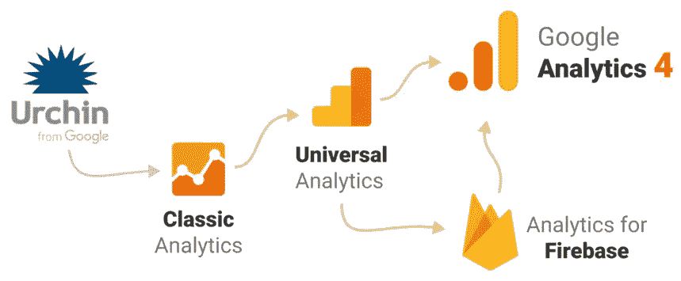
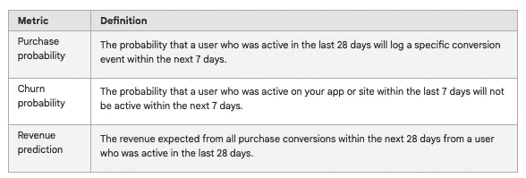
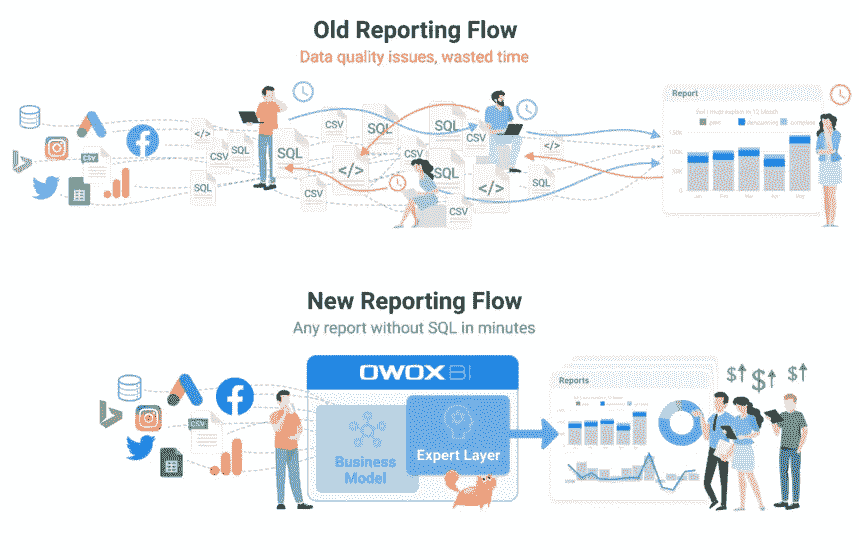

# 谷歌分析 4:分析的未来

> 原文：<https://medium.com/geekculture/google-analytics-4-the-future-of-analytics-692bd2069ec6?source=collection_archive---------6----------------------->

Source:[Depositphotos](https://ru.depositphotos.com/243457388/stock-photo-selective-focus-toy-plane-map.html)

## 旧的分析方法已经不起作用了，在未来的后 cookie 世界里也肯定不起作用。让我们看看谷歌分析 4 更新，因为它解决了现代营销需求。

我们生活在一个新的、动态发展的现实中。一切都在变化:用户的行为、数据需求、企业的需求以及他们处理数据的方式。

这就是为什么我们现在不断看到旧服务的更新和新产品的发布。

# 什么是谷歌分析 4？

Google Analytics 是最受欢迎的数字分析软件工具之一，允许您深入分析营销效率和网站访问者行为。

去年，[谷歌宣布了](https://blog.google/products/marketingplatform/analytics/new_google_analytics/)谷歌分析有史以来最重大的变化:谷歌分析 4，一个与传统的“通用”分析非常不同的新版本。这是个大新闻，但并不意外。

谷歌分析多年来的发展导致了谷歌分析 4 的发展。

这不是我们第一次接触新平台。2005 年，谷歌收购了跟踪平台顽童，此后该公司发布了几个新版本的分析服务。

Image courtesy of the author

然而，大多数这些版本都跟踪了网站或应用程序属性，而不是两者都跟踪。

以前，企业需要两个平台——Google Analytics 和 Firebase——来分别分析网站和应用。这些产品是获得数据洞察力的好方法，但要获得跨应用程序和网站的统一图片是相当具有挑战性的。

2019 年，谷歌迈出了一大步，推出了一个名为 [App +网站](https://www.blog.google/products/marketingplatform/analytics/new-way-unify-app-and-website-measurement-google-analytics/)的 beta property。它基本上是 Firebase 的谷歌分析，但具有网络跟踪功能。现在它已经退出测试，谷歌将其重命名为谷歌分析 4 (GA4)，并增加了大量新功能。

新的谷歌分析 4 带有一系列关键功能，使其与旧版本的通用分析非常不同，大多数人对新平台以及它对分析的未来意味着什么有很多疑问。

我们在这篇文章中回答了这些问题。

# 通用分析正在消失吗，我们现在应该从通用分析转向谷歌分析 4 吗？

如今，许多人都很困惑:通用分析是否会永远消失，我们是否应该立即转向新版本？老版本会怎么样？

谷歌的通用分析还没有消失，也没有迹象表明谷歌分析的旧风格何时会被关闭。尽管如此，你现在需要开始制定计划，以确保你为过渡到谷歌分析 4 做好准备。

目前，用户不会被迫切换到新版本的分析，但任何新的属性或新账户都将默认为谷歌分析 4。

数据连续性和报告对于每个企业的成功和发展都非常重要。这就是为什么我们建议在您的堆栈中实施 GA4 作为额外的分析工具，并开始收集数据和构建您的新 Google Analytics 4 属性，以便您拥有历史数据来正确利用该平台。这个做法也是 Google [在自己的网站](https://support.google.com/analytics/answer/10119380?hl=en&ref_topic=9303319)上推荐的。

强烈建议同时运行 Universal Analytics 和 Google Analytics 4，以便您可以并行跟踪您的 GA4 和 Universal Analytics 属性。即使您不打算马上使用 GA4，使用 parallel tracking 您也可以比较这两个平台，试用 GA4，并了解所有的新特性。

并行跟踪的主要优势如下:

*   积累历史数据，因为 GA4 不提供您在通用分析中跟踪的任何历史数据。它只在设置好之后才开始跟踪数据。GA4 标记越早到位，您将收集和处理的历史数据就越多。
*   给自己一些时间来适应新的界面、数据模型和报告配置。GA4 中的一切都是不同的，因为它是一个与 Universal Analytics 完全不同的实体。
*   面向未来。没人知道万能分析何时会被完全否决，但它会。你不想浪费时间，有一天被新的分析现实淹没。保护好自己。

过渡到 Google Analytics 4 并不等同于升级现有资产，因为 GA4 引入了一个全新的数据模式。谷歌警告说，用户不应该期望他们的数据在通用分析和谷歌分析 4 中看起来是一样的。

迁移之路并不简单，只需点击一个神奇的按钮，开箱即可让一切完美运行。你当前的追踪系统越大越复杂，你有效切换到 Google Analytics 4 的时间就越长。

# 谷歌分析 4 有什么新功能？

那么，什么发生了变化？总之…很多。

Google Analytics 4 使用了完全不同的数据结构和数据收集逻辑。让我们更详细地看看这个工具，并讨论一下最明显的变化。

谷歌分析 4 中可用的主要功能有:

*   跨平台跟踪(网络和应用程序)
*   更深层次的谷歌广告整合
*   人工智能驱动的预测和见解
*   免费 BigQuery 集成
*   谷歌信号
*   基于事件的模型

## 跨平台跟踪(网络和应用程序)

如果您的企业拥有网站和移动应用程序，您现在可以方便地将数据传输到同一家酒店。

以前，如果你想测量你的网站数据，你需要使用你的谷歌分析属性来跟踪网站数据。

如果我们需要查看应用程序中的流量，我们需要利用 Google Analytics for Firebase 来访问数据。现在，您的网站和应用程序中的所有数据都集中在一个帐户中。

新的 GA4 将 web 和移动应用流量使用数据结合到一个界面的一个属性中。

这可以通过一种新的架构来实现，这种架构允许我们安装跨设备跟踪并统一跨设备的数据。此外，这还包括能够跨设备跟踪用户。

在 GA4 和跨设备跟踪的帮助下，营销人员现在可以跨设备全面地查看客户旅程。

## 更深层次的谷歌广告整合

谷歌分析 4 与谷歌广告有更深层次的整合。您可以使用来自 GA4 的数据来建立与您的客户更相关的定制受众，并针对他们开展付费或有机活动。

此外，GA4 将报告来自 YouTube engaged views 的行动，这些行动发生在应用程序内以及网络上。

[据谷歌:](https://blog.google/products/marketingplatform/analytics/new_google_analytics/)

> 随着谷歌营销产品的新集成，很容易使用你所学到的东西来提高你的营销投资回报率。
> 
> 例如，与谷歌广告的更深层次整合，让你可以创造受众，无论他们选择在哪里与你的企业打交道，你都可以通过更相关、更有帮助的体验接触到他们。

营销人员现在可以更全面地了解他们的结果，能够看到来自谷歌和非谷歌付费渠道、YouTube 视频视图、谷歌搜索、社交媒体和电子邮件的转换。

## 人工智能驱动的预测和见解

谷歌是机器学习的领导者，高级机器学习作为数据测量的主要形式，已经在谷歌分析 4 中应用，以检测数据的趋势并向用户发出警报，这并不奇怪。

GA4 能够预测用户的行动和行为，并且通过提供让您知道应该关注什么的可用数据，它使得规划您的下一步变得更加容易。知道在哪里投资你的时间和资源来获得最好的回报，这当然是有用的和必要的。

GA4 通过两个功能使用机器学习来帮助数字营销人员:预测指标和自动化洞察。

Google Analytics 4 支持三种预测指标:购买概率、收入预测和流失概率。

Source:[Support.google.com](https://support.google.com/analytics/answer/9846734?hl=en)

这些指标允许您使用收集的所有数据来预测客户的未来行动。

通过使用人工智能，谷歌分析 4 可以让营销人员和用户自动洞察他们的访客、客户和客户旅程。

自动洞察是自动生成的，默认情况下可在 GA4 报告视图中访问。在他们的帮助下，GA4 可以自动提醒营销人员注意数据趋势。

## 免费 BigQuery 集成

GA4 中最令人兴奋的特性之一是能够从 GA 访问原始数据并将其导出到 Google BigQuery (BigQuery 链接)。

此前，BigQuery 集成仅适用于 Google Analytics 360(Google Analytics 的企业版)，但在 GA4 中，每个人都可以免费使用。

当你超过谷歌云免费层的限制时，你只需为你的实际数据存储和数据查询付费，导出数据是免费的。

在通用分析中，采样总是一个问题，尤其是当你处理非常大的数据集时。使用 BigQuery 集成，您可以对完全原始的、未采样的数据进行数据分析。因此，您的分析将比以往更加准确和有力。

以下是 BigQuery 集成的更多优势:

*   用第三方 API 连接 GA4 数据
*   导出所有自定义事件参数和维度
*   使用数据可视化工具(Data Studio、Power BI、Tableau 或 Qlik)连接 BigQuery 中的数据
*   纠正过去数据中的数据错误
*   使用云基础设施
*   构建您自己的定制频道分组

有了这种无需企业计划的原生 BigQuery 连接，Google 为分析用例开启了许多充满希望的可能性。

现在，营销人员将不受任何限制地敞开工作的大门，随时拥有未采样的数据，并能够使用云基础设施和提供的所有强大工具。

## 谷歌信号

谷歌信号是一项广告报告功能，允许营销人员收集登录谷歌账户并启用广告个性化的个人的跨设备数据。

Google Signals 于 2018 年推出，但 Google Signals 和 Google Analytics 4 之间的这种集成是一个巨大的更新——现在，这一功能可以用于所有的报告，而以前它只适用于少数预建的报告。

来自 Google Signals 的数据是聚合的，符合 GDPR 标准，因为没有个人身份信息。

以下是为您的酒店激活 Google Signals 的好处:

*   收集关于客户年龄、性别和兴趣的信息
*   创建要在 Google 网络上转售的用户列表
*   更全面地了解受众在各种设备上的行为

## 基于事件的模型

通用分析依赖于不同的点击类型，如浏览量、事件、社交互动和电子商务。

在 GA4 中，现在一切都是事件。基于事件的模型将每个用户交互作为所有 web 和应用访问的自主事件进行处理。

Image courtesy of the author

事件构建是谷歌分析 4 最重要的功能之一。

有三类事件可供您创建、跟踪和接收报告:

*   自动收集的事件(从全局站点标签接收；不需要额外的配置)
*   推荐活动(Google 推荐的活动；必须手动实现)
*   增强测量事件(由 GA4 中的增强测量自动跟踪)
*   自定义事件(您自己命名和实现的事件)

历史上，Universal Analytics 将所有数据分组到会话中，这些会话是整个报告系统的基础。

使用 GA4，您仍然可以看到会话数据，但是 GA4 将所有收集的数据分组为事件。

基于事件的数据模型提供了从 web 和应用程序平台收集数据的灵活性。它还补充了基于这个新数据模型的一组全新的报告。

这听起来可能没什么，但是基于事件的模型是最基本的。对于基于会话模型数据的旧报告来说，这是一个巨大的差异和大问题。

# *这一变化对谷歌分析用户意味着什么？*

转到 GA4，我们都将处理一个全新的数据结构、会话逻辑和报告系统。显然，所有未来的 GA4 用户都将面临这样的情况，即所有基于 Universal Analytics 基于会话的数据模型构建的报告都无法在 GA4 中工作，分析师将被迫重写 SQL 查询并重新构建所有报告。

但是在这个问题上您并不孤单，OWOX BI 可以让您顺利地迁移到 GA4。

# 如何借助 OWOX BI 开始使用 GA4

如果你专业地使用谷歌分析，你必须处理报告，数据集成和导出，以及自定义跟踪。一下子换到一个新系统不是那么简单的。

正如我们之前提到的，我们建议您从现在开始并行跟踪您的 GA4 和 Universal Analytics 属性。不要等到 GA4 在市场上被很好地接受，并且它的特性已经被有远见的企业和竞争对手更彻底地研究和解释。

但是如果你认为现在就可以开始并行跟踪，到时候就可以快速轻松地切换到 GA4，那就不现实了。

谷歌分析 4 是一个全新的分析工具，有一个新的数据模型。用户界面已经改变。跟踪点和指标已经改变。数据架构已更改。报告配置已更改。

升级之路并不像点击一个神奇的按钮就能让所有东西开箱即用那么简单。在[中有很多东西，比如到新平台](https://www.owox.com/audit-of-analytics-implementation-google-analytics-4/)的无 bug 迁移。

OWOX BI 已经走过了许多大公司的升级之路，我们现在可以提供一个完美的解决方案——OWOX BI 智能数据。

Image courtesy of the author

[OWOX BI Smart Data](https://www.owox.com/products/bi/smart-data/) 是一款工具，可让营销和管理专家轻松构建无限数量的即席报告，以从不同角度分析您的受众并获得有价值的见解。

智能数据究竟如何帮助 GA4 迁移？

*下面是开始使用 OWOX BI 的步骤:*

**第一步。** OWOX 分析师可以帮助您识别、开发和部署指标系统，并开始并行跟踪。

在设置了并行跟踪并开始收集历史数据之后，我们必须返回到基于基于会话的数据模型的旧报告的问题、基于事件的新数据模型、基于旧数据模型的报告集，以及重新构建这些报告的必要性。这对于所有分析师来说都是一场噩梦，并导致研究新数据结构、重写所有 SQL 查询和进行无限更新的无休止过程。

但是，您可以避免所有这些折磨，将您的分析部门从这项工作中解放出来，并使任何营销人员在智能数据的帮助下，在没有 SQL 知识的情况下，在几分钟内构建临时报告。

**第二步。**连接 OWOX BI 智能数据，该数据可创建您公司的数据模型并自动构建临时报告。

基于任何数据切片构建并在智能数据的帮助下接收的报告可从任何来源(Universal Analytics 或 GA4)中提取。如果您进行更改，它们不会中断，因为所有更改都是在数据模型级别进行的。

智能数据自动生成 SQL 查询，不需要手动重写。

听起来很棒，不是吗？预订演示，了解有关智能数据的更多信息，以及智能数据如何立即为您提供帮助。

# 关键要点

世界仍然不太了解 GA4，它的全部功能，它所有的新功能，以及它未来的发展。

但是我们知道 GA4 是我们的未来，我们不应该推迟迁移，而是应该尽快开始迁移。

随着数字世界的不断变化，所有营销专家都应该能够自己构建报告，改进决策，从不同角度分析所有收集的数据，并获得有价值的见解。

GA4 是我们都需要的分析升级。它帮助客户了解用户如何以统一的方式在他们的应用程序和网站上进行交互，它尊重隐私，旨在满足无烹饪未来的需求，满足现代营销需求，并为营销人员提供更多灵活性。