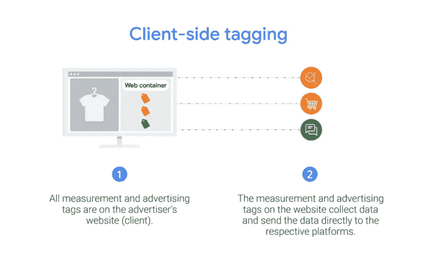
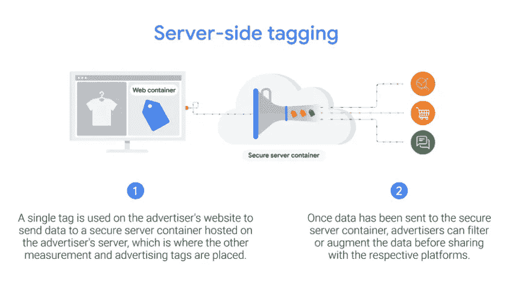
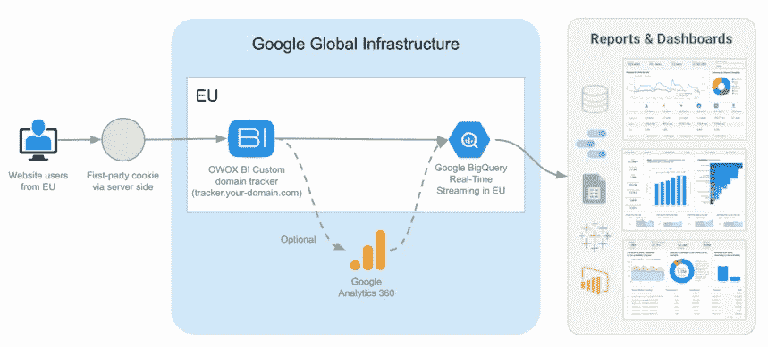

# 谷歌分析在欧洲:如何确保 GDPR 合规

> 原文：<https://medium.com/geekculture/google-analytics-in-europe-how-to-ensure-gdpr-compliance-db68ef191b9a?source=collection_archive---------13----------------------->

Source:[Depositphotos](https://ru.depositphotos.com/161347682/stock-photo-aerial-high-drone-flight-over.html)

## 谷歌分析被禁的情况仍然需要澄清。然而，不管结果如何，最好现在就保护您的业务，而不是等待将来更好的时机。

数据隐私游戏的规则已经发生了翻天覆地的变化，影响了欧洲企业准确评估其业绩和充分评估其营销努力的能力。随着禁令的出现，通常的工作方式不再可行，导致宝贵数据的丢失，这些数据将永远不会被取代。

数字分析的巨大变化始于一些欧洲国家禁止使用谷歌分析，终于欧盟和美国之间的新数据隐私框架。根据欧洲数据保护当局最近的决定，谷歌分析在几个国家被网站运营商视为非法。由于实施谷歌分析现在被视为违反 GDPR 第五章，欧洲企业一直面临着一场危机。

然而，在 2022 年 3 月，情况发生了变化，所以让我们尝试最终确定数据隐私出现了什么问题，以及欧洲企业可以做些什么来保护他们的营销分析。

# 谷歌分析在欧洲:这是怎么回事？

在过去的几年里，数据隐私和谷歌分析领域发生了许多事件。对于欧洲企业来说，收集和应用数据方面的这些变化意味着调整和高级营销分析黄金时代的结束。数据使用的限制和禁止使得不可能应用已建立的工作流程。我们已经收集并绘制了我们所拥有的所有信息，以了解所有这些变化是如何开始的以及我们现在处于什么位置。

2020 年，非营利组织 [NOYB](https://noyb.eu/) 向[提交了 101 起针对欧洲经济区(EEA)网站的投诉](https://noyb.eu/en/eu-us-transfers-complaint-overview)，这些网站应用了谷歌分析或脸书连接。在此之后， [EEA 数据保护当局](https://edpb.europa.eu/edpb_en)开始发布裁决，强制 EEA 网站运营商停止使用这些服务，理由是它们不符合通用数据保护条例( [GDPR](https://gdpr-info.eu/) )。

问题在于在欧洲应用谷歌分析的方法，因为它将收集的欧盟居民数据(用户行为数据)存储在一个美国的云服务上。关键点是——现在仍然是——谷歌采取的安全措施不足以阻止美国情报机构获取欧盟居民的个人数据。根据欧洲数据保护机构的说法，这些海外数据传输违反了 GDPR。

到目前为止，已经审理了两起案件。第一起是奥地利的[病例(2021 年 12 月)，接着是不到两个月后的](https://www.itm.nrw/wp-content/uploads/document-dsb.pdf)[法国病例](https://www.cnil.fr/en/use-google-analytics-and-data-transfers-united-states-cnil-orders-website-manageroperator-comply)(2022 年 2 月)。这些案例的总结是，欧盟居民的个人数据没有得到足够的保护，同时他们的个人数据被非法转移到美国的服务机构。例如，唯一的用户 ID 号、IP 地址和浏览器参数没有受到谷歌提供的标准保护条款的充分保护。

其他欧洲国家的类似案例可能会产生多米诺骨牌效应，抑制谷歌分析(以及类似服务)的使用。由于对这些侵犯数据隐私的投诉已经有了典型的回应和反应，有可能更多的欧洲当局将很快效仿，导致在欧洲完全禁止谷歌分析(和其他工具)。

然后，在 2022 年 3 月 25 日，经过一年多的谈判，美国和欧盟宣布就符合 GDPR 要求的从欧盟向美国转移个人数据的新法律框架达成“原则协议”。[跨大西洋数据隐私框架](https://ec.europa.eu/commission/presscorner/detail/en/FS_22_2100)解决了欧盟法院在 2020 年 7 月的 Schrems II 裁决中提出的问题，并保证了隐私和数据保护的最高标准。[谷歌期待第一时间在跨大西洋数据隐私框架下认证其流程](https://blog.google/outreach-initiatives/public-policy/trans-atlantic-data-privacy-framework-building-long-term/)。尽管如此，这仍然是一个“原则上的协议”，细节和时间还有待确认。

没有人能够预测未来，随着数字世界的快速变化，企业应该做好准备保护他们的数据处理工作流程。

# 出现了什么问题？

由于 NOYB 的投诉，许多欧洲经济区(EEA)的数据保护机构希望迫使 EEA 网站运营商完全停止使用谷歌分析。这些决策的受害者是欧洲企业，他们希望实施在线技术，以增加业务收入，提高整体业绩。

现在，这些企业处于弱势地位，因为他们在等待国际数据传输这个政治热点问题得到合理的解决。我们不要忘记，尽管存在数据传输问题，但数据隐私的其他危险风险也在全球范围内存在，如网络攻击和勒索软件。

目前，使用谷歌分析出现的问题如下:

*   无法遵守 GDPR 的网站如果继续将敏感用户数据转移到美国的服务，将支付高额罚款。
*   没有应用谷歌分析，营销人员担心他们将无法评估他们的营销业绩。
*   为了改变他们的营销分析解决方案，企业将在学习和实施新产品上投入大量资金。

让我们看看可以做些什么来解决这些问题，以及公司如何在未来避免更大的问题。

*注:NOYB 项目为公司提供了指导方针。特别是对于不确定美国监控法律或其美国合作伙伴受这些法律约束的较小欧盟公司，noyb.eu 网站上有* [*免费指南和模型请求*](https://noyb.eu/en/next-steps-eu-companies-faqs) *。*

# 保存营销分析的步骤

当然，这种情况对许多企业来说是不愉快的，并且违反了长期建立的工作流程。然而，没有理由绝望，因为这肯定不是世界末日，还有出路。

## 当你想继续你的谷歌分析工作时该怎么做

首先，我们应该首先提到 Google Analytics 可以通过两种方式实现。因此，它的实现方式会影响它对 GDPR 的遵从性。这两种方法是:

## 客户端模式

Source:[Google Marketing Platform](https://blog.google/products/marketingplatform/360/bring-performance-and-privacy-together-server-side-tagging/)

通常，网站应用*客户端模式*，这意味着在网站的页面上使用 JavaScript 代码，设置 cookies，生成客户端 id，并将获得的数据传输到 Google Analytics 以产生网站的统计数据。

让我们看看在客户端模式下使用 Google Analytics 时应该采取哪些步骤。为了确保符合 GDPR，需要检查技术和法律方面的问题。

1.  从适当的用户同意开始。您应该通知用户他们的数据(设备信息、跟踪 id、IP 地址等。)将不仅被收集，而且被转移到美国的服务。此外，应该指出，用户可以随时撤回其同意。
2.  实现 [IP 匿名化](https://support.google.com/analytics/answer/2763052?hl=en)。(对于 Google Analytics 4 属性，默认启用 IP 匿名化。)
3.  检查 Google Analytics 中的[数据共享选项](https://support.google.com/analytics/answer/1011397)和[信号选项](https://support.google.com/analytics/answer/7532985#zippy=%2Cin-this-article)是否被禁用。
4.  如果你使用专有的[用户标识](https://support.google.com/analytics/answer/3123662#zippy=%2Cin-this-article)，确保没有[用户标识](https://developers.google.com/analytics/solutions/crm-integration)的权限。

**重要！不要忘记检查法律事务。检查您签署的所有合同，因为 EMEA 地区的公司签署的所有合同都应该与谷歌爱尔兰有限公司而不是谷歌有限责任公司签订。然后，检查涵盖谷歌爱尔兰有限公司和谷歌有限责任公司之间的数据传输的 TIA。**

## 服务器端模式

Source:[Google Marketing Platform](https://blog.google/products/marketingplatform/360/bring-performance-and-privacy-together-server-side-tagging/)

第二个变体是实现一个*服务器端* *模式*。它更加谨慎，因为这种模式允许您将标签从网站上移除(包括广告和测量)，并将它们转移到安全的服务器容器中。此外，通过应用服务器端跟踪，用户的 IP 地址在信息与谷歌的报告工具共享之前会自动匿名。简而言之，这意味着用户和谷歌之间没有直接的交流。信息由出版商的服务器收集，然后转发给谷歌进行分析。

# 实施营销分析的更多方法(没有谷歌分析)

虽然许多企业可能会有这样的印象，没有谷歌分析就意味着没有分析，但这不是真的。实施高级营销分析还有其他方法，OWOX BI 团队为收集和存储数据提供了安全的解决方案。

**什么是 OWOX BI？**

[OWOX BI](https://www.owox.com/) 是一款营销分析解决方案，可自动将数据从孤立的来源交付到您的分析目的地，确保您的数据始终准确和最新。

使用 OWOX BI 处理数据的主要优势如下:

*   所有数据都存储在完全符合 GDPR 标准的 Google BigQuery 中。OWOX BI 的服务器端跟踪在您的个人域上提供安全的第一方数据收集。跟踪过程符合 Schrems II 和 GDPR。
*   熟悉的谷歌分析数据模式。您将获得众所周知的 Google Analytics 通用数据模式，用于点击和会话转换。使用您当前的 Google Analytics 设置，只需几分钟即可轻松设置跟踪。
*   高质量的数据收集。不受广告拦截器的影响，获得可解释质量的完整原始数据。近乎实时地收集 Google BigQuery EU 存储中的每次点击，无需采样。
*   有效的营销和数据分析。2023 年，由于第三方 cookie 的消亡和 cookie 生命周期的缩短，关于广告渠道有效性的很大一部分信息将不再可用。您可以通过 OWOX BI 服务器端跟踪将损失降至最低，收集第一方数据，并将其与存储中的营销数据合并。

使用 OWOX BI，您可以采取哪些步骤来保存您的营销分析？

由于大多数企业更愿意确保数据收集和存储都在欧盟地区进行， [OWOX BI](https://www.owox.com/) 避免使用谷歌分析。具体来说，OWOX BI 数据流如下所示:

1.  以经典的谷歌分析格式从网站上收集数据。因为这种数据格式很熟悉，所以可以重用数千个现有的 SQL 查询。
2.  将原始数据实时收集到 Google BigQuery 存储中。获得的数据属于您，并存储在您选择的欧盟区域。

Image by Author

总而言之，OWOX BI 允许每个营销人员和分析师继续他们的工作，并应用令公司法律部门满意的分析解决方案:

*   在处理敏感数据时，确保遵守 GDPR。
*   避免在重新处理数据或学习和采用新技术方面浪费时间和资源。
*   保持你的网站现有的标记，因为实施时间和价值实现时间真的很短。

# 关键要点

谷歌分析被禁止的情况和即将到来的跨大西洋数据隐私框架仍然需要澄清。然而，不管结果如何，最好现在就保护您的业务，而不是等待将来更好的时机。你可以采取一些明显的措施来降低风险，从做好法律准备和确保用户同意，到远离美国所有的服务提供商。

OWOX BI 服务器端跟踪提供安全的第一方数据收集，符合 Schrems II 和 GDPR。最重要的是能够最大限度地减少因第三方 cookie 的消亡和 cookie 生命周期的缩短而造成的损失。