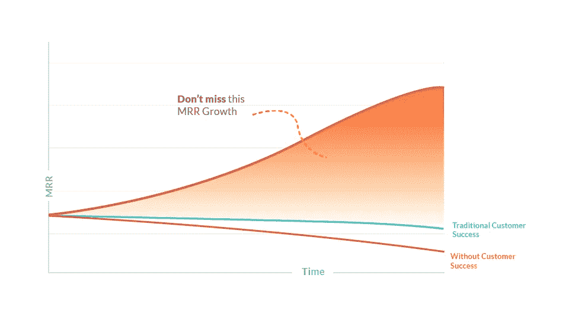
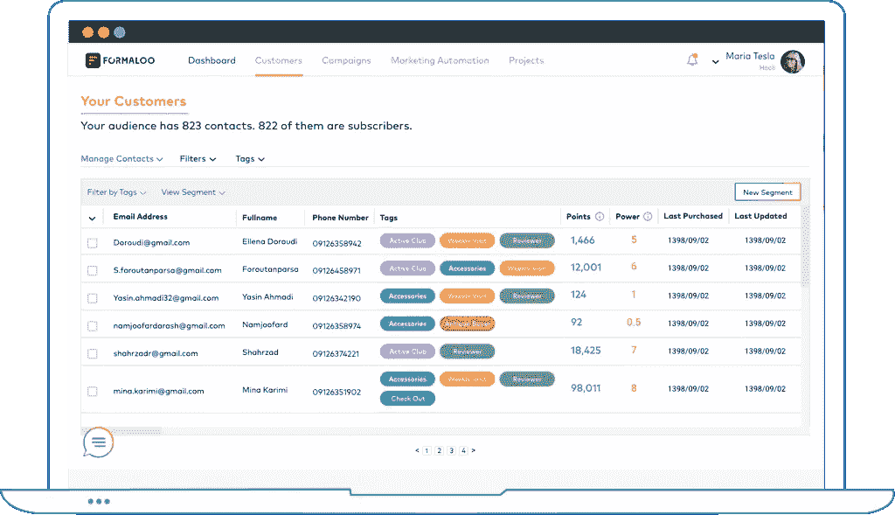

# 谷歌分析与客户分析

> 原文：<https://medium.com/geekculture/google-analytics-vs-customer-analytics-b47f84cdb794?source=collection_archive---------9----------------------->

如果有一件事是我和我所有的同事都同意的，那就是分析他们的客户的企业每次都会赢，而那些“太忙”以至于不能理解他们的客户的企业会落后。

对于在线企业来说尤其如此，比如电子商务企业 SaaS 创业公司，流失和转向竞争对手的成本几乎为零。所以如果你不分析你的客户，他们会的，相信我，迟早他们会得到你的客户。

说实话，我觉得挺公平民主的。花时间和精力去了解他们的客户和需求的企业应该繁荣发展。在过去的 10 年里，我直接或间接地与 1000 多家在线企业合作，每一次，最好的企业都把他们的客户放在首位。因此，他们比竞争对手增长得更快，拥有更大的市场份额，每月经常性收入(MRR)也比竞争对手高得多。

> “全面使用客户分析的公司报告说，在**利润方面超过竞争对手的情况几乎是不使用客户分析的公司的两倍。**
> 
> 据[麦肯锡](http://www.mckinsey.com/business-functions/marketing-and-sales/our-insights/why-customer-analytics-matter)

# “谷歌分析”的陷阱

大多数在线企业使用谷歌分析，他们应该这样做，但他们认为这就足够了。记住，谷歌分析追踪的是你的**“访客和会话”，而不是你的“客户和行为”。**

因此，虽然你应该使用 GA 来改善你的业务和分析你的网站，但请不要将其与产品分析或客户分析相混淆。大多数企业陷入了这样的结果，他们认为他们做得足够了，但几乎总是，那些只使用 GA 的企业，甚至没有使用哪怕是一点点正确的方法。

为了分析你的客户，你需要行为分析，而这是谷歌分析无法提供的。除了 GA 之外，您还需要强大的客户分析软件。

好消息是，答案既不复杂也不昂贵。您不必花费大量的金钱或时间来为您的业务添加客户分析。出色的客户分析是如此自动化和直观，以至于你甚至不需要数据专家来操作它们。

MRR growth after using Customer Analytics in 6 months, Source: Formaloo.com

# 你只有一种方法可以领先于你的竞争对手:分析你的客户

每个企业在分析他们的客户时都有两个主要目标，首先是**提高他们的交谈率**，其次是增加客户保持率**减少客户流失**。

以下是客户分析的 5 大要素:

# 1.行为跟踪和客户洞察:

当你的观众和顾客使用你的产品时，他们会做出各种行为。行为跟踪跟踪你的每一个客户的所有这些行为，并把它们分析成不同的“模式”。

当这些模式通过数据挖掘和机器学习的力量相互比较时，它们会创建更复杂的模式，这些模式不仅可以单独分析每个客户，还可以分析业务，甚至预测每个客户群体的未来需求。

客户洞察是每个客户档案的分析版本。借助客户洞察和分析，您可以增强并可视化您的客户、数据和社区。一言以蔽之，你会看到你的企业需要什么，你的客户需要什么，即使他们没有告诉你。

# 2.自动、智能分段:

基于行为跟踪的模式，客户分析将识别不同的客户群。从“每月活跃用户”这样明显的细分到更复杂的细分，如“弗吉尼亚前 10 名客户”或“将在 3 周内离开的不开心的客户”。

它汇总了所有客户数据，并通过行为和得分(参见#4，健康得分)提供智能和自动的细分。它帮助您确定正确的 KPI 及其趋势，甚至预测每个客户群的未来需求。

# 3.客户数据平台(CDP):

客户分析使用 CDP 来收集、统一和分析来自不同数据源的所有客户数据。借助 CDP，您客户的所有数据都将得到分析，而不仅仅是数据的一部分。

例如，你的企业使用 CRM、服务台软件、支付系统(如 Stripe 或 Paypal)甚至电子商务平台(如 Shopify 或 WooCommerce)进行在线销售。将所有这些集成到您的客户分析软件中是一项繁重的工作，但有了 CDP，这将自动完成，没有任何麻烦。

一些 CDP 的另一个重要特性是，它们甚至可以帮助您从客户那里收集数据。当您没有足够的客户数据来分析他们时，这是一个很好的特性。

总之，CDP 帮助你将访问者转化为顾客，将顾客转化为忠诚的顾客。

# 4.客户健康评分:

健康评分就像信用评分一样，只是对你的客户而言。它显示了客户对你的业务有多满意，他们再次订购的可能性有多大，他们流失的可能性有多大，他们需要什么，什么时候，等等。

这些分数是根据每个顾客将要做的每个动作和他们的模式计算出来的。这些模式将决定每一个行动意味着什么，以及下一步是什么。这些分数有助于您了解您的客户、他们的细分以及他们的未来需求。

# 5.后续行动:流失、追加销售和推荐提醒

客户分析和客户数据平台只需将您的数据转化为清晰的行动。它们使您能够通过预测分数跟踪您的客户和受众，提前识别客户流失风险、下一步需求、下一步建议行动甚至追加销售机会。

客户分析有助于您提高客户的健康得分，并在适当的时候让您的客户采取最佳的后续行动。

# 结论

客户分析帮助企业将大问题分解成可管理的答案。当公司需要观察他们的客户的行为时，无论是作为个人还是在不同的群体中，客户分析都会解码他们的行为，以便他们更容易理解。这有助于公司在定价、促销和管理方面做出更好的决策。

当你**投资于你的现有客户**时，你的客户会变得忠诚，会成为你的大使，他们会给你带来*新客户*，而这只是你通常的客户获取成本(CAC)的一小部分。

提高客户成功率和客户忠诚度，让现有客户一次又一次回来订购的方法是分析他们和他们的需求。这样你可以个性化你的业务，你的产品，和你的方法。

所以今天就开始使用客户分析吧。它们是全自动的，易于理解，并且对于不同的业务是灵活的。借助客户分析和 CDP，您可以通过分析来自您的**【现有客户】**的所有数据，了解您的业务现状以及增长途径。

总之，它为这些问题提供了非常直接的答案，而 Google Analytics 不会为您提供这些答案:

> 谁是我最好的客户？
> 
> 作为客户，我会失去谁？谁要走了？
> 
> *如何阻止我的客户离开我去找我们的竞争对手？如何永远不失去另一个客户？*
> 
> *如何提高客户忠诚度&参与度？*
> 
> *如何从每一个顾客身上获得更多的利润？*

《卓越客户分析》为这些问题提供了一个简单的答案，并为你提供了**下一步行动:**作为一家企业，你应该如何发展的建议。

> 嗨！我是 Farokh Shahabi， [Formaloo](http://formaloo.com/) 的联合创始人兼首席执行官。在过去的 10 年里，我一直在与许多在线企业合作，尤其是帮助他们成长的初创企业。我会在我的故事里分享我的经历。我很想听到你的反馈和你的经验。如果你想联系我或问我任何问题， [**这里是我的 LinkedIn**](https://www.linkedin.com/in/farokhshahabi/) ，我会很高兴收到你的来信:)