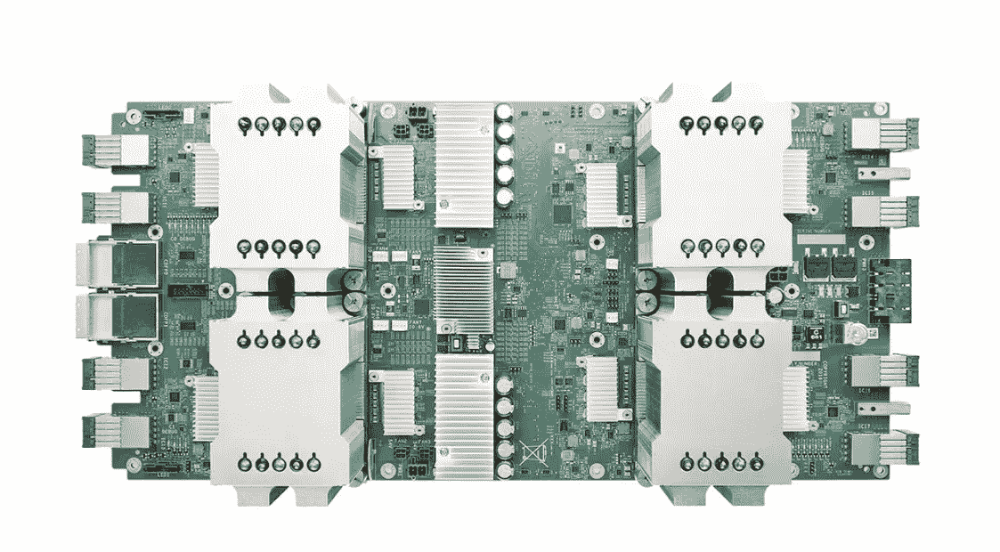
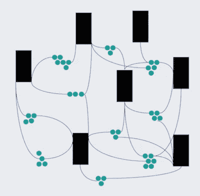
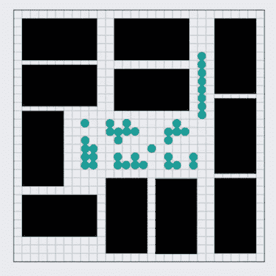
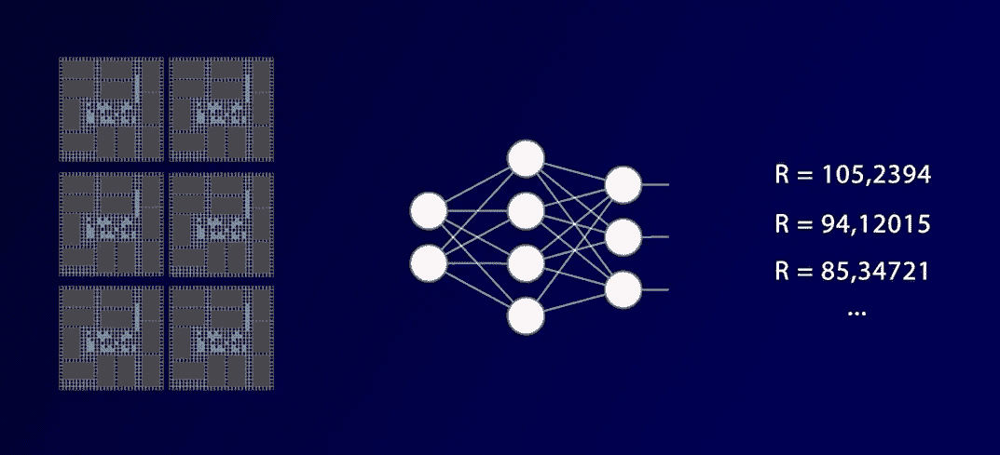
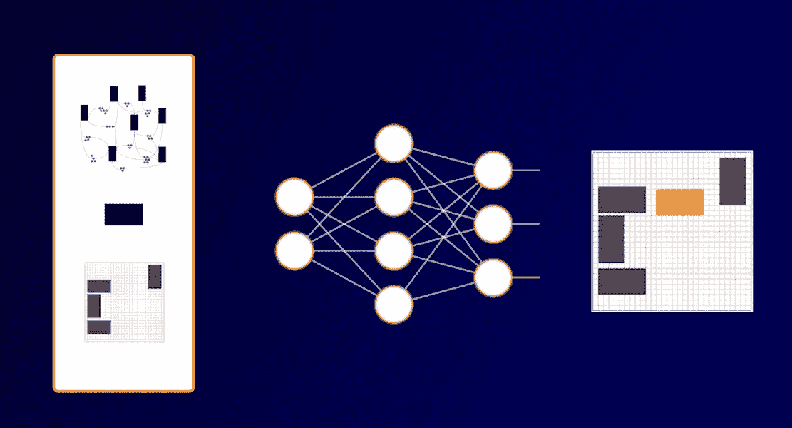
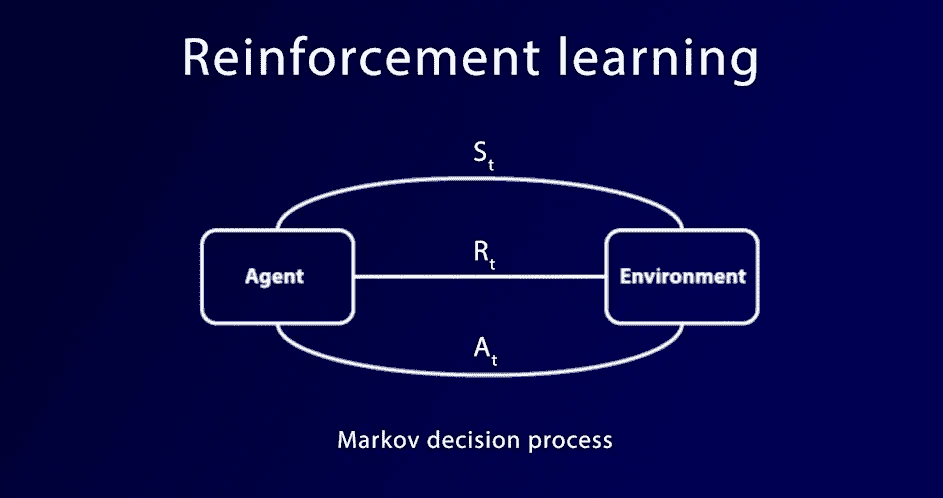
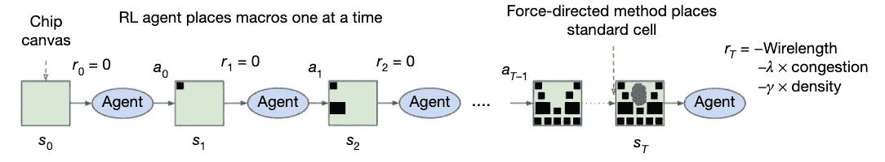
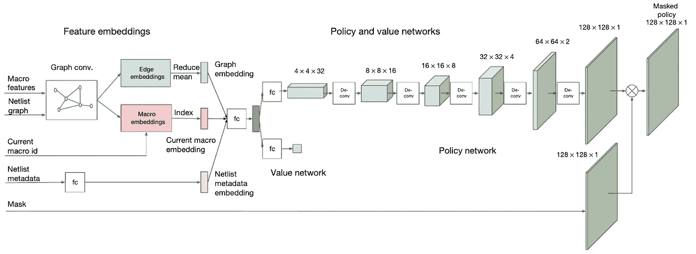

# 第一个使用人工智能设计的处理器。

> 原文：<https://medium.com/geekculture/google-brain-creates-the-first-processor-designed-using-artificial-intelligence-e3d80cd2c5f8?source=collection_archive---------10----------------------->

Tensor Processing Unit (TPU-v1)

摩尔定律即将终结。至少，很大一部分硬件设计师是这么认为的。然而，科学和工程面临的巨大挑战需要更强大的处理器。为了满足这些需求，谷歌或英伟达等科技巨头正转向开发专用集成电路。与普通处理器不同，这些芯片只能执行较少的运算，但速度无与伦比。

然而，设计这些芯片非常复杂，需要几个团队合作，几个月来反复设计。为此，谷歌大脑的一个团队已经探索了人工智能技术在第五代人工智能处理器(TPU-v5)设计中的应用。使用强化学习技术，**他们已经将一个设计阶段的持续时间从几个月缩短到仅仅 6 个小时**。

# 芯片设计流程(简化):

芯片设计要经历几个阶段。首先，从涉众那里获得芯片必须满足的规范。然后，根据这些需求，一个**逻辑设计**被创建，抽象地详细描述了芯片的功能。之后，我们必须验证设计是否正常工作。随后，从这个逻辑设计中，**物理设计**被创建，具有将集成芯片的组件。

这个**物理设计**过程也要经历几个阶段。首先，芯片的**逻辑设计**必须翻译成**网表**。网表是对电路元件及其与其它元件的连接的描述。

然后，被称为**宏块**的大块必须被放置在芯片的画布上，从而生成**布局图**。之后，剩余的标准单元被放置在芯片上宏块留下的空间中。

可以想象，有大量可能的方式来放置组件(大约。10 个⁵⁰⁰可能的位置)，显然，有些比其他人更好。正是这个非常复杂的问题，谷歌大脑的研究人员利用强化学习技术在短短 6 个小时内成功解决了。

# 宏块布局

这一设计阶段的目标是找到一种方法来放置元件，使其布线的**长度**和**拥挤**以及放置的**密度**最小化。为此，我们可以定义以下目标指标来实现最大化:

为了便于解决这个复杂的问题，研究人员将其分为两部分:

## 第 1 部分:监督学习。

首先，他们使用**监督学习**，专注于识别零件的**放置**和**目标度量**之间存在的**关系**。

为了做到这一点，他们选择了一组不同的位置，他们已经知道它们相应的价值，并训练了一个神经网络来估计它。

网络接收关于芯片(网表)和部件布局的信息，并产生估计。通过将这些估计值与实际值进行比较，神经网络调整其连接，以做出越来越好的估计。一旦经过训练，它就能够估计出以前从未见过的芯片的这些值。

由于网表是一个图(其顶点是组件，其边是它们的连接)，研究人员开发了一个能够处理这些数据结构的神经网络，他们将其命名为 **Edge-GCN(边图卷积网络)**。这个神经网络存储网表的顶点和边的内部表示，基于它生成其目标值的估计。

## 第 2 部分:强化学习

接下来，他们关注问题的第二部分。在其中，一个新的神经网络将把网表、要放置的部件和关于芯片状态的信息作为输入，并且它将产生该部件的布局作为输出。

这个任务可以被视为一个强化学习问题，其中一个代理(神经网络)观察任务*(网表和芯片)的状态，并基于它在 (放置棋子)采取一个动作 ***，该动作产生一定的奖励 ***Rt*** 。****

**

*这样，神经网络就会把所有的棋子一个一个地摆放好。当它完成时，它将收到我们上面看到的目标值作为奖励，这是基于布线的长度、拥挤度和密度。*

**

## *神经网络体系结构*

**

*先前的神经网络(*图 conv。【图中 将附加一个新的。由于这一点，新的网络将不必从头开始学习放置零件，而是将使用在上一步中学习的表示来探索最有希望的零件放置。**

## *演员-评论家方法*

*新的神经网络有两个部分(*价值网络*和*策略网络*)，因为它基于演员-评论家家族的算法进行学习(特别是*近似策略优化*)。这些算法同时学习做出决定和评估它们的质量，使用这种评估作为寻找最佳行动的指南。*

**政策网络*将选择**在哪里放置棋子**，而*价值网络*将**评估所采取行动的质量**。代理每次执行一个动作，我们都会将该动作获得的结果与*价值网络*做出的评估进行比较。如果结果好于预期，*策略网络*将更频繁地执行动作。否则，它将很少执行它。*

*这种反复试验的循环进行了数百万次，直到通过实验和观察结果，演员学会了将棋子放置在正确的位置。*

*结果是:一个神经网络能够在 6 小时内放置芯片的各个部分，而一组熟练的工程师需要几周或几个月。*

## *本文视频*