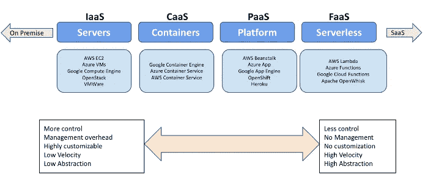
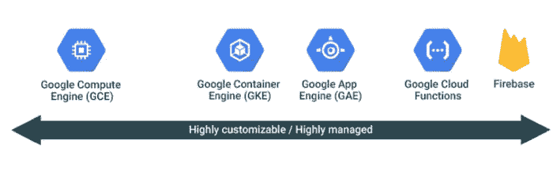
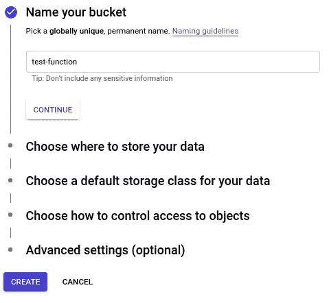
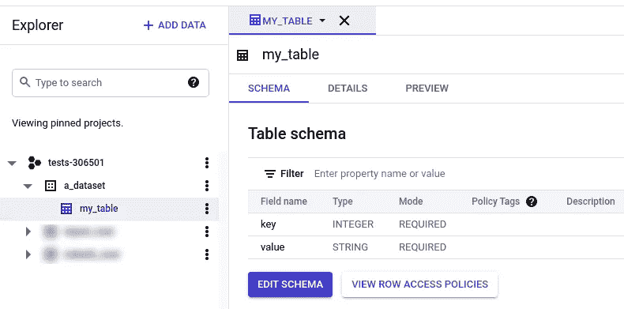
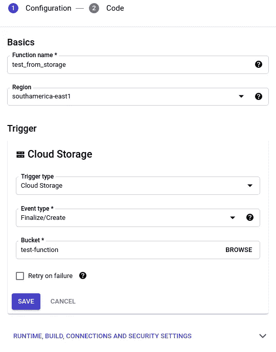
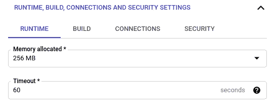
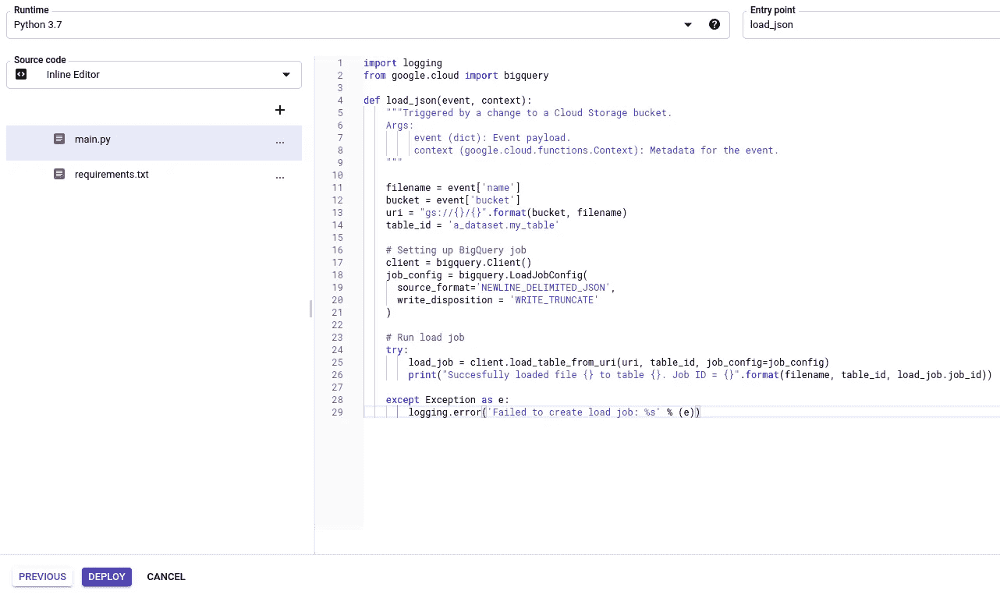
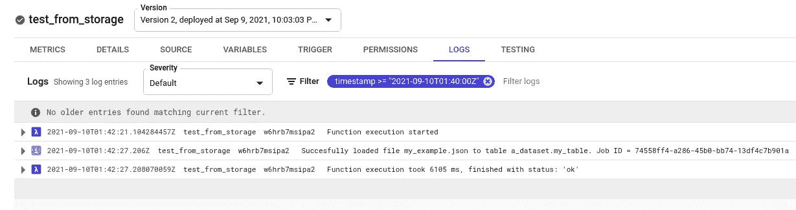

# 谷歌云功能——简要教程

> 原文：<https://medium.com/geekculture/google-cloud-functions-a-brief-tutorial-de07d8945b01?source=collection_archive---------10----------------------->

用云函数提取从云存储加载到 BigQuery 的数据

> *这篇文章的葡文版可以在这里阅读**。*

在许多情况下，我们需要存储数据以备将来使用。借助谷歌云平台，我们可以使用[谷歌云存储](https://cloud.google.com/storage/docs) (GCS)作为数据湖来存储和加载数据到 [BigQuery](https://cloud.google.com/bigquery/docs/introduction) ，这是一个用于构建数据仓库的强大分析数据库，允许我们存储海量数据并进行快速 SQL 查询，而无需管理其基础设施。将数据从 GCS 自动导入 BigQuery 的一种方法是使用云函数作为下面描述的 [ETL](https://en.wikipedia.org/wiki/Extract,_transform,_load) 过程的中间人:


本文的想法是通过在 GCP 内部构建一个数据管道来介绍 Google Cloud 函数，在这个管道中，文件被上传到 GCS 中的一个桶中，然后由一个 Cloud 函数读取和处理，这个 Cloud 函数会将这些数据加载到一个 BigQuery 表中。

## 但是谷歌云功能到底是什么呢？

为了理解云计算的功能，我们首先需要知道不同的计算服务是什么。



上图显示了不同可用服务的范围，包括:基础设施即服务(IaaS)、容器即服务(CaaS)、平台即服务(PaaS)和功能即服务(FaaS)。请注意，尽管左侧的服务为 it 配置提供了更高级别的控制，但它们需要专业团队来维护 it 基础架构。在右边，尽管他们不提供太多的控制，但他们有更高的抽象级别，it 的维护由服务提供商完成。

云函数就像 FaaS 一样在右边的光谱上。通常，这些服务执行开发人员编写的一段代码，作为对预定义事件的响应，具有时间执行限制，其可伸缩性由提供者管理。这种服务的体系结构被称为无服务器体系结构，其中定价是根据函数被调用的次数以及所使用的内存和 CPU 的数量来计算的。这种服务非常活跃，因为只需很少的努力，该功能就可以启动并运行，而不用担心管理服务器。

下图显示了谷歌云平台提供的不同种类的计算服务，包括 IaaS 和 FaaS。



总之，谷歌云功能是 FaaS，在一个无服务器的执行环境中，代码在一个完全受管理的环境中运行，其中单一目的的功能由 GCP 的其他服务发出的预定义事件编写和触发。它的支付模型是基于总的函数调用和使用的计算资源。

## 设置云功能

这个函数背后的思想是在将一个 *json* 文件存储在云存储桶中的时候立即处理它，并将它的内容加载到 BigQuery。

下面我们定义了存储文件的桶 *test_function*



现在我们将定义一个 BigQuery 表，数据将被加载到这个表中。我们称之为 *my_table* ，包含以下几列:



要设置云功能，我们必须转到云功能仪表盘，点击*创建功能*:


然后，我们将填充我们的功能配置。



首先，我们需要填写函数的名称和区域。

在*触发器*部分，我们将选择*云存储*选项。对于事件类型，我们将选择*完成/创建。*最后，我们将指定云存储中的*存储桶*，在该存储桶上创建的每个文件都将触发该函数。

在*运行时，构建、连接和安全设置*可以配置其他设置。在*高级*中有两个强制配置:内存量和超时限制。

这些配置的默认设置是 256MB 内存和 60 秒的超时时间，但是可以分配高达 8GB 的内存和 540 秒(9 分钟)的超时时间。



完成所有设置后，我们可以进入代码选项卡。有很多语言选项和方法来设置我们的代码。我们将选择 Python 3.7，并使用 Google 自己的编辑器来编写代码。

还需要指定函数的*入口点*，这意味着我们需要定义在代码执行时将读取什么方法。也可以在 *requirements.txt* 文件中指定使用哪些 Python 包。



Cloud Function Editor

下面是为此函数编写的代码:

需要注意的是，BigQuery 只接受名为 *NDjson* 的特定 json 文件格式，这是一个每行都有一个 JSON 对象的 JSON 文件，如下例所示:

```
{"key": 1, "value": "my_value"}{"key": 2, "value": "another value"}{"key": 3, "value": "this is NDJSON"}
```

一切就绪后，我们可以点击*部署*，看看神奇的事情发生了=)

## 运行云功能

现在我们终于可以使用我们的功能了！所有的功能日志都记录在 GCP 的*测井*工具中。每个功能还有一个*日志*标签。

为了运行我们的函数，我们将上传一个 *NDJSON* 文件到 GCS 中的*测试函数*桶。函数日志将在它执行后立即可用。



Function logs after uploading the *my_example.json file to GCS*

现在我们可以在 BigQuery 中查询数据了！


## 结束语

Google Cloud Funtions 是一个很好的工具，可以轻松完成 ETL 工作，因为它在部署单一目的的面向事件的功能(如发布/订阅和云存储，以及 HTTP 调用)方面具有通用性和灵活性。

考虑它的局限性仍然很重要。9 分钟的执行时间可能会使要求更高的作业变得不可行，从而限制了 it 对要求较低的工作负载(如微批处理)的使用。

# 参考

> [*使用云函数将数据从云存储流式传输到 big query*](https://cloud.google.com/architecture/streaming-data-from-cloud-storage-into-bigquery-using-cloud-functions)[*云函数文档*](https://cloud.google.com/functions/docs)