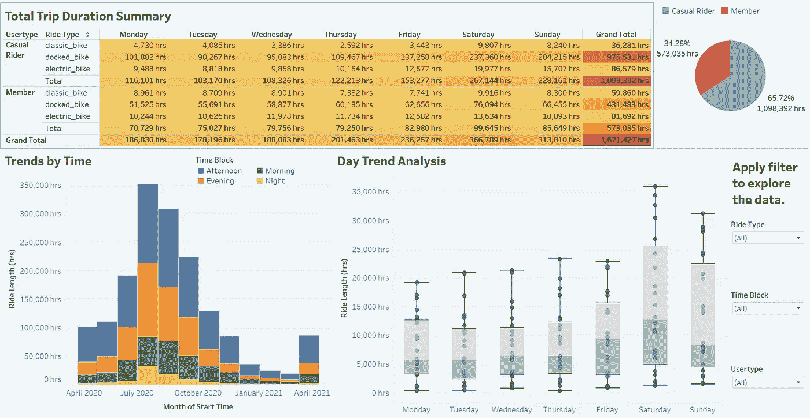
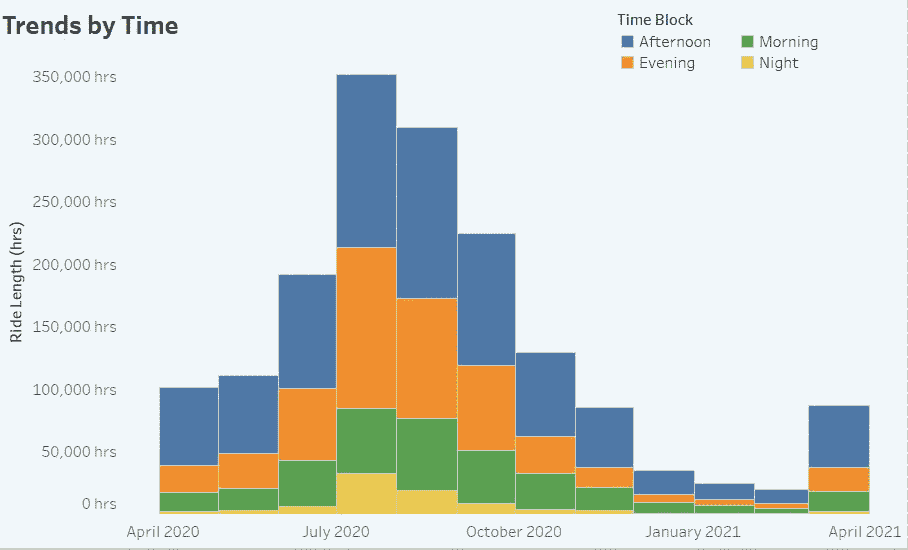
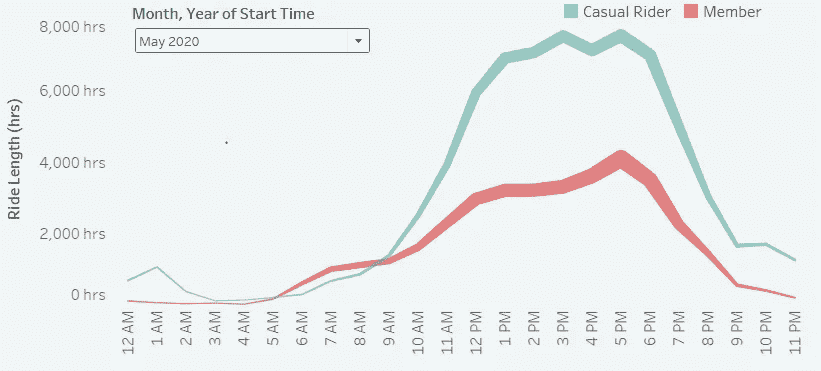
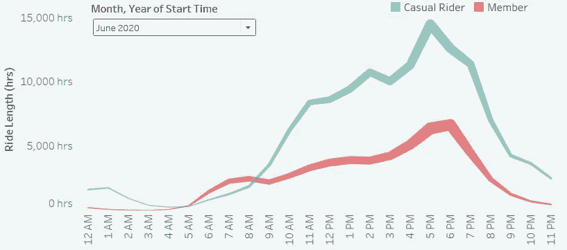
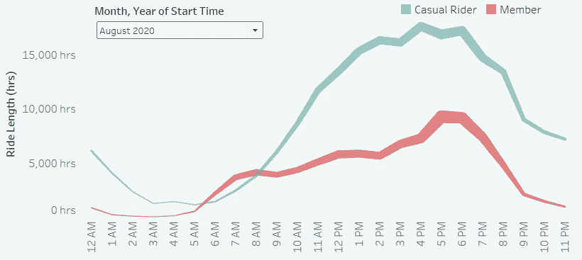
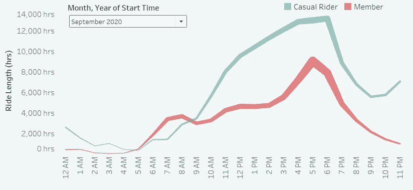
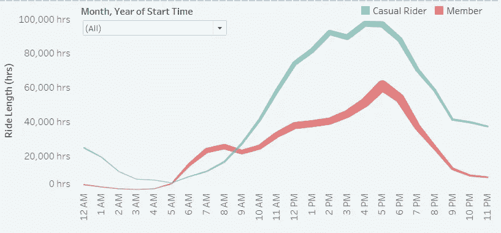
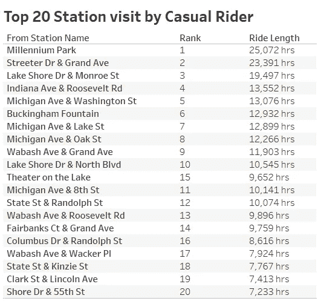
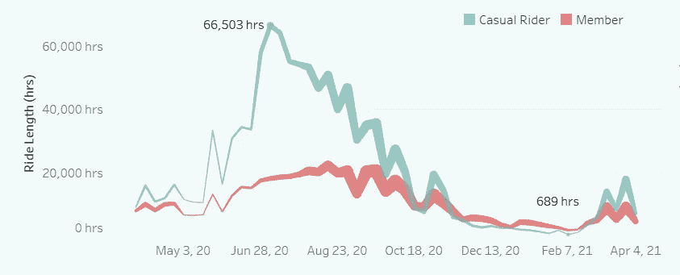

# 谷歌数据分析顶点项目:自行车共享周期分析

> 原文：<https://medium.com/geekculture/google-data-analytics-capstone-project-cyclistic-bike-share-analysis-6c42340b3f10?source=collection_archive---------3----------------------->

# 关于公司

2016 年，Cyclistic 成功推出了自行车共享产品。从那时起，该计划已经发展到由 5824 辆自行车组成的车队，这些自行车被地理跟踪并锁定到遍布芝加哥的 692 个站点的网络中。自行车可以从一个站点解锁，并随时返回到系统中的任何其他站点。

到目前为止，Cyclistic 的营销策略依赖于建立普遍意识和吸引广泛的消费者群体。有助于实现这些目标的一个方法是其灵活的定价方案:单程通行证、全天通行证和年度会员资格。购买单程票或全天票的顾客被称为临时乘客。购买年度会员资格的顾客是周期性会员。

Cyclistic 的财务分析师得出结论，年度会员比临时会员更有利可图。虽然价格的灵活性有助于 Cyclistic 吸引更多的客户，但 Moreno 认为，最大限度地增加年度会员的数量将是未来增长的关键。莫雷诺认为，这是一个将休闲骑手转化为会员的好机会，而不是创造一个针对全新客户的营销活动。她指出，休闲骑手已经意识到 cyclic istic 计划，并选择 cyclic istic 来满足他们的移动需求。

莫雷诺设定了一个明确的目标:设计营销策略，旨在将临时骑手转化为年度会员。然而，为了做到这一点，营销分析师团队需要更好地了解年度会员和休闲骑手的区别，为什么休闲骑手会购买会员资格，以及数字媒体会如何影响他们的营销策略。莫雷诺和她的团队对分析周期性的历史自行车旅行数据感兴趣，以确定趋势。

# 方案

你是一名初级数据分析师，在芝加哥自行车共享公司 Cyclistic 的营销分析师团队工作。营销总监认为公司未来的成功取决于年度会员数量的最大化。因此，您的团队希望了解临时骑手和年度会员使用自行车的不同之处。根据这些见解，你的团队将设计一个新的营销策略，将临时骑手转化为年度会员。但首先，周期性高管必须批准你的建议，所以他们必须有令人信服的数据洞察力和专业的数据可视化支持。

莫雷诺给你布置了第一个要回答的问题:年度会员和休闲骑手使用自行车有何不同？

# 商业任务

分析骑手对营销会员转化计划的使用模式。

**工具:** R 用于数据清洗，Tableau 用于数据可视化。

**数据集:** [Cyclistic 从 2020 年 4 月到 2021 年 4 月的历史行程数据](https://divvy-tripdata.s3.amazonaws.com/index.html)

我使用 R 将所有数据合并到一个工作表中，删除未使用的列，并将其导出到一个 CSV 文件中。

关于 R 代码，请参考 [Github](https://github.com/HockChong/Google-Data-Analytics-Capstone-Project-Cyclistic-bike-share-analysis/blob/main/Data%20Cleaning%20Process%20-%20R.pdf) 。

我从[数据中发现的](https://divvy-tripdata.s3.amazonaws.com/index.html):

1.  临时乘客的总出行时长是会员总出行时长的 1.91 倍。
2.  总出行时长在周末最高，并在 2020 年 8 月达到峰值。
3.  旅行时长从春季到夏季逐渐增加，在 7 月 20 日达到高峰，之后急剧下降。

从下面的图表可以看出，从 2020 年 4 月到 2020 年 7 月，下午和晚上时段的总出行时长显著增加。

**注:**总行程增加，线条粗细增加。

# **总结:**

临时骑手和年度会员的总旅行时间受季节影响。冬季气温很低，很少有人愿意出门，需要每天出行工作的人会选择乘坐其他公共交通工具，这导致总出行时间在其他季节中是最低的。

这些年来，我们看到两组用户从 5 月到 9 月的总旅行时长有显著差异。由于他们的偏好，这显示了他们的使用模式，当我们查看一天中每个小时的总出行时长时，这一点更加明显。

年度会员显示两个高峰时段，即早上 7 点和下午 5 点，这表明他们很可能是办公室工作人员。休闲骑手高峰期是下午 4 点和 5 点。休闲骑手访问的前 20 个车站大多是旅游景点，休闲骑手最有可能是夫妇、学生、退休人员、游客或家人。

根据临时骑手的每月总旅行时长，推出新营销活动的最佳时机是在 4 月至 5 月之间。此外，考虑不同的价格策略，如季节性通行证，以提高转化率。

最好是营销团队能够开展一项调查，从当前的临时骑手那里收集数据，了解他们在考虑订阅年度会员时寻求什么样的功能或好处。

对于交互式 Tableau 仪表板，请单击此处的[。](https://public.tableau.com/app/profile/hockchong/viz/GoogleDataAnalyticsCapstoneProjectCyclisticbike-shareanalysis/Cyclisticbike-shareanalysis)