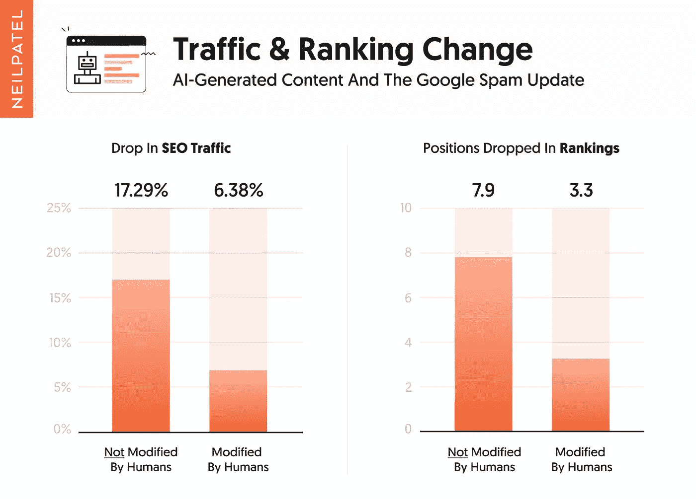
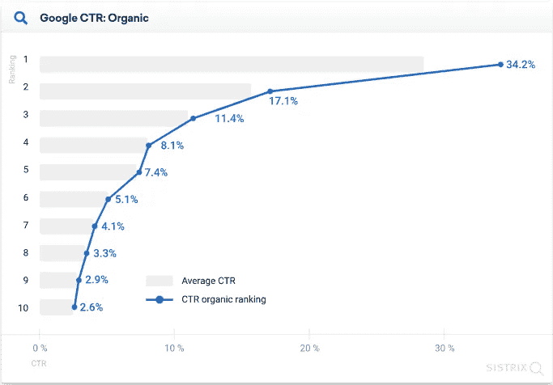
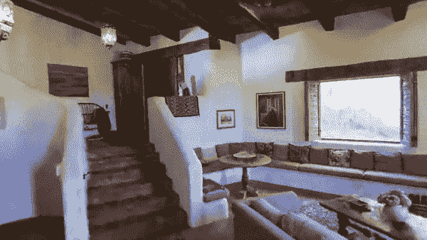
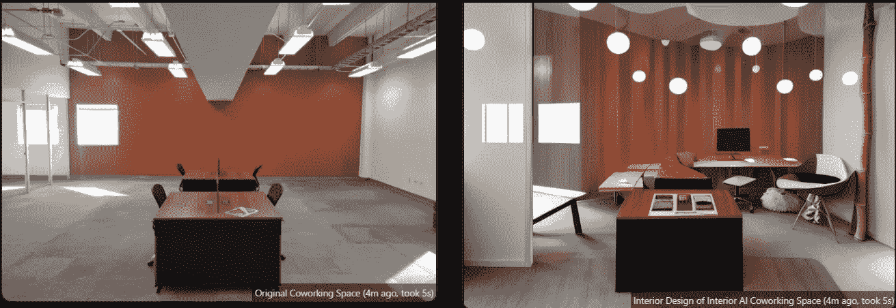

# 谷歌破坏人工智能生成的内容排名

> 原文：<https://medium.com/geekculture/google-destroys-ai-generated-content-rankings-59589da095ab?source=collection_archive---------0----------------------->

## **补充:人工智能是如何让室内设计师出局的**

W 欢迎来到**风口浪尖**:用简单的英语解释前沿的人工智能新闻(及其含义)。

在本周的杂志中:

*   **结果在**:谷歌官方*销毁* AI 生成的内容。但是多少呢——使用它是否仍然有利可图？
*   新的人工智能开发将在短短几年内摧毁室内设计行业。
*   你是 3D 的吗？由于这种人工智能，像 Quixel 这样的公司将面临重大冲击。

让我们开始吧。

# 1.谷歌对人工智能生成的内容进行了至少 20%的惩罚，可能更多

去年，像 GPT-3 这样的大型语言模型因其生成怪异的人类文本的能力而成为头条新闻。自然地，联盟营销者和内容作者(包括我自己)很快尝试和游戏系统。

但事实证明，谷歌进行了反击。

热门网络营销博主尼尔·帕特尔(Neil Patel)刚刚宣布了对谷歌人工智能写作新立场的首次真正测试。并且结果是确定的: **AI 生成的内容*破坏*你的搜索流量。**

尼尔找到了 50 个网站，并把它们分成两组。一组是人工智能生成的——另一组，他让人类编写、编辑或混合使用这两种方法。

然后，他等待谷歌对它们进行索引。结果呢？纯人工智能生成的内容立刻被罚 20%——这只是平均水平。在某些情况下，罚款高达 60%。

你们很多人会想:20%……就这样？为什么这是一件大事？

因为你在谷歌搜索中的排名越高，收益就越大，而且不对称。越接近顶端，流量就呈指数级增长。

如果你在第一名，你会得到第二名的两倍。如果你是第二名，你会比第八名多六倍的点击量。

因此，仅仅因为使用人工智能而被降 20%几乎总是足以让你下降至少几个位置——这意味着你损失了 75%或更多的流量。

不过，还是有一线希望的。由人工智能生成，但由人类修改的内容平均只下降了 6%。

由于人工智能写作通常会提供 4-5 倍的加速，这可能仍然是一项非常值得的投资——特别是对于低竞争的关键词。

## 我们如何利用这一点呢？

运营一个网站，想排名更好？

*   不要试图自动生成内容——那是一场竞争。
*   相反，用人工智能增强你现有的有能力的作家，比如 GPT-3 或 T2 侏罗纪-1。
*   确保他们编辑结果的清晰度、风格和语气。

一美元换一美元，你将增加大约 400%的产量，而损失的*等级潜力仅为* 6%。如果你的目标是没有太多竞争的长尾关键词，这足以抵消减少的数量*加上*在数量上给你一个大的帮助。

# 2.多亏了人工智能，3D 室内设计师将很快被淘汰

NeRF(神经辐射场)刚刚得到了一个大升级。

上面的剪辑是由几十张室内照片组成的。NeRF 无缝地将这些照片编织在一起，并在风格转移的帮助下，让您立即改变颜色、心情和家具。

有问题的库( [NeRF Studio](https://docs.nerf.studio/) )仍在开发中，但很明显，它有可能颠覆价值[41 亿美元的室内设计软件行业](https://www.imarcgroup.com/interior-design-software-market#:~:text=Market%20Overview%3A,US%24%204.17%20Billion%20in%202021.)。

这不仅仅是因为 NeRF 是免费的:它也比传统的设计方法快了几个数量级。

在过去，你必须为一个空间拍摄几十张照片，创建一个详细的平面图，然后向某人支付数百(或数千)美元购买实体模型。

最近，像 Matterport 这样的解决方案越来越流行；他们使用 3D 扫描快速创建一个空间模型。但 Matterport 的质量是出了名的糟糕，成像过程缓慢且不直观。

另一方面，NeRF 只需要几分钟。

没过多久，3D 室内设计行业的每个人都会做出改变——当他们这样做的时候，市场就会陷入巨大的混乱。

## 即时渲染服务

除了 3D 室内设计，**即时渲染服务**是另一种人工智能驱动的方法，正在迅速流行起来。

[**Interior AI**](https://interiorai.com/) 是一款免费的设计原型应用程序，它可以拍摄你房间的图像，然后使用稳定的扩散来叠加新的图像，包括家具和其他物体，向你展示你的空间会是什么样子。

上面的例子虽然不是难以置信的*，*已经服务于一个利基市场。鉴于图像生成人工智能的增长速度——我的意思是，我们在短短 6 年内从模糊的 16×16 的奶牛到完全真实的 T2 人脸——类似的服务很快就会在各个层面上超越人类设计师。

## 我们如何利用这一点呢？

在设计方面？桌子上有一大堆快钱。

*   了解 NeRF 是如何工作的，并开始在您的工作流程中实现它
*   除了提高输出，创造信息产品(课程，电子书等)教其他设计师做同样的事情

或者:建筑还是房地产？你会变得更有效率。

*   使用 NeRF 快速创建属性的 3D 模型
*   利用即时渲染人工智能自动完成构思过程
*   生成空间*可能*的样子的模型，然后发送给设计师进行修饰

你不需要*成为你所在行业遭受重大破坏的受害者。提前计划，对你的工作流程做一些改变，然后获利。*

# 3.人工智能纹理生成将很快让像 Quixel 这样的公司物有所值

说到 3D: [AI 纹理生成](https://app.runwayml.com/ai-tools/text-to-texture)在过去几年里取得了巨大的飞跃。这将会给像 Quixel 这样创造和销售 3D 纹理的公司带来竞争。

对于那些不了解的人，Quixel 创建了用于视频游戏、电影和其他 CGI 的 3D 纹理。

但这些纹理需要大量的时间和金钱来创建——摄影师必须前往偏远地区放大现实世界的物体，并从不同角度拍摄它们，以创建一个全面的纹理库。

现在吗？人工智能可以用很少的时间和很少的成本完成所有的工作。

[Runway.ml](http://runway.ml/) 最近发布了一个先进的纹理生成功能，帮助设计师、艺术家和 3D 专业人士在十分之一的时间内制作纹理。虽然它还不能与 Quixel 的专利 [Megascan 库](https://quixel.com/megascans/home)相提并论，但它正在接近——而且速度很快。

另外(这是非常重要的)它可以生成无限多种真实世界中不存在的纹理。

这是什么意思？

根据 Mordor Intelligence 的数据，3D 绘图和建模产业价值约 130 亿美元。

但是结合[稳定扩散 3D 模型](https://github.com/ashawkey/stable-dreamfusion)，纹理生成器几乎肯定会在不久的将来淘汰这个行业的大部分。整个行业几乎会在一夜之间消失。

# 我们如何利用这一点呢？

幸运的是，如果你是一个前瞻性的思考者，有足够的时间来准备和制造轰动。

*   首先，学习如何使用稳定扩散来生成自己的纹理(或者使用 Runway.ml 这样的预制解决方案)
*   创建一个生成和升级高质量 3D 纹理的管道
*   在他们破产之前，在像 [CGTrader](https://www.cgtrader.com/pages/sell-3d-models) 这样的市场上卖出尽可能多的股票。当销售开始放缓时(他们会的)，推销管道本身以获得额外的跑道
*   创建信息产品，教电脑生成图像专业人员如何开始与人工智能

虽然看到创意产业自动化总是令人难过，但无可否认的是其经济潜力。更重要的是:人工智能 3D 资产生成将对媒体、讲故事和我们的文化产生巨大(积极)的影响。至少我们失业躺在沙发上的时候有东西看。

喜欢这个吗？考虑和你认识的人分享。如果你读这篇文章是因为你认识的某个人发给你的，请在这里注册[获取下一期简讯](https://nicksaraev.com/#/portal/signup)。

下周见。

尼克