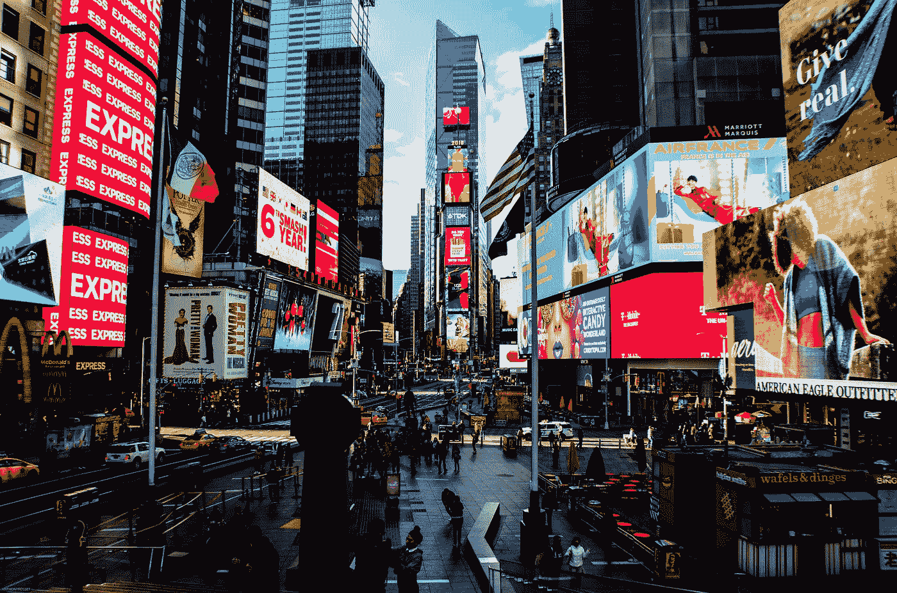

# 谷歌也像苹果一样扼杀广告行业

> 原文：<https://medium.com/geekculture/google-is-also-killing-ad-industry-like-apple-52fcdfff2eb5?source=collection_archive---------33----------------------->

## 承诺从 Android 12 开始杜绝个性化广告

Photo by [Anthony Rosset](https://unsplash.com/@anthonyrosset?utm_source=medium&utm_medium=referral) on [Unsplash](https://unsplash.com?utm_source=medium&utm_medium=referral)

谷歌终止安卓个性化广告的决定可能会让许多人感到意外。因为谷歌本质上是一家广告公司。接近 80%的收入来自广告。但迫于监管者和消费者的压力，谷歌别无选择，只能…