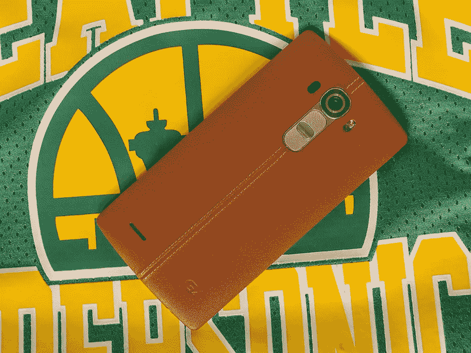
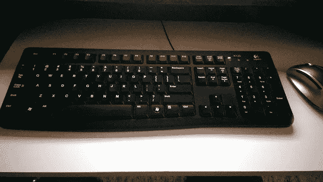
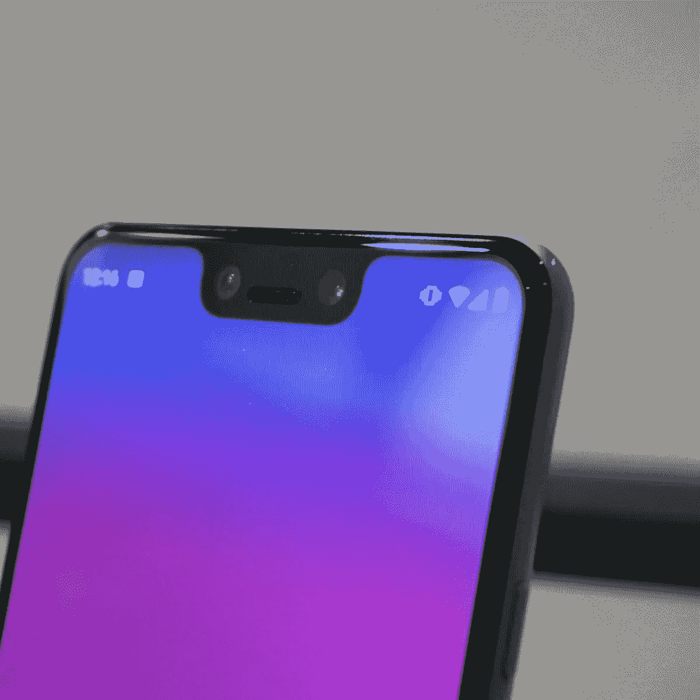

# 谷歌是 iPhone > Android 的原因

> 原文：<https://medium.com/geekculture/google-is-the-reason-iphone-android-efab7659ca43?source=collection_archive---------0----------------------->

## 燃烧的桥梁

## 世界上所有的软件魔法都无法掩盖无能

Two beloved relics from my past. Source: [DPReview](https://www.dpreview.com/reviews/lg-g4-camera-review)

我一生都是安卓用户。在过去的 10 多年里，我所拥有的都是基于安卓系统的智能手机。其实我在撒谎。我确实在易贝[花了 50 美元]买了一部 iPhone 4，当时我的三星 Galaxy S8+掉在地上，摔碎了屏幕(那些该死的弧形边缘)。我用了一个星期，之后就积灰了。除此之外，以下是我目前拥有的智能手机清单:

*   [三星 Galaxy S II Epic 4G Touch](https://www.theverge.com/2011/10/24/2494448/sprint-samsung-galaxy-ii-epic-4g-touch-review)(2011 年 9 月发布)
*   [HTC One M7](https://www.techradar.com/reviews/phones/mobile-phones/htc-one-m7-1131862/review)(2013 年 3 月发布)
*   [LG G4](https://www.lg.com/us/cell-phones/lg-US991-g4-unlocked-smartphone-android)(2015 年 4 月发布)
*   [三星 Galaxy S7 edge](https://www.androidauthority.com/samsung-galaxy-s7-release-date-price-specs-features-660745/)(2016 年 2 月发布)
*   [三星 Galaxy S8+](https://www.androidauthority.com/samsung-galaxy-s8-plus-review-760314/)(2017 年 4 月发布)
*   [谷歌 Pixel 2 XL](https://www.cnet.com/reviews/google-pixel-2-xl-review/)(2017 年 11 月发布)
*   [谷歌 Pixel 3 XL](https://www.techradar.com/reviews/google-pixel-3-xl-review)(2018 年 10 月发布)
*   [谷歌 Pixel 5](https://www.androidcentral.com/google-pixel-5-review)(2020 年 9 月发布)

对我来说，我从来没有找到一个好的理由来考虑从 Android 系统中退出。LG G4、Galaxy S8 和 Pixel 2 等创新手机不断问世。甚至安卓本身——作为一个操作系统——也在成长和成熟。随着时间的推移，它变得越来越容易使用；更直观，更友好，总体上更有能力*。*我非常喜欢 Android，尤其是谷歌手机的一个方面是，它真的试图强调“智能手机”中的*智能*像' [Now Playing](https://support.google.com/pixelphone/answer/7535326?hl=en) 、' ' [Call Screen](https://support.google.com/phoneapp/answer/9118387?hl=en#:~:text=screens%20the%20call.-,Screen%20calls%20manually,the%20call%2C%20or%20hang%20up.) 、'和' [Night Sight](https://support.google.com/googlecamera/answer/9708795?hl=en) '这样的功能在我第一次尝试它们时感觉是革命性的(现在仍然如此！).

我从来没有考虑过换 iPhone。为什么我要？我认为“iPhone 13 会和我的 iPhone 4 感觉一模一样，只是有更好的摄像头和更快的处理器。”尽管我所有的家人和朋友都鼓励我改用 iMessage 和 FaceTime，但我从未认真考虑过。我喜欢 Android——使用起来真的很有趣，并且做了我需要的一切。

不过，事情是这样的。我的安卓手机已经完成了我需要它们做的一切，除了它们没有完成的时候。我的 HTC One M7 拍出了惊艳的照片；也就是说，直到他们都开始有一个紫色的色调。很自然地，这发生在我过了保修期之后。

Eventually, the HTC One M7’s camera decided to liven photos up with a purple hue. Source: [Android Central](https://forums.androidcentral.com/htc-one-m7/328287-htc-one-simple-poll-how-many-have-purple-red-pink-tint-camera-4.html)

How the photo should look (and did, after the phone was repaired). Source: [Android Central](https://forums.androidcentral.com/htc-one-m7/328287-htc-one-simple-poll-how-many-have-purple-red-pink-tint-camera-4.html)

## 迷信还是运气不好？

我的 LG G4 一直是我最喜欢的手机；也就是说，直到它开发出一个惊人的“[启动循环](https://en.wikipedia.org/wiki/LG_smartphone_bootloop_issues)”问题，并使自己永久不可用。然后我喜欢上了我换下来的 S7 edge，直到手机拒绝充电，因为错误的警报声称充电端口有湿气。还好，在这个问题出现的时候，我有资格升级到新手机(Galaxy S8+)。没必要担心它。

开个玩笑！S8+也有同样的问题。谢天谢地，我通过百思买有了一个保护计划，并设法拿回了手机的钱，我用它花了 200 美元买了一个翻新的 Pixel 2 XL。我很高兴我那样做了，因为那部手机改变了我的生活。好吧，它确实没有以某种夸张的方式“改变我的生活”——然而，它确实让我开始对智能手机有了更高的标准。

我的 Pixel 2 XL 感觉与我习惯的一些 LG 和三星手机非常不同。相比之下，那些人几乎感到幼稚；更具体地说，是用户界面。Pixel 的软件使用起来非常简单，每一点信息都以干净简洁的方式显示出来。这并不意味着像素是无聊的。从颜色古怪的电源按钮到“有点像鼠尾草”和“真蓝”等手机颜色，Pixel 手机都有某种个性和泡沫。当谷歌全力以赴地将色彩和时髦作为“[材料你](https://material.io/blog/announcing-material-you)”的一部分时，这就成了 Android 12 中真正的例证

撇开我的滔滔不绝不谈，我真的很喜欢 Pixel 手机，因为它们非常*智能*手机；在几个方面比 iPhones 智能得多。但是，负面影响是什么呢？嗯，就像我之前解释的，一切都很好，直到它不好了。我爱我的手机，直到它们开始出现问题。当他们*遇到问题的时候，通常会伴随着另一个问题，另一个问题，另一个问题，等等。*

我的 Pixel 3 XL？拥有它大约一年半后，电池寿命大幅下降。仅仅一个小时左右，手机就会开始失去大约 15-20%的电池寿命(注意，这是在“空闲”或“待机”状态下)。最重要的是，手机会随机决定崩溃并自动重启。当我拍摄照片时，它有时会无法保存照片，导致我需要重新拍摄。它会随机过热，即使外面不热，我也没有运行任何密集。

It’s like the Pixel 3 XL is smiling at you with that massive notch. Source: [Mashable](https://mashable.com/article/google-pixel-3-notch)

就背景而言，我在手机上做的最密集的事情可能是以 1080p 录制视频。它甚至不能让*和*正确，因为它允许我在录制视频时通过*接收任何通知。如果这听起来不错，其实不然。为什么？我可以在录制的视频中听到通知或铃声。*

## 保持承诺

所以我的 Pixel 3 XL(以及 2XL)有很多奇怪的地方。尽管如此，我还是继续使用它，继续热爱它。然而，我现在才意识到，我忍受了很多别人会认为是破坏交易的事情。最大的那个？通话质量。

哦，我的*天啊*我的 Pixel 2XL 和 3XL 的通话质量很差吗？即使在扬声器里，和我说话的人听起来也总是有些低沉。我很快了解到，我的运营商推出了高清语音通话，当我看到我的一个电话上显示“高清”标志时，我很兴奋地尝试了一下。我以为这能解决我的问题。可能不是手机的问题，而是运营商的问题。不，是电话的事。高清语音通话听起来仍然很糟糕。

有趣的是——我称谷歌手机为最智能的智能手机，但不知何故，它们最终却成了最笨的手机。有时，他们甚至不能正确地做基本的*电话*事情。消息传递？谷歌有多少次试图想出 iMessage 的竞争对手而失败了？可能比我的手指还多。更糟糕的是，他们几乎立刻放弃了他们推出的所有东西。

被视为“蓝色”泡沫海洋中的“绿色”泡沫对我来说没什么大不了的。我不在乎被排斥为“局外人”让我感到困扰的是，当一个 iPhone 用户(在我的 Android 手机上)给我发送一张图片或视频时，当我打开它时，它看起来非常压缩。我现在明白了*为什么*会发生这种情况(由于文件在传递到古老的短信/彩信时被压缩)，但我不在乎。应该可以。现在是 2022 年。没有借口。

嗯，尽管对许多问题都说“没有借口”，我还是继续使用(并升级到)安卓手机。嗯，今年结束了。是的，读者——结束了。我和安卓分手了。

## 预示最后结果（或败局）的先兆

这一切都是从我花 300 美元在易贝买了一台翻新的 Pixel 5 开始的(或者真的，结束了)。我当时正在升级我的 Pixel 3 XL，它的电池完全没电了。事实上，我喜欢 Pixel 5 更小，存储容量增加一倍，电池容量大得多。最重要的是，它没有边框，保留了受人喜爱的后置指纹识别器。这部手机是我想要的一切，直到我意识到我真的需要这部手机来充当电话。

我的意思是——手机真的很智能(又一次),但作为一部手机它很糟糕。抛开 iMessage-to-SMS 的抱怨不谈，这款手机还有一个极端的问题:它在物理上无法打正常的电话。几乎每次我打电话给某人，我都听不到他们的声音。我把这归因于一个坏的 SIM 卡，但当我从 T-Mobile 得到一个新的 5G SIM 卡时，它继续这样做。我当时认为覆盖范围是个问题，但它甚至发生在 Wi-Fi 通话上。它发生在我能完全覆盖的地方。事情发生在不同的城市。它会随时随地发生，但是为什么呢？

我买了这部手机一个月，并没有真正注意到这个问题，因为我很少打电话或接电话。如果我给家人打电话，通常是通过 WhatsApp 等单独的通话应用。不过，最终我开始注意到了这一点。我不得不打了一系列关于家庭维修问题的重要电话，电话开始露出真面目。我想打一个电话，看它接通了，但是我听不到对方的声音。我又打了一次，看到计时器在计时，但什么也没有——我听不到他们的声音。

我会重启手机，重置我的移动网络设置，禁用 5G，禁用 Wi-Fi 通话，等等。相信我，我尝试了 reddit、Google、T-Mobile 支持页面等网站上我能找到的所有东西。没有任何效果——只是不断发生。我开始紧张。这是我第一次对自己拥有一部安卓手机感到真正的恼火。我对这个问题非常困惑——这肯定是一个*突出的*问题，不是吗？我在 Pixel 6 发布 5 个月后购买了我的翻新 Pixel。谷歌仍在通过软件更新支持 Pixel 5，自推出以来已经一年多了。他们肯定有足够的时间来解决这个问题。他们肯定意识到了这个问题。当然，他们关心的是确保他们的手机能为成千上万的人所用，我想他们正经历着同样的事情。

## 介绍 183979330

好吧，读者——我得出的结论是谷歌并不*在乎。也许这是显而易见的；也许不是。尽管如此，我还是要告诉你是什么让我最终开始相信这一点。我要把你介绍给我的一个好朋友。看官，认识一下 [183979330](http://v) 。 [183979330](https://issuetracker.google.com/issues/183979330) ，与读者见面。谁是 [183979330](https://issuetracker.google.com/issues/183979330) ？这是一年多前(2021 年 3 月 29 日)一名用户在谷歌“IssueTracker”平台上报告的一个问题。*

报告的问题:

*   *开始或转移到 wifi 呼叫的呼叫经常导致单向音频(呼叫者听不到被呼叫者，但被呼叫者可以听到呼叫者)。这个问题至少会在三次通话中出现一次。我测试了 5G 网络和 LTE 网络。如果 wifi 被禁用，音频将立即恢复。一旦出现问题，除非重新启动设备，否则问题会一直出现。然后它将工作大约 1/2 到 1 天。这已经在几个论坛/媒体上报道了任何支持 5G 的 pixel 手机(也许是其他的？)下面举例:*

长话短说，手机有时拒绝进行适当的双向通话。其他人也许能听到你的声音，但是你*听不到他们的声音。有时甚至反过来，但大多数情况下是前者。这个问题似乎主要发生在 T-Mobile 的 Pixel 5 设备上。在 [183979330](https://issuetracker.google.com/issues/183979330) 上的一些评论提到了用户在使用其他 Pixel 设备，甚至其他制造商的设备时遇到的问题，但在大多数情况下，它影响的是在 T-Mobile 上使用 Pixel 5 的用户。*

当我发现这个问题时(多亏了我的表弟，他帮我解决了这个问题)，我注意到它被标记为“P2/S2”或“优先级-2/严重性-2”我希望你和我想的一样。太荒谬了。一部不能打正常电话的手机，尽管很智能，也不是一部手机。此问题应立即标记为 P1 或 P0。相反，它已经在 P2 炼狱里呆了**一年多了。**

*仅仅是阅读 Pixel 5 用户(囚犯)留下的一些评论就真的令人沮丧。你可以通过文本感受到绝望。*

*它开始严重的性质(2021 年 5 月 27 日):*

*   **向谁分配问题的优先级，有没有办法提高优先级？P2 优先被定义为“一个需要在合理的时间范围内解决的问题。这种问题可能是以下任何一种:1)可能是 P0 或 P1 的问题，但有一个合理的解决方法……”如果没有手机信号，就没有合理的解决方法，而这正是 wifi 通话的全部目的。人们有时真的不能把他们的手机当电话用，而等待半年来解决这个问题在我看来并不“合理”。在这一点上，这不应该是一个 P1 吗？**

*它演变成仍然专业的怀疑(2021 年 9 月 15 日):*

*   *不敢相信这还是一个问题，谷歌。WFH 的生活充满了难以置信的挑战，WiFi 通话如此不可靠。请告诉我们最新情况。*

*变成了轻微的悲伤(2021 年 10 月 25 日):*

*   *这个问题会得到解决吗？🙁*

*人们仍然礼貌地大声呼救(2021 年 12 月 29 日):*

*   *大家好——希望你们都喜欢自己的假期。考虑到这里写的所有内容，我们是否更接近解决方案？是 GOOG 的问题还是 T-Mobile 的问题？似乎两家公司都没有注意到这个重大问题——电话最大的主要用途是打电话和接电话。在紧急情况下，这是一个很大的风险……*

*上述人士在下一条评论(2022 年 2 月 21 日)中改变了语气:*

*   **伙计们——从这个问题被报道到现在已经快一年了——到目前为止，我不确定是否有任何来自 GOOG / TMob 的人注意到我们的问题和不便。GOOG/TMob 会有人关注或承认这个问题吗？或者，这种缺乏沟通是一种微妙的方式，让我们知道我们需要把我们的移动业务转移到别处(威瑞森，AT & T)或者换成竞争对手的手机？想法/评论？**

*我们策划了一个生日聚会(2022 年 3 月 15 日):*

*   *嘿，今天是这个 bug 的一周年纪念日！也许有人谷歌可以给我们一个更新的问题是什么，以及估计他们什么时候可以修复它？或许可以提示一下，解决方法是什么，使它成为“S2”而不是“S1”？定期重启不起作用，禁用 IPv6 不起作用，重置 Wi-Fi 不起作用。我看到它最近出现在一些“热门名单”上。是不是受到了更多的关注？也许吧？*

*12 月 21 日和 2 月 22 日的家伙放弃了(2022 年 3 月 29 日):*

*   **从第一篇关于这个 bug 的帖子发布到今天正好一年。我曾希望一年后，谷歌/T-Mobile 会对此有所解决，但似乎我们没有任何前进的道路。因此，这个周末一旦我有了 iPhone，我将不得不学习如何使用 iOS。我真的很喜欢 android，但是每天重启手机或者听不到电话是不可能的。**

*虚幻的希望和彻底的绝望(2022 年 3 月 29 日):*

*   **也许我们小小的 S2 问题能改变今天的 S1？这是他的第一个生日！**

*发现问题后我插话说(2022 年 4 月 15 日):*

*   **我在这里创建了一个新的问题*[*https://issuetracker.google.com/issues/229382298*](https://issuetracker.google.com/issues/229382298)*我没有提到这个门票 ID，因为我担心他们会把两张门票合并起来，然后又忘记它们。希望他们会把新票当作一个新问题，并把它分配给真正处理它的人。**

*我越来越烦了(2022 年 4 月 18 日):*

*   **所以他们把我的问题标为重复，但不是这个问题 ID；是* [*期 172762810*](https://issuetracker.google.com/issues/172762810) *比这个还要老。这似乎有点荒谬，不过，考虑到我们的问题 ID 在这里是一年多前。关于问题跟踪，他们到底在做什么？我感觉他们甚至不知道我们的问题 ID 的存在。他们似乎知道另一个存在，但要么太懒，要么没有能力处理它。**

*我想我会成为我希望看到的改变(2022 年 4 月 19 日):*

*   *是时候让谷歌的一些员工上 blast 了，这样问题就可以解决了。我会大力鼓励人们向已知的谷歌员工发推文，并把他们引向这里，这样谷歌就会获得曝光率和吸引力。*
*   *注意:我在 Twitter 和其他平台上用绝望的推文联系谷歌高管(比如 Hiroshi Lockheimer ),希望有人会注意到我。从来没有人这样做过。*

*我放弃了希望(2022 年 4 月 25 日):*

*   *没有人致力于解决这个问题。从报道到现在已经一年多了。可悲的是，这里现在只是人们哭泣的地方。*

*我真的希望你读了那些评论，并在我积极处理这个问题时和我一样感到震惊。从谷歌获得绝对的零支持是一种糟糕的感觉；知道他们永远不会关心你的奋斗，尽管这很重要。如果他们甚至不关心关注*他们的*“问题追踪”平台上的问题，我们应该去哪里报告我们的问题呢？像 [T183979330](https://issuetracker.google.com/issues/183979330) 这样的问题被指派给真正的谷歌员工去处理。 [x330](https://issuetracker.google.com/issues/183979330) 在其初期被多次重新赋值。两天前它甚至被重新分配给了别人。然而，这又有什么关系呢，当他们在将近一年半之后都不愿意见面的时候？我更恼火的是他的生日聚会我都没去。*

## *眼睛睁开了*

*我知道我的 Pixel 5 问题可能是一个异常。并非所有安卓手机都是如此。如果我简单地更换运营商，我的 Pixel 5 问题甚至可能得到解决。然而，我终于明白了，我不应该勉强接受低于标准的成绩。我不应该为了让我的手机正常工作而更换运营商。除此之外，我非常不希望任何东西会坏掉或崩溃(关于我用过的任何安卓手机)，以至于我开始更加欣赏 iphone。不要误解我的意思，它们有自己的缺陷，无论如何都不是完美的。然而，它们会在你需要的时候工作。*

*如果你有问题，你可以带他们去苹果商店。不管你是否付费，你都可以拨打一条合格的技术支持热线。如果你报告了一个 bug——尤其是像这样一个严重的 bug——苹果可能会因为他们的形象而关心它(因为大量用户可能会受到影响)。我可能不同意苹果所做的一切，但我确实相信，如果像 [T183979330](https://issuetracker.google.com/issues/183979330) 这样的问题被报告给他们，它会得到更快的解决(或者只是，你知道，解决)。*

*在我结束这个话题之前，我想写一份免责声明:谷歌行动不力不是 LG 的错，焊接问题导致 LG G4(和许多其他 LG 手机)出现大规模启动环路错误也不是谷歌的错。HTC 的手机开始拍紫色图片也不是谷歌的错。*

*然而，我对 Android 的总体体验包括“忍受”客观上不可原谅的事情，不管我用的是什么手机。Android 是谷歌的平台，说到底。我至少希望谷歌自己的硬件能成为 Android 的绝对巅峰，展示最好的 Android。好吧，考虑到我对这三部 Pixel 手机的总体体验是多么的错误、紧张和不可靠，我最终对 Android 完全失去了信心。*

*谢天谢地，我不会再找借口了。Pixel 5 是最后一根稻草。去年，我写了一篇题为“2021 年是谷歌的最后机会”的文章，主要是指 Pixel 6 的推出以及*如何绝对需要*才能成为赢家。我甚至称 Pixel 5 是一部没有灵魂的手机，然而它却是我想要的手机的一切…除了，你知道，它不能给人打电话的事实。没什么大不了的。*

*我可能会在未来的某个时候再次爱上 Android，但现在，没有他妈的办法。如果掌舵的公司不能重整旗鼓，我为什么还要对站在船边的其他人更加忠诚呢？我厌倦了依赖一家不称职的公司来交付功能性的东西，也厌倦了为其他公司找借口。*

*最终，我明白了我只是想要一部工作起来几乎完美无缺的手机，并且在我想做的时候做我需要做的事情。我不需要它有最多的内存，最快的充电速度，最多的百万像素，或者随机的噱头。我只想要一部能满足基本通话需求的手机，比如打电话和发短信。我很高兴让你知道我找到了答案。感谢阅读。*

*从我的 iPhone 发送*