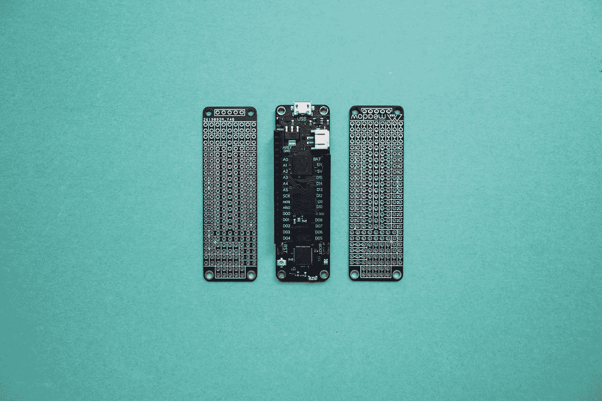
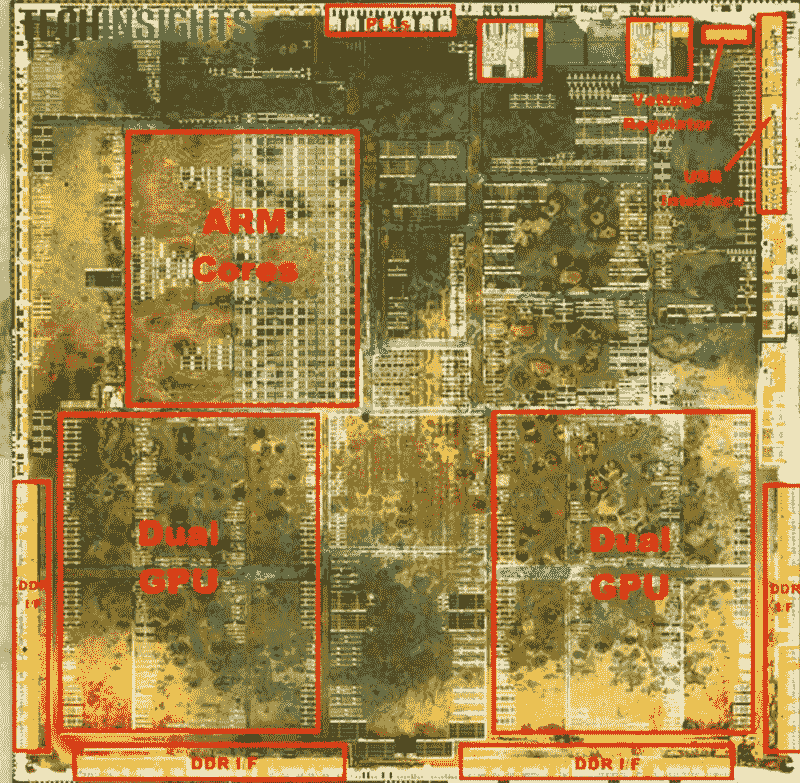
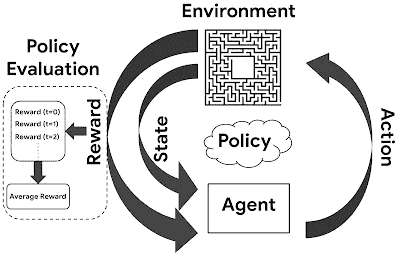
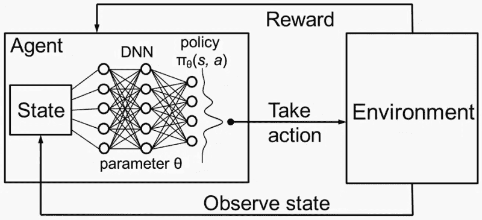

# 谷歌正在利用人工智能制造手机芯片。让我们解释一下是如何做到的。

> 原文：<https://medium.com/geekculture/google-is-using-ai-to-build-phone-chips-lets-explain-how-92540d5102ba?source=collection_archive---------8----------------------->

## 让我们来探索一下谷歌是如何利用强化学习来构建其新芯片的。用英语。

Photo by [Jorge Ramirez](https://unsplash.com/@jorgedevs?utm_source=medium&utm_medium=referral) on [Unsplash](https://unsplash.com?utm_source=medium&utm_medium=referral)

谷歌的 Pixel 系列手机从来都不是最耀眼的旗舰手机。他们从未声称拥有最快的硬件或最新的相机。相反，pixel 手机一直依靠谷歌在软件和人工智能使用方面的比较优势来改善用户体验，并充分利用有限的硬件。事实上，尽管 pixel 手机号称是当今智能手机市场上最好的手机摄像头之一，但它的摄像头硬件已经有三代没有更新了。这就是为什么当有报道称谷歌正在使用人工智能和强化学习来设计新 Pixel 的内部芯片时，任何熟悉谷歌手机的人都不会感到惊讶。

在本文中，我们将解释机器学习的一个分支，称为强化学习，并涵盖谷歌如何通过强化学习在比以往更短的时间内构建新的芯片。用英语

# 传统上芯片是如何制造的

Floorplan for a modern mobile chip from [www.ubmtechinsights.com](http://www.ubmtechinsights.com/)

作为传统芯片制造过程的一部分，工程师们要花几个月的时间为芯片制作“平面图”。平面图是芯片子系统的布局，如 GPU 或 CPU 以及将它们链接在一起的数百万个连接。这个过程很复杂，需要先进的软件来帮助工程师可视化芯片上的各个部分是如何装配在一起的。相同组件之间的布局差异会对芯片的性能产生深远影响，因为即使是最小的布局差异也会对整体性能产生重大影响。

现在，由于人工智能和强化学习，工程师可以简单地给谷歌的算法提供数以千计的例子，说明什么是有效的平面布置图，给它一些时间来自己学习，并将创建平面布置图的时间从数月缩短到仅仅数小时。

# 强化学习解释

At each given state, an agent takes an action based on the policy and receives a reward. From [ai.googleblog.com](https://ai.googleblog.com/)

强化学习是机器学习的一个分支，它允许人工智能代理从经验中学习，并调整其行为，以最大化其收到的总回报。在强化学习问题中，有代理、环境和奖励。代理通过测量其在环境中的当前状态并采取某些产生奖励的行动来与环境进行交互。强化学习算法依靠试错法来增加他们对交互如何影响他们在环境中的整体进展的理解。当代理尝试不同的动作并获得相应的奖励时，它会增加强化学习模型的训练数据。在机器学习的世界里，这被认为是半监督学习。

与传统的监督学习问题相比，强化学习问题更具挑战性，因为它们涉及延迟奖励。例如，如果一个代理人因他们采取的每一个行动而获得奖励，这将被认为是一个监督学习问题。然而，在强化学习问题中，采取行动后奖励不会立即出现。奖励只有在未来的某个时候才会收到。这种即时反馈的缺乏会导致代理人在学会如何最大化其总报酬之前的延迟。

强化学习的一个标准例子是电脑游戏环境。在这种情况下，代理是玩家，它通过在游戏世界中移动和与对象交互来与环境交互。与一个物体互动的回报取决于它如何影响你在游戏中的整体进度。最终，在游戏结束时，玩家将获得赢得游戏的奖励。然而，玩家不知道与游戏世界中特定对象的交互将如何影响其整体进度，或者是否会导致其输赢。最终，这可能是一个很难解决的问题，因为如果不知道过程中每一步的反馈，代理就很难学习如何最好地与对象交互以最大化其回报。

强化学习问题的最终挑战是设计一个最优策略，它告诉代理如何根据代理对当时什么行动最好的不确定性来最好地与环境交互。策略的一个例子是，如果代理处于状态 s，则采取动作 A，如果代理处于状态 s，则采取动作 B。该策略表示代理可以从中选择的一组动作，并且每个动作将依次执行，直到一个动作导致某个状态。在大多数强化学习问题中，有多种状态，代理将根据它如何与环境交互的当前状态来选择动作。然后，根据它以前学到的如何最大化它的总回报，它尝试不同的行动，直到它找到一个最大化它的总回报。

对于任何想深入研究这个主题的人，我强烈推荐观看这个视频:

# 深度强化学习

对于复杂的问题，强化学习问题中的最优策略很难计算，即使我们有关于状态、动作和奖励之间关系的高度精确的数据。因此，为大多数现实世界的问题学习最优策略是不切实际的。这就是神经网络的用武之地。

神经网络是一种特殊类型的计算学习模型，它基于大脑中的神经元与数字计算机器(如计算机和移动电话)中的神经元类似的工作方式的观察。虽然没有给出神经网络如何工作的完整流程，但神经网络很重要，因为它们是很好的函数逼近器。在强化学习的情况下，神经网络可以逼近最优策略，并在给定足够数据的情况下最小化该逼近与最优策略之间的距离(或误差度量)。

使神经网络在强化学习中发挥最佳功能的关键是用状态-动作对的例子来训练它们。状态-动作对是代理处于特定状态并采取特定动作的情况。本质上，这些例子是代理在采取某些行动后获得的奖励的样本。通过使用这些数据来训练神经网络，它将逐渐学习如何基于状态-行动对做出最佳可能的选择(或政策)。为了提供最佳策略的有用近似值，我们需要向它提供成千上万的样本或示例，并让它自己从中学习。

例如，AlphaGo 最初被训练为模仿人类游戏，试图通过使用约 3000 万步的数据库匹配历史记录游戏中的专家棋手的走法。然后，为了将 AlphaGo 改进到甚至可以击败最优秀的人类棋手的程度，他们继续使用强化学习来训练模型，模拟数百万个不同的状态-动作对，并将有关各自奖励的信息反馈到模型中，以调整策略功能。想象一下，如果我们让世界上最好的围棋手，给他们世界上所有的时间，让他们和他/她自己下上百万次围棋。那个球员会变得多好？实质上，这就是 AlphaGo 如何变得比世界上任何人类棋手都更擅长围棋。

# 回到谷歌

谷歌是如何利用这项技术来帮助构建芯片的？谷歌的工程师将构建芯片的布局规划过程比作玩棋盘游戏。你必须考虑所有的部分如何组合在一起。这不是一个简单的任务；芯片可能包括数百万个部件，所有这些部件都必须正确连接。布局的不同导致性能和效率的不同。事实上，考虑到芯片制造过程的规模和一秒钟内发生的数十亿次计算周期，纳米长度的布局差异可能会导致性能和效率的巨大差异。

谷歌用 1 万个不同芯片设计的例子训练了这个模型，每个例子都有一个分数，作为效率和性能等不同成功指标的函数。然后，该模型的任务是优化其策略，尽可能高效地放置芯片组件，以使总回报最大化。就像在一场围棋比赛中，AI 模型有一个游戏棋盘(硅骰子)、游戏棋子(计算机组件)、一组走法(放置组件的不同位置)和一个获胜条件(找到最有效的布局)。谷歌认为，这种方法可以帮助克服传统芯片设计工具的局限性，传统芯片设计工具可能需要大量的人力和成本来设计定制芯片。

虽然这项技术仍处于早期阶段，但在产品开发的所有阶段使用人工智能有许多潜在的好处。想象一下，如果一家初创公司可以在他们的产品设计过程中使用 RL 神经网络，以最少的客户浪费来制造最好的产品。或者，汽车制造商可以使用 RL 神经网络来优化他们的生产计划，以最大限度地提高效率。这项技术的应用是无穷无尽的，在许多方面，它只是刚刚开始被发现。