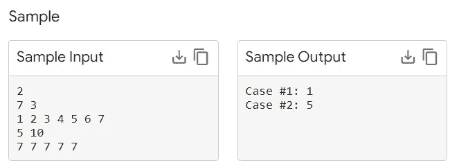

# Google Kickstart with Go

> 原文：<https://medium.com/geekculture/google-kickstart-with-go-2bc3cf144e52?source=collection_archive---------9----------------------->

谷歌 Kickstart 2022 实践回合 Golang 问题 1 解决方案


src: [Google Kick Start — Important Dates, Eligibility, Contest Details — GeeksforGeeks](https://www.geeksforgeeks.org/google-kick-start-important-dates-eligibility-contest-details/)

# 介绍

在过去的几个月里，我一边学习围棋，一边准备技术面试和竞争性编码比赛。为了平衡这些任务，我一直在 Golang 准备我的面试/比赛。

谷歌 Kickstart 2022 已经开始，上周开始了一轮练习。到目前为止，Python、Java、C/C++和 C#是编码竞赛中最流行的语言。Golang 很少甚至没有对 Leetcode、算法或竞争性编码的在线支持。Go 是最想学的编码语言之一，但是它仍然相当现代，并且正在被采用。由于这个原因，缺乏在线支持是可以理解的，而且肯定会增长。

我为那些好奇的人写一些关于用 Go 解决算法问题的文章，这篇文章将开始一系列我在编码比赛中使用 Go 的文章。

# 问题

这个问题是练习轮的第一个样题。它非常简单，旨在让您熟悉 Kickstart 环境。

你已经收集了 N 袋糖果，你想把这些糖果分给 M 个孩子。第 I 个袋子里装着 Ci 块糖果。你要确保每个孩子得到相同数量的糖果，并且他们得到的糖果数量尽可能多。你可以打开每个袋子，把所有的糖果混合在一起，然后分发给孩子们。

根据上述规则，在你把糖果分给孩子们后，还会剩下多少块？

## 投入

输入的第一行给出了测试用例的数量，接下来是 T. T 测试用例。

每个测试用例由两行组成。每个测试用例的第一行包含两个整数:整数 N，糖果袋的数量，M，孩子的数量。

下一行包含 N 个非负整数 C1，C2，…，CNC1，C2，…，CN 代表数组 C，其中第 I 个整数代表第 I 个袋子里糖果的数量。

## 输出

对于每个测试用例，输出包含`Case #x: y`的一行，其中`x`是测试用例编号(从 1 开始)，而`y`是根据上述规则在孩子之间分配糖果时剩余的糖果数量。

## 限制

时间限制:40 秒。
内存限制:1 GB。

## 测试集 1

1≤T≤1001≤T≤100。
1≤N≤1051≤N≤105。
1≤M≤1041≤M≤104。
0≤Ci≤10000≤Ci≤1000，对于从 1 到 n 的所有 I。



在样本案例#1 中，我们有 N=7N=7 袋糖果。我们总共有 1+2+3+4+5+6+7 = 281+2+3+4+5+6+7 = 28 颗糖果，我们想在 M=3M=3 个孩子之间分配。每个孩子可以得到 99 块糖，所以剩下 283×9 = 1283×9 = 1 块糖。

在样本案例#2 中，我们有 N=5N=5 袋糖果。我们总共有 7+7+7+7+7=357+7+7+7+7=35 颗糖果，我们想在 M =10M 万= 10 个孩子之间分配。每个孩子可以得到 33 块糖，所以剩下 3510×3 = 53510×3 = 5 块糖。

# 解决办法

这个问题的解决方案非常简单。你得到糖果的总数，用 m 取模，结果被传递到控制台输出，并且必须符合 Google 指定的格式。

```
package mainimport "fmt"func main() {
    var numTests int
    fmt.Scan(&numTests)

    for i := 0; i < numTests; i++ {
        var n int
        var m int
        var totalCandies int

        fmt.Scan(&n)
        fmt.Scan(&m)

        for i:= 0; i < n; i++ {
            var tempNum int
            fmt.Scan(&tempNum)
            totalCandies += tempNum
        }

        result := fmt.Sprintf("Case #%d: %d", i+1, totalCandies%m)
        fmt.Println(result)

    }

}
```