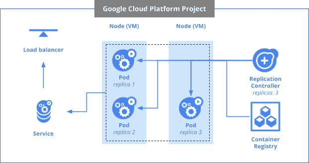

# Google Kubernetes 引擎第 1 部分:节点、pod、控制器和服务(通往 Google 协理云工程师 2020 认证之路)

> 原文：<https://medium.com/geekculture/google-kubernetes-engine-part-1-nodes-pods-controllers-and-services-road-to-google-associate-55c8fe46f301?source=collection_archive---------40----------------------->

Kubernetes 是认证最重要的论据之一。Google Kubernetes 引擎是运行 Docker 容器的集群管理器和协调器。它将容器调度到一个集群中，并根据使用配置文件(YAML 格式)以声明方式定义的需求自动管理它们。

Kubernetes 包括许多概念:

*   [节点](http://kubernetes.io/docs/admin/node/):一个节点是一个 Kubernetes 集群中的工作机，在 Google Kubernetes 引擎中，这个机器总是一个[计算引擎实例](https://cloud.google.com/compute/docs/instances/)。
*   pod:pod 是一组一个或多个容器、共享存储以及与这些容器相关的配置数据。在 Kubernetes 中运行的生产应用程序通常会在一个 pod 中包含多个相对紧密耦合的容器。
*   [复制控制器](http://kubernetes.io/docs/user-guide/replication-controller/):复制控制器工作以确保所请求数量的 pod 副本在给定时间总是可用并运行。复制控制器根据需要自动添加或移除单元，以保持所需的状态。
*   [服务](http://kubernetes.io/docs/user-guide/services/):服务定义了一组逻辑 pod，以及使用 IP 地址和端口号对访问它们的方法。

其他必须熟知的概念:

*   使用 *gcloud* CLI 创建和管理集群
*   使用 *kubectl* CLI 管理 pod 和服务
*   不同类型的服务
*   水平 Pod 缩放
*   挂起窗格的调试

# 节点

Kubernetes 通过将容器放入 Pods 中在*节点*上运行来运行您的工作负载。根据群集的不同，节点可以是虚拟机或物理机。每个节点由[控制平面](https://kubernetes.io/docs/reference/glossary/?all=true#term-control-plane)管理，并包含运行[pod](https://kubernetes.io/docs/concepts/workloads/pods/)所需的服务

通常，一个群集中有几个节点；在学习或资源有限的环境中，您可能只有一个节点。

[名称](https://kubernetes.io/docs/concepts/overview/working-with-objects/names#names)标识一个节点。两个节点不能同时具有相同的名称。

# 分离舱

Kubernetes 的核心是[舱](http://kubernetes.io/docs/user-guide/pods/)。

pod 表示并持有一个或多个容器的集合。通常，如果您有多个相互依赖的容器，那么您可以将这些容器打包到一个 pod 中。

豆荚也有[卷](http://kubernetes.io/docs/user-guide/volumes/)。卷是数据磁盘，只要 pod 存在，卷就存在，并且可以由 pod 中的容器使用。pod 为其内容提供了一个共享的名称空间，这意味着我们的示例 pod 中的两个容器可以相互通信，并且它们还共享附加的卷。

pod 还共享一个网络名称空间。这意味着每个 pod 有一个 IP 地址。

# 控制器

有不同类型的控制器

## 达蒙塞特

**DaemonSet** 确保所有(或一些)节点运行一个 Pod 的副本。随着节点添加到集群中，单元也会添加到其中。随着节点从集群中移除，这些 pod 将被垃圾收集。删除 DaemonSet 将清理它创建的 pod。
DaemonSet 的一些典型用途包括:

*   在每个节点上运行集群存储守护程序
*   在每个节点上运行日志收集守护程序
*   在每个节点上运行节点监控守护程序

## 复制集

一个**副本集的**目的是在任何给定时间保持一组稳定的副本盒运行。因此，它通常用于保证指定数量的相同 pod 的可用性。
ReplicaSet 负责维护所需的 pod 数量，因此，删除它也会删除 pod。

## 状态集

**状态集**状态集对于需要以下一项或多项的应用程序很有价值

*   稳定、唯一的网络标识符。
*   稳定持久的存储。
*   有序、优雅的部署和扩展。
*   有序的自动滚动更新。

与部署不同，StatefulSet 为它们的每个 pod 维护一个粘性身份。这些 pod 是根据相同的规范创建的，但是不可互换:每个 pod 都有一个永久的标识符，它在任何重新调度中都维护这个标识符

# 服务

豆荚并不意味着持久。它们可以因为许多原因而停止或启动，比如失败的活性或就绪检查，这导致了一个问题:如果您想要与一组 pod 通信，会发生什么？当他们重新启动时，他们可能会有一个不同的 IP 地址。

这就是服务发挥作用的地方。服务为 pod 提供稳定的端点。

服务使用标签来确定它们在什么样的 pod 上运行。如果包装有正确的标签，我们的服务人员会自动将它们取出并暴露出来。

服务提供给一组 pod 的访问级别取决于服务的类型。目前有三种类型:

*   ClusterIP(内部)—默认类型意味着此服务仅在群集内部可见，
*   节点端口为集群中的每个节点提供一个外部可访问的 IP
*   LoadBalancer 添加了一个来自云提供商的负载平衡器，它将流量从服务转发到其中的节点。
*   入口服务会创建一个 HTTPS 负载平衡器，并根据指定的信息进行相应配置，以允许访问集群

# 控制平面

控制平面是 Kubernetes 组件，它管理集群中的工作节点和 pod。

在生产环境中，控制平面跨多台机器运行，一个群集跨多个节点运行，以提供容错能力。

控制平面对集群做出决策(例如调度)并对集群事件做出响应(例如当需要创建新的 Pod 来满足扩展要求时)。