# 谷歌地图平台 101 —第 3 部分:运行时的图像叠加、地图样式

> 原文：<https://medium.com/geekculture/google-map-platform-101-part-3-image-overlay-4c1210814153?source=collection_archive---------21----------------------->

谷歌地图可以添加一个图像覆盖来显示客户的标志。在这一部分中，您将学习如何在地图上创建菜单和图像工具。事先，您可以在运行时更改地图样式。

# — ===菜单=== —

**🎨1.** [**创建一个标志**](#1ebe) **🖌 2。** [**创建菜单图标**](#9fe9) **📜 3.** [**添加菜单→首页**](#9b75) **🚵 4.** [**图像叠加**](#dc5a) **🍍 5.** [**菜单选项**](#86a9) **🎮 6.** [**第二菜单项**](#d737) **🛬 7。** [**运行时的地图样式**](#b0f6)

# 🎨1.创建一个标志… → [菜单](#1a4c)

在他们的网站或他们提供给你的信息中找到关于你的客户的详细信息。该徽标图像必须有透明背景。

举个例子，

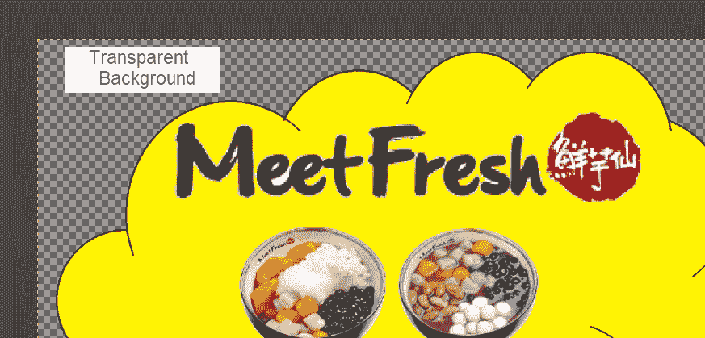

保存到 res/drawable

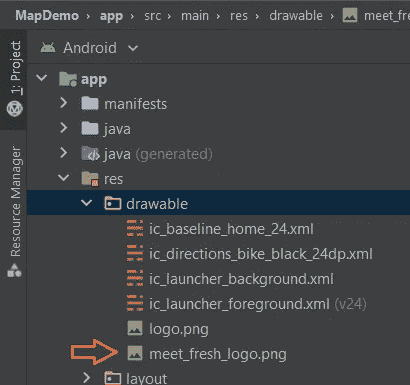

# 🖌 2.创建菜单图标…… → [菜单](#1a4c)

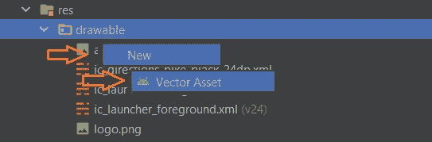

我需要一个家庭图标。

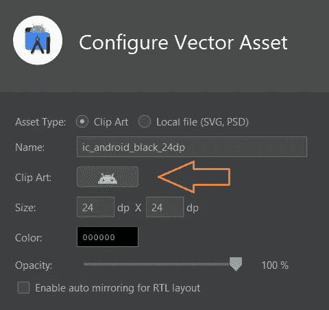

搜索主页:

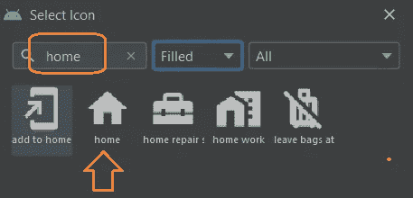

选择颜色:

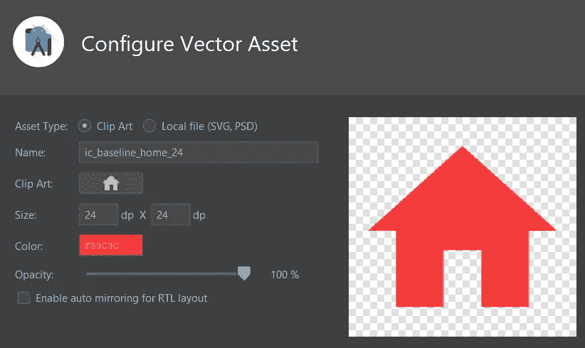

完成。

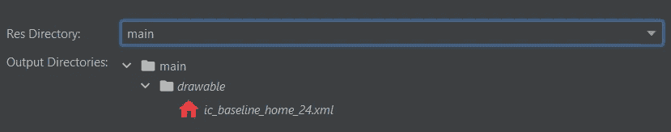

# 📜 3.添加菜单→主页…… → [菜单](#1a4c)

> 添加资源目录

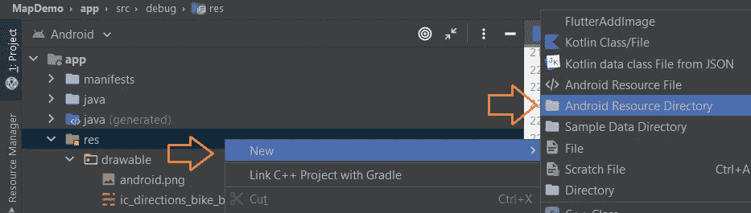

> 添加菜单目录

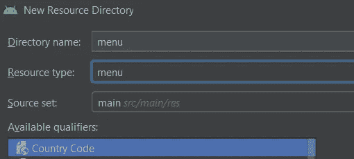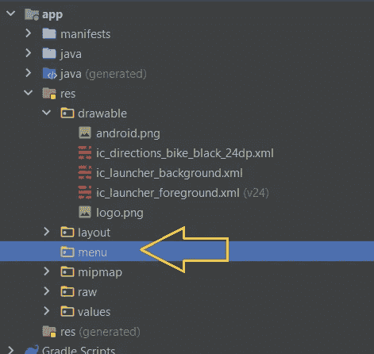

> 菜单项

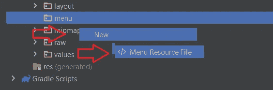

新建→菜单资源文件

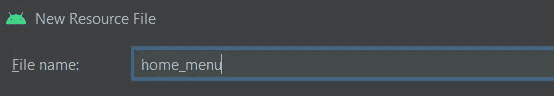

**文件名**:主页 _ 菜单

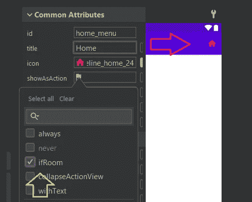

**id** → home_menu
**标题** → Home
**图标** →上面我做过的那个。
**显示操作** → ifRoom ( *如果屏幕有空间则显示图标*)

# 🚵 4.图像叠加… → [菜单](#1a4c)

让我们回到地图演示项目。

我将有两个功能:

*   移动到客户的位置
*   添加图像覆盖

> 准备位置

来自[https://maps.google.com/](https://maps.google.com)

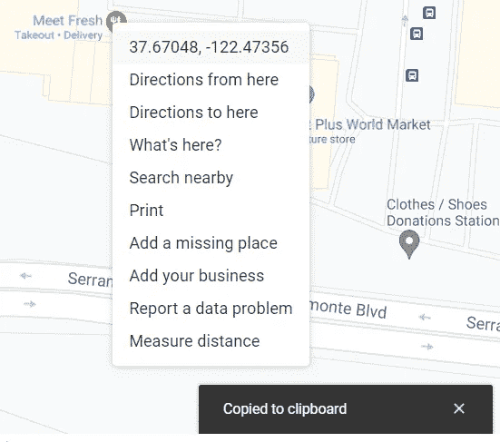

Copied the location data

```
*// customer location* **private val homeLatLng** = LatLng(37.670435397441466, -122.47354342767584)
```

> 移动到家庭位置

```
**private fun** moveToHome() {
    **mMap**.moveCamera(CameraUpdateFactory.newLatLng(**homeLatLng**))
    **mMap**.animateCamera(CameraUpdateFactory.zoomIn())
    **mMap**.animateCamera(CameraUpdateFactory.zoomTo(17f), 4000, **null**)
}
```

变量 **mMap** 已经在 [***第一部分***](/geekculture/walk-through-google-map-platform-101-in-android-7c72a4dd40e3) 初始化。

> 图像叠加

```
*/**
 * Image Overlay
 */* **private fun** imageOverlay(imageId: Int, size: Float) {
    **val** overlaySize = size

    **val** androidOverlay = GroundOverlayOptions()
        .image(BitmapDescriptorFactory.fromResource(imageId))
        .position(**homeLatLng**, overlaySize)
    **mMap**.addGroundOverlay(androidOverlay)
}
```

简单，没什么大不了的！您可以修改该函数，使其运行如下:

*   **来自数据库的图像链接**
*   **从缓存加载图像**
*   **数据库中的营业地点**
*   **数据库中的标志尺寸**

接下来，您将把它们组合成一个自动加载图像叠加功能。如果你有一些新的想法，请与我分享。

# 🍍 5.菜单选项… → [菜单](#1a4c)

> 菜单布局

```
**override fun** onCreateOptionsMenu(menu: Menu?): Boolean {
    *menuInflater*.inflate(**R.menu.*home_menu***, menu)
    **return true** }
```

> 选择的菜单项

```
**override fun** onOptionsItemSelected(item: MenuItem): Boolean {

    **when**(item.*itemId*) {
        R.id.*home_menu* -> {
            imageOverlay(R.drawable.*meet_fresh_logo*, 150f)
            moveToHome()
        }
    }
    **return super**.onOptionsItemSelected(item)
}
```

超级简单不是吗？

我们跑吧🐣。

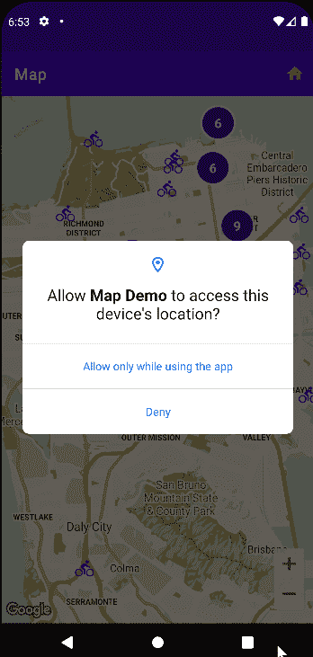

工作很好！

# 🎮 6.第二个菜单项…… → [菜单](#1a4c)

> 按照第 1 章创建第 2 个。图标:

剪贴画:


颜色:

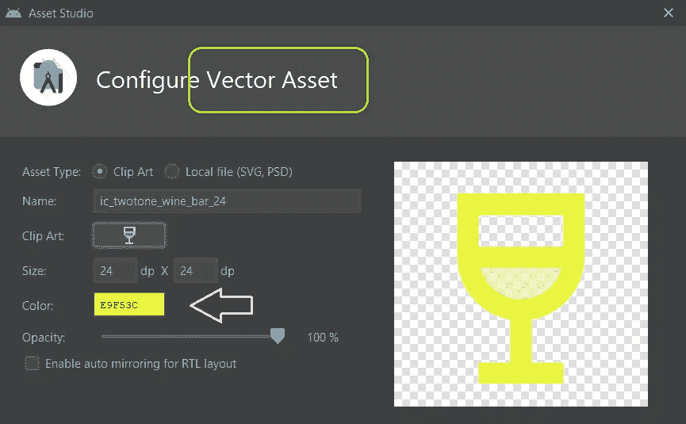

结果:

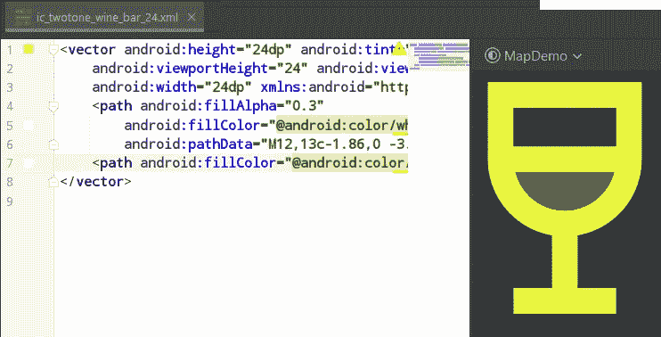

> 创建一个商业标志:在 GIMP 中设计。

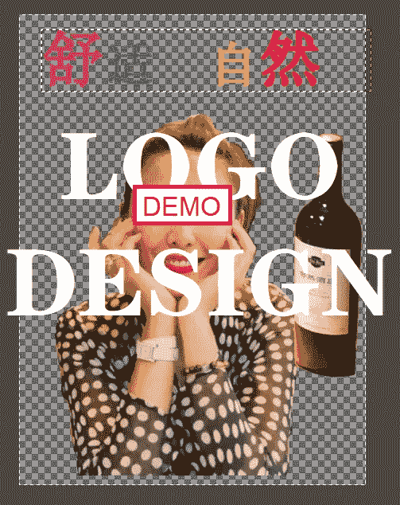

保存到 res/drawable 文件夹。

> 编辑主页菜单:

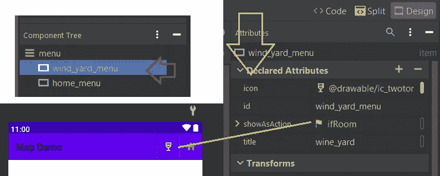

> 编辑 ui/ **MapsActivity.kt**

新变量: **wineyearLatLng (** 这是一个假的位置。 **)**

```
**private val wineyardLatLng** = LatLng(39.94505180548504, 116.41756601673754)
```

新功能: **moveToWindyard()**

```
**private fun** moveToWineyard() {
    **mMap**.moveCamera(CameraUpdateFactory.newLatLng(**wineyardLatLng**))
    **mMap**.animateCamera(CameraUpdateFactory.zoomIn())
    **mMap**.animateCamera(CameraUpdateFactory.zoomTo(18f), 4000, **null**)
}
```

共享功能: **imageOverlay()**

```
**private fun** imageOverlay(
    imageId: Int, size: Float, **location: LatLng**
) {
    **val** overlaySize = size

    **val** androidOverlay = GroundOverlayOptions()
        .image(BitmapDescriptorFactory.fromResource(imageId))
        .position(**location**, overlaySize)
    **mMap**.addGroundOverlay(androidOverlay)
}
```

选择的菜单项:

```
**override fun** onOptionsItemSelected(item: MenuItem): Boolean {

    **when**(item.*itemId*) {
        R.id.*home_menu* -> {
            imageOverlay(
                R.drawable.*meet_fresh_logo*, 150f, **homeLatLng**)
            moveToHome()
        }
        R.id.*wind_yard_menu* -> {
            imageOverlay(
                R.drawable.*wine_yard_logo*, 100f, **wineyardLatLng**)
            moveToWineyard()
        }
    }
    **return super**.onOptionsItemSelected(item)
} 
```

测试结果:

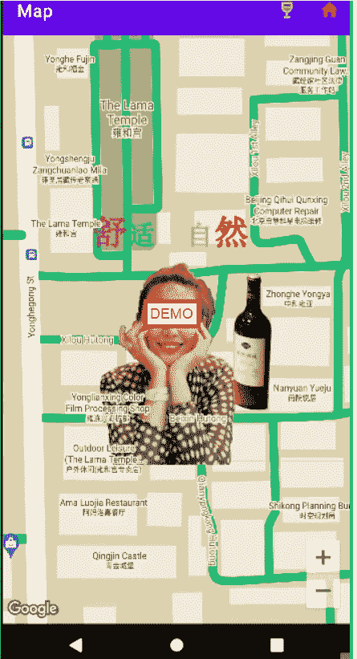

这种地图风格很可怕吧？其他地标挡住了 logo。

# 🛬 7.运行时的地图样式…… → [菜单](#1a4c)

链接: [***谷歌地图平台 101 —第二部分:地图风格***](https://homanhuang.medium.com/google-map-platform-101-part-2-map-style-6f6b7e5cc28e?source=your_stories_page-------------------------------------)

> 新款:粉色，去除商务色彩

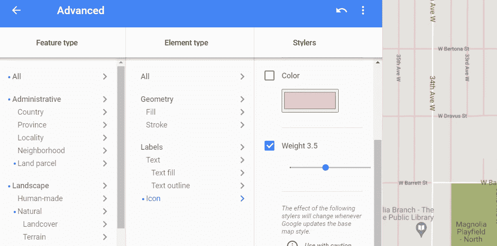

Pick your options to minimize the surrounding materials.

保存到一个新的 JSON 文件:***map _ style _ bar . JSON***

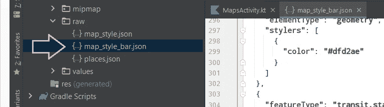

> ui/ **MapaActivity.kt**

调整参数:

```
*/**
 * Map style
 */* **private fun** setMapStyle(mapStyleId: Int) {
    **try** {
        **val** success = **mMap**.setMapStyle(
            MapStyleOptions.loadRawResourceStyle(
                **this**,
                mapStyleId
            )
        )

        **if** (!success) {
            *lge*(**"MapStyle: Style parsing failed."**)
        }
    } **catch** (e: Resources.NotFoundException) {
        *lge*(**"MapStyle: Can't find style. Error: $**e**"**)
    }
}
```

选择的菜单项:

```
override fun onOptionsItemSelected(item: MenuItem): Boolean {

    when(item.*itemId*) {
        R.id.*home_menu* -> {
            **setMapStyle(R.raw.*map_style*)**
            ...
        }
        R.id.*wind_yard_menu* -> {
            **setMapStyle(R.raw.*map_style_bar*)**
            ...
        }
    }
    return super.onOptionsItemSelected(item)
}
```

🚀运行:

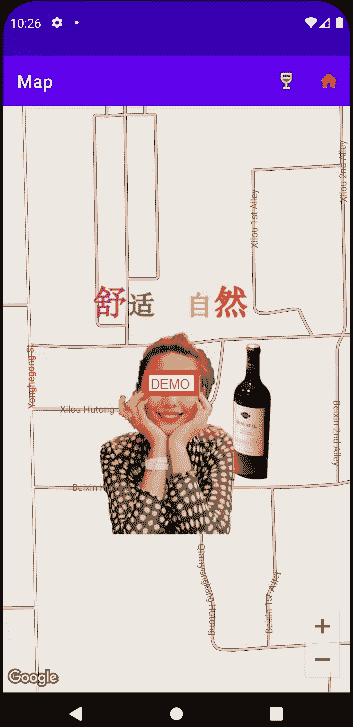

现在更清楚了！

# 🙈鼓掌，鼓掌，大家！