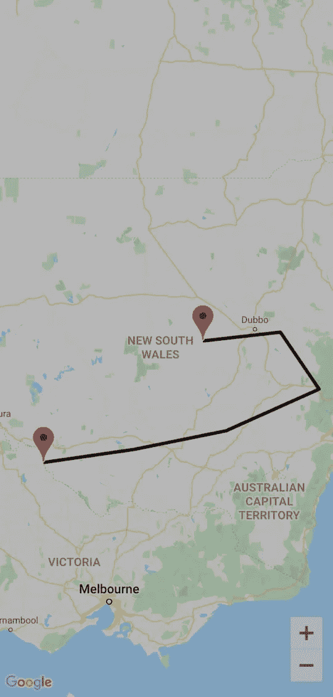

# Jetpack 中的谷歌地图合成 Android

> 原文：<https://medium.com/geekculture/google-maps-in-jetpack-compose-android-ae7b1ad84e9?source=collection_archive---------10----------------------->

与 android xml 相比，在 jetpack compose 中集成 google maps 有点困难。但是如果没有 Xml，我们也不能将谷歌地图集成到 jetpack compose android 应用程序中。

为了在 jetpack compose 中集成谷歌地图，您需要从[谷歌云控制台](https://console.cloud.google.com/)生成谷歌地图 api 密钥，然后您需要添加以下依赖项。

```
*implementation*("com.google.android.libraries.maps:maps:3.1.0-beta")
*implementation*("com.google.maps.android:maps-v3-ktx:2.2.0")
*implementation*("androidx.fragment:fragment:1.3.2")
```

之后，在 android manifest.xml 文件中添加带有 google map api 密钥和互联网权限的元数据标签

```
<uses-permission android:name="android.permission.INTERNET"/><meta-data android:name="com.google.android.geo.API_KEY"
    android:value="Api_key_here"/>
```

现在，在 res 目录下创建一个新目录，将其命名为 layout，并创建一个新的资源文件，就像我创建 layout_map.xml 文件一样，并在该文件中添加以下代码

```
<androidx.fragment.app.FragmentContainerView
    xmlns:android="http://schemas.android.com/apk/res/android"
    android:id="@+id/map"
    android:name="com.google.android.gms.maps.SupportMapFragment"
    android:layout_width="match_parent"
    android:layout_height="match_parent"/>
```

现在你可能想知道我们如何在 jetpack compose 中使用它，所以不要担心，我也将向你展示这一点。

现在创建一个新文件，我把它命名为 MapUtils.kt，并在其中添加下面的代码

```
@Composable
fun rememberMapViewWithLifecycle(): MapView {
    val context = *LocalContext*.current
    val mapView = *remember* **{** MapView(context).*apply* **{** *id* = R.id.*map* **}
    }** // Makes MapView follow the lifecycle of this composable
    val lifecycleObserver = *rememberMapLifecycleObserver*(mapView)
    val lifecycle = *LocalLifecycleOwner*.current.*lifecycle
    DisposableEffect*(lifecycle) **{** lifecycle.addObserver(lifecycleObserver)
        onDispose **{** lifecycle.removeObserver(lifecycleObserver)
        **}
    }** return mapView
}

@Composable
fun rememberMapLifecycleObserver(mapView: MapView): LifecycleEventObserver =
    *remember*(mapView) **{** *LifecycleEventObserver* **{** _, event **->** when (event) {
                Lifecycle.Event.*ON_CREATE* -> mapView.onCreate(Bundle())
                Lifecycle.Event.*ON_START* -> mapView.onStart()
                Lifecycle.Event.*ON_RESUME* -> mapView.onResume()
                Lifecycle.Event.*ON_PAUSE* -> mapView.onPause()
                Lifecycle.Event.*ON_STOP* -> mapView.onStop()
                Lifecycle.Event.*ON_DESTROY* -> mapView.onDestroy()
                else -> throw IllegalStateException()
            }
        **}
    }**
```

这是我们将要使用的两个可组合的函数。这些功能是我从 https://github.com/joreilly/GalwayBus[复制来的，你可以看看更多信息。](https://github.com/joreilly/GalwayBus)

之后，你需要在你的活动组合函数中写下

```
val mapView = *rememberMapViewWithLifecycle*()
```

我们可以在可组合函数中使用 AndroidView()来使用 Xml 布局文件

```
*Column*(
    modifier = Modifier
        .*fillMaxHeight*()
        .*fillMaxWidth*()
        .*background*(Color.White)
) **{** *AndroidView*(**{** mapView**}**) **{**mapView**->** *CoroutineScope*(Dispatchers.Main).*launch* **{** val map = mapView.awaitMap()
            map.*uiSettings*.*isZoomControlsEnabled* = true

            val pickUp =  LatLng(-35.016, 143.321)
            val destination = LatLng(-32.491, 147.309)
            map.moveCamera(CameraUpdateFactory.newLatLngZoom(destination,6f))
            val markerOptions = MarkerOptions()
                .title("Sydney Opera House")
                .position(pickUp)
            map.addMarker(markerOptions)

            val markerOptionsDestination = MarkerOptions()
                .title("Restaurant Hubert")
                .position(destination)
            map.addMarker(markerOptionsDestination)

            map.addPolyline(PolylineOptions().add( pickUp,
                 LatLng(-34.747, 145.592),
             LatLng(-34.364, 147.891),
             LatLng(-33.501, 150.217),
             LatLng(-32.306, 149.248),
             destination))

        **}

    }
}**
```

我已经在坐标范围内初始化了地图，并在地图上画了两个标记，然后我画了折线用于常规显示。

最后是输出:



如果你面临任何问题，请发表评论，以便我可以帮助你。