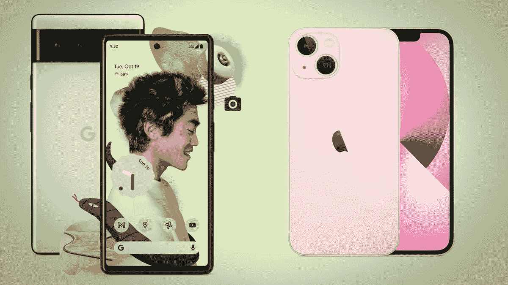
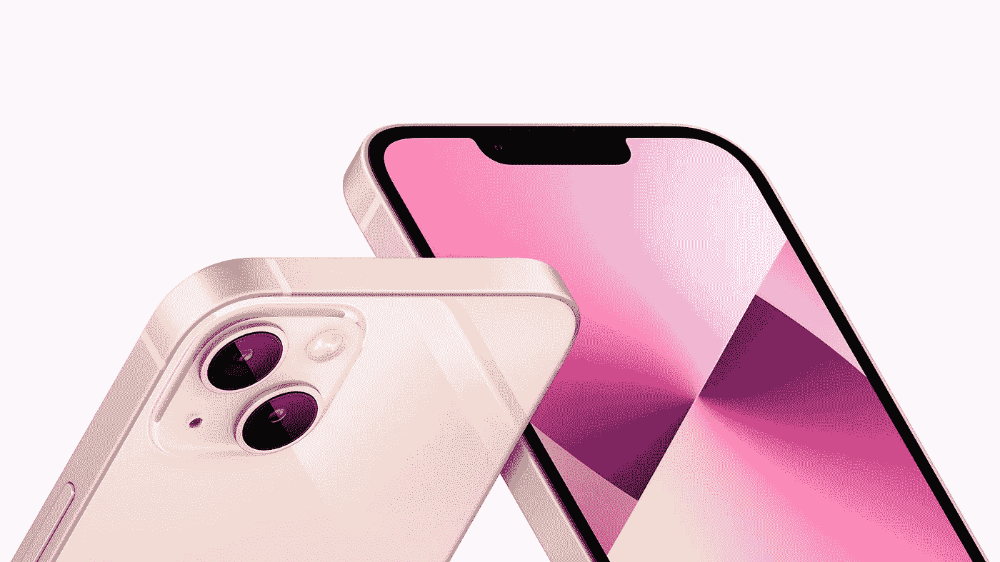
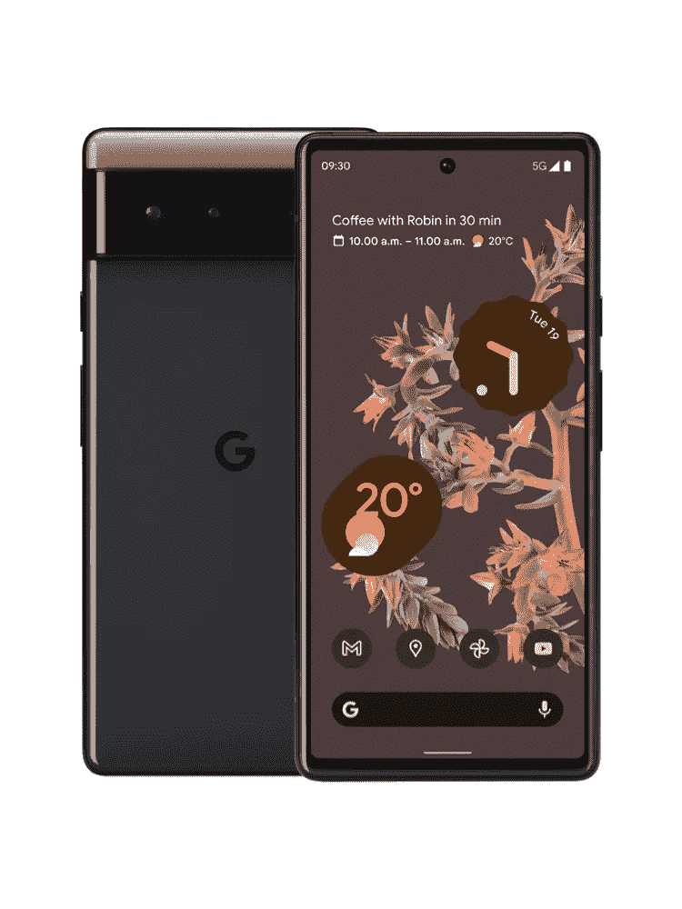
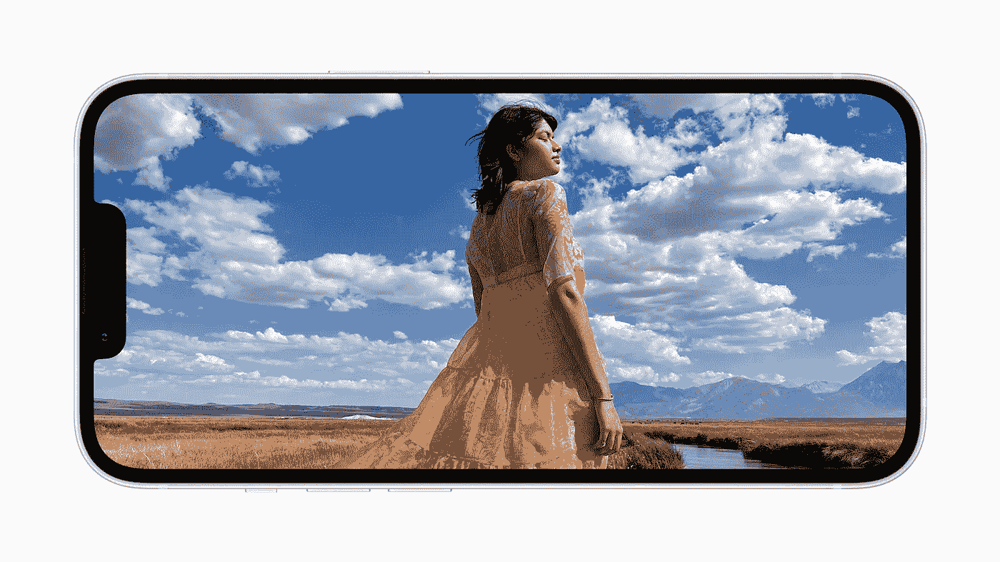
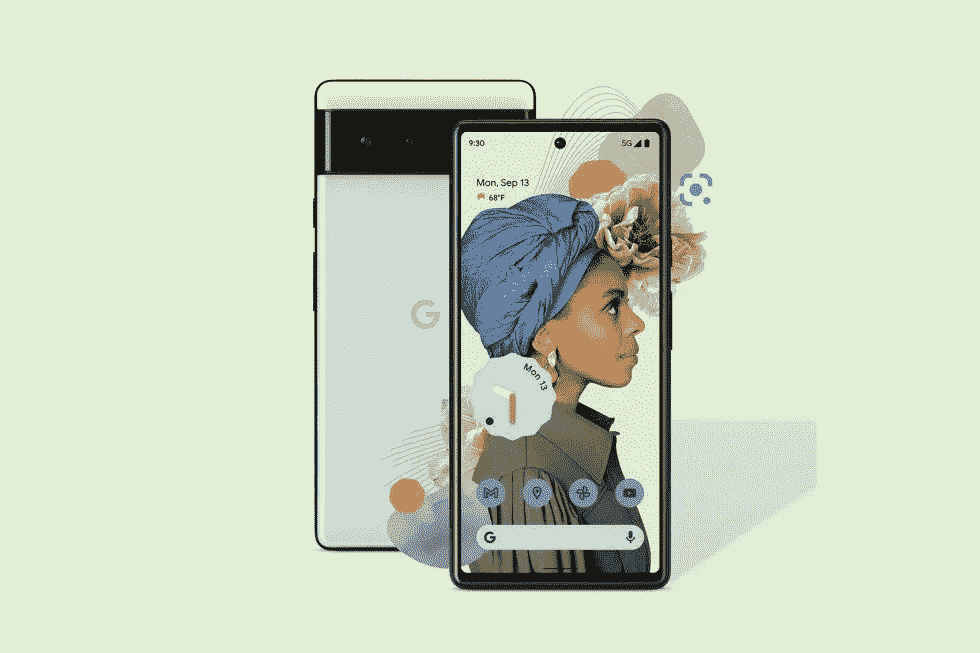
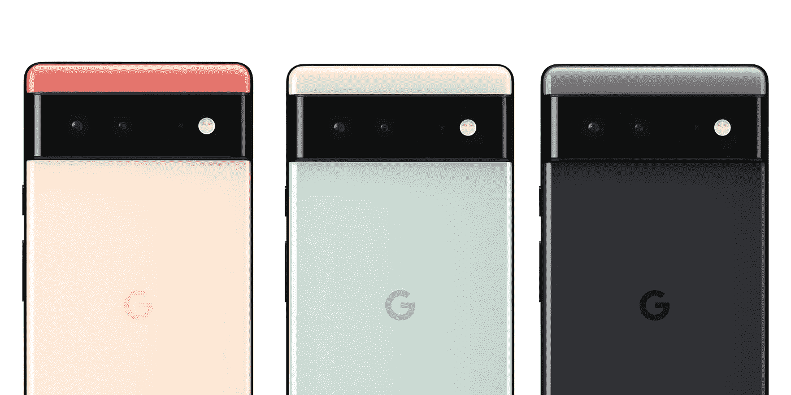
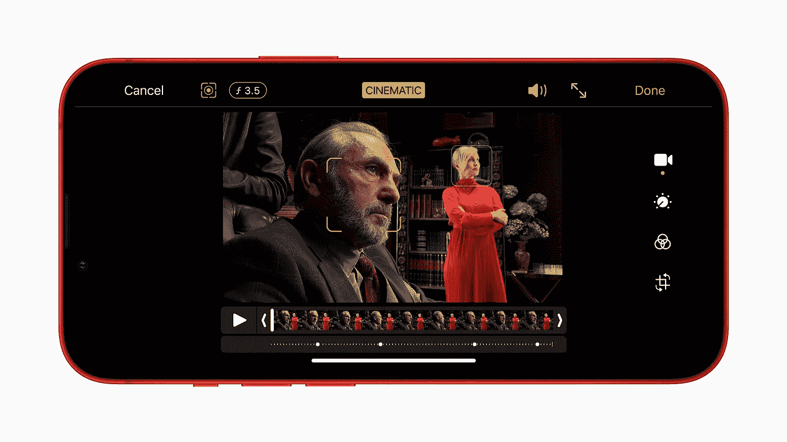
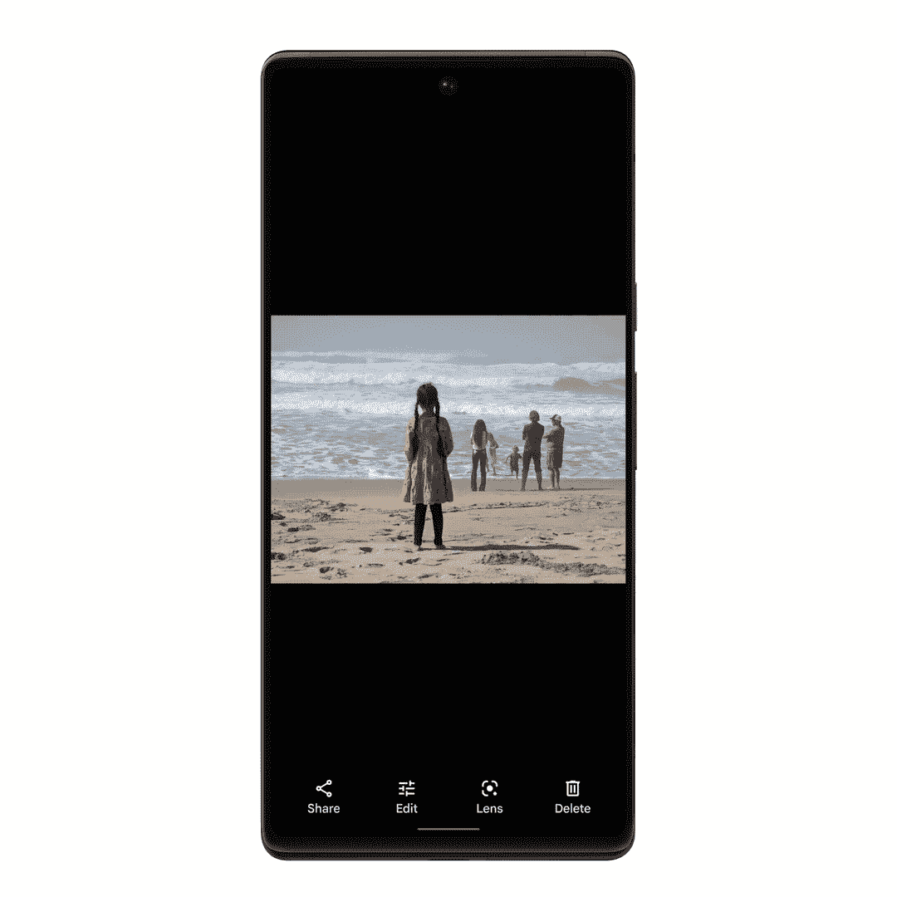
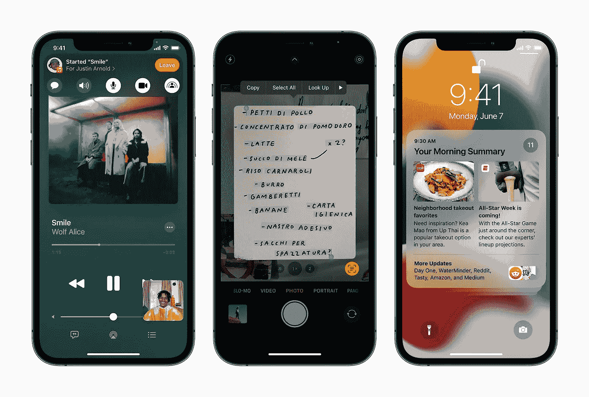
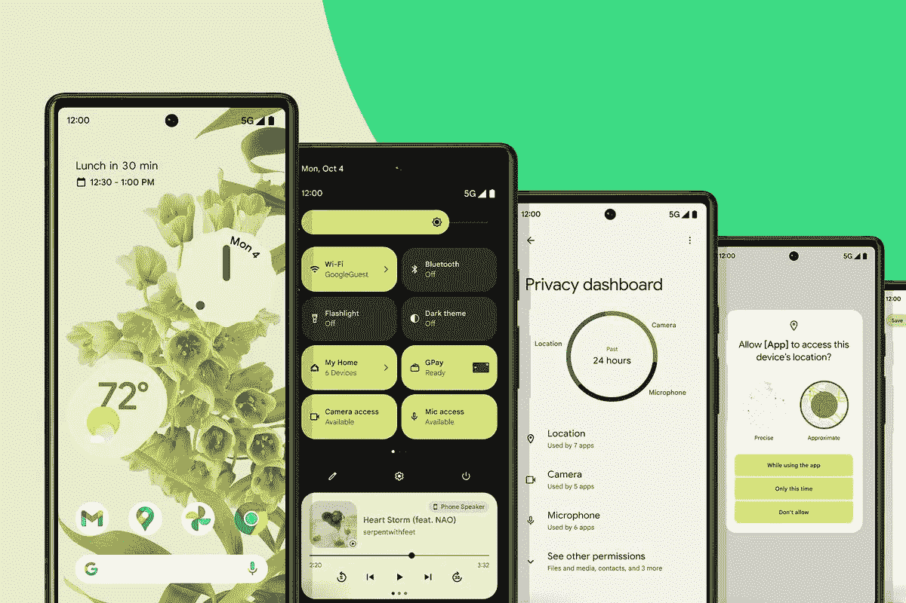

# 谷歌 Pixel 6 或者苹果 iPhone 13。

> 原文：<https://medium.com/geekculture/google-pixel-6-or-apple-iphone-13-57e93c422fed?source=collection_archive---------4----------------------->

## 非专业手机之战。

**Pixel 6 and iPhone 13**

又到了一年中的这个时候，苹果和谷歌的大玩具来了。

新闻网站和 YouTube 上将会到处进行比较，我认为大多数人的目光将会集中在 iPhone 13 Pro 和 Pixel 6 Pro 上，但我认为我们真的应该更密切地关注两家公司的标准型号，因为我认为它们是今年更有吸引力的设备。

5.4 英寸**iPhone 13**mini 的起价为 679 美元/699 美元，更大的 6.1 英寸**iPhone 13**的起价为 779 美元/799 美元，因此为了公平起见，我主要比较 6.1 英寸 iPhone 13，因为它在尺寸上与 6.4 英寸 Pixel 6 更匹配，并且所有型号都有 128GB 的基本存储选项。

**iPhone 13 |** Image by Apple

**Pixel 6** 售价 599/599 美元，没错，谷歌确实做了一件体面的事情，以合理的价格发布了一款高端手机。您还可以获得 128GB 存储的 Pixel 6，这确实使 Pixel 6 成为这些价格的真正竞争者。

**Google Pixel 6** | Image from Google.

所以现在知道谷歌将会在拥有更大的显示屏和电池的同时削弱 iPhone 13 甚至 13 mini。

让我们来看看一些更重要的东西。

**显示**

主要事件，当你得到你的新设备时，你花费所有时间寻找的地方。 **iPhone 13** 和 **13 mini** 都有 60hz 的液态视网膜 XDR 有机发光二极管面板，而 **Pixel 6** 有 90hz 刷新率的 FHD+ OLED 面板。

**iPhone 13 display.** | Image from Apple

由于有机发光二极管，所有显示器都将清晰明亮，色彩绚丽，但只有 Pixel 6 的刷新率更高，老实说，这应该是 2021 年这些价格的手机的最低要求。

**Pixel 6 display.** | Image from Google

无论如何，iPhone 13 仍然有 Face ID 凹槽，但现在比去年小了 20%，Pixel 6 有打孔摄像头，显示更清晰。我发现两者都有优点和缺点，但我仍然更喜欢打孔机，因为它对我的使用来说侵入性更小。

**设计**

所以我想这让我们想到了设计，是的，Pixel 上的摄像头带在智能手机领域是非常独特的。就像 iPhone 上的凹槽一样，Pixel 上的摄像头带会让你立刻认出这个像素。

iPhone 13 的边框薄了几毫米，但我不认为你真的会注意到，如果你在设备上有一个外壳，它们与去年的 iPhone 12 型号具有相同的平边设计。

**iPhone 13 flat edge design.** | Image from Apple.

这款手机有午夜款(黑色带蓝色)、星光款(白色带金色)、粉色、红色和蓝色，我发现午夜款非常适合单调的黑色，这也是我的最爱。

13 和 13 mini 背面都有两个摄像头，12MP 宽和 12MP 超宽，长焦仅用于 Pro 型号。

Pixel 6 有一个全新的设计，边缘略微弯曲，有一个太空时代的护目镜式相机凸起，双色背面，有暴风雨黑、珊瑚色和海泡石色。

**Google Pixel 6** | Image from Google.

像 iPhone 13 一样， **Pixel 6** 也有两个摄像头，但有一个 **50MP** 宽和一个 12MP 超宽镜头，这使 Pixel 6 具有规格优势，但百万像素并不代表一切。

它们都配有铝制框架和玻璃后盖，而 Pixel 6 将是最大的设备，这要归功于 6.4 英寸的显示屏。

**你可能会感兴趣的其他规格！**

所以我不会过多地谈论相机，因为在这一点上，当谈到照片时，这真的是个人偏好，我认为 iPhone 13 在手机上拍摄了一些最好的照片，以前的 Pixel 手机也总是拍摄出令人惊叹的照片，但谈到视频记录，iPhone 一直是王者。

所有设备都将以 4K 60fps 拍摄，这是目前顶级手机的标准， **iPhone 13** 有一个新的[电影模式](https://www.apple.com/newsroom/2021/09/apple-introduces-iphone-13-and-iphone-13-mini/)(视频的肖像模式)，而 **Pixel 6** 有[魔法橡皮擦](https://blog.google/products/photos/magic-eraser/)(从照片背景中删除东西)。

**Cinematic mode on iPhone 13.** | Image from Apple

目前还不知道 Pixel 6 是否有同样好的视频，但我会在 10 月 25 日开始收到评论后查看一些视频，如 [SuperSaf](https://www.youtube.com/c/SuperSaf) 谁做了很棒的相机比较视频。我认为这两款设备基本上都不会出错，它们非常适合摄影，领先于其他设备，所以如果你优先考虑照片，你不会错过 Pixel 或 iPhone。

**Magic eraser on Pixel 6.** | Image from Google

iPhone 13 和 Pixel 6 都配有 5G、立体声扬声器、无线充电、eSim 支持，防水和防尘等级为 IP68。

不过 **Pixel 6** 也有高达 30W 的快速充电，高达 21W 的无线充电，反向无线充电，8GB 的 RAM，USB-C 端口，Pixel Stand 2 支持，Wifi 6E，4614 mAh 电池和 under display 指纹识别器。

而两个 **iPhone 13** 型号都有一个 lightning 连接器，3227 mAh 和 2406 mAh (13 和 13 mini)电池，最高 18W 快速充电，最高 15W 无线充电，Face ID，Wifi 6，4GB 内存，并与 MagSafe 配件配合使用。

iPhone 13 配备了苹果 A15 芯片，这是目前智能手机中最快的芯片，可以让 iOS 一如既往地流畅运行，而 **Pixel 6** 配备了谷歌自己的新[张量芯片](https://blog.google/products/pixel/introducing-google-tensor/)，理论上可以与安卓和谷歌助手兼容，但这是一个未知数，所以我们必须在未来几周内看看它能做什么。

老实说，我不认为你会注意到设备之间的速度差异太大，由于软件和硬件的集成，两者在日常使用中都提供了如此流畅的体验。

正如你所看到的，这两款设备之间没有太多区别，但如果我现在必须选择一款，Pixel 6 就能为我提供你以这个价格获得的东西，90hz 显示屏，魔法橡皮擦，更大的电池，以及 USB-C 端口，这意味着我不需要为我的笔记本电脑或 iPad 携带额外的电线，可以使用一个充电器。

**软件**

因此，对一些人来说，这是最重要的事情之一，你每天看到的毕竟是软件，你希望它看起来和玩起来都不错。

苹果的 iOS 15 仍然非常流畅，看起来和往常一样，干净，易于使用主屏幕小工具，当然对于北美用户来说，iMessage 是一个重要的功能，iPhone 13 将获得 5-6 年的更新，这对那些长期使用手机的人来说是一个巨大的优势。

**iOS 15** | Image from Apple

谷歌推出了 Android 12，这是对 Android 11 的一次彻底的革新，并且有了更加个性化的外观和感觉，这要归功于与你的壁纸颜色主题相匹配的材料。Pixel 设备上的 Android 一直非常流畅、干净，我预计 Pixel 6 将继续保持这一趋势，由于谷歌张量芯片，Pixel 6 将获得 5 年的安全更新，这是 Android 设备上的第一次。

5 年的支持意味着你将从一个 Android 设备上获得不错的转售价值。

**Android 12** | Image from Google

现在，两者在操作系统功能上非常相似，这又要归结到个人偏好上了，你觉得什么更适合你的日常生活需要。

这是一些人在公司之间转换变得棘手的地方，iOS 对许多人来说非常熟悉和简单，做出改变可能会令人生畏，但 Android 近年来变得更加受欢迎和易于使用，我不认为许多人会发现很难掌握它。

从 Android 转移到 iOS 将非常容易，但你会失去很多定制，但你会获得 iPhone 与 Mac 或 iPad 兼容的流畅方式。

**一些花絮**

我还想为那些对生态系统和配件感兴趣的人提一下这些。

如果你全力以赴，苹果拥有出色的 Apple Watch、AirPods 和 MacBooks，谷歌拥有 Fitbit 或 Galaxy Watch 4、Pixel Buds 和 Chromebook，它们本身就是一个不错的小生态系统。

两者都有类似的共享功能，如 Airdrop 或 Nearby share，用于在 iOS 或 Android 设备上共享照片、文件等，这些功能也允许与 MAC 或 Chromebook 共享。

总的来说，iPhone 13 和 Pixel 6 看起来都是很棒的手机，我想你会对这两款手机都很满意。选择将归结为如果你想使用 iOS 或 Android 基本上，两部手机都有非常相似的规格，Pixel 6 可能是更好的性价比。

iPhone 13 和 Pixel 6 是为那些想要价格合理的旗舰相机和令人惊叹的流畅软件的人准备的。

现在，谷歌为苹果提供了 5 年更新期(至少 3 年的操作系统更新期和 5 年的安全性更新期)，你可以在这两种操作系统上轻松使用几年。

**谷歌 Pixel 6 和 Pixel 6 Pro 将于 10 月 28 日上市，而 iPhone 13 和 13 mini 现已上市。**