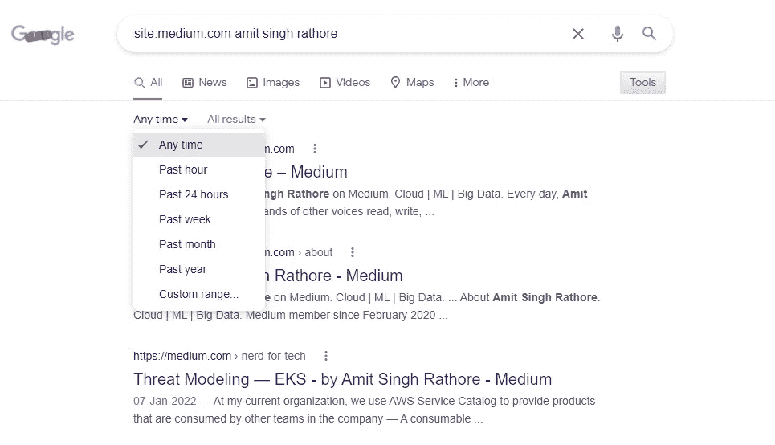
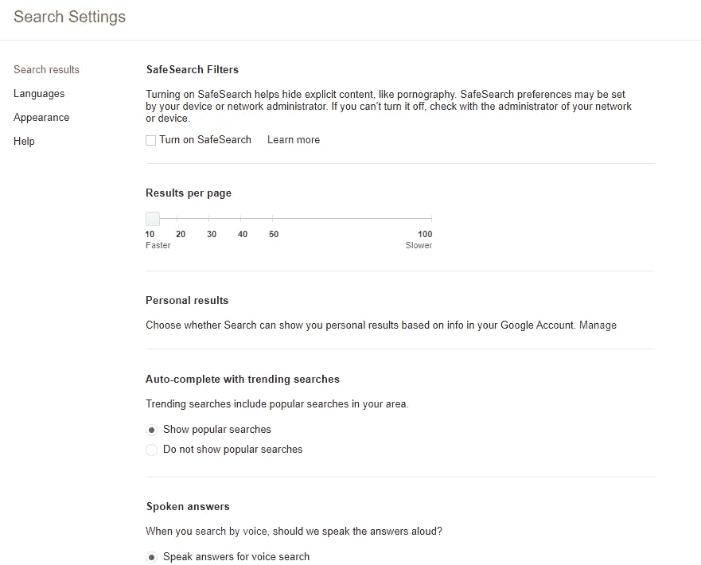
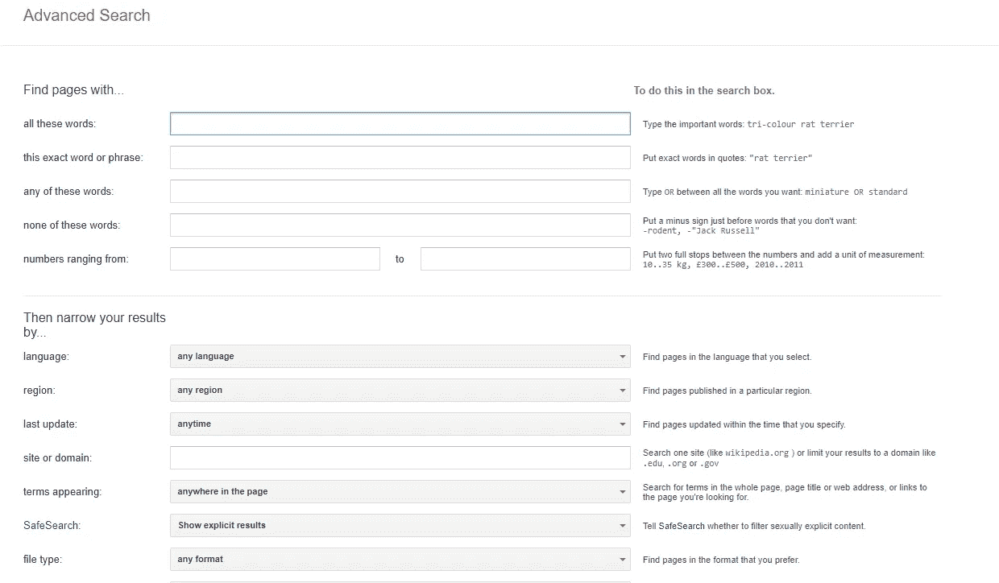

# 谷歌搜索技巧

> 原文：<https://medium.com/geekculture/google-search-tricks-ed8ca28f1dba?source=collection_archive---------11----------------------->

Photo by [matthew_henry](https://burst.shopify.com/@matthew_henry?utm_campaign=photo_credit&amp;utm_content=Free+Stock+Photo+of+Christmas+Tree+Search+%E2%80%94+HD+Images&amp;utm_medium=referral&amp;utm_source=credit)

让你的谷歌搜索有更准确的命中

> 藏尸体的最佳地点是谷歌的第二页。

搜索谷歌很难，我们很少想去谷歌搜索结果的第 2 页或第 3 页。在这个博客中，我们将看到一些选项，这些选项将允许我们限制搜索中不必要的命中次数。

## 排除术语

如果我们希望删除一些通常与搜索结果相关的搜索术语，我们可以在术语前使用`-`。下面的查询将给出除维基百科以外的所有链接。

`Rohit Sharma -wikipedia`

## 精确匹配

如果我们希望搜索准确的单词，我们需要将它们放在引号中。如果我们希望找到精确匹配的查询结果，这是很有用的。

`"a aa aaa"`

## 在 URL 中搜索

如果我们想在一个特定的网站上搜索内容，我们可以使用下面的语法。

`site:medium.com amit singh ratore`

上面的查询将导致在 medium.com 的名字的所有提及

## 相似的 URL

如果我们希望找到与其他网站相似的网站，我们使用下面的语法来选择。

`related:dev.to`

## 引用文章

如果我们想查看引用《纽约时报》文章的其他网站，我们会使用这个选项。语法如下:

`linked:nytimes.com`

## 将搜索限制在一个时间范围内

如果我们想搜索某年前或某年后出版的某些内容，我们可以使用下面的选项。

`after:2020`

`before:2020`

或者仅在 2020 年我们可以使用`..2020`

## 逻辑运算

我们可以像逻辑运算符一样组合搜索词。

`(Term A | Term B) Term C`或`(Term A or Term B) & Term C`

上面的模式将给出项 A 和项 C 在一起或者项 B &和项 C 在一起的结果。

## 搜索词占位符

星号将作为一个搜索谷歌搜索的占位符，它将被搜索引擎自动填充。

`come *abc* get me`

## 在特定距离搜索单词

如果我们希望搜索某些单词以外的术语，我们可以使用下面的选项。

`program AROUND(3) code`

上面的查询将导致单词**代码**和**程序**之间有 3 个单词的命中。

## 特定文件类型

如果我们希望从某些文件类型中找到内容，我们可以使用下面的选项。

`filetype:pdf`

## 搜索网站的缓存版本

有时我们希望看到网站的缓存版本。我们可以使用下面的选项。

`cache:wesite`

## 在特定标签中搜索

如果我们希望在网站 URL、文章标题或页面内容中搜索术语，我们可以使用以下选项之一。

`allintitle`

`allinurl`

`allintext`

## 搜索社交媒体

我们可以直接获得社交媒体句柄或标签的元数据信息。

`#hashtag`

`@username/handle`

## 搜索一系列数字

使用此选项，我们可以搜索一个范围。比如，如果我们想获得 2015、2016、2017、2018、2019 年的所有澳网冠军，我们可以像下面这样搜索。

`AO Winners 2015..2019`

## 搜索实用程序

> 天气预报
> 航班

单词搜索

> 定义
> 词源
> 读音
> 词

## 互补效用

计算器
翻译器
计时器/秒表

## 谷歌学术

搜索学术/学术内容。

使用设置选择，上述所有内容也可以保留或默认。安全搜索、按日期排序结果等设置。

谷歌有一个 https://www.google.com/advanced_search 页面，你可以在那里选择你的搜索偏好。

快乐的谷歌搜索！！