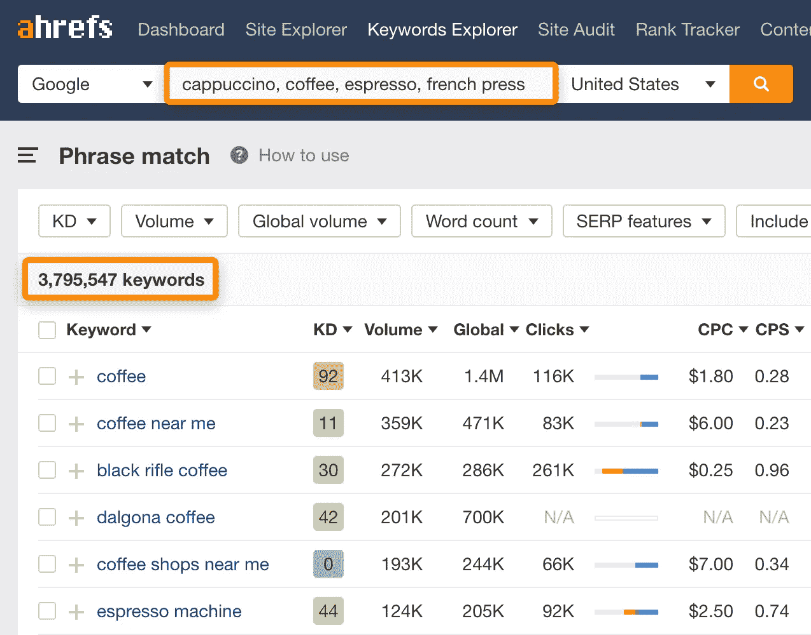

# 谷歌搜索引擎优化关键词分析

> 原文：<https://medium.com/geekculture/google-seo-keyword-analysis-dc9342065b11?source=collection_archive---------8----------------------->

关键词是所有搜索的起点，是 SEO 的开始。这个工作单调乏味，很多人都是用脑子想的。不幸的是，由此得出的东西可能从一开始就是错的。一个关键词分析是 Google SEO 各个环节中最重要也是最基础的一个环节，所以请用最笨的方法老老实实的去做，否则，你将无法产生流量。

本文将从关键词选择、关键词分析、关键词使用等实际应用流程中拆解具体操作。

[Keyword analysis](https://ahrefs.com/blog/keyword-research/)

## 1.关键词选择:以高价值、低难度、大搜索量为原则

*   选词，从行业核心词开始查询，通过 Google 关键词规划器搜索，将搜索量大的词一起继续查询，直到找不到大词为止(不要用自己的脑袋想，人脑算力值有限)
*   完成上一步后，导出单词，继续重复 5-8 次，最后合并并去除重复项，基本得到完整的词库
*   联想词、同义词、长尾词(主要是问答)等。需要查询
*   使用 Ahrefs 等工具查询同行网站已经收录的关键词，导出后可以根据大词重复第一条
*   写文章的时候，优先选择竞争度低，搜索量大的词，长尾词。在布局每个短语时，需要考虑长尾词。
*   区分每个关键词的搜索意图，如信息词、转换词等。

## 2.关键词分析

## (1)分组:以搜索意图为核心原则

*   根据核心词的字面意思(搜索量最大的词可以作为核心词)，每个大组作为一个节，然后从大组再细分成组，直到组不混在一起，大组是根据搜索量尽量放在一起
*   对于含义不确定的词，以搜索结果为主，非广告结果前五名作为分组依据

## (2)使用规则:基于功能主题群的原则

*   首页:需要部署每个核心词(针对 H1，H2，文首)，每个核心词联想词(下方 H3 和内容)，每个核心词长尾词(下方 H3 和内容)，以及其他大词
*   功能页(产品页):部署 1 大类核心词及其相关的联想词、长尾词等。，尽量按照集团内的子类别来部署所有相关的类别，每个类别都可以作为一个内容板块，这里主要侧重于产品功能，按照命名法、产品功能用途、价格、材料要素、问答类等顺序进行部署。
*   博客页(文章页):核心是产品页的补充说明和最新的相关信息、指南、竞品。这个页面上的单词主要基于最细分的短语
*   错误的单词和不常用的搜索词可以用作图像的 alt 标签

[keyword research](https://plancod.com/keyword-seo-ways-to-improve-seo-keywords/)

*   注意，一组关键词就是一篇文章。本文的核心关键词是月搜索量最高的关键词，其他都是分段关键词。
*   一篇 1000 字的文章，一般用 8 个关键词，一个关键词一般不超过 3 次；作者不使用的剩余子关键字被放置在图片的 ALT 中。
*   一些未使用的相关关键字可以添加在每个页面的底部，对用户隐藏，并使用 P 标签添加

标签:{关键词}

**3。难度判断**

*   通过工具导出时，参考工具给出的疑难数据。谷歌关键词规划器会有高低提示；Ahrefs 等工具会用数字提示。
*   选择优化方向时，前期难度低(难度值小)，搜索量大为主。先把这部分单词放在难词上。连锁资源重点倾斜。
*   如果你想在 Google 主页上做某个词，没有其他的招数。如果内容没有问题，可以通过优质外链推送，另一种是通过有流量的网站内部链接推送。

**(3)补码**

*   主要的语言补语主要是通过同源词、连词和替代词(别名)
*   次要语言补充在主要语言中从头开始重复

**(4)删除文字**

只能删除完全不相关的词。删除之前需要去谷歌搜索是否真的无关，否则无法删除。

## 3.常见问题

*   杂类:必须区分每一组，意义相近的必须放在一个大组里。关键字分组的核心目的是明确真正的使用需求
*   词库覆盖面不足:不要偷懒，关键词是一切的基础，必须尽量多找与产品相关的词，项目负责人需要亲自指导用词，最好尽量分组
*   同一个核心关键词在网站首页之外的不同页面多次出现，会造成页面互相竞争。部署关键词时，尽量用一个页面作为一个核心关键词。
*   如果有多个搜索量高的词，并且相互关联，可以放在一起，也可以不放在一起。在这种情况下，尝试以主题的方式来布局它们，并将它们放在一个主题下的页面上。

如果有人有兴趣知道他们的网站在谷歌上的表现，或者他们想在谷歌上排名靠前。我很乐意帮助免费的搜索引擎优化审计，并给出改善他们的网站和增加流量的建议。如果感兴趣，请发邮件给我你的网站。