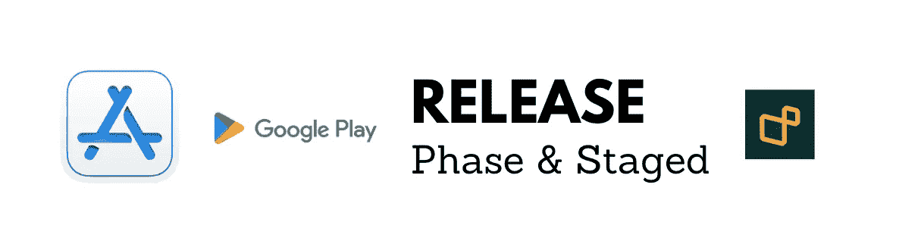
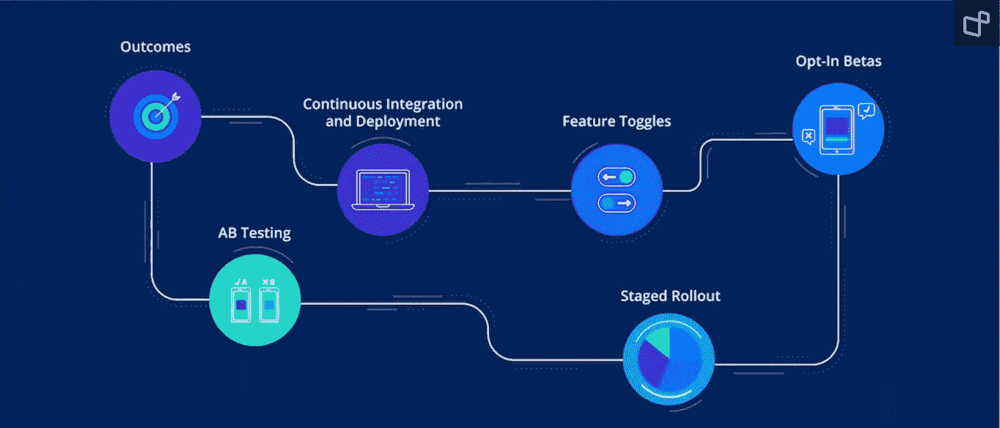

# 谷歌分阶段推出&应用商店分阶段发布:压力更小

> 原文：<https://medium.com/geekculture/google-staged-rollouts-app-store-phased-release-with-less-stress-1d51dffde7a7?source=collection_archive---------2----------------------->

# 🔥什么是分阶段发布？

分阶段发布意味着在您发布您的更新后，它只能由在…中选择的一组用户访问