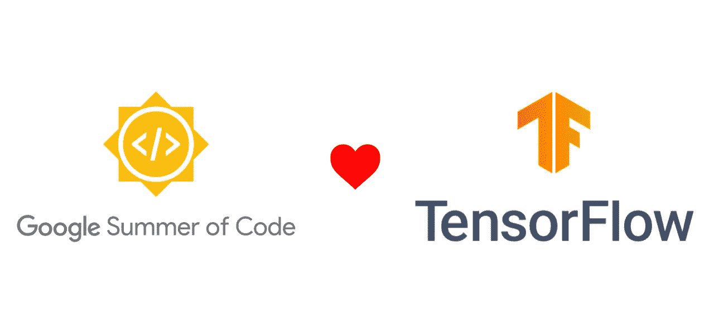
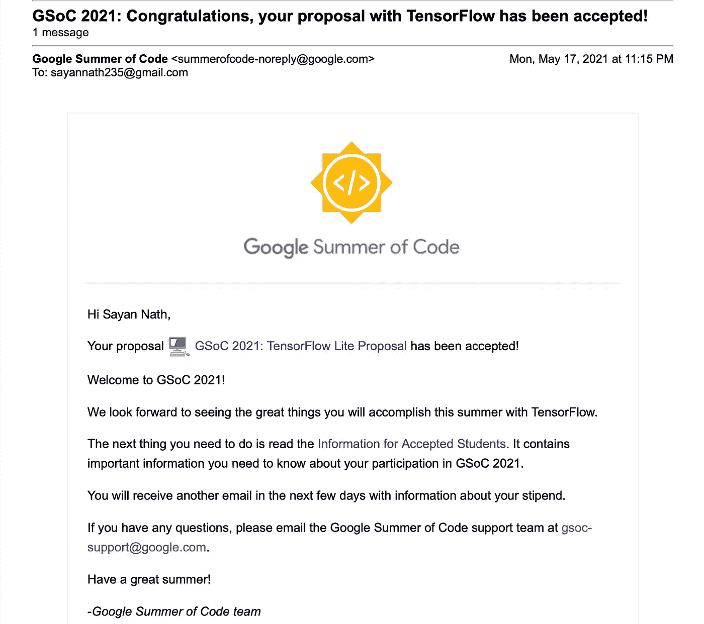
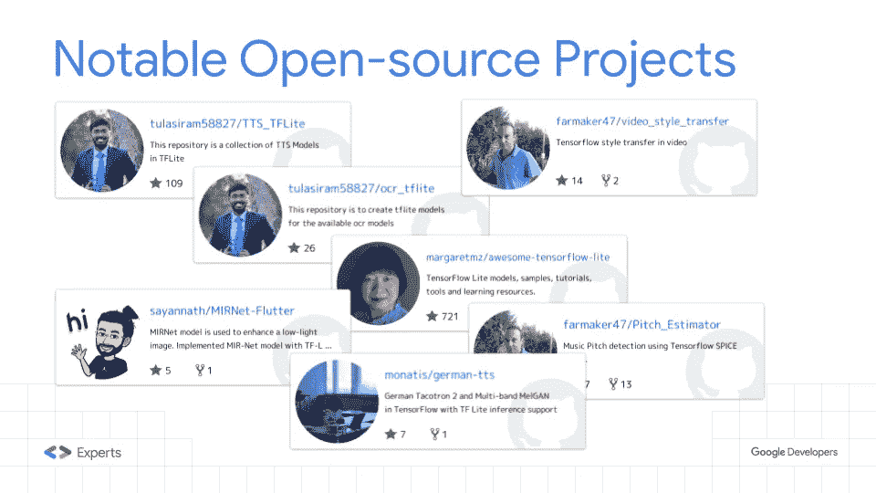
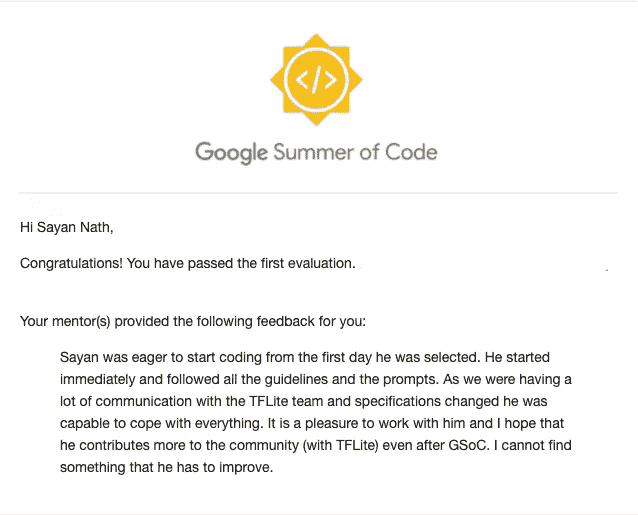
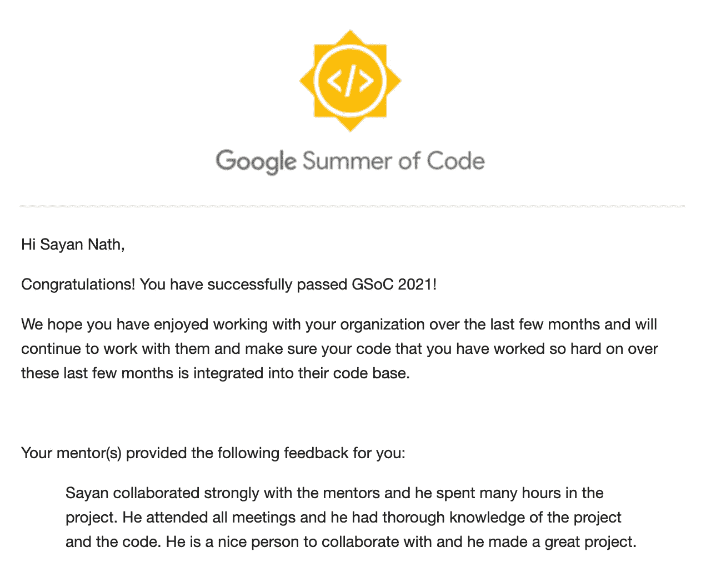
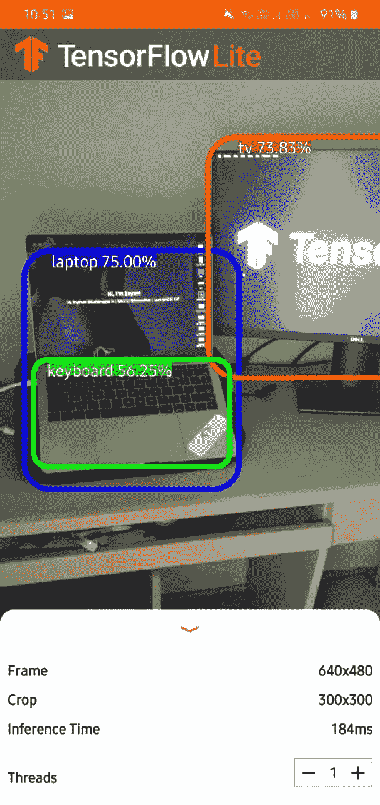

# 改进计算机视觉 TensorFlow Lite 示例

> 原文：<https://medium.com/geekculture/google-summer-of-code-21-project-tensorflow-project-110461f697af?source=collection_archive---------27----------------------->

## GSoC 2021 张量流项目

我今年参加了 GSoC 2021，帮助改进 TensorFlow Lite 的计算机视觉示例应用程序。该项目的想法是改进使用 TensorFlow Lite 任务库和 TensorFlow 支持库的计算机视觉示例应用程序。主要目标是实现 CameraX 并更新应用程序，以便社区的开发人员可以轻松地将机器学习与 Android 应用程序集成。

**导师** : [乔治·索洛比斯](https://medium.com/u/1c779d4a5835?source=post_page-----110461f697af--------------------------------)和[玛格丽特·梅纳德-里德](https://medium.com/u/ed2f34822130?source=post_page-----110461f697af--------------------------------)

我发现自己很幸运有他们做我的导师。

**项目链接**:[https://summerofcode . with Google . com/projects/# 4931401570320384](https://summerofcode.withgoogle.com/projects/#4931401570320384)

GitHub 链接:[https://github.com/sayannath/GSoC-Project-2021](https://github.com/sayannath/GSoC-Project-2021)

# 关于我

你好！我是萨彦纳特。我是**卡林加工业技术学院**的三年级本科生。我是来自印度的 [GitHub](https://medium.com/u/8df3bf3c40ae?source=post_page-----110461f697af--------------------------------) 的**顶级贡献者**之一。我是 [Codebugged AI](https://medium.com/u/63f823439bcd?source=post_page-----110461f697af--------------------------------) 的**机器学习工程师**，是 [Dsckiit](https://medium.com/u/7a6d839c5eae?source=post_page-----110461f697af--------------------------------) 的**主角**。我还被从[谷歌开发者](https://medium.com/u/991272e72e68?source=post_page-----110461f697af--------------------------------)中选作**导师**。除了机器学习，我的其他兴趣是后端开发、DevOps 和 Flutter。我贡献了 [**Keras 编码示例**](https://github.com/keras-team/keras-io) 、 [**TensorFlow 资源库**](https://github.com/tensorflow/examples) 、 **ML-GDE 资源库、****Awesome tensor flow-Lite**资源库。我也喜欢在活动中做技术演讲，并指导我的同事和我的下级。

# GSoC 选拔故事

GSoC’21 Selection Mail

这是我 2021 年 5 月 17 日收到的选择邮件。但是这个旅程很久以前就开始了。从 12 标准开始，我就想在开源领域做点大事。做 GSoC 是我的遗愿清单。当时，我是一个开源爱好者，但在过去的几个月里，我与 Sayak Paul 取得了联系。他是一个令人敬畏的导师，也是一个好人。我认为自己很幸运能有像他这样的导师。 [Soumik Rakshit](https://medium.com/u/75239884c307?source=post_page-----110461f697af--------------------------------) 转载了一篇名为 [MIR-Net](https://github.com/soumik12345/MIRNet/) 的研究论文。 [Sayak Paul](https://medium.com/u/c7edfd638e74?source=post_page-----110461f697af--------------------------------) 在 [TensorFlow-Hub](https://tfhub.dev/sayakpaul/lite-model/mirnet-fixed/dr/1) 中为其制作了 TensorFlow-Lite 文件。我用 TF-Lite 在我的 [Flutter App](https://github.com/sayannath/MIRNet-Flutter) 中实现了它。幸运的是，这个令人激动的项目在一次聚会上被谷歌提及。Sayak Paul 的演讲是关于 TFLite 的社区生态系统。点击[此处](https://lnkd.in/eFmvZ6q)为甲板。Sayak Paul 回顾了我关于谷歌代码之夏的提议，这又是一次对他的大声喊出来。

One of the slides from the Deck

# **任务**

1.  实现 **CameraX** ，用现有的 Camera2 和 Camera API 去掉片段的使用。
2.  用 TensorFlow Lite 解释器实现**支持库**。
3.  实现**数据绑定。**
4.  实现**图像到位图**的转换，修改支持库和任务库。
5.  修改 Android 中的**测试代码**
6.  在 tflite-support 库中添加一个**边界框**函数(拉伸目标)

# 首次评估

在我的第一次评估中，我在乔治·索洛皮斯的指导下非常顺利地完成了前三项任务。他是一个人能得到的最好的导师。他的支持是不变的。我以前每周都会和我的导师们见一次面，比如[乔治·索洛比斯](https://medium.com/u/1c779d4a5835?source=post_page-----110461f697af--------------------------------)和[玛格丽特·梅纳德-里德](https://medium.com/u/ed2f34822130?source=post_page-----110461f697af--------------------------------)，讨论我项目的更新。除此之外，[乔治·索卢普斯](https://medium.com/u/1c779d4a5835?source=post_page-----110461f697af--------------------------------)和我曾经在 LinkedIn 上聊天，[玛格丽特·梅纳德-里德](https://medium.com/u/ed2f34822130?source=post_page-----110461f697af--------------------------------)和[梅格娜·纳特拉杰](https://medium.com/u/b24e3ae734?source=post_page-----110461f697af--------------------------------)在 Google Chat 和 Google 的 TensorFlow Lite 团队在邮件中聊天。

## 面临的挑战

这个项目的主要挑战是当 CameraX 代替 Camera2 实现时绘制边界框。这是因为 Camera2 的输出格式是位图，而 CameraX 的输出格式是图像。乔治爵士在做任何推断之前帮我做了图像的预处理。这修复了上述问题。

现在是结果的时候了。

# 首次评估的结果

Mail of First Evaluation

就这样，我在[乔治·索洛比斯](https://medium.com/u/1c779d4a5835?source=post_page-----110461f697af--------------------------------)和[玛格丽特·梅纳德-里德](https://medium.com/u/ed2f34822130?source=post_page-----110461f697af--------------------------------)的指导下顺利通过了我的第一次评估。

# 最终评估

任务 4 和 5 正在进行第二次评估。我在两周内完成了任务。乔治先生在转换和 android 测试方面给了我很多帮助。我比预期的早一点完成了我的项目，并热情地开始着手另一件事。 [Margaret Maynard-Reid](https://medium.com/u/ed2f34822130?source=post_page-----110461f697af--------------------------------) Mam 建议将 Drawing 类放在支持库中，这样开发者就可以在检测到物体的情况下轻松使用该类来绘制边界框。

## 面临的挑战

TensorFlow 支持库支持位图形式的输入，但是 CameraX 输出的是图像，所以我们也为 TensorFlow 支持库开发了预处理功能。第二个挑战需要根据图像的输出修改测试，以简化流程。[乔治·索罗斯先生也帮助了我。](https://medium.com/u/1c779d4a5835?source=post_page-----110461f697af--------------------------------)

# 最终评估结果

Mail of the Final Evaluation

就这样，我在[乔治·索洛比斯](https://medium.com/u/1c779d4a5835?source=post_page-----110461f697af--------------------------------)和[玛格丽特·梅纳德-里德](https://medium.com/u/ed2f34822130?source=post_page-----110461f697af--------------------------------)的指导下顺利通过了我的期末评估。

# **应用程序演示**

Demo of the App

PS:那是我的极简主义设定；)

查看我的拉动式请求—[https://github.com/tensorflow/examples/pull/341](https://github.com/tensorflow/examples/pull/341)

# GitHub 知识库

作为参考，您可以查看这个存储库

 [## GitHub-sayan Nath/GSoC-Project-2021:tensor flow Lite 对象检测 Android 演示

### 这个资源库包含了我在 2021 年 GSoC 期间为 TensorFlow 团队所做的项目。年份…

github.com](https://github.com/sayannath/GSoC-Project-2021) 

# 让我们连接

投资组合:[https://sayannath.biz/](https://sayannath.biz/)

领英:[https://www.linkedin.com/in/sayannath235/](https://www.linkedin.com/in/sayannath235/)

GitHub:[https://github.com/sayannath](https://github.com/sayannath)

推特:[https://twitter.com/the_sayannath](https://twitter.com/the_sayannath)

谷歌开发库:[https://devlibrary.withgoogle.com/authors/sayannath](https://devlibrary.withgoogle.com/authors/sayannath)

insta gram:【https://www.instagram.com/sayannath235/ 