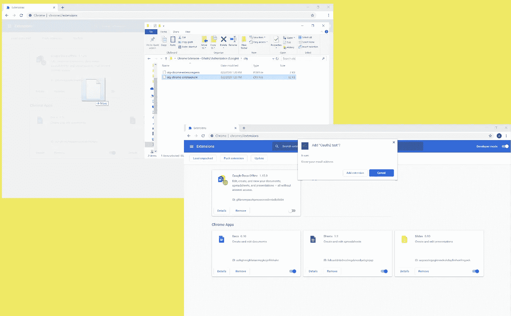
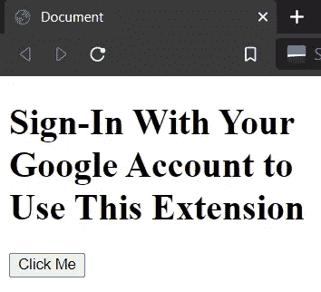

# 谷歌对 Chrome 扩展的 OAuth2 授权

> 原文：<https://medium.com/geekculture/googles-oauth2-authorization-with-chrome-extensions-2d50578fc64f?source=collection_archive---------0----------------------->

使用谷歌的 OAuth2 获取用户数据。我们将处理用户的联系人数据。

# 本教程使用了一个锅炉板谷歌浏览器扩展设置。

**如果你想知道如何进行设置，
点击这里查看我的文章:**

[](/@an_object_is_a/how-does-a-chrome-extension-work-web-development-6e85bd2bccc1) [## Chrome 扩展是如何工作的？(网络开发)

### Chrome 扩展有 5 个部分:

medium.com](/@an_object_is_a/how-does-a-chrome-extension-work-web-development-6e85bd2bccc1) 

## 在我们接触一行代码之前，我们需要设置我们的开发工作区，以便我们有能力做两件主要的事情:

1.赋予我们特定的 Chrome 扩展使用 Google 的 API 和服务的能力。
2。获得与 Google 的 OAuth2 端点交互的能力。
3。获得与 Google API 交互的能力。

# 我们开始吧。

首先，我们需要在**谷歌商店**注册我们的 Chrome 扩展。有两种方法可以做到这一点，我们或者正式上传我们的 Chrome 扩展到谷歌 Chrome 商店，或者用谷歌 Chrome 浏览器注册我们的扩展。既然我们不想上传一个开发扩展到公共商店， ***我们就选择后一种方法*** 。

在您的 **Chrome 浏览器**中导航到地址“ **chrome://extensions** ”。点击" **Pack Extension** "并选择你的 Chrome 扩展的位置。这将在你的 Chrome 扩展位置上面的目录中生成两个文件，一个' **crx** '和'**PEM**'；我们关心的是' **crx** '文件。
将' **crx** '文件拖放到“ **chrome://extensions** ”页面中。您应该会得到一个提示，要求您添加扩展，单击“**是**”。



现在，**导航到你的 Chrome 扩展所在的位置**。
对于 MacOS 和 Linux 用户来说，情况会有所不同，但是对于 Windows 用户来说，

**C:\Users\ <您的用户名>\ AppData \ Local \ Google \ Chrome \ User Data \ Default \ Extensions**。

我们正在寻找与您的 Chrome 扩展 id 同名的文件夹。这个 id 可以在你的“ **chrome://extensions** ”页面找到。查找“ **ID** ”属性。
进入与你的 Chrome 扩展同名的文件夹，进入 verion number 文件夹，打开“ **manifest.json** 文件。复制“**键**属性。

***这是我们独有的 Chrome 扩展键*T3。复制并粘贴到你正在开发的 Chrome 扩展的“ **manifest.json** ”中。(您为“**包扩展**步骤选择的文件夹)**

```
/* manifest.json */{
    "name": "Oauth2 test",
    "description": "",
    "version": "0.1.0",
    "manifest_version": 2,
    "key": "<key here>",
    "icons": {
        "16": "./obj-16x16.png",
        "32": "./obj-32x32.png",
        "48": "./obj-48x48.png",
        "128": "./obj-128x128.png"
    },
    "background": {
        "scripts": [
            "./background.js"
        ]
    },
    "options_page": "./options.html",
    "browser_action": {
        "default_popup": "popup.html"
    },
    "permissions": [
        "identity",
        "identity.email"
    ]
}
```

**注意:**
我们需要“ **identity** ”和“ **identity.email** ”权限。

**最后**，从浏览器中移除您的 Chrome 扩展(点击“**移除**”)，并通过点击“**加载解包**”安装开发扩展，并为您的开发扩展选择文件夹。

**这个开发扩展现在有了使用谷歌 API 和服务的能力。**

要为 Google 的 OAuth2 端点获得 ***授权*** ，我们需要导航到 **Google 开发者控制台**并请求一个 OAuth2 客户端 ID。

导航到“[**https://console.developers.google.com/**](https://console.developers.google.com/)”如果你还没有，创建一个项目。

这里我们必须做两件事…

点击左侧的“ **OAuth 同意屏幕**”链接。选择**外部**和**创建**。只需填写“**应用名称**字段和“**保存**”。
“**OAuth 同意**”屏幕告诉用户，当他们选择使用他们的 Google 帐户登录时，我们希望访问他们的 Google 数据。

接下来，点击左侧的**凭证**链接。
点击屏幕上方的**创建凭证**，选择
**OAuth 客户端 ID** 。
将**应用类型**设置为 **Chrome app** 。
在“**名称**”字段中填入您想要的任何内容，然后在底部填入
“**应用 Id** ”。“**应用 Id** ”是你的 Chrome 扩展的 Id；可以找到@ **chrome://extensions** 。
点击**创建**。

接下来，我们需要一个 API 键，这样我们就可以使用 People API 访问用户的 Google 联系人数据。
前往左侧栏上的**图书馆**。搜索“**谷歌人 API** ，点击“**启用**”。
转到左侧栏上的**凭证**。
在主页面中点击“API&服务中的**凭证”。
点击页面顶部的**创建凭证**，选择 **API key** 。**

**这个开发扩展现在能够与 Google 的 OAuth2 端点和 People API 交互。**

## 我们去分机吧。

我们将在'**popup.html**'中使用一个简单的按钮及其脚本来测试我们的 Chrome 扩展。



popup.html

```
/* popup-script.js */document.querySelector('button')
  .addEventListener('click', function () {
    chrome.runtime.sendMessage({ message: '' });
  });
```

我们将在' **background.js** '脚本中的消息接收器中创建一个' **if conditional** '树。这将处理 5 个请求:

1.获取访问令牌。
2。获取登录用户的配置文件信息。
3。从用户的 Google 联系人页面获取用户的联系人。
4。在用户的 Google 联系人页面中创建一个联系人。
5。在用户的 Google 联系人页面中删除联系人。

为此，我们需要向我们的' **manifest.json** '添加一些属性。

```
/* manifest.json */{
    "name": "Oauth2 test",
    "description": "",
    "version": "0.1.0",
    "manifest_version": 2,
    "key": "<key here>",
    "oauth2": {
        "client_id": "<client id here>",
        "scopes": [
            "profile email",
            "[https://www.googleapis.com/auth/contacts](https://www.googleapis.com/auth/contacts)"
        ]
    },
...
```

**注意:**
添加一个" **oauth2** "属性，带有:
" **client_id** "从 Google 开发者控制台
" **scopes** "带有"**个人资料电子邮件**"和"[https://www.googleapis.com/auth/contacts](https://www.googleapis.com/auth/contacts)"

```
/* background.js */const API_KEY = '';
let user_signed_in = false;chrome.identity.onSignInChanged.addListener(function (account_id, signedIn) {
    if (signedIn) {
        user_signed_in = true;
    } else {
        user_signed_in = false;
    }
});chrome.runtime.onMessage
  .addListener((request, sender, sendResponse) => {

  });
```

**注意:**
我们已经添加了一个常量变量来保存来自 Google 开发者控制台的 API 密钥。

这个扩展最重要的部分是"**chrome . identity . getauthtoken()**"方法。
它允许我们获得一个“**访问令牌**，我们可以用它来获得用户数据的入口。

```
/* background.js */if (request.message === 'get_auth_token') {
  chrome.identity
    .getAuthToken({ interactive: true }, function (token) {
      console.log(token);
    });
}
```

用户登录后，我们可以使用“**chrome . identity . getprofileuserinfo()**”方法获取他们的个人资料信息。

```
/* background.js */} else if (request.message === 'get_profile') {
  chrome.identity
    .getProfileUserInfo({ accountStatus: 'ANY' }, function 
    (user_info) {
      console.log(user_info);
    });
}
```

## 这个项目的实质就是这个:

当我们想要与用户的数据交互时，这意味着要通过 Google 的一个 API，我们需要在 fetch 请求的头
中传递一个访问令牌。
所以我们需要先调用' **getAuthToken()** '方法，然后用 Token 把它传入 fetch 调用。

你可以在这里 得到源文件 [**。**](https://github.com/an-object-is-a/chrome-ext-google-oauth)

如果你想要更深入的指导，可以看看我在 YouTube 上的完整视频教程，**一个物体是一个**。

一定要在 [**Instagram**](https://www.instagram.com/an_object_is_a/) 和 [**Twitter**](https://twitter.com/anobjectisa1) 上关注我们，及时了解我们最新的 **Web 开发教程**。

**Google OAuth2 和 Chrome 扩展——访问用户的 Google 数据**